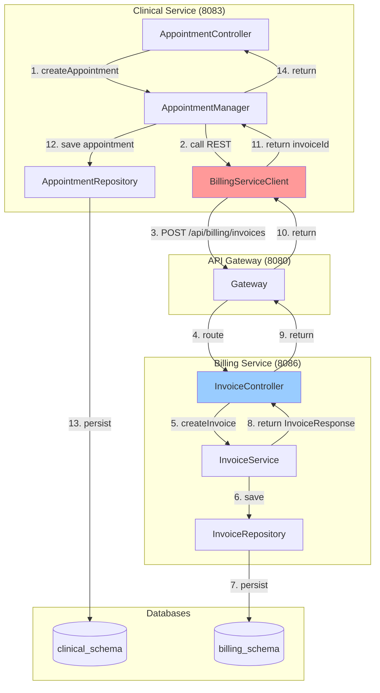
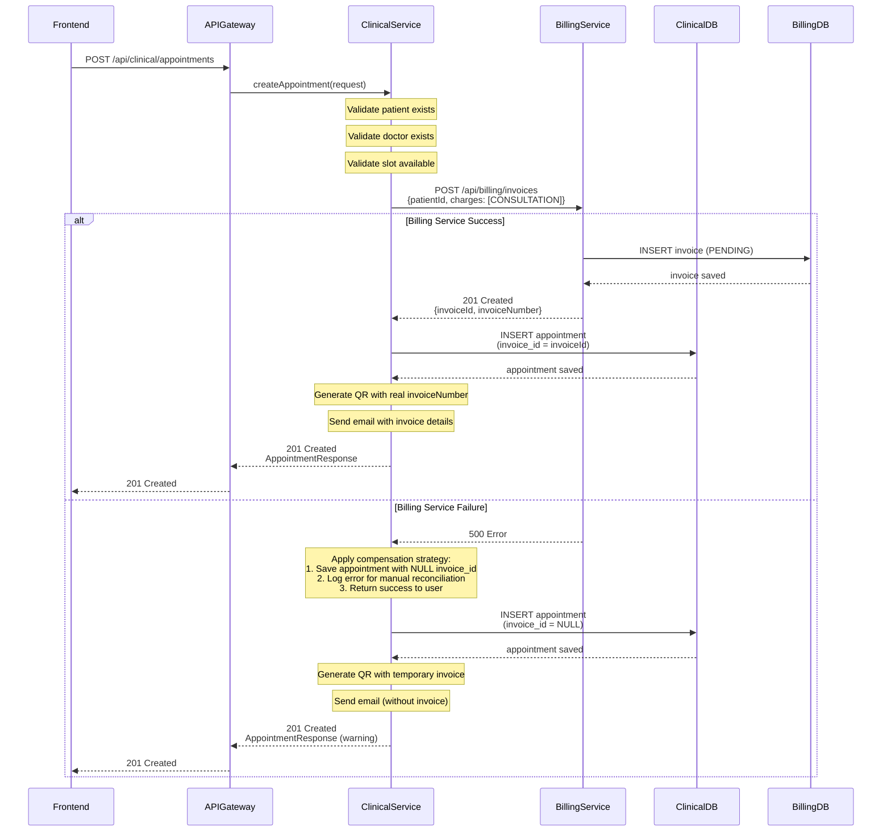
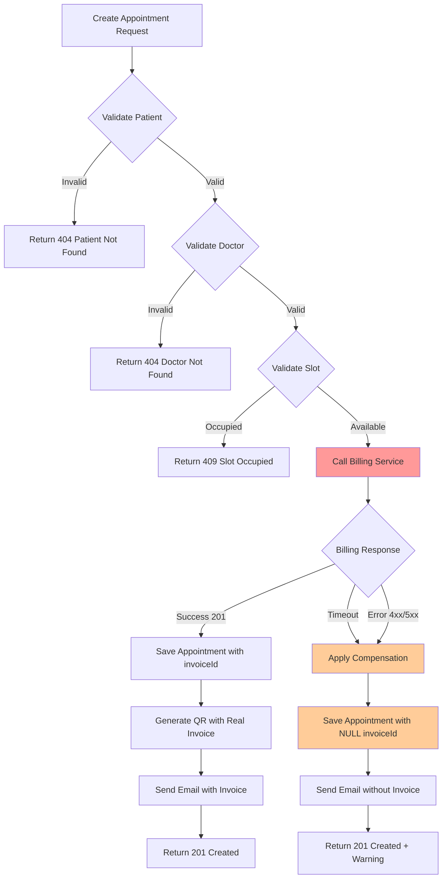

# Design Document: Appointment-Billing Integration

## Overview

La integración automática entre el módulo de admisión (Clinical Service) y el módulo de facturación (Billing Service) permite que al crear una cita médica se genere automáticamente una factura PENDING en el sistema de facturación con un cargo por consulta médica. Esta integración elimina la creación manual de facturas por parte del cajero, reduce errores humanos, mejora la trazabilidad entre citas y facturas, y minimiza el riesgo de que pacientes se vayan sin pagar.

**Problema actual**: Clinical Service genera un número de factura temporal (INV-yyyyMMddHHmmss) pero NO crea la factura real en Billing Service. El cajero debe crear manualmente la factura cuando el paciente llega a caja.

**Solución propuesta**: Implementar integración síncrona REST donde AppointmentController.createAppointment() llama a Billing Service para crear una factura PENDING con cargo CONSULTATION, almacena el invoiceId real en la tabla appointments, y maneja errores con estrategia de compensación.

**Arquitectura**: Microservicios con DDD | **Comunicación**: REST síncrona | **Principio**: CERO JOINs entre esquemas

## Architecture

### System Context Diagram



### Integration Sequence Diagram



### Error Handling Flow



---

## Data Model Changes

### Clinical Service - Appointments Table

**New Column**: `invoice_id` to store reference to the billing invoice

```sql
-- Migration: Add invoice_id column to appointments table
ALTER TABLE clinical_schema.appointments 
ADD COLUMN invoice_id VARCHAR(36) NULL;

-- Add index for faster lookups
CREATE INDEX idx_appointments_invoice_id 
ON clinical_schema.appointments(invoice_id);

-- Add comment for documentation
COMMENT ON COLUMN clinical_schema.appointments.invoice_id 
IS 'Foreign key reference to billing_schema.invoices.id (logical, not enforced)';
```

**Updated Appointment Entity**:
```java
@Entity
@Table(name = "appointments", schema = "clinical_schema")
public class Appointment {
    @Id
    @GeneratedValue(strategy = GenerationType.UUID)
    private String id;
    
    private String patientId;
    private String doctorId;
    private LocalDate appointmentDate;
    private LocalTime appointmentTime;
    
    @Enumerated(EnumType.STRING)
    private AppointmentStatus status;
    
    private String notes;
    
    // NEW FIELD: Reference to billing invoice
    @Column(name = "invoice_id")
    private String invoiceId;
    
    private LocalDateTime createdAt;
    private String createdBy;
    
    @Transient
    private String qrCodeBase64;
    
    // Getters and setters...
}
```

### Billing Service - Invoices Table

**New Column**: `appointment_id` to store reference to the clinical appointment

```sql
-- Migration: Add appointment_id column to invoices table
ALTER TABLE billing_schema.invoices 
ADD COLUMN appointment_id VARCHAR(36) NULL;

-- Add index for faster lookups
CREATE INDEX idx_invoices_appointment_id 
ON billing_schema.invoices(appointment_id);

-- Add comment for documentation
COMMENT ON COLUMN billing_schema.invoices.appointment_id 
IS 'Foreign key reference to clinical_schema.appointments.id (logical, not enforced)';
```

**Updated Invoice Entity**:
```java
@Entity
@Table(name = "invoices", schema = "billing_schema")
public class Invoice {
    @Id
    @GeneratedValue(strategy = GenerationType.UUID)
    private String id;
    
    private String invoiceNumber;
    private String patientId;
    
    // NEW FIELD: Reference to clinical appointment
    @Column(name = "appointment_id")
    private String appointmentId;
    
    @OneToMany(cascade = CascadeType.ALL, mappedBy = "invoice")
    private List<Charge> charges;
    
    private BigDecimal subtotal;
    private BigDecimal discountAmount;
    private BigDecimal total;
    
    @Enumerated(EnumType.STRING)
    private InvoiceStatus status;
    
    private LocalDateTime createdAt;
    private String createdBy;
    private LocalDateTime updatedAt;
    
    // Getters and setters...
}
```

### Data Consistency Rules

1. **Bidirectional Reference**: `appointments.invoice_id` ↔ `invoices.appointment_id`
2. **Nullable Fields**: Both fields are nullable to support compensation scenarios
3. **No Foreign Key Constraints**: Logical references only (CERO JOINs principle)
4. **Eventual Consistency**: If Billing Service fails, appointment is created with NULL invoice_id

---

## Component Design

### 1. BillingServiceClient (Clinical Service)

**Purpose**: REST client for communicating with Billing Service

**Location**: `clinical-service/src/main/java/com/medframe/clinical/infrastructure/client/BillingServiceClient.java`

```java
package com.medframe.clinical.infrastructure.client;

import com.medframe.clinical.infrastructure.client.dto.CreateInvoiceRequest;
import com.medframe.clinical.infrastructure.client.dto.InvoiceResponse;
import io.github.resilience4j.circuitbreaker.annotation.CircuitBreaker;
import io.github.resilience4j.retry.annotation.Retry;
import lombok.extern.slf4j.Slf4j;
import org.springframework.beans.factory.annotation.Value;
import org.springframework.http.HttpEntity;
import org.springframework.http.HttpHeaders;
import org.springframework.http.HttpMethod;
import org.springframework.http.ResponseEntity;
import org.springframework.stereotype.Component;
import org.springframework.web.client.RestTemplate;

/**
 * REST client for Billing Service integration.
 * Implements circuit breaker and retry patterns for resilience.
 */
@Component
@Slf4j
public class BillingServiceClient {
    
    private final RestTemplate restTemplate;
    private final String billingServiceUrl;
    
    public BillingServiceClient(
            RestTemplate restTemplate,
            @Value("${billing.service.url:http://localhost:8086}") String billingServiceUrl) {
        this.restTemplate = restTemplate;
        this.billingServiceUrl = billingServiceUrl;
    }
    
    /**
     * Creates an invoice in Billing Service.
     * 
     * Circuit Breaker: Opens after 5 consecutive failures, half-open after 30s
     * Retry: 3 attempts with exponential backoff (1s, 2s, 4s)
     * Timeout: 5 seconds per request
     * 
     * @param request the invoice creation request
     * @param userId the user ID creating the invoice (for audit)
     * @return InvoiceResponse with invoiceId and invoiceNumber
     * @throws BillingServiceException if the call fails after retries
     */
    @CircuitBreaker(name = "billingService", fallbackMethod = "createInvoiceFallback")
    @Retry(name = "billingService")
    public InvoiceResponse createInvoice(CreateInvoiceRequest request, String userId) {
        log.info("Calling Billing Service to create invoice for patient: {}", request.getPatientId());
        
        HttpHeaders headers = new HttpHeaders();
        headers.set("X-User-Id", userId);
        headers.set("Content-Type", "application/json");
        
        HttpEntity<CreateInvoiceRequest> entity = new HttpEntity<>(request, headers);
        
        try {
            ResponseEntity<InvoiceResponse> response = restTemplate.exchange(
                billingServiceUrl + "/api/billing/invoices",
                HttpMethod.POST,
                entity,
                InvoiceResponse.class
            );
            
            log.info("Invoice created successfully: {}", response.getBody().getInvoiceNumber());
            return response.getBody();
            
        } catch (Exception e) {
            log.error("Error calling Billing Service: {}", e.getMessage(), e);
            throw new BillingServiceException("Failed to create invoice in Billing Service", e);
        }
    }
    
    /**
     * Fallback method when circuit breaker is open or all retries fail.
     * Returns null to signal that invoice creation failed.
     */
    private InvoiceResponse createInvoiceFallback(CreateInvoiceRequest request, String userId, Exception e) {
        log.error("Circuit breaker OPEN or retries exhausted for Billing Service. " +
                  "Patient: {}, Error: {}", request.getPatientId(), e.getMessage());
        return null; // Signals failure to caller
    }
}
```

### 2. DTOs for Billing Integration

**CreateInvoiceRequest DTO**:
```java
package com.medframe.clinical.infrastructure.client.dto;

import lombok.AllArgsConstructor;
import lombok.Data;
import lombok.NoArgsConstructor;

import java.math.BigDecimal;
import java.util.List;

@Data
@NoArgsConstructor
@AllArgsConstructor
public class CreateInvoiceRequest {
    private String patientId;
    private String appointmentId; // NEW: Link back to appointment
    private List<ChargeRequest> charges;
}

@Data
@NoArgsConstructor
@AllArgsConstructor
class ChargeRequest {
    private String type; // "CONSULTATION", "LABORATORY", "MEDICATION", "OTHER"
    private String description;
    private Integer quantity;
    private BigDecimal unitPrice;
}
```

**InvoiceResponse DTO**:
```java
package com.medframe.clinical.infrastructure.client.dto;

import lombok.AllArgsConstructor;
import lombok.Data;
import lombok.NoArgsConstructor;

import java.math.BigDecimal;
import java.time.LocalDateTime;
import java.util.List;

@Data
@NoArgsConstructor
@AllArgsConstructor
public class InvoiceResponse {
    private String id;
    private String invoiceNumber;
    private String patientId;
    private String appointmentId;
    private List<ChargeResponse> charges;
    private BigDecimal subtotal;
    private BigDecimal discountAmount;
    private BigDecimal total;
    private String status; // "PENDING", "PAID", "CANCELLED"
    private LocalDateTime createdAt;
    private String createdBy;
}

@Data
@NoArgsConstructor
@AllArgsConstructor
class ChargeResponse {
    private String id;
    private String type;
    private String description;
    private Integer quantity;
    private BigDecimal unitPrice;
    private BigDecimal subtotal;
}
```

### 3. Modified AppointmentController

**Updated createAppointment() method**:

```java
@PostMapping
public ResponseEntity<AppointmentResponse> createAppointment(
        @Valid @RequestBody CreateAppointmentRequest request,
        @RequestHeader("X-User-Id") String userId) {

    // 1. Determine patient ID
    String patientId;
    String patientEmail = "no-email@medflow.com";
    String patientFirstName = "Paciente";
    
    if (request.getPatientId() != null && !request.getPatientId().isBlank()) {
        patientId = request.getPatientId();
        try {
            PatientDTO patient = (PatientDTO) patientServiceClient.getPatient(patientId);
            patientEmail = patient.getEmail();
            patientFirstName = patient.getFirstName();
        } catch (Exception e) {
            log.warn("No se pudo obtener info del paciente {}: {}", patientId, e.getMessage());
        }
    } else {
        try {
            PatientDTO patient = (PatientDTO) patientServiceClient.getPatient(userId);
            patientId = patient.getId();
            patientEmail = patient.getEmail();
            patientFirstName = patient.getFirstName();
        } catch (Exception e) {
            log.error("No se pudo obtener info del paciente con auth_user_id {}: {}", userId, e.getMessage());
            throw new RuntimeException("No se pudo obtener información del paciente");
        }
    }

    // 2. Create appointment (manual or auto-assignment)
    Appointment appointment;
    if (request.getDoctorId() != null && !request.getDoctorId().trim().isEmpty()) {
        appointment = appointmentManager.createAppointment(
            patientId, request.getDoctorId(),
            request.getAppointmentDate(), request.getAppointmentTime(),
            request.getNotes(), userId, true);
    } else {
        appointment = manageAppointmentUseCase.createAppointmentWithAutoAssignment(
            patientId,
            request.getAppointmentDate(), request.getAppointmentTime(),
            request.getNotes(), userId);
    }

    // 3. Release slot hold if provided
    if (request.getSessionId() != null && !request.getSessionId().isBlank()) {
        manageAppointmentUseCase.releaseHold(request.getSessionId());
    }

    // 4. Resolve doctor name
    String doctorName = doctorRepository.findById(appointment.getDoctorId())
            .map(d -> "Dr. " + d.getName())
            .orElse("Dr. Asignado");

    // ========== NEW: CREATE INVOICE IN BILLING SERVICE ==========
    String invoiceNumber = null;
    try {
        // Build invoice request with consultation charge
        BigDecimal consultationPrice = consultationPriceConfig.getPrice(); // From config
        
        CreateInvoiceRequest invoiceRequest = new CreateInvoiceRequest(
            patientId,
            appointment.getId(), // Link appointment to invoice
            List.of(new ChargeRequest(
                "CONSULTATION",
                "Consulta médica - " + doctorName + " - " + 
                    appointment.getAppointmentDate().format(DateTimeFormatter.ISO_DATE),
                1,
                consultationPrice
            ))
        );
        
        // Call Billing Service
        InvoiceResponse invoiceResponse = billingServiceClient.createInvoice(invoiceRequest, userId);
        
        if (invoiceResponse != null) {
            // Success: Save invoice reference in appointment
            appointment.setInvoiceId(invoiceResponse.getId());
            appointmentRepository.save(appointment);
            invoiceNumber = invoiceResponse.getInvoiceNumber();
            
            log.info("Invoice created successfully for appointment {}: {}", 
                     appointment.getId(), invoiceNumber);
        } else {
            // Fallback triggered: Log for manual reconciliation
            log.warn("Billing Service unavailable. Appointment {} created without invoice. " +
                     "Manual reconciliation required.", appointment.getId());
            invoiceNumber = generateTemporaryInvoiceNumber(); // Fallback to temporary
        }
        
    } catch (Exception e) {
        // Compensation: Continue without invoice
        log.error("Error creating invoice for appointment {}: {}", 
                  appointment.getId(), e.getMessage(), e);
        invoiceNumber = generateTemporaryInvoiceNumber();
    }
    // ========== END NEW CODE ==========

    // 5. Attach QR code and send confirmation email
    appointmentManager.attachQRAndNotify(
        appointment, patientEmail, patientFirstName, doctorName, invoiceNumber);

    return ResponseEntity.status(HttpStatus.CREATED).body(mapToResponse(appointment));
}

/**
 * Generates a temporary invoice number for fallback scenarios.
 * Format: INV-yyyyMMddHHmmss
 */
private String generateTemporaryInvoiceNumber() {
    return "INV-" + LocalDateTime.now().format(
        DateTimeFormatter.ofPattern("yyyyMMddHHmmss"));
}
```

### 4. Billing Service - Updated InvoiceController

**Modified createInvoice() to accept appointmentId**:

```java
@PostMapping
public ResponseEntity<InvoiceResponse> createInvoice(
        @Valid @RequestBody CreateInvoiceRequest request,
        @RequestHeader(value = "X-User-Id", required = false, defaultValue = "system") String createdBy) {
    
    InvoiceResponse response = invoiceService.createInvoice(request, createdBy);
    return ResponseEntity.status(HttpStatus.CREATED).body(response);
}
```

**Updated InvoiceService.createInvoice()**:

```java
@Transactional
public InvoiceResponse createInvoice(CreateInvoiceRequest request, String createdBy) {
    // 1. Generate invoice number: INV-YYYYMMDD-XXXX
    String invoiceNumber = generateInvoiceNumber();
    
    // 2. Calculate subtotals for each charge
    List<Charge> charges = request.getCharges().stream()
        .map(c -> {
            Charge charge = new Charge();
            charge.setType(ChargeType.valueOf(c.getType()));
            charge.setDescription(c.getDescription());
            charge.setQuantity(c.getQuantity());
            charge.setUnitPrice(c.getUnitPrice());
            charge.setSubtotal(c.getUnitPrice().multiply(BigDecimal.valueOf(c.getQuantity())));
            return charge;
        }).collect(Collectors.toList());
    
    // 3. Calculate total
    BigDecimal subtotal = charges.stream()
        .map(Charge::getSubtotal)
        .reduce(BigDecimal.ZERO, BigDecimal::add);
    
    // 4. Create invoice
    Invoice invoice = new Invoice();
    invoice.setInvoiceNumber(invoiceNumber);
    invoice.setPatientId(request.getPatientId());
    invoice.setAppointmentId(request.getAppointmentId()); // NEW: Store appointment reference
    invoice.setCharges(charges);
    invoice.setSubtotal(subtotal);
    invoice.setDiscountAmount(BigDecimal.ZERO);
    invoice.setTotal(subtotal);
    invoice.setStatus(InvoiceStatus.PENDING);
    invoice.setCreatedAt(LocalDateTime.now());
    invoice.setCreatedBy(createdBy);
    
    Invoice saved = invoiceRepository.save(invoice);
    
    return mapToResponse(saved);
}
```

---

## Configuration

### Clinical Service - application.yml

```yaml
# Billing Service Integration
billing:
  service:
    url: ${BILLING_SERVICE_URL:http://localhost:8086}
    timeout: 5000 # 5 seconds
    
# Consultation Pricing
consultation:
  price:
    default: 150.00 # Default consultation price in GTQ
    emergency: 300.00 # Emergency consultation price
    followup: 100.00 # Follow-up consultation price

# Resilience4j Circuit Breaker Configuration
resilience4j:
  circuitbreaker:
    instances:
      billingService:
        registerHealthIndicator: true
        slidingWindowSize: 10
        minimumNumberOfCalls: 5
        permittedNumberOfCallsInHalfOpenState: 3
        automaticTransitionFromOpenToHalfOpenEnabled: true
        waitDurationInOpenState: 30s
        failureRateThreshold: 50
        eventConsumerBufferSize: 10
        recordExceptions:
          - org.springframework.web.client.HttpServerErrorException
          - org.springframework.web.client.ResourceAccessException
          - com.medframe.clinical.infrastructure.client.BillingServiceException
        ignoreExceptions:
          - com.medframe.clinical.domain.exception.ValidationException
          
  retry:
    instances:
      billingService:
        maxAttempts: 3
        waitDuration: 1s
        enableExponentialBackoff: true
        exponentialBackoffMultiplier: 2
        retryExceptions:
          - org.springframework.web.client.HttpServerErrorException
          - org.springframework.web.client.ResourceAccessException
        ignoreExceptions:
          - org.springframework.web.client.HttpClientErrorException

# RestTemplate Configuration
rest:
  template:
    connection:
      timeout: 5000
      request-timeout: 5000
    read:
      timeout: 5000
```

### ConsultationPriceConfig Bean

```java
package com.medframe.clinical.config;

import lombok.Data;
import org.springframework.boot.context.properties.ConfigurationProperties;
import org.springframework.context.annotation.Configuration;

import java.math.BigDecimal;

@Configuration
@ConfigurationProperties(prefix = "consultation.price")
@Data
public class ConsultationPriceConfig {
    private BigDecimal defaultPrice = new BigDecimal("150.00");
    private BigDecimal emergency = new BigDecimal("300.00");
    private BigDecimal followup = new BigDecimal("100.00");
    
    /**
     * Returns the default consultation price.
     * Can be extended to support different pricing strategies.
     */
    public BigDecimal getPrice() {
        return defaultPrice;
    }
}
```

### RestTemplate Bean with Timeout

```java
package com.medframe.clinical.config;

import org.springframework.beans.factory.annotation.Value;
import org.springframework.boot.web.client.RestTemplateBuilder;
import org.springframework.context.annotation.Bean;
import org.springframework.context.annotation.Configuration;
import org.springframework.web.client.RestTemplate;

import java.time.Duration;

@Configuration
public class RestTemplateConfig {
    
    @Value("${rest.template.connection.timeout:5000}")
    private int connectionTimeout;
    
    @Value("${rest.template.read.timeout:5000}")
    private int readTimeout;
    
    @Bean
    public RestTemplate restTemplate(RestTemplateBuilder builder) {
        return builder
            .setConnectTimeout(Duration.ofMillis(connectionTimeout))
            .setReadTimeout(Duration.ofMillis(readTimeout))
            .build();
    }
}
```

---

## Correctness Properties

### Property 1: Bidirectional Reference Consistency
**Statement**: For any appointment with a non-null `invoice_id`, there SHALL exist an invoice with matching `appointment_id`.

**Formal**: `∀ appointment ∈ Appointments: appointment.invoice_id ≠ NULL ⇒ ∃ invoice ∈ Invoices: invoice.id = appointment.invoice_id ∧ invoice.appointment_id = appointment.id`

**Validates: Requirements 5.3, 5.4, 5.5, 5.6**

**Test Strategy**: Property-based test that generates random appointments and verifies bidirectional consistency.

```java
@Property
void appointmentInvoiceReferencesAreConsistent(
    @ForAll("validAppointments") Appointment appointment) {
    
    if (appointment.getInvoiceId() != null) {
        Invoice invoice = invoiceRepository.findById(appointment.getInvoiceId())
            .orElseThrow(() -> new AssertionError("Invoice not found"));
        
        assertThat(invoice.getAppointmentId()).isEqualTo(appointment.getId());
    }
}
```

### Property 2: Invoice Created for Every Successful Appointment
**Statement**: When an appointment is created successfully AND Billing Service is available, an invoice SHALL be created with status PENDING.

**Formal**: `∀ appointment ∈ Appointments: appointment.created_successfully = true ∧ billing_service.available = true ⇒ ∃ invoice ∈ Invoices: invoice.appointment_id = appointment.id ∧ invoice.status = PENDING`

**Validates: Requirements 1.1, 1.2, 1.3, 1.6, 1.8**

**Test Strategy**: Integration test with mocked Billing Service returning success.

```java
@Test
void whenAppointmentCreated_thenInvoiceIsCreatedWithPendingStatus() {
    // Given: Billing Service is available and returns success
    when(billingServiceClient.createInvoice(any(), any()))
        .thenReturn(new InvoiceResponse(/* ... */));
    
    // When: Create appointment
    Appointment appointment = appointmentManager.createAppointment(/* ... */);
    
    // Then: Invoice exists with PENDING status
    assertThat(appointment.getInvoiceId()).isNotNull();
    
    Invoice invoice = invoiceRepository.findById(appointment.getInvoiceId()).orElseThrow();
    assertThat(invoice.getStatus()).isEqualTo(InvoiceStatus.PENDING);
    assertThat(invoice.getAppointmentId()).isEqualTo(appointment.getId());
}
```

### Property 3: Appointment Created Even When Billing Fails (Compensation)
**Statement**: When Billing Service is unavailable, the appointment SHALL still be created with `invoice_id = NULL`.

**Formal**: `∀ appointment_request: billing_service.available = false ⇒ ∃ appointment ∈ Appointments: appointment.invoice_id = NULL ∧ appointment.status = SCHEDULED`

**Validates: Requirements 2.1, 2.2, 2.6, 2.7**

**Test Strategy**: Integration test with mocked Billing Service throwing exception.

```java
@Test
void whenBillingServiceFails_thenAppointmentIsStillCreated() {
    // Given: Billing Service is unavailable
    when(billingServiceClient.createInvoice(any(), any()))
        .thenThrow(new BillingServiceException("Service unavailable"));
    
    // When: Create appointment
    Appointment appointment = appointmentManager.createAppointment(/* ... */);
    
    // Then: Appointment exists with NULL invoice_id
    assertThat(appointment.getId()).isNotNull();
    assertThat(appointment.getInvoiceId()).isNull();
    assertThat(appointment.getStatus()).isEqualTo(AppointmentStatus.SCHEDULED);
}
```

### Property 4: Invoice Total Equals Consultation Price
**Statement**: For any invoice created from an appointment, the total SHALL equal the configured consultation price (no discount applied initially).

**Formal**: `∀ invoice ∈ Invoices: invoice.appointment_id ≠ NULL ⇒ invoice.total = consultation.price.default ∧ invoice.discount_amount = 0`

**Validates: Requirements 4.3, 4.4, 4.5**

**Test Strategy**: Property-based test verifying invoice totals.

```java
@Property
void invoiceFromAppointmentHasCorrectTotal(
    @ForAll("validAppointmentRequests") CreateAppointmentRequest request) {
    
    Appointment appointment = appointmentManager.createAppointment(/* ... */);
    
    if (appointment.getInvoiceId() != null) {
        Invoice invoice = invoiceRepository.findById(appointment.getInvoiceId()).orElseThrow();
        
        BigDecimal expectedPrice = consultationPriceConfig.getPrice();
        assertThat(invoice.getTotal()).isEqualByComparingTo(expectedPrice);
        assertThat(invoice.getDiscountAmount()).isEqualByComparingTo(BigDecimal.ZERO);
    }
}
```

### Property 5: Circuit Breaker Opens After Threshold
**Statement**: When Billing Service fails consecutively for `failureRateThreshold` times, the circuit breaker SHALL open and subsequent calls SHALL fail fast.

**Formal**: `∀ calls: consecutive_failures(calls) ≥ failureRateThreshold ⇒ circuit_breaker.state = OPEN ∧ next_call.duration < timeout`

**Validates: Requirements 3.1, 3.2, 3.3, 3.7**

**Test Strategy**: Integration test simulating consecutive failures.

```java
@Test
void whenBillingServiceFailsConsecutively_thenCircuitBreakerOpens() {
    // Given: Billing Service fails 5 times (threshold)
    when(billingServiceClient.createInvoice(any(), any()))
        .thenThrow(new BillingServiceException("Service unavailable"));
    
    // When: Make 5 consecutive calls
    for (int i = 0; i < 5; i++) {
        try {
            appointmentManager.createAppointment(/* ... */);
        } catch (Exception e) {
            // Expected
        }
    }
    
    // Then: Circuit breaker is OPEN
    CircuitBreaker circuitBreaker = circuitBreakerRegistry.circuitBreaker("billingService");
    assertThat(circuitBreaker.getState()).isEqualTo(CircuitBreaker.State.OPEN);
    
    // And: Next call fails fast (< 100ms instead of 5s timeout)
    long startTime = System.currentTimeMillis();
    try {
        appointmentManager.createAppointment(/* ... */);
    } catch (Exception e) {
        long duration = System.currentTimeMillis() - startTime;
        assertThat(duration).isLessThan(100);
    }
}
```

---

## Testing Strategy

### Unit Tests
1. **BillingServiceClient**:
   - Test successful invoice creation
   - Test timeout handling
   - Test circuit breaker fallback
   - Test retry mechanism

2. **AppointmentController**:
   - Test appointment creation with successful billing
   - Test appointment creation with billing failure
   - Test compensation strategy

### Integration Tests
1. **End-to-End Flow**:
   - Create appointment → Verify invoice created
   - Create appointment with billing down → Verify appointment created without invoice
   - Verify QR code contains real invoice number

2. **Circuit Breaker**:
   - Test circuit opens after threshold
   - Test circuit half-open state
   - Test circuit closes after successful calls

### Property-Based Tests
1. **Bidirectional Consistency**: Verify appointment ↔ invoice references
2. **Invoice Totals**: Verify consultation price calculation
3. **Compensation**: Verify appointments created even when billing fails

---

## Deployment Strategy

### Phase 1: Database Migrations (Zero Downtime)
1. Add `invoice_id` column to `appointments` table (nullable)
2. Add `appointment_id` column to `invoices` table (nullable)
3. Add indexes for performance

### Phase 2: Deploy Billing Service Changes
1. Deploy updated `InvoiceController` and `InvoiceService`
2. Verify backward compatibility (old requests still work)

### Phase 3: Deploy Clinical Service Changes
1. Deploy `BillingServiceClient` and configuration
2. Deploy updated `AppointmentController`
3. Monitor circuit breaker metrics

### Phase 4: Data Reconciliation (Optional)
1. Script to link existing appointments to invoices by `patientId` and `createdAt`
2. Manual review of unlinked records

---

## Monitoring and Observability

### Metrics to Track
1. **Billing Service Call Success Rate**: `billing_service_calls_total{status="success|failure"}`
2. **Circuit Breaker State**: `resilience4j_circuitbreaker_state{name="billingService"}`
3. **Appointments Created Without Invoice**: `appointments_without_invoice_total`
4. **Average Invoice Creation Time**: `billing_service_call_duration_seconds`

### Alerts
1. **Circuit Breaker Open**: Alert when circuit breaker stays open > 5 minutes
2. **High Failure Rate**: Alert when billing call failure rate > 10%
3. **Appointments Without Invoice**: Alert when count > 10 in 1 hour

### Logs
1. **Successful Integration**: `INFO: Invoice created successfully for appointment {id}: {invoiceNumber}`
2. **Billing Failure**: `WARN: Billing Service unavailable. Appointment {id} created without invoice.`
3. **Circuit Breaker**: `ERROR: Circuit breaker OPEN for Billing Service`

---

## Rollback Plan

### If Integration Causes Issues
1. **Immediate**: Set `billing.service.enabled=false` in config (feature flag)
2. **Code Rollback**: Revert to previous version of `AppointmentController`
3. **Data Cleanup**: Set `invoice_id = NULL` for problematic appointments

### Feature Flag Implementation
```yaml
billing:
  service:
    enabled: ${BILLING_INTEGRATION_ENABLED:true}
```

```java
@Value("${billing.service.enabled:true}")
private boolean billingIntegrationEnabled;

// In createAppointment():
if (billingIntegrationEnabled) {
    // Call Billing Service
} else {
    // Use temporary invoice number (old behavior)
}
```

---

## Future Enhancements

1. **Asynchronous Integration**: Use message queue (RabbitMQ/Kafka) for eventual consistency
2. **Pricing Strategies**: Support different prices based on doctor specialty, time of day, patient type
3. **Automatic Reconciliation**: Background job to link orphaned appointments to invoices
4. **Invoice Preview**: Show estimated cost to patient before confirming appointment
5. **Payment at Booking**: Allow patients to pay online when creating appointment

---

**Created**: April 24, 2026  
**Author**: MedFlow Team  
**Status**: ✅ Ready for Review  
**Version**: 1.0.0
