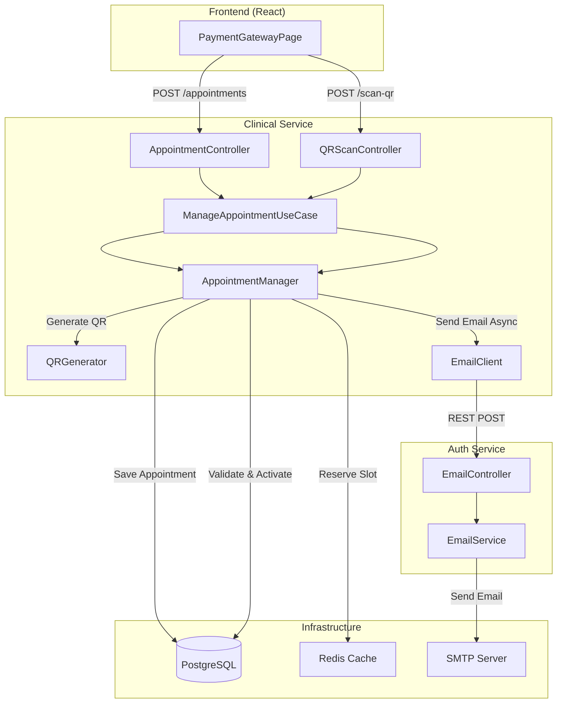
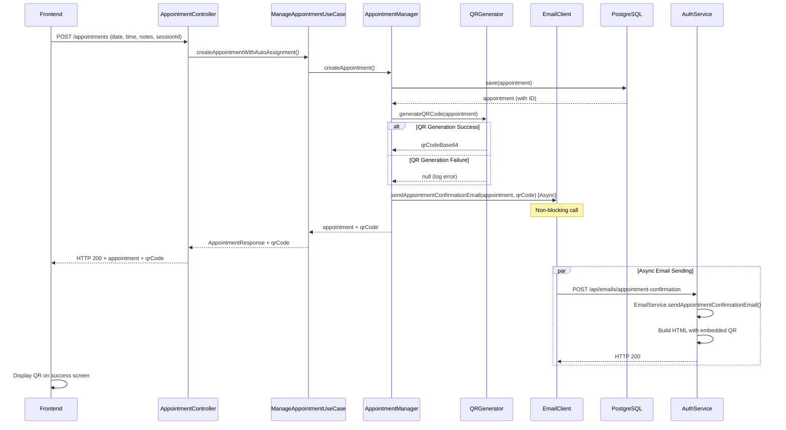
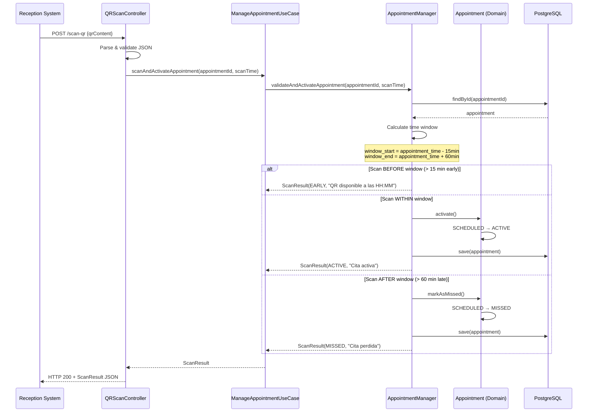

# Design Document: Appointment Confirmation QR & Email

## Overview

This design implements QR code generation and email confirmation functionality for medical appointments in the MedFlow HIS system. When a patient successfully books and pays for an appointment, the system will:

1. **Generate a unique QR code** containing appointment details (appointmentId, patientId, doctorId, date, time, generatedAt)
2. **Send a confirmation email** with appointment details and the embedded QR code
3. **Display the QR code** on the payment success screen for immediate access
4. **Enable QR-based appointment activation** within a time window (15 minutes before to 60 minutes after appointment time)

### Key Design Principles

- **Hexagonal Architecture**: Maintain clean separation between domain, application, and infrastructure layers
- **Resilience**: QR generation or email failures must not block appointment creation
- **Asynchronous Communication**: Email sending is non-blocking
- **Time-Window Validation**: QR activation enforces business rules about arrival times
- **Microservice Integration**: Clinical-service communicates with auth-service for email delivery

### Technology Stack

- **QR Generation**: ZXing (Zebra Crossing) library v3.5.1+
- **Email Service**: Existing EmailService in auth-service with JavaMailSender
- **Inter-service Communication**: REST with Feign client
- **Serialization**: Jackson ObjectMapper for JSON
- **Async Processing**: Spring @Async for email operations

---

## Architecture

### High-Level Component Diagram



### Sequence Diagram: Appointment Creation with QR & Email



### Sequence Diagram: QR Code Scanning & Activation



---

## Components and Interfaces

### 1. QRGenerator (Infrastructure Layer)

**Location**: `backend-services/clinical-service/src/main/java/com/medframe/clinical/infrastructure/qr/QRGenerator.java`

**Responsibility**: Generate QR codes containing appointment data in JSON format, encoded as base64 PNG images.

**Interface**:
```java
public interface QRCodeGenerator {
    /**
     * Generates a QR code for an appointment.
     * @param appointmentData Data to encode in the QR
     * @return Base64-encoded PNG image, or null if generation fails
     */
    String generateQRCode(AppointmentQRData appointmentData);
}
```

**Implementation Details**:
- Uses ZXing `QRCodeWriter` and `MatrixToImageWriter`
- QR error correction level: L (15% recovery)
- Image size: 300x300 pixels
- Output format: PNG encoded as base64 string
- Handles exceptions gracefully, returns null on failure

**Dependencies**:
```xml
<dependency>
    <groupId>com.google.zxing</groupId>
    <artifactId>core</artifactId>
    <version>3.5.1</version>
</dependency>
<dependency>
    <groupId>com.google.zxing</groupId>
    <artifactId>javase</artifactId>
    <version>3.5.1</version>
</dependency>
```

### 2. AppointmentQRData (Domain Model)

**Location**: `backend-services/clinical-service/src/main/java/com/medframe/clinical/domain/model/AppointmentQRData.java`

**Responsibility**: Value object representing the data encoded in a QR code.

**Structure**:
```java
public class AppointmentQRData {
    private String appointmentId;
    private String patientId;
    private String doctorId;
    private String date;        // ISO 8601: YYYY-MM-DD
    private String time;        // ISO 8601: HH:mm:ss
    private String generatedAt; // ISO 8601 with timezone
    
    // Constructor, getters, equals, hashCode
}
```

**Serialization**: Jackson ObjectMapper with UTF-8 encoding

### 3. EmailClient (Infrastructure Layer)

**Location**: `backend-services/clinical-service/src/main/java/com/medframe/clinical/infrastructure/client/EmailClient.java`

**Responsibility**: Adapter for communicating with auth-service to send emails.

**Interface**:
```java
public interface AppointmentEmailSender {
    /**
     * Sends appointment confirmation email asynchronously.
     * @param request Email request with appointment details and QR code
     */
    void sendAppointmentConfirmationEmail(AppointmentEmailRequest request);
}
```

**Implementation**:
- Uses Feign client for REST communication
- Target: `POST http://auth-service:8081/api/emails/appointment-confirmation`
- Timeout: 5 seconds (configured in Feign)
- Circuit breaker: Logs errors, does not throw exceptions
- Async execution: Annotated with `@Async`

**Configuration**:
```yaml
# application.yml
services:
  auth-service:
    url: http://localhost:8081  # Local dev
    # url: http://auth-service:8081  # Docker

feign:
  client:
    config:
      auth-service:
        connectTimeout: 2000
        readTimeout: 5000
```

### 4. EmailService Enhancement (Auth Service)

**Location**: `backend-services/auth-service/src/main/java/com/medflow/auth/service/EmailService.java`

**New Method**:
```java
@Async
public void sendAppointmentConfirmationEmail(String toEmail, String firstName,
                                             String appointmentDate, String appointmentTime,
                                             String doctorName, String invoiceNumber,
                                             String qrCodeBase64, String notes,
                                             String validFromTime, String validUntilTime)
```

**Email Template Structure**:
- Subject: "Confirmación de Cita — MedFlow HIS"
- HTML body with MedFlow branding (consistent with existing templates)
- Sections:
  - Greeting with patient name
  - Appointment details (date, time, doctor, invoice number)
  - QR code embedded as inline image (``)
  - Time window instructions ("QR válido desde HH:MM hasta HH:MM")
  - Notes (if provided)
  - Footer with contact information

**Email Controller** (New):

**Location**: `backend-services/auth-service/src/main/java/com/medflow/auth/controller/EmailController.java`

```java
@RestController
@RequestMapping("/api/emails")
public class EmailController {
    
    @PostMapping("/appointment-confirmation")
    public ResponseEntity<Void> sendAppointmentConfirmation(
            @RequestBody AppointmentEmailRequest request) {
        // Delegate to EmailService
        // Return 200 immediately (async processing)
    }
}
```

### 5. AppointmentManager Enhancement (Domain Service)

**Location**: `backend-services/clinical-service/src/main/java/com/medframe/clinical/domain/service/AppointmentManager.java`

**New Methods**:

```java
/**
 * Creates appointment with QR generation and email notification.
 * @return Appointment with qrCodeBase64 field populated
 */
public Appointment createAppointmentWithNotification(
        String patientId, String doctorId, LocalDate date, LocalTime time,
        String notes, String createdBy, boolean skipPatientValidation);

/**
 * Validates QR scan time and activates appointment if within window.
 * @param appointmentId Appointment to activate
 * @param scanTime Time when QR was scanned
 * @return ScanResult with status (EARLY, ACTIVE, MISSED) and message
 */
public ScanResult validateAndActivateAppointment(
        String appointmentId, LocalDateTime scanTime);
```

**Business Logic**:
- Time window calculation:
  - `window_start = appointment_datetime - 15 minutes`
  - `window_end = appointment_datetime + 60 minutes`
- State transitions:
  - `EARLY`: scanTime < window_start
  - `ACTIVE`: window_start ≤ scanTime ≤ window_end (transition SCHEDULED → ACTIVE)
  - `MISSED`: scanTime > window_end (transition SCHEDULED → MISSED)

### 6. Appointment Domain Model Enhancement

**Location**: `backend-services/clinical-service/src/main/java/com/medframe/clinical/domain/model/Appointment.java`

**New Status**:
```java
public enum AppointmentStatus {
    SCHEDULED, ACTIVE, COMPLETED, CANCELLED, MISSED
}
```

**New Business Method**:
```java
/**
 * Marks appointment as missed (late arrival).
 * Transition: SCHEDULED → MISSED
 */
public void markAsMissed() {
    if (this.status != AppointmentStatus.SCHEDULED) {
        throw new IllegalStateException(
            "Solo se pueden marcar como perdidas las citas programadas. Estado actual: " + this.status);
    }
    this.status = AppointmentStatus.MISSED;
}
```

**Transient Field** (not persisted):
```java
@Transient
private String qrCodeBase64; // Populated after generation, returned in API response
```

### 7. QRScanController (REST Layer)

**Location**: `backend-services/clinical-service/src/main/java/com/medframe/clinical/infrastructure/rest/controller/QRScanController.java`

**Endpoint**:
```java
@PostMapping("/api/clinical/appointments/scan-qr")
public ResponseEntity<ScanResultDTO> scanQRCode(@RequestBody QRScanRequest request)
```

**Request DTO**:
```java
public class QRScanRequest {
    private String appointmentId;
    private String patientId;
    private String doctorId;
    private String date;
    private String time;
    private String generatedAt;
}
```

**Response DTO**:
```java
public class ScanResultDTO {
    private String status;           // EARLY, ACTIVE, MISSED
    private String message;          // User-friendly message
    private AppointmentDTO appointmentDetails;
    private String timestamp;        // ISO 8601
}
```

### 8. Frontend Enhancement

**Location**: `frontend-medflow/src/pages/PaymentGatewayPage.tsx`

**Changes**:
1. **AppointmentResponse interface** updated:
```typescript
export interface AppointmentResponse {
  id: string;
  patientId: string;
  doctorId: string;
  appointmentDate: string;
  appointmentTime: string;
  status: string;
  notes?: string;
  createdAt: string;
  qrCodeBase64?: string;  // NEW
}
```

2. **Success screen enhancement**:
   - Display QR code image: ``
   - Show time window: "QR válido desde {validFrom} hasta {validUntil}"
   - Add download button: triggers browser download of QR as PNG file

3. **Download functionality**:
```typescript
const downloadQR = () => {
  const link = document.createElement('a');
  link.href = `data:image/png;base64,${appointment.qrCodeBase64}`;
  link.download = `cita-${appointment.id}.png`;
  link.click();
};
```

---

## Data Models

### AppointmentQRData JSON Structure

```json
{
  "appointmentId": "550e8400-e29b-41d4-a716-446655440000",
  "patientId": "3012345678901",
  "doctorId": "DOC-001",
  "date": "2025-02-15",
  "time": "14:00:00",
  "generatedAt": "2025-02-01T10:30:00-06:00"
}
```

### AppointmentEmailRequest (Clinical → Auth Service)

```json
{
  "toEmail": "patient@example.com",
  "firstName": "Juan",
  "appointmentDate": "2025-02-15",
  "appointmentTime": "14:00",
  "doctorName": "Dr. María González",
  "invoiceNumber": "INV-2025-001234",
  "qrCodeBase64": "iVBORw0KGgoAAAANSUhEUgAA...",
  "notes": "Traer exámenes previos",
  "validFromTime": "13:45",
  "validUntilTime": "15:00"
}
```

### ScanResult Domain Model

```java
public class ScanResult {
    public enum Status { EARLY, ACTIVE, MISSED }
    
    private Status status;
    private String message;
    private Appointment appointment;
    private LocalDateTime scanTime;
}
```

### Database Schema Changes

**appointments table** (no schema changes required):
- Existing `status` column already supports VARCHAR, will store new "MISSED" value
- No new columns needed (qrCodeBase64 is transient, not persisted)

---

## Correctness Properties

*A property is a characteristic or behavior that should hold true across all valid executions of a system—essentially, a formal statement about what the system should do. Properties serve as the bridge between human-readable specifications and machine-verifiable correctness guarantees.*

### Property Reflection

After analyzing all acceptance criteria, I identified the following property categories:

1. **QR Generation & Serialization**: Properties about QR code creation, format, and content
2. **Time Window Validation**: Properties about scan time validation and state transitions
3. **Round-Trip Properties**: Serialization/deserialization and QR encode/decode cycles
4. **Email Content**: Properties about email structure and required fields
5. **State Machine**: Properties about appointment status transitions

**Redundancy Elimination**:
- Properties 1.2 and 6.1 (QR content fields) are identical → Combined into Property 1
- Properties 9.4 and 10.5 (round-trip) cover the same behavior → Combined into Property 2
- Properties 11.2, 11.4, 11.5, 11.6 all test time window logic → Combined into Property 4
- Properties 13.2 and 13.3 (state transitions) are specific cases of Property 5 → Consolidated

### Property 1: QR Code Contains Required Fields

*For any* valid appointment, the generated QR code SHALL contain a JSON object with all required fields: appointmentId, patientId, doctorId, date (ISO 8601 YYYY-MM-DD), time (ISO 8601 HH:mm:ss), and generatedAt (ISO 8601 with timezone).

**Validates: Requirements 1.2, 6.1, 6.2, 6.3, 6.4**

### Property 2: QR Generation Round-Trip Preserves Data

*For any* valid appointment data, generating a QR code and then scanning/decoding it SHALL produce appointment data equivalent to the original.

**Validates: Requirements 1.4, 9.4, 10.5**

### Property 3: QR Code Output is Valid Base64 PNG

*For any* valid appointment, the generated QR code SHALL be a valid base64-encoded string that decodes to a valid PNG image readable by standard QR readers.

**Validates: Requirements 1.3, 1.4**

### Property 4: Time Window Validation Determines Scan Result

*For any* appointment and scan time, the scan result status SHALL be:
- EARLY if scanTime < (appointmentDateTime - 15 minutes)
- ACTIVE if (appointmentDateTime - 15 minutes) ≤ scanTime ≤ (appointmentDateTime + 60 minutes)
- MISSED if scanTime > (appointmentDateTime + 60 minutes)

**Validates: Requirements 11.1, 11.2, 11.4, 11.5, 11.6**

### Property 5: State Transitions Follow Valid Paths

*For any* appointment, state transitions SHALL only follow valid paths:
- SCHEDULED → ACTIVE (when QR scanned within window)
- SCHEDULED → MISSED (when QR scanned after window)
- SCHEDULED → CANCELLED (when cancelled by user)
- ACTIVE → COMPLETED (when consultation finishes)
- ACTIVE → CANCELLED (when cancelled by user)
Invalid transitions (e.g., ACTIVE → SCHEDULED, COMPLETED → ACTIVE) SHALL be rejected.

**Validates: Requirements 13.2, 13.3, 13.4**

### Property 6: Appointment Creation Always Assigns SCHEDULED Status

*For any* newly created appointment (regardless of whether QR generation or email sending succeeds or fails), the initial status SHALL be SCHEDULED.

**Validates: Requirements 13.1**

### Property 7: Scan Result Idempotence

*For any* appointment already in ACTIVE or MISSED status, additional QR scans SHALL return the same status and message without changing the appointment state.

**Validates: Requirements 13.5, 13.6**

### Property 8: Email Request Contains All Required Fields

*For any* appointment confirmation email request sent from clinical-service to auth-service, the request SHALL contain all required fields: toEmail, firstName, appointmentDate, appointmentTime, doctorName, invoiceNumber, qrCodeBase64, validFromTime, validUntilTime.

**Validates: Requirements 5.3**

### Property 9: Email HTML Contains Required Information

*For any* appointment confirmation email, the generated HTML SHALL contain: patient name, appointment date, appointment time, doctor name, invoice number, embedded QR code image, and time window instructions.

**Validates: Requirements 2.2, 2.3, 2.5**

### Property 10: Time Window Calculation is Consistent

*For any* appointment time T, the valid time window SHALL be calculated as:
- validFrom = T - 15 minutes
- validUntil = T + 60 minutes

This calculation SHALL be consistent across QR scanning validation, email content, and frontend display.

**Validates: Requirements 2.5, 3.5, 11.2**

### Property 11: JSON Serialization Round-Trip Preserves Appointment Data

*For any* valid AppointmentQRData object, serializing to JSON and then deserializing SHALL produce an object equivalent to the original, including correct handling of UTF-8 characters, special characters, and accents.

**Validates: Requirements 9.1, 9.2, 9.3, 9.4**

### Property 12: Scan Response Contains Required Fields

*For any* QR scan request (valid or invalid), the response SHALL contain all required fields: status, message, appointmentDetails (if found), and timestamp.

**Validates: Requirements 12.3**

### Property 13: Early Scan Message Includes Valid-From Time

*For any* QR scan that occurs before the valid window (EARLY status), the response message SHALL include the exact time when the QR will become valid (appointmentTime - 15 minutes).

**Validates: Requirements 11.4, 12.4**

---

## Error Handling

### QR Generation Failures

**Strategy**: Graceful degradation
- If QR generation fails (exception thrown), log the error with full stack trace
- Continue with appointment creation
- Return appointment response without qrCodeBase64 field
- Frontend displays appointment details without QR code

**Implementation**:
```java
try {
    String qrCode = qrGenerator.generateQRCode(qrData);
    appointment.setQrCodeBase64(qrCode);
} catch (Exception e) {
    log.error("QR generation failed for appointment {}: {}", 
              appointment.getId(), e.getMessage(), e);
    // Continue without QR
}
```

### Email Service Failures

**Strategy**: Fire-and-forget with logging
- Email sending is asynchronous and non-blocking
- If email service is unavailable or times out, log the error
- Do not retry (patient can access appointment details in dashboard)
- Circuit breaker pattern prevents cascading failures

**Implementation**:
```java
@Async
public void sendAppointmentConfirmationEmail(AppointmentEmailRequest request) {
    try {
        emailClient.sendConfirmation(request);
    } catch (FeignException e) {
        log.error("Failed to send appointment confirmation email to {}: {}", 
                  request.getToEmail(), e.getMessage());
        // Do not throw - email failure should not affect appointment creation
    }
}
```

**Timeout Configuration**:
- Connect timeout: 2 seconds
- Read timeout: 5 seconds
- No retries

### QR Scan Validation Errors

**Strategy**: Return descriptive error responses

| Error Condition | HTTP Status | Response |
|----------------|-------------|----------|
| Appointment not found | 404 | `{"error": "Cita no encontrada", "appointmentId": "..."}` |
| Invalid QR content (malformed JSON) | 400 | `{"error": "Contenido de QR inválido", "details": "..."}` |
| Missing required fields | 400 | `{"error": "Datos incompletos en QR", "missingFields": [...]}` |
| Invalid date/time format | 400 | `{"error": "Formato de fecha/hora inválido"}` |

### State Transition Errors

**Strategy**: Domain exceptions with clear messages
- `IllegalStateException` thrown by domain model when invalid transition attempted
- Caught by use case layer and converted to HTTP 409 Conflict
- Response includes current state and attempted transition

**Example**:
```java
// Domain model
public void activate() {
    if (this.status != AppointmentStatus.SCHEDULED) {
        throw new IllegalStateException(
            "Solo se pueden activar citas con estado PROGRAMADO. Estado actual: " + this.status);
    }
    this.status = AppointmentStatus.ACTIVE;
}
```

### Serialization Errors

**Strategy**: Custom exception with context
- Wrap Jackson exceptions in `QRGenerationException`
- Include appointment ID and problematic field in error message
- Log full exception for debugging

---

## Testing Strategy

### Unit Tests

**QR Generation**:
- Test QR code generation with valid appointment data
- Test QR code contains all required fields
- Test base64 encoding is valid
- Test error handling when invalid data provided
- Test UTF-8 character encoding (accents, special characters)

**Time Window Validation**:
- Test scan before window returns EARLY
- Test scan within window returns ACTIVE
- Test scan after window returns MISSED
- Test boundary conditions (exactly at window start/end)
- Test time zone handling

**State Transitions**:
- Test valid transitions (SCHEDULED → ACTIVE, SCHEDULED → MISSED)
- Test invalid transitions throw exceptions
- Test idempotence (scanning already-active appointment)

**Email Content Generation**:
- Test email HTML contains all required fields
- Test QR code is embedded correctly
- Test time window is calculated correctly
- Test special characters in patient/doctor names

**JSON Serialization**:
- Test serialization produces valid JSON
- Test deserialization from valid JSON
- Test round-trip preserves data
- Test error handling for malformed JSON

### Property-Based Tests

**Library**: Use fast-check (if using TypeScript/JavaScript) or QuickCheck-style library for Java (e.g., jqwik)

**Configuration**: Minimum 100 iterations per property test

**Property Test 1: QR Round-Trip**
```java
@Property
@Label("Feature: appointment-confirmation-qr-email, Property 2: QR Generation Round-Trip Preserves Data")
void qrRoundTripPreservesData(@ForAll AppointmentQRData originalData) {
    // Generate QR code
    String qrBase64 = qrGenerator.generateQRCode(originalData);
    
    // Decode QR code
    String jsonContent = qrDecoder.decode(qrBase64);
    AppointmentQRData decodedData = objectMapper.readValue(jsonContent, AppointmentQRData.class);
    
    // Verify equivalence
    assertThat(decodedData).isEqualTo(originalData);
}
```

**Property Test 2: Time Window Validation**
```java
@Property
@Label("Feature: appointment-confirmation-qr-email, Property 4: Time Window Validation Determines Scan Result")
void timeWindowValidationDeterminesScanResult(
        @ForAll LocalDateTime appointmentTime,
        @ForAll LocalDateTime scanTime) {
    
    LocalDateTime windowStart = appointmentTime.minusMinutes(15);
    LocalDateTime windowEnd = appointmentTime.plusMinutes(60);
    
    ScanResult result = appointmentManager.validateAndActivateAppointment(
        appointmentId, scanTime);
    
    if (scanTime.isBefore(windowStart)) {
        assertThat(result.getStatus()).isEqualTo(Status.EARLY);
    } else if (scanTime.isAfter(windowEnd)) {
        assertThat(result.getStatus()).isEqualTo(Status.MISSED);
    } else {
        assertThat(result.getStatus()).isEqualTo(Status.ACTIVE);
    }
}
```

**Property Test 3: State Transition Validity**
```java
@Property
@Label("Feature: appointment-confirmation-qr-email, Property 5: State Transitions Follow Valid Paths")
void stateTransitionsFollowValidPaths(
        @ForAll AppointmentStatus currentStatus,
        @ForAll("validTransitions") AppointmentStatus targetStatus) {
    
    Appointment appointment = createAppointmentWithStatus(currentStatus);
    
    // Attempt transition
    if (isValidTransition(currentStatus, targetStatus)) {
        assertDoesNotThrow(() -> transitionTo(appointment, targetStatus));
    } else {
        assertThrows(IllegalStateException.class, 
                    () -> transitionTo(appointment, targetStatus));
    }
}
```

**Property Test 4: JSON Serialization Round-Trip**
```java
@Property
@Label("Feature: appointment-confirmation-qr-email, Property 11: JSON Serialization Round-Trip Preserves Appointment Data")
void jsonSerializationRoundTripPreservesData(@ForAll AppointmentQRData originalData) {
    // Serialize
    String json = objectMapper.writeValueAsString(originalData);
    
    // Deserialize
    AppointmentQRData deserialized = objectMapper.readValue(json, AppointmentQRData.class);
    
    // Verify equivalence
    assertThat(deserialized).isEqualTo(originalData);
}
```

**Property Test 5: Email Request Completeness**
```java
@Property
@Label("Feature: appointment-confirmation-qr-email, Property 8: Email Request Contains All Required Fields")
void emailRequestContainsAllRequiredFields(@ForAll Appointment appointment) {
    AppointmentEmailRequest request = emailRequestBuilder.build(appointment);
    
    assertThat(request.getToEmail()).isNotBlank();
    assertThat(request.getFirstName()).isNotBlank();
    assertThat(request.getAppointmentDate()).isNotBlank();
    assertThat(request.getAppointmentTime()).isNotBlank();
    assertThat(request.getDoctorName()).isNotBlank();
    assertThat(request.getInvoiceNumber()).isNotBlank();
    assertThat(request.getQrCodeBase64()).isNotBlank();
    assertThat(request.getValidFromTime()).isNotBlank();
    assertThat(request.getValidUntilTime()).isNotBlank();
}
```

### Integration Tests

**Appointment Creation with QR**:
- Create appointment via REST API
- Verify response contains qrCodeBase64
- Verify appointment is saved in database
- Verify email service was called (mock verification)

**QR Scanning Flow**:
- Create appointment
- Scan QR within valid window
- Verify appointment status changed to ACTIVE
- Verify response contains correct status and message

**Email Service Integration**:
- Create appointment
- Verify email endpoint was called with correct payload
- Verify email contains all required fields (using test email server)

**Error Scenarios**:
- Simulate QR generation failure, verify appointment still created
- Simulate email service timeout, verify appointment still created
- Scan non-existent appointment, verify 404 response
- Scan with malformed QR content, verify 400 response

### End-to-End Tests

**Happy Path**:
1. Patient books appointment and pays
2. Verify QR code displayed on success screen
3. Verify confirmation email received
4. Scan QR code at reception within window
5. Verify appointment activated

**Resilience Path**:
1. Patient books appointment (email service down)
2. Verify appointment created successfully
3. Verify QR code still displayed
4. Verify error logged but user not affected

---

## Implementation Details

### Phase 1: QR Generation Infrastructure

**1.1 Add ZXing Dependencies**

Update `backend-services/clinical-service/pom.xml`:
```xml
<dependency>
    <groupId>com.google.zxing</groupId>
    <artifactId>core</artifactId>
    <version>3.5.1</version>
</dependency>
<dependency>
    <groupId>com.google.zxing</groupId>
    <artifactId>javase</artifactId>
    <version>3.5.1</version>
</dependency>
```

**1.2 Create QRGenerator Implementation**

```java
package com.medframe.clinical.infrastructure.qr;

import com.fasterxml.jackson.databind.ObjectMapper;
import com.google.zxing.BarcodeFormat;
import com.google.zxing.EncodeHintType;
import com.google.zxing.WriterException;
import com.google.zxing.client.j2se.MatrixToImageWriter;
import com.google.zxing.common.BitMatrix;
import com.google.zxing.qrcode.QRCodeWriter;
import com.google.zxing.qrcode.decoder.ErrorCorrectionLevel;
import com.medframe.clinical.domain.model.AppointmentQRData;
import lombok.RequiredArgsConstructor;
import lombok.extern.slf4j.Slf4j;
import org.springframework.stereotype.Component;

import java.io.ByteArrayOutputStream;
import java.util.Base64;
import java.util.HashMap;
import java.util.Map;

@Slf4j
@Component
@RequiredArgsConstructor
public class ZXingQRGenerator implements QRCodeGenerator {
    
    private static final int QR_SIZE = 300;
    private final ObjectMapper objectMapper;
    
    @Override
    public String generateQRCode(AppointmentQRData appointmentData) {
        try {
            // 1. Serialize to JSON
            String jsonContent = objectMapper.writeValueAsString(appointmentData);
            
            // 2. Configure QR code
            Map<EncodeHintType, Object> hints = new HashMap<>();
            hints.put(EncodeHintType.ERROR_CORRECTION, ErrorCorrectionLevel.L);
            hints.put(EncodeHintType.CHARACTER_SET, "UTF-8");
            
            // 3. Generate QR code matrix
            QRCodeWriter qrCodeWriter = new QRCodeWriter();
            BitMatrix bitMatrix = qrCodeWriter.encode(
                jsonContent, BarcodeFormat.QR_CODE, QR_SIZE, QR_SIZE, hints);
            
            // 4. Convert to PNG image
            ByteArrayOutputStream outputStream = new ByteArrayOutputStream();
            MatrixToImageWriter.writeToStream(bitMatrix, "PNG", outputStream);
            
            // 5. Encode as base64
            byte[] imageBytes = outputStream.toByteArray();
            String base64Image = Base64.getEncoder().encodeToString(imageBytes);
            
            log.info("QR code generated successfully for appointment {}", 
                     appointmentData.getAppointmentId());
            return base64Image;
            
        } catch (WriterException | IOException e) {
            log.error("Failed to generate QR code for appointment {}: {}", 
                      appointmentData.getAppointmentId(), e.getMessage(), e);
            return null; // Graceful degradation
        }
    }
}
```

**1.3 Create AppointmentQRData Domain Model**

```java
package com.medframe.clinical.domain.model;

import lombok.AllArgsConstructor;
import lombok.Data;
import lombok.NoArgsConstructor;

import java.time.LocalDate;
import java.time.LocalTime;
import java.time.ZonedDateTime;

@Data
@NoArgsConstructor
@AllArgsConstructor
public class AppointmentQRData {
    private String appointmentId;
    private String patientId;
    private String doctorId;
    private String date;        // ISO 8601: YYYY-MM-DD
    private String time;        // ISO 8601: HH:mm:ss
    private String generatedAt; // ISO 8601 with timezone
    
    public static AppointmentQRData fromAppointment(Appointment appointment) {
        return new AppointmentQRData(
            appointment.getId(),
            appointment.getPatientId(),
            appointment.getDoctorId(),
            appointment.getAppointmentDate().toString(),
            appointment.getAppointmentTime().toString(),
            ZonedDateTime.now().toString()
        );
    }
}
```

### Phase 2: Email Integration

**2.1 Create Email Client in Clinical Service**

```java
package com.medframe.clinical.infrastructure.client;

import com.medframe.clinical.infrastructure.client.dto.AppointmentEmailRequest;
import org.springframework.cloud.openfeign.FeignClient;
import org.springframework.web.bind.annotation.PostMapping;
import org.springframework.web.bind.annotation.RequestBody;

@FeignClient(
    name = "auth-service",
    url = "${services.auth-service.url}",
    configuration = FeignConfiguration.class
)
public interface EmailServiceFeignClient {
    
    @PostMapping("/api/emails/appointment-confirmation")
    void sendAppointmentConfirmation(@RequestBody AppointmentEmailRequest request);
}
```

**2.2 Create Email Client Adapter**

```java
package com.medframe.clinical.infrastructure.client;

import com.medframe.clinical.domain.port.out.AppointmentEmailSender;
import com.medframe.clinical.infrastructure.client.dto.AppointmentEmailRequest;
import feign.FeignException;
import lombok.RequiredArgsConstructor;
import lombok.extern.slf4j.Slf4j;
import org.springframework.scheduling.annotation.Async;
import org.springframework.stereotype.Component;

@Slf4j
@Component
@RequiredArgsConstructor
public class EmailClientAdapter implements AppointmentEmailSender {
    
    private final EmailServiceFeignClient emailClient;
    
    @Async
    @Override
    public void sendAppointmentConfirmationEmail(AppointmentEmailRequest request) {
        try {
            log.info("Sending appointment confirmation email to {}", request.getToEmail());
            emailClient.sendAppointmentConfirmation(request);
            log.info("Appointment confirmation email sent successfully to {}", 
                     request.getToEmail());
        } catch (FeignException e) {
            log.error("Failed to send appointment confirmation email to {}: {} - {}", 
                      request.getToEmail(), e.status(), e.getMessage());
            // Do not throw - email failure should not affect appointment creation
        } catch (Exception e) {
            log.error("Unexpected error sending appointment confirmation email to {}: {}", 
                      request.getToEmail(), e.getMessage(), e);
        }
    }
}
```

**2.3 Create AppointmentEmailRequest DTO**

```java
package com.medframe.clinical.infrastructure.client.dto;

import lombok.AllArgsConstructor;
import lombok.Builder;
import lombok.Data;
import lombok.NoArgsConstructor;

@Data
@Builder
@NoArgsConstructor
@AllArgsConstructor
public class AppointmentEmailRequest {
    private String toEmail;
    private String firstName;
    private String appointmentDate;
    private String appointmentTime;
    private String doctorName;
    private String invoiceNumber;
    private String qrCodeBase64;
    private String notes;
    private String validFromTime;
    private String validUntilTime;
}
```

**2.4 Add Email Controller in Auth Service**

```java
package com.medflow.auth.controller;

import com.medflow.auth.dto.AppointmentEmailRequest;
import com.medflow.auth.service.EmailService;
import lombok.RequiredArgsConstructor;
import lombok.extern.slf4j.Slf4j;
import org.springframework.http.ResponseEntity;
import org.springframework.web.bind.annotation.*;

@Slf4j
@RestController
@RequestMapping("/api/emails")
@RequiredArgsConstructor
public class EmailController {
    
    private final EmailService emailService;
    
    @PostMapping("/appointment-confirmation")
    public ResponseEntity<Void> sendAppointmentConfirmation(
            @RequestBody AppointmentEmailRequest request) {
        
        log.info("Received appointment confirmation email request for {}", 
                 request.getToEmail());
        
        emailService.sendAppointmentConfirmationEmail(
            request.getToEmail(),
            request.getFirstName(),
            request.getAppointmentDate(),
            request.getAppointmentTime(),
            request.getDoctorName(),
            request.getInvoiceNumber(),
            request.getQrCodeBase64(),
            request.getNotes(),
            request.getValidFromTime(),
            request.getValidUntilTime()
        );
        
        return ResponseEntity.ok().build();
    }
}
```

**2.5 Enhance EmailService in Auth Service**

```java
@Async
public void sendAppointmentConfirmationEmail(String toEmail, String firstName,
                                             String appointmentDate, String appointmentTime,
                                             String doctorName, String invoiceNumber,
                                             String qrCodeBase64, String notes,
                                             String validFromTime, String validUntilTime) {
    try {
        MimeMessage msg = mailSender.createMimeMessage();
        MimeMessageHelper helper = new MimeMessageHelper(msg, true, "UTF-8");
        
        helper.setFrom(fromAddress, "MedFlow HIS");
        helper.setTo(toEmail);
        helper.setSubject("Confirmación de Cita — MedFlow HIS");
        
        String htmlBody = buildAppointmentConfirmationHtml(
            firstName, appointmentDate, appointmentTime, doctorName,
            invoiceNumber, qrCodeBase64, notes, validFromTime, validUntilTime);
        
        helper.setText(htmlBody, true);
        
        mailSender.send(msg);
        log.info("[Email] Confirmación de cita enviada a {}", toEmail);
        
    } catch (MessagingException | UnsupportedEncodingException e) {
        log.error("[Email] Error al enviar confirmación de cita a {}: {}", 
                  toEmail, e.getMessage());
    }
}

private String buildAppointmentConfirmationHtml(String firstName, String appointmentDate,
                                                String appointmentTime, String doctorName,
                                                String invoiceNumber, String qrCodeBase64,
                                                String notes, String validFromTime,
                                                String validUntilTime) {
    String notesSection = (notes != null && !notes.isBlank()) 
        ? "<p style=\"color:#444;line-height:1.6;margin:16px 0 0;\"><strong>Notas:</strong> " 
          + notes + "</p>"
        : "";
    
    return "<!DOCTYPE html><html lang=\"es\"><head><meta charset=\"UTF-8\"></head>"
        + "<body style=\"margin:0;padding:0;background:#f4f6f8;font-family:Arial,sans-serif;\">"
        + "<table width=\"100%\" cellpadding=\"0\" cellspacing=\"0\" style=\"background:#f4f6f8;padding:40px 0;\">"
        + "<tr><td align=\"center\">"
        + "<table width=\"560\" cellpadding=\"0\" cellspacing=\"0\" style=\"background:#ffffff;border-radius:8px;overflow:hidden;box-shadow:0 2px 8px rgba(0,0,0,.08);\">"
        + "<tr><td style=\"background:#0f4c75;padding:28px 40px;\">"
        + "<h1 style=\"margin:0;color:#00d4e8;font-size:22px;letter-spacing:1px;\">MedFlow HIS</h1>"
        + "<p style=\"margin:4px 0 0;color:#b0d4e8;font-size:12px;\">Sistema de Información Hospitalaria</p></td></tr>"
        + "<tr><td style=\"padding:36px 40px;\">"
        + "<h2 style=\"margin:0 0 16px;color:#1a1a2e;font-size:20px;\">¡Cita confirmada, " + firstName + "! 🎉</h2>"
        + "<p style=\"color:#444;line-height:1.6;margin:0 0 24px;\">Tu cita ha sido agendada exitosamente. A continuación los detalles:</p>"
        + "<table style=\"background:#f0faff;border:1px solid #b8e4f0;border-radius:6px;width:100%;margin:0 0 24px;\">"
        + "<tr><td style=\"padding:14px 20px;\"><p style=\"margin:0 0 6px;color:#555;font-size:13px;\"><strong>📅 Fecha:</strong></p>"
        + "<p style=\"margin:0;font-size:16px;color:#0f4c75;font-weight:bold;\">" + appointmentDate + "</p></td></tr>"
        + "<tr><td style=\"padding:0 20px 14px;\"><p style=\"margin:0 0 6px;color:#555;font-size:13px;\"><strong>🕐 Hora:</strong></p>"
        + "<p style=\"margin:0;font-size:16px;color:#0f4c75;font-weight:bold;\">" + appointmentTime + "</p></td></tr>"
        + "<tr><td style=\"padding:0 20px 14px;\"><p style=\"margin:0 0 6px;color:#555;font-size:13px;\"><strong>👨‍⚕️ Doctor:</strong></p>"
        + "<p style=\"margin:0;font-size:16px;color:#0f4c75;font-weight:bold;\">" + doctorName + "</p></td></tr>"
        + "<tr><td style=\"padding:0 20px 14px;\"><p style=\"margin:0 0 6px;color:#555;font-size:13px;\"><strong>📄 Factura:</strong></p>"
        + "<p style=\"margin:0;font-family:monospace;font-size:14px;color:#0f4c75;font-weight:bold;\">" + invoiceNumber + "</p></td></tr>"
        + "</table>"
        + notesSection
        + "<div style=\"text-align:center;margin:24px 0;\">"
        + "<p style=\"color:#555;font-size:14px;margin:0 0 12px;\"><strong>Tu código QR de confirmación:</strong></p>"
        + ""
        + "<p style=\"color:#e74c3c;font-size:13px;margin:12px 0 0;\">⏰ QR válido desde <strong>" + validFromTime + "</strong> hasta <strong>" + validUntilTime + "</strong></p>"
        + "<p style=\"color:#888;font-size:12px;margin:8px 0 0;\">Presenta este código en recepción el día de tu cita</p>"
        + "</div>"
        + "</td></tr>"
        + "<tr><td style=\"background:#f4f6f8;padding:16px 40px;text-align:center;\">"
        + "<p style=\"margin:0;color:#aaa;font-size:11px;\">&copy; 2025 MedFlow HIS &middot; Correo automático.</p>"
        + "</td></tr>"
        + "</table></td></tr></table></body></html>";
}
```

### Phase 3: Domain Service Enhancement

**3.1 Enhance AppointmentManager**

```java
public Appointment createAppointmentWithNotification(
        String patientId, String doctorId, LocalDate date, LocalTime time,
        String notes, String createdBy, boolean skipPatientValidation,
        String patientEmail, String patientFirstName, String doctorName,
        String invoiceNumber) {
    
    // 1. Create appointment (existing logic)
    Appointment appointment = createAppointment(
        patientId, doctorId, date, time, notes, createdBy, skipPatientValidation);
    
    // 2. Generate QR code
    try {
        AppointmentQRData qrData = AppointmentQRData.fromAppointment(appointment);
        String qrCodeBase64 = qrGenerator.generateQRCode(qrData);
        appointment.setQrCodeBase64(qrCodeBase64);
    } catch (Exception e) {
        log.error("QR generation failed for appointment {}: {}", 
                  appointment.getId(), e.getMessage(), e);
        // Continue without QR
    }
    
    // 3. Send confirmation email (async)
    if (appointment.getQrCodeBase64() != null) {
        try {
            LocalTime validFrom = time.minusMinutes(15);
            LocalTime validUntil = time.plusMinutes(60);
            
            AppointmentEmailRequest emailRequest = AppointmentEmailRequest.builder()
                .toEmail(patientEmail)
                .firstName(patientFirstName)
                .appointmentDate(date.toString())
                .appointmentTime(time.toString())
                .doctorName(doctorName)
                .invoiceNumber(invoiceNumber)
                .qrCodeBase64(appointment.getQrCodeBase64())
                .notes(notes)
                .validFromTime(validFrom.toString())
                .validUntilTime(validUntil.toString())
                .build();
            
            emailSender.sendAppointmentConfirmationEmail(emailRequest);
        } catch (Exception e) {
            log.error("Email sending failed for appointment {}: {}", 
                      appointment.getId(), e.getMessage(), e);
            // Continue - email failure should not affect appointment
        }
    }
    
    return appointment;
}

public ScanResult validateAndActivateAppointment(String appointmentId, 
                                                  LocalDateTime scanTime) {
    // 1. Retrieve appointment
    Appointment appointment = appointmentRepository.findById(appointmentId)
        .orElseThrow(() -> new AppointmentNotFoundException(
            "Cita no encontrada con ID: " + appointmentId));
    
    // 2. Calculate time window
    LocalDateTime appointmentDateTime = LocalDateTime.of(
        appointment.getAppointmentDate(), appointment.getAppointmentTime());
    LocalDateTime windowStart = appointmentDateTime.minusMinutes(15);
    LocalDateTime windowEnd = appointmentDateTime.plusMinutes(60);
    
    // 3. Determine status based on scan time
    if (scanTime.isBefore(windowStart)) {
        // Too early
        String message = String.format("QR disponible a las %s", 
                                      windowStart.toLocalTime().toString());
        return new ScanResult(ScanResult.Status.EARLY, message, appointment, scanTime);
        
    } else if (scanTime.isAfter(windowEnd)) {
        // Too late - mark as missed
        if (appointment.getStatus() == Appointment.AppointmentStatus.SCHEDULED) {
            appointment.markAsMissed();
            appointmentRepository.save(appointment);
        }
        return new ScanResult(ScanResult.Status.MISSED, "Cita perdida", 
                             appointment, scanTime);
        
    } else {
        // Within window - activate
        if (appointment.getStatus() == Appointment.AppointmentStatus.SCHEDULED) {
            appointment.activate();
            appointmentRepository.save(appointment);
            return new ScanResult(ScanResult.Status.ACTIVE, "Cita activa", 
                                 appointment, scanTime);
        } else if (appointment.getStatus() == Appointment.AppointmentStatus.ACTIVE) {
            // Already active - idempotent
            return new ScanResult(ScanResult.Status.ACTIVE, "Cita activa", 
                                 appointment, scanTime);
        } else if (appointment.getStatus() == Appointment.AppointmentStatus.MISSED) {
            // Already missed - idempotent
            return new ScanResult(ScanResult.Status.MISSED, "Cita perdida", 
                                 appointment, scanTime);
        } else {
            throw new IllegalStateException(
                "No se puede escanear QR para cita en estado: " + appointment.getStatus());
        }
    }
}
```

**3.2 Create ScanResult Domain Model**

```java
package com.medframe.clinical.domain.model;

import lombok.AllArgsConstructor;
import lombok.Data;

import java.time.LocalDateTime;

@Data
@AllArgsConstructor
public class ScanResult {
    public enum Status { EARLY, ACTIVE, MISSED }
    
    private Status status;
    private String message;
    private Appointment appointment;
    private LocalDateTime scanTime;
}
```

### Phase 4: REST Layer

**4.1 Create QRScanController**

```java
package com.medframe.clinical.infrastructure.rest.controller;

import com.medframe.clinical.domain.model.ScanResult;
import com.medframe.clinical.domain.port.in.ManageAppointmentUseCase;
import com.medframe.clinical.infrastructure.rest.dto.QRScanRequest;
import com.medframe.clinical.infrastructure.rest.dto.ScanResultDTO;
import lombok.RequiredArgsConstructor;
import lombok.extern.slf4j.Slf4j;
import org.springframework.http.ResponseEntity;
import org.springframework.web.bind.annotation.*;

import java.time.LocalDateTime;

@Slf4j
@RestController
@RequestMapping("/api/clinical/appointments")
@RequiredArgsConstructor
public class QRScanController {
    
    private final ManageAppointmentUseCase manageAppointmentUseCase;
    
    @PostMapping("/scan-qr")
    public ResponseEntity<ScanResultDTO> scanQRCode(@RequestBody QRScanRequest request) {
        log.info("QR scan request received for appointment {}", request.getAppointmentId());
        
        // Validate request
        if (request.getAppointmentId() == null || request.getAppointmentId().isBlank()) {
            return ResponseEntity.badRequest().build();
        }
        
        try {
            // Scan and validate
            LocalDateTime scanTime = LocalDateTime.now();
            ScanResult result = manageAppointmentUseCase.scanAndActivateAppointment(
                request.getAppointmentId(), scanTime);
            
            // Convert to DTO
            ScanResultDTO dto = ScanResultDTO.fromDomain(result);
            
            log.info("QR scan completed for appointment {} with status {}", 
                     request.getAppointmentId(), result.getStatus());
            
            return ResponseEntity.ok(dto);
            
        } catch (AppointmentNotFoundException e) {
            log.warn("Appointment not found: {}", request.getAppointmentId());
            return ResponseEntity.notFound().build();
        } catch (Exception e) {
            log.error("Error processing QR scan: {}", e.getMessage(), e);
            return ResponseEntity.internalServerError().build();
        }
    }
}
```

**4.2 Enhance AppointmentController**

Update the existing `createAppointment` method to include QR generation:

```java
@PostMapping
public ResponseEntity<AppointmentResponse> createAppointment(
        @RequestBody CreateAppointmentRequest request,
        @RequestHeader("Authorization") String authHeader) {
    
    // ... existing validation and doctor assignment logic ...
    
    // Get additional data for email
    String patientEmail = patientServiceClient.getPatientEmail(patientId);
    String patientFirstName = patientServiceClient.getPatientFirstName(patientId);
    String doctorName = doctorRepository.findById(assignedDoctorId)
        .map(Doctor::getFullName)
        .orElse("Doctor");
    String invoiceNumber = "INV-" + System.currentTimeMillis(); // Get from billing service
    
    // Create appointment with notification
    Appointment appointment = appointmentManager.createAppointmentWithNotification(
        patientId, assignedDoctorId, date, time, notes, createdBy, isPatient,
        patientEmail, patientFirstName, doctorName, invoiceNumber);
    
    // Convert to response DTO (includes qrCodeBase64)
    AppointmentResponse response = AppointmentResponse.fromDomain(appointment);
    
    return ResponseEntity.status(HttpStatus.CREATED).body(response);
}
```

### Phase 5: Frontend Enhancement

**5.1 Update AppointmentResponse Interface**

```typescript
export interface AppointmentResponse {
  id: string;
  patientId: string;
  doctorId: string;
  appointmentDate: string;
  appointmentTime: string;
  status: string;
  notes?: string;
  createdAt: string;
  qrCodeBase64?: string;  // NEW
}
```

**5.2 Enhance PaymentGatewayPage Success Screen**

```typescript
// Calculate time window
const calculateTimeWindow = (appointmentTime: string) => {
  const [hours, minutes] = appointmentTime.split(':').map(Number);
  const appointmentDate = new Date();
  appointmentDate.setHours(hours, minutes, 0);
  
  const validFrom = new Date(appointmentDate.getTime() - 15 * 60000);
  const validUntil = new Date(appointmentDate.getTime() + 60 * 60000);
  
  return {
    validFrom: fmt12(validFrom.toTimeString().substring(0, 5)),
    validUntil: fmt12(validUntil.toTimeString().substring(0, 5))
  };
};

// Download QR code
const downloadQR = () => {
  if (!appointment?.qrCodeBase64) return;
  
  const link = document.createElement('a');
  link.href = `data:image/png;base64,${appointment.qrCodeBase64}`;
  link.download = `cita-${appointment.id}.png`;
  document.body.appendChild(link);
  link.click();
  document.body.removeChild(link);
};

// In the success screen JSX:
{appointment?.qrCodeBase64 && (
  <div className="mt-6 p-4 bg-gray-50 rounded-lg">
    <h3 className="text-center font-semibold text-gray-800 mb-3">
      Tu código QR de confirmación
    </h3>
    <div className="flex justify-center mb-3">
      
    </div>
    <p className="text-center text-sm text-gray-600 mb-2">
      ⏰ QR válido desde <strong>{timeWindow.validFrom}</strong> hasta <strong>{timeWindow.validUntil}</strong>
    </p>
    <p className="text-center text-xs text-gray-500 mb-3">
      Presenta este código en recepción el día de tu cita
    </p>
    <button
      onClick={downloadQR}
      className="w-full py-2 bg-gray-200 text-gray-700 font-medium rounded-lg hover:bg-gray-300 transition-colors flex items-center justify-center gap-2"
    >
      <svg className="w-5 h-5" fill="none" stroke="currentColor" viewBox="0 0 24 24">
        <path strokeLinecap="round" strokeLinejoin="round" strokeWidth={2} 
              d="M4 16v1a3 3 0 003 3h10a3 3 0 003-3v-1m-4-4l-4 4m0 0l-4-4m4 4V4" />
      </svg>
      Descargar QR
    </button>
  </div>
)}
```

### Configuration

**Clinical Service application.yml**:
```yaml
services:
  auth-service:
    url: ${AUTH_SERVICE_URL:http://localhost:8081}

spring:
  task:
    execution:
      pool:
        core-size: 2
        max-size: 5
        queue-capacity: 100

feign:
  client:
    config:
      auth-service:
        connectTimeout: 2000
        readTimeout: 5000
        loggerLevel: basic
```

**Docker environment**:
```yaml
# docker-compose.yml
clinical-service:
  environment:
    - AUTH_SERVICE_URL=http://auth-service:8081
```

---

## Deployment Considerations

### Database Migration

No schema changes required. The `appointments` table already supports the new "MISSED" status value in the VARCHAR status column.

### Backward Compatibility

- Existing appointments without QR codes will continue to work
- Frontend gracefully handles missing qrCodeBase64 field
- Email service is optional - appointment creation succeeds even if email fails

### Performance Impact

- QR generation adds ~50-100ms to appointment creation
- Email sending is asynchronous and non-blocking
- No impact on appointment creation response time

### Monitoring

**Metrics to track**:
- QR generation success rate
- QR generation duration (p50, p95, p99)
- Email delivery success rate
- Email service timeout rate
- QR scan success rate by status (EARLY, ACTIVE, MISSED)

**Alerts**:
- QR generation failure rate > 5%
- Email service timeout rate > 10%
- Email delivery failure rate > 20%

### Rollback Plan

If issues arise:
1. Disable QR generation by feature flag (return null from generator)
2. Disable email sending by feature flag (skip email client call)
3. Appointments will continue to be created normally
4. Frontend will display appointments without QR codes

---

## Security Considerations

### QR Code Content

- QR codes contain appointment IDs and patient/doctor IDs
- No sensitive medical information included
- IDs are UUIDs, not sequential (prevents enumeration)
- QR codes are single-use (appointment can only be activated once)

### Email Security

- Emails sent over TLS-encrypted SMTP connection
- QR codes embedded as base64 (no external image hosting)
- Email addresses validated before sending
- Rate limiting on email endpoint to prevent abuse

### QR Scanning

- Scan endpoint requires authentication (ADMISSION or ADMIN role)
- Appointment ID validation prevents unauthorized access
- Time window enforcement prevents replay attacks
- Idempotent operations prevent double-activation

---

## Future Enhancements

1. **QR Code Expiration**: Add expiration timestamp to QR data, reject scans after appointment date + 1 day
2. **SMS Notifications**: Send QR code via SMS in addition to email
3. **QR Code Regeneration**: Allow patients to regenerate QR if lost
4. **Multi-language Support**: Generate emails in patient's preferred language
5. **QR Analytics**: Track scan patterns to optimize time windows
6. **Push Notifications**: Send mobile push notification with QR code
7. **Digital Wallet Integration**: Add QR to Apple Wallet / Google Pay

---

