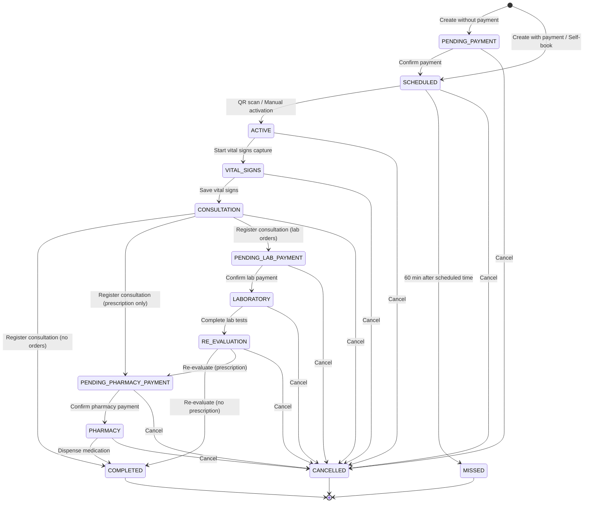

# Design Document: Appointment State Machine Redesign

## Overview

This design document specifies the technical implementation for expanding the appointment state machine from 5 states to 13 states to support the complete hospital workflow. The redesigned state machine will manage the patient journey from appointment creation through payment validation, triage, consultation, laboratory, pharmacy, and completion.

### Current System (5 States)

The existing system supports a simplified workflow:
- **SCHEDULED**: Appointment created and waiting for patient arrival
- **ACTIVE**: Patient has arrived and is in the system
- **COMPLETED**: Appointment finished
- **CANCELLED**: Appointment cancelled by staff or patient
- **MISSED**: Patient did not arrive within the time window

### New System (13 States)

The redesigned system supports the complete hospital workflow with payment validations:

1. **PENDING_PAYMENT**: Appointment created but consultation fee not paid
2. **SCHEDULED**: Consultation fee paid, waiting for patient arrival
3. **ACTIVE**: Patient arrived, waiting for triage
4. **VITAL_SIGNS**: Triage in progress (vital signs being captured)
5. **CONSULTATION**: Waiting for doctor consultation
6. **PENDING_LAB_PAYMENT**: Lab tests ordered, waiting for lab fee payment
7. **LABORATORY**: Lab fee paid, tests in progress
8. **RE_EVALUATION**: Lab results ready, waiting for doctor review
9. **PENDING_PHARMACY_PAYMENT**: Prescription issued, waiting for medication fee payment
10. **PHARMACY**: Medication fee paid, waiting for dispensing
11. **COMPLETED**: All services completed, patient discharged
12. **CANCELLED**: Appointment cancelled at any stage
13. **MISSED**: Patient did not arrive within scheduled time window

### Key Design Principles

1. **Payment-First Transitions**: All paid services require payment validation before proceeding
2. **State Locking**: Certain states (VITAL_SIGNS) lock the appointment to prevent concurrent access
3. **Priority Routing**: RE_EVALUATION appointments have priority over CONSULTATION appointments
4. **Graceful Degradation**: System continues operating even if Billing Service is unavailable
5. **Audit Trail**: All state transitions are logged with timestamp and user information
6. **Domain-Driven Design**: Business logic resides in domain model, not controllers

## Architecture

### State Machine Diagram



### Component Architecture

```
┌─────────────────────────────────────────────────────────────┐
│                     Frontend Layer                          │
├─────────────────────────────────────────────────────────────┤
│  TriagePendingPage  │  TriageVitalSignsCapture             │
│  DoctorConsultation │  ActivateAppointments                │
│  PaymentQueue       │  LabQueue  │  PharmacyQueue          │
└─────────────────────────────────────────────────────────────┘
                            │
                            ↓ REST API
┌─────────────────────────────────────────────────────────────┐
│              AppointmentController (REST)                   │
├─────────────────────────────────────────────────────────────┤
│  POST   /appointments                                       │
│  PATCH  /appointments/{id}/activate                         │
│  PATCH  /appointments/{id}/start-vital-signs                │
│  POST   /appointments/{id}/confirm-payment                  │
│  POST   /appointments/{id}/confirm-lab-payment              │
│  POST   /appointments/{id}/confirm-pharmacy-payment         │
│  PATCH  /appointments/{id}/complete-lab                     │
│  PATCH  /appointments/{id}/dispense-medication              │
│  DELETE /appointments/{id}                                  │
└─────────────────────────────────────────────────────────────┘
                            │
                            ↓
┌─────────────────────────────────────────────────────────────┐
│           Application Layer (Use Cases)                     │
├─────────────────────────────────────────────────────────────┤
│  ManageAppointmentUseCase                                   │
│  - activateAppointment()                                    │
│  - startVitalSigns()                                        │
│  - confirmPayment()                                         │
│  - confirmLabPayment()                                      │
│  - confirmPharmacyPayment()                                 │
│  - completeLab()                                            │
│  - dispenseMedication()                                     │
│  - cancelAppointment()                                      │
└─────────────────────────────────────────────────────────────┘
                            │
                            ↓
┌─────────────────────────────────────────────────────────────┐
│              Domain Layer (Business Logic)                  │
├─────────────────────────────────────────────────────────────┤
│  Appointment (Aggregate Root)                               │
│  - AppointmentStatus enum (13 states)                       │
│  - activate()                                               │
│  - startVitalSigns()                                        │
│  - completeVitalSigns()                                     │
│  - registerConsultation()                                   │
│  - confirmLabPayment()                                      │
│  - completeLab()                                            │
│  - confirmPharmacyPayment()                                 │
│  - dispenseMedication()                                     │
│  - complete()                                               │
│  - cancel()                                                 │
│  - markAsMissed()                                           │
│                                                             │
│  PaymentValidator                                           │
│  - validatePayment(invoiceId, appointmentId)                │
└─────────────────────────────────────────────────────────────┘
                            │
                            ↓
┌─────────────────────────────────────────────────────────────┐
│         Infrastructure Layer (Persistence & Clients)        │
├─────────────────────────────────────────────────────────────┤
│  AppointmentRepository (JPA)                                │
│  BillingServiceClient (REST)                                │
│  PatientServiceClient (REST)                                │
└─────────────────────────────────────────────────────────────┘
```

## Domain Model Changes

### Updated Appointment.java

```java
package com.medframe.clinical.domain.model;

import java.time.LocalDate;
import java.time.LocalDateTime;
import java.time.LocalTime;

/**
 * Appointment domain entity with expanded state machine (13 states).
 * Contains all state transition business logic.
 */
public class Appointment {

    /**
     * Appointment lifecycle states supporting complete hospital workflow.
     */
    public enum AppointmentStatus {
        // Initial states
        PENDING_PAYMENT,    // Created without payment
        SCHEDULED,          // Payment confirmed, waiting for arrival
        
        // Arrival and triage
        ACTIVE,             // Patient arrived, waiting for triage
        VITAL_SIGNS,        // Triage in progress (locked state)
        
        // Consultation
        CONSULTATION,       // Waiting for doctor consultation
        
        // Laboratory workflow
        PENDING_LAB_PAYMENT,  // Lab ordered, waiting for payment
        LABORATORY,           // Lab payment confirmed, tests in progress
        RE_EVALUATION,        // Lab results ready, waiting for doctor review
        
        // Pharmacy workflow
        PENDING_PHARMACY_PAYMENT,  // Prescription issued, waiting for payment
        PHARMACY,                  // Pharmacy payment confirmed, dispensing
        
        // Terminal states
        COMPLETED,          // All services completed
        CANCELLED,          // Cancelled at any stage
        MISSED              // Patient did not arrive
    }

    // Fields
    private String id;
    private String patientId;
    private String doctorId;
    private LocalDate appointmentDate;
    private LocalTime appointmentTime;
    private AppointmentStatus status;
    private String notes;
    private LocalDateTime createdAt;
    private String createdBy;
    private String invoiceId;              // Consultation invoice
    private String labInvoiceId;           // Lab tests invoice
    private String pharmacyInvoiceId;      // Medications invoice
    private String qrCodeBase64;           // Transient field

    public Appointment() {
        this.createdAt = LocalDateTime.now();
        // Initial state determined by payment status (set by factory method)
    }

    // ═══════════════════════════════════════════════════════════════
    // State Transition Methods
    // ═══════════════════════════════════════════════════════════════

    /**
     * Transition: PENDING_PAYMENT → SCHEDULED
     * Triggered when consultation payment is confirmed.
     * 
     * @throws IllegalStateException if not in PENDING_PAYMENT state
     */
    public void confirmPayment() {
        if (this.status != AppointmentStatus.PENDING_PAYMENT) {
            throw new IllegalStateException(
                "Solo se puede confirmar pago para citas en estado PENDING_PAYMENT. " +
                "Estado actual: " + this.status);
        }
        this.status = AppointmentStatus.SCHEDULED;
    }

    /**
     * Transition: SCHEDULED → ACTIVE
     * Triggered when patient arrives (QR scan or manual activation).
     * 
     * @throws IllegalStateException if not in SCHEDULED state
     */
    public void activate() {
        if (this.status != AppointmentStatus.SCHEDULED) {
            throw new IllegalStateException(
                "Solo se pueden activar citas en estado SCHEDULED. " +
                "Estado actual: " + this.status);
        }
        this.status = AppointmentStatus.ACTIVE;
    }

    /**
     * Transition: ACTIVE → VITAL_SIGNS
     * Triggered when triage staff starts capturing vital signs.
     * This is a locking transition to prevent concurrent access.
     * 
     * @throws IllegalStateException if not in ACTIVE state
     */
    public void startVitalSigns() {
        if (this.status != AppointmentStatus.ACTIVE) {
            throw new IllegalStateException(
                "Solo se puede iniciar triaje para citas en estado ACTIVE. " +
                "Estado actual: " + this.status);
        }
        this.status = AppointmentStatus.VITAL_SIGNS;
    }

    /**
     * Transition: VITAL_SIGNS → CONSULTATION
     * Triggered when vital signs are saved successfully.
     * 
     * @throws IllegalStateException if not in VITAL_SIGNS state
     */
    public void completeVitalSigns() {
        if (this.status != AppointmentStatus.VITAL_SIGNS) {
            throw new IllegalStateException(
                "Solo se pueden completar signos vitales para citas en estado VITAL_SIGNS. " +
                "Estado actual: " + this.status);
        }
        this.status = AppointmentStatus.CONSULTATION;
    }

    /**
     * Transition: CONSULTATION → (COMPLETED | PENDING_PHARMACY_PAYMENT | PENDING_LAB_PAYMENT)
     * Triggered when doctor registers consultation.
     * Next state depends on consultation content:
     * - No orders → COMPLETED
     * - Prescription only → PENDING_PHARMACY_PAYMENT
     * - Lab orders → PENDING_LAB_PAYMENT (takes priority)
     * 
     * @param hasLabOrders true if consultation includes lab orders
     * @param hasPrescription true if consultation includes prescription
     * @throws IllegalStateException if not in CONSULTATION state
     */
    public void registerConsultation(boolean hasLabOrders, boolean hasPrescription) {
        if (this.status != AppointmentStatus.CONSULTATION) {
            throw new IllegalStateException(
                "Solo se puede registrar consulta para citas en estado CONSULTATION. " +
                "Estado actual: " + this.status);
        }
        
        // Determine next state based on consultation content
        if (hasLabOrders) {
            // Lab orders take priority over prescription
            this.status = AppointmentStatus.PENDING_LAB_PAYMENT;
        } else if (hasPrescription) {
            this.status = AppointmentStatus.PENDING_PHARMACY_PAYMENT;
        } else {
            // No orders, complete the appointment
            this.status = AppointmentStatus.COMPLETED;
        }
    }

    /**
     * Transition: PENDING_LAB_PAYMENT → LABORATORY
     * Triggered when lab payment is confirmed.
     * 
     * @throws IllegalStateException if not in PENDING_LAB_PAYMENT state
     */
    public void confirmLabPayment() {
        if (this.status != AppointmentStatus.PENDING_LAB_PAYMENT) {
            throw new IllegalStateException(
                "Solo se puede confirmar pago de laboratorio para citas en estado PENDING_LAB_PAYMENT. " +
                "Estado actual: " + this.status);
        }
        this.status = AppointmentStatus.LABORATORY;
    }

    /**
     * Transition: LABORATORY → RE_EVALUATION
     * Triggered when lab tests are completed and results are ready.
     * 
     * @throws IllegalStateException if not in LABORATORY state
     */
    public void completeLab() {
        if (this.status != AppointmentStatus.LABORATORY) {
            throw new IllegalStateException(
                "Solo se pueden completar laboratorios para citas en estado LABORATORY. " +
                "Estado actual: " + this.status);
        }
        this.status = AppointmentStatus.RE_EVALUATION;
    }

    /**
     * Transition: RE_EVALUATION → (COMPLETED | PENDING_PHARMACY_PAYMENT)
     * Triggered when doctor completes re-evaluation after lab results.
     * Next state depends on whether prescription is issued.
     * 
     * @param hasPrescription true if re-evaluation includes prescription
     * @throws IllegalStateException if not in RE_EVALUATION state
     */
    public void completeReEvaluation(boolean hasPrescription) {
        if (this.status != AppointmentStatus.RE_EVALUATION) {
            throw new IllegalStateException(
                "Solo se puede completar re-evaluación para citas en estado RE_EVALUATION. " +
                "Estado actual: " + this.status);
        }
        
        if (hasPrescription) {
            this.status = AppointmentStatus.PENDING_PHARMACY_PAYMENT;
        } else {
            this.status = AppointmentStatus.COMPLETED;
        }
    }

    /**
     * Transition: PENDING_PHARMACY_PAYMENT → PHARMACY
     * Triggered when pharmacy payment is confirmed.
     * 
     * @throws IllegalStateException if not in PENDING_PHARMACY_PAYMENT state
     */
    public void confirmPharmacyPayment() {
        if (this.status != AppointmentStatus.PENDING_PHARMACY_PAYMENT) {
            throw new IllegalStateException(
                "Solo se puede confirmar pago de farmacia para citas en estado PENDING_PHARMACY_PAYMENT. " +
                "Estado actual: " + this.status);
        }
        this.status = AppointmentStatus.PHARMACY;
    }

    /**
     * Transition: PHARMACY → COMPLETED
     * Triggered when medications are dispensed.
     * 
     * @throws IllegalStateException if not in PHARMACY state
     */
    public void dispenseMedication() {
        if (this.status != AppointmentStatus.PHARMACY) {
            throw new IllegalStateException(
                "Solo se pueden dispensar medicamentos para citas en estado PHARMACY. " +
                "Estado actual: " + this.status);
        }
        this.status = AppointmentStatus.COMPLETED;
    }

    /**
     * Transition: ACTIVE → COMPLETED
     * Legacy method for backward compatibility.
     * New workflow should use registerConsultation() instead.
     * 
     * @deprecated Use registerConsultation() for new workflow
     * @throws IllegalStateException if not in ACTIVE state
     */
    @Deprecated
    public void complete() {
        if (this.status != AppointmentStatus.ACTIVE) {
            throw new IllegalStateException(
                "Solo se pueden completar citas en estado ACTIVE. " +
                "Estado actual: " + this.status);
        }
        this.status = AppointmentStatus.COMPLETED;
    }

    /**
     * Transition: (any except COMPLETED) → CANCELLED
     * Can be triggered from any state except COMPLETED.
     * 
     * @throws IllegalStateException if already COMPLETED
     */
    public void cancel() {
        if (this.status == AppointmentStatus.COMPLETED) {
            throw new IllegalStateException(
                "No se pueden cancelar citas ya completadas.");
        }
        if (this.status == AppointmentStatus.CANCELLED) {
            throw new IllegalStateException(
                "La cita ya está cancelada.");
        }
        this.status = AppointmentStatus.CANCELLED;
    }

    /**
     * Transition: SCHEDULED → MISSED
     * Triggered automatically when patient doesn't arrive within time window.
     * 
     * @throws IllegalStateException if not in SCHEDULED state
     */
    public void markAsMissed() {
        if (this.status != AppointmentStatus.SCHEDULED) {
            throw new IllegalStateException(
                "Solo se pueden marcar como perdidas las citas en estado SCHEDULED. " +
                "Estado actual: " + this.status);
        }
        this.status = AppointmentStatus.MISSED;
    }

    // ═══════════════════════════════════════════════════════════════
    // Query Methods
    // ═══════════════════════════════════════════════════════════════

    /**
     * Checks if appointment can be cancelled.
     * 
     * @return true if appointment is not COMPLETED
     */
    public boolean canBeCancelled() {
        return this.status != AppointmentStatus.COMPLETED;
    }

    /**
     * Checks if appointment is in a payment-pending state.
     * 
     * @return true if waiting for any payment
     */
    public boolean isPendingPayment() {
        return this.status == AppointmentStatus.PENDING_PAYMENT ||
               this.status == AppointmentStatus.PENDING_LAB_PAYMENT ||
               this.status == AppointmentStatus.PENDING_PHARMACY_PAYMENT;
    }

    /**
     * Checks if appointment is in a terminal state.
     * 
     * @return true if COMPLETED, CANCELLED, or MISSED
     */
    public boolean isTerminal() {
        return this.status == AppointmentStatus.COMPLETED ||
               this.status == AppointmentStatus.CANCELLED ||
               this.status == AppointmentStatus.MISSED;
    }

    /**
     * Checks if appointment requires priority handling (re-evaluation).
     * 
     * @return true if in RE_EVALUATION state
     */
    public boolean isPriority() {
        return this.status == AppointmentStatus.RE_EVALUATION;
    }

    // ═══════════════════════════════════════════════════════════════
    // Getters and Setters
    // ═══════════════════════════════════════════════════════════════

    public String getId() { return id; }
    public void setId(String id) { this.id = id; }

    public String getPatientId() { return patientId; }
    public void setPatientId(String patientId) { this.patientId = patientId; }

    public String getDoctorId() { return doctorId; }
    public void setDoctorId(String doctorId) { this.doctorId = doctorId; }

    public LocalDate getAppointmentDate() { return appointmentDate; }
    public void setAppointmentDate(LocalDate appointmentDate) { 
        this.appointmentDate = appointmentDate; 
    }

    public LocalTime getAppointmentTime() { return appointmentTime; }
    public void setAppointmentTime(LocalTime appointmentTime) { 
        this.appointmentTime = appointmentTime; 
    }

    public AppointmentStatus getStatus() { return status; }
    public void setStatus(AppointmentStatus status) { this.status = status; }

    public String getNotes() { return notes; }
    public void setNotes(String notes) { this.notes = notes; }

    public LocalDateTime getCreatedAt() { return createdAt; }
    public void setCreatedAt(LocalDateTime createdAt) { this.createdAt = createdAt; }

    public String getCreatedBy() { return createdBy; }
    public void setCreatedBy(String createdBy) { this.createdBy = createdBy; }

    public String getInvoiceId() { return invoiceId; }
    public void setInvoiceId(String invoiceId) { this.invoiceId = invoiceId; }

    public String getLabInvoiceId() { return labInvoiceId; }
    public void setLabInvoiceId(String labInvoiceId) { 
        this.labInvoiceId = labInvoiceId; 
    }

    public String getPharmacyInvoiceId() { return pharmacyInvoiceId; }
    public void setPharmacyInvoiceId(String pharmacyInvoiceId) { 
        this.pharmacyInvoiceId = pharmacyInvoiceId; 
    }

    public String getQrCodeBase64() { return qrCodeBase64; }
    public void setQrCodeBase64(String qrCodeBase64) { 
        this.qrCodeBase64 = qrCodeBase64; 
    }
}
```


## Components and Interfaces

### REST API Endpoints

#### State Transition Endpoints

**POST /api/clinical/appointments/{id}/confirm-payment**
- **Purpose**: Transition from PENDING_PAYMENT to SCHEDULED
- **Request Body**: `{ "invoiceId": "string" }`
- **Validation**: Verify invoice exists and status is PAID
- **Response**: 200 OK with updated appointment
- **Error Cases**:
  - 400 Bad Request: Invoice not paid or invalid
  - 503 Service Unavailable: Billing Service unavailable

**PATCH /api/clinical/appointments/{id}/activate**
- **Purpose**: Transition from SCHEDULED to ACTIVE
- **Request Body**: None
- **Validation**: Verify payment status before activation
- **Response**: 200 OK
- **Error Cases**:
  - 400 Bad Request: Invalid state or payment not confirmed
  - 503 Service Unavailable: Billing Service unavailable

**PATCH /api/clinical/appointments/{id}/start-vital-signs**
- **Purpose**: Transition from ACTIVE to VITAL_SIGNS (locking transition)
- **Request Body**: None
- **Response**: 200 OK
- **Error Cases**:
  - 400 Bad Request: Invalid state
  - 409 Conflict: Appointment already locked by another user

**POST /api/clinical/vital-signs**
- **Purpose**: Save vital signs and transition from VITAL_SIGNS to CONSULTATION
- **Request Body**: VitalSignsRequest (systolic, diastolic, heart rate, etc.)
- **Response**: 200 OK with vital signs record
- **Error Cases**:
  - 400 Bad Request: Invalid vital signs data or invalid state

**POST /api/clinical/consultations**
- **Purpose**: Register consultation and transition to next state
- **Request Body**: ConsultationRequest (diagnosis, notes, hasLabOrders, hasPrescription)
- **Next State Logic**:
  - hasLabOrders=true → PENDING_LAB_PAYMENT
  - hasLabOrders=false && hasPrescription=true → PENDING_PHARMACY_PAYMENT
  - hasLabOrders=false && hasPrescription=false → COMPLETED
- **Response**: 200 OK with consultation record
- **Error Cases**:
  - 400 Bad Request: Invalid state or missing required fields

**POST /api/clinical/appointments/{id}/confirm-lab-payment**
- **Purpose**: Transition from PENDING_LAB_PAYMENT to LABORATORY
- **Request Body**: `{ "labInvoiceId": "string" }`
- **Validation**: Verify lab invoice exists and status is PAID
- **Response**: 200 OK
- **Error Cases**:
  - 400 Bad Request: Invoice not paid or invalid
  - 503 Service Unavailable: Billing Service unavailable

**PATCH /api/clinical/appointments/{id}/complete-lab**
- **Purpose**: Transition from LABORATORY to RE_EVALUATION
- **Request Body**: None
- **Response**: 200 OK
- **Error Cases**:
  - 400 Bad Request: Invalid state

**POST /api/clinical/consultations/{consultationId}/re-evaluate**
- **Purpose**: Complete re-evaluation and transition to next state
- **Request Body**: ReEvaluationRequest (notes, hasPrescription)
- **Next State Logic**:
  - hasPrescription=true → PENDING_PHARMACY_PAYMENT
  - hasPrescription=false → COMPLETED
- **Response**: 200 OK
- **Error Cases**:
  - 400 Bad Request: Invalid state or missing required fields

**POST /api/clinical/appointments/{id}/confirm-pharmacy-payment**
- **Purpose**: Transition from PENDING_PHARMACY_PAYMENT to PHARMACY
- **Request Body**: `{ "pharmacyInvoiceId": "string" }`
- **Validation**: Verify pharmacy invoice exists and status is PAID
- **Response**: 200 OK
- **Error Cases**:
  - 400 Bad Request: Invoice not paid or invalid
  - 503 Service Unavailable: Billing Service unavailable

**PATCH /api/clinical/appointments/{id}/dispense-medication**
- **Purpose**: Transition from PHARMACY to COMPLETED
- **Request Body**: None
- **Response**: 200 OK
- **Error Cases**:
  - 400 Bad Request: Invalid state

**DELETE /api/clinical/appointments/{id}**
- **Purpose**: Cancel appointment from any non-terminal state
- **Request Body**: None
- **Response**: 204 No Content
- **Error Cases**:
  - 400 Bad Request: Cannot cancel completed appointments

#### Query Endpoints

**GET /api/clinical/appointments/pending-triage**
- **Purpose**: List appointments in ACTIVE and VITAL_SIGNS states
- **Response**: Array of appointments with patient and doctor information
- **Filters**: None (returns all pending triage appointments)

**GET /api/clinical/appointments/doctor**
- **Purpose**: List appointments for authenticated doctor
- **Response**: Array of appointments in CONSULTATION and RE_EVALUATION states
- **Sorting**: RE_EVALUATION appointments appear first (priority)

**GET /api/clinical/appointments/payment-queue**
- **Purpose**: List appointments in payment-pending states
- **Response**: Array of appointments in PENDING_PAYMENT, PENDING_LAB_PAYMENT, PENDING_PHARMACY_PAYMENT
- **Filters**: Optional filter by payment type

**GET /api/clinical/appointments/lab-queue**
- **Purpose**: List appointments in LABORATORY state
- **Response**: Array of appointments waiting for lab tests

**GET /api/clinical/appointments/pharmacy-queue**
- **Purpose**: List appointments in PHARMACY state
- **Response**: Array of appointments waiting for medication dispensing

### Domain Services

#### PaymentValidator

```java
public interface PaymentValidator {
    /**
     * Validates payment status for an appointment.
     * 
     * @param invoiceId Invoice identifier (can be null for compensation cases)
     * @param appointmentId Appointment identifier for logging
     * @return PaymentValidationResult with validation outcome
     */
    PaymentValidationResult validatePayment(String invoiceId, String appointmentId);
}

public class PaymentValidationResult {
    private boolean allowed;
    private boolean hasWarning;
    private String warningMessage;
    private PaymentValidationError error;
    private String errorMessage;
    private InvoiceResponse invoice;
    
    // Factory methods
    public static PaymentValidationResult allowed(InvoiceResponse invoice);
    public static PaymentValidationResult allowedWithWarning(String warning);
    public static PaymentValidationResult denied(PaymentValidationError error, String message);
}

public enum PaymentValidationError {
    PAYMENT_PENDING,
    INVOICE_CANCELLED,
    INVOICE_NOT_FOUND,
    SERVICE_TIMEOUT,
    SERVICE_ERROR
}
```

#### AppointmentManager

```java
public class AppointmentManager {
    /**
     * Creates appointment with initial state based on payment status.
     * 
     * @param patientId Patient identifier
     * @param doctorId Doctor identifier
     * @param date Appointment date
     * @param time Appointment time
     * @param notes Optional notes
     * @param createdBy User who created the appointment
     * @param hasPaid Whether consultation fee has been paid
     * @return Created appointment with initial state
     */
    public Appointment createAppointment(
        String patientId, String doctorId,
        LocalDate date, LocalTime time,
        String notes, String createdBy,
        boolean hasPaid
    );
    
    /**
     * Validates and activates appointment with payment check.
     * 
     * @param appointmentId Appointment identifier
     * @throws PaymentValidationException if payment not confirmed
     * @throws InvalidAppointmentStatusException if not in SCHEDULED state
     */
    public void activateAppointment(String appointmentId);
    
    /**
     * Starts vital signs capture (locking transition).
     * 
     * @param appointmentId Appointment identifier
     * @throws InvalidAppointmentStatusException if not in ACTIVE state
     */
    public void startVitalSigns(String appointmentId);
}
```

### Frontend Components

#### TriagePendingPage Updates

**Current Behavior**: Displays appointments in ACTIVE state only

**New Behavior**: Display appointments in both ACTIVE and VITAL_SIGNS states

**Changes Required**:
1. Update API call to fetch appointments in ACTIVE and VITAL_SIGNS states
2. Add visual indicator for appointments in VITAL_SIGNS state (locked)
3. Disable "Capture Vital Signs" button for appointments already in VITAL_SIGNS state
4. Show which staff member is currently capturing vital signs (if available)

#### TriageVitalSignsCapture Updates

**Current Behavior**: Navigates to page and saves vital signs

**New Behavior**: Immediately transition to VITAL_SIGNS state on page load

**Changes Required**:
1. Add `useEffect` hook to call `/appointments/{id}/start-vital-signs` on component mount
2. Handle 409 Conflict error if appointment already locked
3. Show loading state while transitioning
4. Redirect back to pending page if transition fails

#### DoctorConsultation Updates

**Current Behavior**: Displays appointments in CONSULTATION state

**New Behavior**: Display appointments in CONSULTATION and RE_EVALUATION states with priority indicator

**Changes Required**:
1. Update API call to fetch both CONSULTATION and RE_EVALUATION appointments
2. Sort RE_EVALUATION appointments first
3. Add visual priority badge for RE_EVALUATION appointments
4. Update consultation form to determine next state based on orders
5. Remove automatic completion - let backend determine next state

#### ActivateAppointments Updates

**Current Behavior**: Displays appointments in SCHEDULED state

**New Behavior**: Display appointments in PENDING_PAYMENT and SCHEDULED states

**Changes Required**:
1. Update API call to fetch both PENDING_PAYMENT and SCHEDULED appointments
2. Add payment status indicator (PENDING_PAYMENT vs SCHEDULED)
3. Show "Confirm Payment" button for PENDING_PAYMENT appointments
4. Show "Activate" button for SCHEDULED appointments
5. Integrate with payment validation before activation

## Data Models

### Database Schema Changes

#### appointments Table

**New Columns**:
```sql
ALTER TABLE appointments 
ADD COLUMN lab_invoice_id VARCHAR(255),
ADD COLUMN pharmacy_invoice_id VARCHAR(255);
```

**Updated Status Enum**:
```sql
ALTER TABLE appointments 
MODIFY COLUMN status ENUM(
    'PENDING_PAYMENT',
    'SCHEDULED',
    'ACTIVE',
    'VITAL_SIGNS',
    'CONSULTATION',
    'PENDING_LAB_PAYMENT',
    'LABORATORY',
    'RE_EVALUATION',
    'PENDING_PHARMACY_PAYMENT',
    'PHARMACY',
    'COMPLETED',
    'CANCELLED',
    'MISSED'
);
```

**Migration Strategy**:
1. Add new columns with NULL default
2. Add new enum values to status column
3. Existing appointments remain in current states (SCHEDULED, ACTIVE, COMPLETED, CANCELLED, MISSED)
4. New appointments use expanded state machine
5. No data migration required - backward compatible

#### appointment_state_transitions Table (New)

**Purpose**: Audit trail for all state transitions

```sql
CREATE TABLE appointment_state_transitions (
    id VARCHAR(255) PRIMARY KEY,
    appointment_id VARCHAR(255) NOT NULL,
    from_state VARCHAR(50) NOT NULL,
    to_state VARCHAR(50) NOT NULL,
    transitioned_by VARCHAR(255) NOT NULL,
    transitioned_at TIMESTAMP NOT NULL,
    notes TEXT,
    FOREIGN KEY (appointment_id) REFERENCES appointments(id),
    INDEX idx_appointment_id (appointment_id),
    INDEX idx_transitioned_at (transitioned_at)
);
```

### DTOs and Request/Response Models

#### CreateAppointmentRequest

```java
public class CreateAppointmentRequest {
    private String patientId;
    private String doctorId;
    private LocalDate appointmentDate;
    private LocalTime appointmentTime;
    private String notes;
    private String sessionId;  // For slot hold release
    private Boolean hasPaid;   // NEW: Determines initial state
}
```

#### AppointmentResponse

```java
public class AppointmentResponse {
    private String id;
    private String patientId;
    private String patientName;
    private String patientDpi;
    private String doctorId;
    private LocalDate appointmentDate;
    private LocalTime appointmentTime;
    private String status;  // Enum as string
    private String notes;
    private LocalDateTime createdAt;
    private String qrCodeBase64;
    private String invoiceId;
    private String labInvoiceId;        // NEW
    private String pharmacyInvoiceId;   // NEW
    private Boolean isPriority;         // NEW: true for RE_EVALUATION
}
```

#### ConfirmPaymentRequest

```java
public class ConfirmPaymentRequest {
    private String invoiceId;
}
```

#### ConsultationRequest

```java
public class ConsultationRequest {
    private String appointmentId;
    private String chiefComplaint;
    private String symptoms;
    private String primaryDiagnosis;
    private List<String> secondaryDiagnoses;
    private String medicalNotes;
    private String treatmentPlan;
    private Boolean hasLabOrders;      // NEW: Determines next state
    private Boolean hasPrescription;   // NEW: Determines next state
}
```

#### ReEvaluationRequest

```java
public class ReEvaluationRequest {
    private String consultationId;
    private String labResultsReview;
    private String updatedDiagnosis;
    private String updatedTreatmentPlan;
    private Boolean hasPrescription;   // Determines next state
}
```

## Error Handling

### Exception Hierarchy

```java
// Base exception for appointment state machine errors
public class AppointmentStateMachineException extends RuntimeException {
    public AppointmentStateMachineException(String message) {
        super(message);
    }
}

// Invalid state transition
public class InvalidAppointmentStatusException extends AppointmentStateMachineException {
    public InvalidAppointmentStatusException(String message) {
        super(message);
    }
}

// Payment validation failed
public class PaymentValidationException extends AppointmentStateMachineException {
    private final PaymentValidationError error;
    
    public PaymentValidationException(String message, PaymentValidationError error) {
        super(message);
        this.error = error;
    }
    
    public PaymentValidationError getError() {
        return error;
    }
}

// Billing service unavailable
public class ServiceUnavailableException extends AppointmentStateMachineException {
    public ServiceUnavailableException(String message) {
        super(message);
    }
}

// Appointment locked by another user
public class AppointmentLockedException extends AppointmentStateMachineException {
    private final String lockedBy;
    
    public AppointmentLockedException(String message, String lockedBy) {
        super(message);
        this.lockedBy = lockedBy;
    }
    
    public String getLockedBy() {
        return lockedBy;
    }
}
```

### Error Response Format

```json
{
  "timestamp": "2025-01-15T10:30:00Z",
  "status": 400,
  "error": "Bad Request",
  "message": "Solo se pueden activar citas en estado SCHEDULED. Estado actual: ACTIVE",
  "path": "/api/clinical/appointments/123/activate",
  "errorCode": "INVALID_STATE_TRANSITION",
  "details": {
    "currentState": "ACTIVE",
    "attemptedTransition": "activate",
    "validStates": ["SCHEDULED"]
  }
}
```

### Error Handling Strategy

#### State Transition Errors (400 Bad Request)
- **Cause**: Invalid state transition attempted
- **Response**: Return descriptive error message with current state and valid states
- **Frontend Action**: Display error message and refresh appointment list
- **Logging**: Log at WARN level with appointment ID and attempted transition

#### Payment Validation Errors (400 Bad Request)
- **Cause**: Invoice not paid or cancelled
- **Response**: Return payment status and required action
- **Frontend Action**: Display payment required message with link to payment page
- **Logging**: Log at WARN level with appointment ID and invoice status

#### Service Unavailable Errors (503 Service Unavailable)
- **Cause**: Billing Service timeout or error
- **Response**: Return retry-after header and service status
- **Frontend Action**: Display "Service temporarily unavailable" with retry button
- **Logging**: Log at ERROR level with service name and error details

#### Concurrent Access Errors (409 Conflict)
- **Cause**: Appointment already locked by another user
- **Response**: Return lock holder information
- **Frontend Action**: Display "Appointment being processed by [user]" message
- **Logging**: Log at INFO level with appointment ID and lock holder

### Resilience Patterns

#### Circuit Breaker for Billing Service
```java
@CircuitBreaker(name = "billingService", fallbackMethod = "validatePaymentFallback")
public PaymentValidationResult validatePayment(String invoiceId, String appointmentId) {
    // Call Billing Service
}

private PaymentValidationResult validatePaymentFallback(
    String invoiceId, String appointmentId, Exception e) {
    
    if (invoiceId == null) {
        // Compensation case - allow activation with warning
        return PaymentValidationResult.allowedWithWarning(
            "Cita sin factura - Activar bajo responsabilidad");
    }
    
    // Service unavailable - deny activation
    return PaymentValidationResult.denied(
        PaymentValidationError.SERVICE_ERROR,
        "Servicio de facturación no disponible. Intente nuevamente.");
}
```

#### Retry Policy
```yaml
resilience4j:
  retry:
    instances:
      billingService:
        maxAttempts: 3
        waitDuration: 500ms
        exponentialBackoffMultiplier: 2
        retryExceptions:
          - java.net.SocketTimeoutException
          - org.springframework.web.client.ResourceAccessException
```

## Testing Strategy

### Property-Based Testing Assessment

**Decision: Property-Based Testing is NOT appropriate for this feature.**

**Rationale**:
1. **State Machine Logic**: The appointment state machine has a finite set of 13 states with deterministic transition rules. Each transition has specific preconditions and postconditions that are better validated with example-based tests covering each transition explicitly.

2. **Infrastructure Orchestration**: This feature primarily involves infrastructure concerns (database schema changes, REST API endpoints, external service integration) rather than pure business logic with universal properties.

3. **External Service Dependencies**: Most state transitions require validation against external services (Billing Service for payment validation). Property-based testing with random inputs would require extensive mocking and wouldn't provide meaningful coverage.

4. **Deterministic Behavior**: State transitions are deterministic - given a specific current state and action, the next state is always the same. There's no input space to explore with random generation.

5. **Better Testing Approach**: Example-based unit tests that explicitly test each valid and invalid state transition provide clearer documentation and more maintainable tests for this workflow logic.

**Testing Approach**:
- **Unit Tests**: Test each state transition method in the Appointment domain model
- **Integration Tests**: Test REST API endpoints with realistic scenarios
- **End-to-End Tests**: Test complete workflows from appointment creation to completion
- **Concurrent Access Tests**: Test locking behavior for VITAL_SIGNS state

### Unit Testing

#### Domain Model Tests

**Appointment State Transition Tests**:
- Test each valid state transition
- Test each invalid state transition throws IllegalStateException
- Test terminal state transitions
- Test query methods (canBeCancelled, isPendingPayment, isTerminal, isPriority)

**Example Test Cases**:
```java
@Test
void shouldTransitionFromPendingPaymentToScheduled() {
    Appointment appointment = new Appointment();
    appointment.setStatus(AppointmentStatus.PENDING_PAYMENT);
    
    appointment.confirmPayment();
    
    assertEquals(AppointmentStatus.SCHEDULED, appointment.getStatus());
}

@Test
void shouldThrowExceptionWhenActivatingNonScheduledAppointment() {
    Appointment appointment = new Appointment();
    appointment.setStatus(AppointmentStatus.ACTIVE);
    
    assertThrows(IllegalStateException.class, () -> appointment.activate());
}

@Test
void shouldTransitionToCorrectStateBasedOnConsultationContent() {
    Appointment appointment = new Appointment();
    appointment.setStatus(AppointmentStatus.CONSULTATION);
    
    // Lab orders take priority
    appointment.registerConsultation(true, true);
    assertEquals(AppointmentStatus.PENDING_LAB_PAYMENT, appointment.getStatus());
    
    // Prescription only
    appointment.setStatus(AppointmentStatus.CONSULTATION);
    appointment.registerConsultation(false, true);
    assertEquals(AppointmentStatus.PENDING_PHARMACY_PAYMENT, appointment.getStatus());
    
    // No orders
    appointment.setStatus(AppointmentStatus.CONSULTATION);
    appointment.registerConsultation(false, false);
    assertEquals(AppointmentStatus.COMPLETED, appointment.getStatus());
}
```

#### Service Layer Tests

**PaymentValidator Tests**:
- Test validation with PAID invoice
- Test validation with PENDING invoice
- Test validation with CANCELLED invoice
- Test validation with null invoiceId (compensation case)
- Test validation with service timeout
- Test validation with service error

**AppointmentManager Tests**:
- Test appointment creation with payment
- Test appointment creation without payment
- Test activation with valid payment
- Test activation with invalid payment
- Test vital signs locking

### Integration Testing

#### API Endpoint Tests

**State Transition Endpoint Tests**:
- Test each endpoint with valid state
- Test each endpoint with invalid state
- Test payment validation integration
- Test concurrent access handling
- Test error responses

**Example Test Case**:
```java
@Test
@WithMockUser(roles = "ADMISSION")
void shouldActivateAppointmentWithValidPayment() throws Exception {
    // Given: Appointment in SCHEDULED state with PAID invoice
    Appointment appointment = createScheduledAppointment();
    when(paymentValidator.validatePayment(any(), any()))
        .thenReturn(PaymentValidationResult.allowed(mockInvoice));
    
    // When: Activate appointment
    mockMvc.perform(patch("/api/clinical/appointments/{id}/activate", appointment.getId()))
        .andExpect(status().isOk());
    
    // Then: Appointment transitioned to ACTIVE
    Appointment updated = appointmentRepository.findById(appointment.getId()).get();
    assertEquals(AppointmentStatus.ACTIVE, updated.getStatus());
}

@Test
@WithMockUser(roles = "ADMISSION")
void shouldRejectActivationWithUnpaidInvoice() throws Exception {
    // Given: Appointment in SCHEDULED state with PENDING invoice
    Appointment appointment = createScheduledAppointment();
    when(paymentValidator.validatePayment(any(), any()))
        .thenReturn(PaymentValidationResult.denied(
            PaymentValidationError.PAYMENT_PENDING,
            "El paciente debe pagar en caja primero"));
    
    // When: Attempt to activate appointment
    mockMvc.perform(patch("/api/clinical/appointments/{id}/activate", appointment.getId()))
        .andExpect(status().isBadRequest())
        .andExpect(jsonPath("$.message").value("El paciente debe pagar en caja primero"));
    
    // Then: Appointment remains in SCHEDULED state
    Appointment unchanged = appointmentRepository.findById(appointment.getId()).get();
    assertEquals(AppointmentStatus.SCHEDULED, unchanged.getStatus());
}
```

#### Database Migration Tests

**Migration Validation**:
- Test existing appointments remain in current states
- Test new appointments use expanded state machine
- Test new columns are nullable
- Test enum values are correctly added

### End-to-End Testing

#### Complete Workflow Tests

**Happy Path - No Lab, No Prescription**:
1. Create appointment with payment → SCHEDULED
2. Activate appointment → ACTIVE
3. Start vital signs → VITAL_SIGNS
4. Save vital signs → CONSULTATION
5. Register consultation (no orders) → COMPLETED

**Happy Path - With Lab and Prescription**:
1. Create appointment with payment → SCHEDULED
2. Activate appointment → ACTIVE
3. Start vital signs → VITAL_SIGNS
4. Save vital signs → CONSULTATION
5. Register consultation (lab orders) → PENDING_LAB_PAYMENT
6. Confirm lab payment → LABORATORY
7. Complete lab tests → RE_EVALUATION
8. Re-evaluate (prescription) → PENDING_PHARMACY_PAYMENT
9. Confirm pharmacy payment → PHARMACY
10. Dispense medication → COMPLETED

**Error Path - Payment Required**:
1. Create appointment without payment → PENDING_PAYMENT
2. Attempt to activate → 400 Bad Request
3. Confirm payment → SCHEDULED
4. Activate appointment → ACTIVE

**Error Path - Billing Service Unavailable**:
1. Create appointment (billing service down) → SCHEDULED (invoiceId=null)
2. Activate appointment → ACTIVE (allowed with warning)
3. Continue workflow normally

### Frontend Testing

#### Component Tests

**TriagePendingPage Tests**:
- Test displays appointments in ACTIVE state
- Test displays appointments in VITAL_SIGNS state with lock indicator
- Test "Capture Vital Signs" button disabled for locked appointments
- Test refresh functionality

**TriageVitalSignsCapture Tests**:
- Test transitions to VITAL_SIGNS on mount
- Test handles 409 Conflict error
- Test saves vital signs and redirects
- Test cancel button releases lock

**DoctorConsultation Tests**:
- Test displays CONSULTATION appointments
- Test displays RE_EVALUATION appointments with priority badge
- Test RE_EVALUATION appointments sorted first
- Test consultation form determines next state

### Performance Testing

#### Load Testing Scenarios

**Concurrent Vital Signs Capture**:
- Simulate 10 triage staff attempting to capture vital signs for same appointment
- Verify only one succeeds (409 Conflict for others)
- Verify no data corruption

**Payment Validation Under Load**:
- Simulate 100 concurrent activation requests
- Verify all payment validations complete within 2 seconds
- Verify circuit breaker activates after threshold

**State Transition Throughput**:
- Measure throughput for each state transition endpoint
- Target: 100 requests/second per endpoint
- Verify no database deadlocks

### Test Coverage Goals

- **Unit Tests**: 90% code coverage for domain model
- **Integration Tests**: 80% coverage for API endpoints
- **E2E Tests**: Cover all critical workflows
- **Performance Tests**: All concurrent access scenarios

### Test Data Management

**Test Fixtures**:
- Appointments in each state
- Invoices in each status (PAID, PENDING, CANCELLED)
- Mock Billing Service responses
- Test users with different roles

**Test Database**:
- Use H2 in-memory database for unit tests
- Use Testcontainers with PostgreSQL for integration tests
- Reset database between test classes
- Use database migrations in tests

