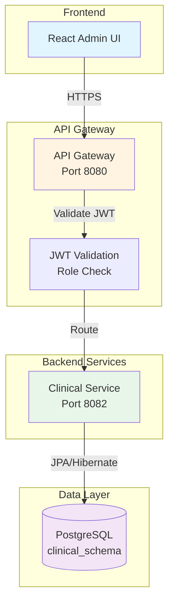

# Clinic Management CRUD - Technical Design Document

## Overview

This document specifies the technical design for the Clinic Management CRUD system within the MedFlow healthcare platform. The system provides comprehensive Create, Read, Update, and Delete operations for clinic entities, which serve as organizational units for future doctor associations.

### Purpose

The Clinic Management system enables administrators to:
- Register and manage healthcare facilities (clinics)
- Maintain clinic operational status (ACTIVE, INACTIVE, DELETED)
- Track audit information for compliance
- Provide a foundation for future doctor-clinic associations

### Scope

**In Scope:**
- Complete CRUD operations for clinic entities
- Role-based access control (ADMIN-only for mutations)
- Backend and frontend validation
- Audit trail tracking
- Soft delete functionality
- Status-based filtering

**Out of Scope:**
- Doctor-clinic associations (future enhancement)
- Clinic scheduling or capacity management
- Multi-tenancy or clinic hierarchies
- Clinic-specific configurations or settings

### Key Design Principles

1. **Domain-Driven Design (DDD)**: Clinic as an aggregate root with business logic encapsulated in the domain model
2. **Hexagonal Architecture**: Clear separation between domain, application, and infrastructure layers
3. **Consistency**: Follow existing MedFlow patterns (Doctor, Appointment models)
4. **Security**: Role-based access control enforced at API Gateway level
5. **Auditability**: Complete audit trail for all modifications
6. **Data Integrity**: Unique constraints and validation at multiple layers

## Architecture

### System Context



### Integration Points

| Component | Integration Type | Purpose |
|-----------|-----------------|---------|
| API Gateway | HTTP/REST | Request routing, JWT validation, role-based access control |
| Clinical Service | Internal | Hosts clinic management domain logic and persistence |
| PostgreSQL | JDBC | Data persistence in clinical_schema |
| Eureka Server | Service Discovery | Service registration and discovery |
| Frontend (React) | HTTP/REST | User interface for clinic management |

### Layered Architecture

The implementation follows hexagonal architecture with three distinct layers:

```mermaid
graph LR
    subgraph "Infrastructure Layer"
        REST[REST Controllers]
        JPA[JPA Repositories]
        ENTITY[JPA Entities]
    end
    
    subgraph "Application Layer"
        UC[Use Cases]
        MAPPER[Mappers]
    end
    
    subgraph "Domain Layer"
        MODEL[Domain Models]
        REPO[Repository Interfaces]
        EXC[Domain Exceptions]
    end
    
    REST --> UC
    UC --> MODEL
    UC --> REPO
    JPA -.implements.-> REPO
    JPA --> ENTITY
    MAPPER --> MODEL
    MAPPER --> ENTITY
    
    style REST fill:#ffe0b2
    style UC fill:#c8e6c9
    style MODEL fill:#b3e5fc
