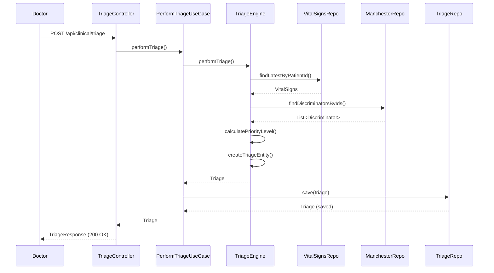
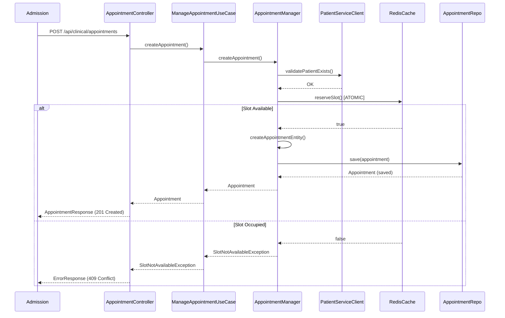
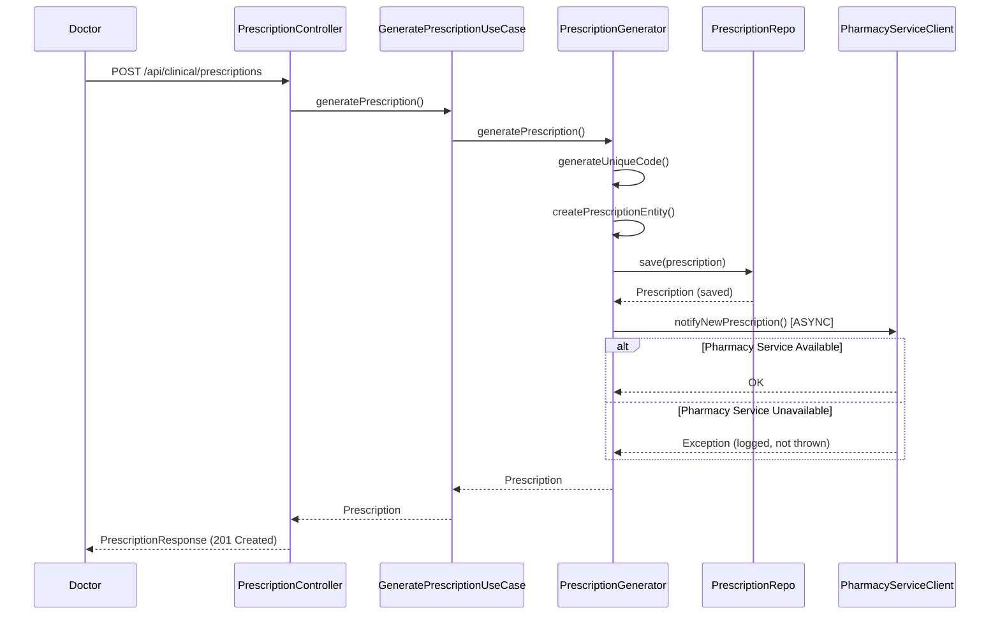
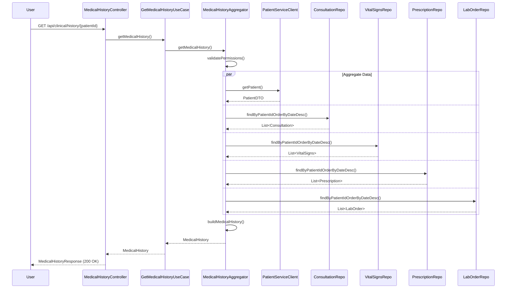

# Design Document: Clinical Service

## 1. Overview

El **Clinical Service** es el microservicio central del sistema MedFlow HIS, responsable de toda la gestión clínica del paciente. Este servicio implementa arquitectura hexagonal (Ports and Adapters) debido a la complejidad de su lógica de negocio, especialmente el algoritmo de Triaje Manchester.

### Propósito

Proporcionar funcionalidades clínicas completas incluyendo:
- Triaje Manchester con cálculo automático de prioridad
- Gestión de citas médicas con slots en tiempo real (Redis)
- Registro de signos vitales
- Consultas médicas con diagnósticos CIE-10
- Generación de prescripciones médicas
- Generación de órdenes de laboratorio
- Historial clínico completo del paciente

### Características Clave

- **Arquitectura**: Hexagonal (Ports and Adapters)
- **Puerto**: 8083
- **Base de Datos**: clinical_schema (PostgreSQL)
- **Cache**: Redis (para slots de citas en tiempo real)
- **Registro en Eureka**: CLINICAL-SERVICE
- **Tecnologías**: Spring Boot 3.2.4, Java 17, Spring Data JPA, Spring Data Redis, OpenFeign

### Decisiones de Diseño

1. **Arquitectura Hexagonal**: Elegida por la complejidad del dominio clínico y la necesidad de aislar la lógica de negocio del Triaje Manchester
2. **Redis para Slots**: Garantiza consistencia en tiempo real para disponibilidad de citas médicas
3. **Eventual Consistency**: Para notificaciones a Pharmacy y Lab Service (no bloquean transacciones)
4. **Circuit Breaker**: Protección contra cascading failures en llamadas a servicios externos
5. **CERO JOINs entre esquemas**: Composición de APIs para obtener datos de otros dominios

## 2. Architecture

### 2.1 Hexagonal Architecture Overview

```
┌─────────────────────────────────────────────────────────────────┐
│                     CLINICAL SERVICE (8083)                      │
│                                                                  │
│  ┌────────────────────────────────────────────────────────┐    │
│  │              INFRASTRUCTURE LAYER                       │    │
│  │  ┌──────────────┐  ┌──────────────┐  ┌─────────────┐  │    │
│  │  │ REST Adapter │  │HTTP Clients  │  │Redis Adapter│  │    │
│  │  │ (Controllers)│  │(Patient,Lab, │  │(Slots Cache)│  │    │
│  │  │              │  │ Pharmacy)    │  │             │  │    │
│  │  └──────┬───────┘  └──────┬───────┘  └──────┬──────┘  │    │
│  └─────────┼──────────────────┼──────────────────┼─────────┘    │
│            │                  │                  │              │
│  ┌─────────▼──────────────────▼──────────────────▼─────────┐    │
│  │              APPLICATION LAYER (Use Cases)              │    │
│  │  - PerformTriageUseCase                                 │    │
│  │  - RecordVitalSignsUseCase                              │    │
│  │  - ManageAppointmentUseCase                             │    │
│  │  - RegisterConsultationUseCase                          │    │
│  │  - GeneratePrescriptionUseCase                          │    │
│  │  - GenerateLabOrderUseCase                              │    │
│  │  - GetMedicalHistoryUseCase                             │    │
│  └─────────────────────────┬───────────────────────────────┘    │
│                            │                                    │
│  ┌─────────────────────────▼───────────────────────────────┐    │
│  │                  DOMAIN LAYER                           │    │
│  │  ┌──────────────────────────────────────────────────┐  │    │
│  │  │  Domain Services (Business Logic)               │  │    │
│  │  │  - TriageEngine (Manchester Algorithm)          │  │    │
│  │  │  - AppointmentManager (Slot Management)         │  │    │
│  │  │  - ConsultationManager                           │  │    │
│  │  │  - PrescriptionGenerator                         │  │    │
│  │  │  - LabOrderGenerator                             │  │    │
│  │  │  - VitalSignsRecorder                            │  │    │
│  │  │  - MedicalHistoryAggregator                      │  │    │
│  │  └──────────────────────────────────────────────────┘  │    │
│  │  ┌──────────────────────────────────────────────────┐  │    │
│  │  │  Domain Model (Entities)                         │  │    │
│  │  │  - Triage, VitalSigns, Appointment               │  │    │
│  │  │  - Consultation, Prescription, LabOrder          │  │    │
│  │  │  - ManchesterMotif, ManchesterDiscriminator      │  │    │
│  │  └──────────────────────────────────────────────────┘  │    │
│  │  ┌──────────────────────────────────────────────────┐  │    │
│  │  │  Ports (Interfaces)                              │  │    │
│  │  │  IN: Use Case Interfaces                         │  │    │
│  │  │  OUT: Repository & Client Interfaces             │  │    │
│  │  └──────────────────────────────────────────────────┘  │    │
│  └─────────────────────────────────────────────────────────┘    │
│                            │                                    │
│  ┌─────────────────────────▼───────────────────────────────┐    │
│  │         INFRASTRUCTURE LAYER (Adapters OUT)             │    │
│  │  ┌──────────────┐  ┌──────────────┐  ┌─────────────┐  │    │
│  │  │JPA Adapter   │  │HTTP Clients  │  │Redis Adapter│  │    │
│  │  │(Repositories)│  │(Feign)       │  │             │  │    │
│  │  └──────┬───────┘  └──────┬───────┘  └──────┬──────┘  │    │
│  └─────────┼──────────────────┼──────────────────┼─────────┘    │
│            │                  │                  │              │
│            ▼                  ▼                  ▼              │
│  ┌──────────────┐  ┌──────────────┐  ┌──────────────┐         │
│  │ PostgreSQL   │  │Patient Service│  │    Redis     │         │
│  │clinical_schema│  │Lab Service   │  │  (Slots)     │         │
│  │              │  │Pharmacy Svc  │  │              │         │
│  └──────────────┘  └──────────────┘  └──────────────┘         │
└─────────────────────────────────────────────────────────────────┘
```

### 2.2 Directory Structure

```
clinical-service/
├── src/main/java/com/medflow/clinical/
│   ├── domain/                          # DOMAIN LAYER
│   │   ├── model/                       # Domain Entities
│   │   │   ├── Triage.java
│   │   │   ├── VitalSigns.java
│   │   │   ├── Appointment.java
│   │   │   ├── Consultation.java
│   │   │   ├── Prescription.java
│   │   │   ├── LabOrder.java
│   │   │   ├── ManchesterMotif.java
│   │   │   └── ManchesterDiscriminator.java
│   │   ├── port/                        # Ports (Interfaces)
│   │   │   ├── in/                      # Input Ports (Use Cases)
│   │   │   │   ├── PerformTriageUseCase.java
│   │   │   │   ├── RecordVitalSignsUseCase.java
│   │   │   │   ├── ManageAppointmentUseCase.java
│   │   │   │   ├── RegisterConsultationUseCase.java
│   │   │   │   ├── GeneratePrescriptionUseCase.java
│   │   │   │   ├── GenerateLabOrderUseCase.java
│   │   │   │   └── GetMedicalHistoryUseCase.java
│   │   │   └── out/                     # Output Ports (Repositories & Clients)
│   │   │       ├── TriageRepository.java
│   │   │       ├── VitalSignsRepository.java
│   │   │       ├── AppointmentRepository.java
│   │   │       ├── ConsultationRepository.java
│   │   │       ├── PrescriptionRepository.java
│   │   │       ├── LabOrderRepository.java
│   │   │       ├── ManchesterCatalogRepository.java
│   │   │       ├── PatientServiceClient.java
│   │   │       ├── PharmacyServiceClient.java
│   │   │       ├── LabServiceClient.java
│   │   │       └── AppointmentSlotCache.java
│   │   └── service/                     # Domain Services (Business Logic)
│   │       ├── TriageEngine.java
│   │       ├── AppointmentManager.java
│   │       ├── ConsultationManager.java
│   │       ├── PrescriptionGenerator.java
│   │       ├── LabOrderGenerator.java
│   │       ├── VitalSignsRecorder.java
│   │       └── MedicalHistoryAggregator.java
│   ├── application/                     # APPLICATION LAYER
│   │   ├── usecase/                     # Use Case Implementations
│   │   │   ├── PerformTriageUseCaseImpl.java
│   │   │   ├── RecordVitalSignsUseCaseImpl.java
│   │   │   ├── ManageAppointmentUseCaseImpl.java
│   │   │   ├── RegisterConsultationUseCaseImpl.java
│   │   │   ├── GeneratePrescriptionUseCaseImpl.java
│   │   │   ├── GenerateLabOrderUseCaseImpl.java
│   │   │   └── GetMedicalHistoryUseCaseImpl.java
│   │   └── service/                     # Application Services
│   │       └── PermissionValidator.java
│   ├── infrastructure/                  # INFRASTRUCTURE LAYER
│   │   ├── rest/                        # REST Adapter (IN)
│   │   │   ├── controller/
│   │   │   │   ├── TriageController.java
│   │   │   │   ├── VitalSignsController.java
│   │   │   │   ├── AppointmentController.java
│   │   │   │   ├── ConsultationController.java
│   │   │   │   ├── PrescriptionController.java
│   │   │   │   ├── LabOrderController.java
│   │   │   │   └── MedicalHistoryController.java
│   │   │   └── dto/
│   │   │       ├── request/
│   │   │       └── response/
│   │   ├── persistence/                 # JPA Adapter (OUT)
│   │   │   ├── entity/                  # JPA Entities
│   │   │   │   ├── TriageEntity.java
│   │   │   │   ├── VitalSignsEntity.java
│   │   │   │   ├── AppointmentEntity.java
│   │   │   │   ├── ConsultationEntity.java
│   │   │   │   ├── PrescriptionEntity.java
│   │   │   │   ├── LabOrderEntity.java
│   │   │   │   └── ManchesterCatalogEntity.java
│   │   │   ├── repository/              # JPA Repositories
│   │   │   │   ├── JpaTriageRepository.java
│   │   │   │   ├── JpaVitalSignsRepository.java
│   │   │   │   ├── JpaAppointmentRepository.java
│   │   │   │   ├── JpaConsultationRepository.java
│   │   │   │   ├── JpaPrescriptionRepository.java
│   │   │   │   ├── JpaLabOrderRepository.java
│   │   │   │   └── JpaManchesterCatalogRepository.java
│   │   │   └── adapter/                 # Repository Adapters
│   │   │       ├── TriageRepositoryAdapter.java
│   │   │       ├── VitalSignsRepositoryAdapter.java
│   │   │       ├── AppointmentRepositoryAdapter.java
│   │   │       ├── ConsultationRepositoryAdapter.java
│   │   │       ├── PrescriptionRepositoryAdapter.java
│   │   │       ├── LabOrderRepositoryAdapter.java
│   │   │       └── ManchesterCatalogRepositoryAdapter.java
│   │   ├── client/                      # HTTP Clients (OUT)
│   │   │   ├── PatientServiceClientAdapter.java
│   │   │   ├── PharmacyServiceClientAdapter.java
│   │   │   └── LabServiceClientAdapter.java
│   │   ├── cache/                       # Redis Adapter (OUT)
│   │   │   └── RedisAppointmentSlotCache.java
│   │   └── exception/                   # Exception Handling
│   │       ├── GlobalExceptionHandler.java
│   │       └── ClinicalException.java
│   └── config/                          # Configuration
│       ├── BeanConfiguration.java
│       ├── RedisConfiguration.java
│       ├── FeignConfiguration.java
│       └── SecurityConfiguration.java
└── src/main/resources/
    ├── application.yml
    ├── application-docker.yml
    └── db/migration/                    # Flyway migrations
        └── V1__create_clinical_schema.sql
```

### 2.3 Request Flow Example: Perform Triage

```
1. HTTP Request
   POST /api/clinical/triage
   Headers: Authorization: Bearer <JWT>, X-User-Roles: DOCTOR
   Body: { "patientId": "123", "motifId": "M01", "discriminatorIds": ["D01", "D02"] }
   │
   ▼
2. TriageController (REST Adapter - IN)
   - Validates JWT
   - Extracts user roles
   - Maps DTO to domain command
   │
   ▼
3. PerformTriageUseCaseImpl (Application Layer)
   - Validates user has DOCTOR role
   - Delegates to TriageEngine
   │
   ▼
4. TriageEngine (Domain Service)
   - Retrieves VitalSigns via VitalSignsRepository (OUT port)
   - Retrieves Manchester catalog via ManchesterCatalogRepository (OUT port)
   - Applies Manchester algorithm (PURE BUSINESS LOGIC)
   - Calculates priority level (Rojo, Naranja, Amarillo, Verde, Azul)
   - Creates Triage domain entity
   │
   ▼
5. TriageRepository (OUT port)
   - TriageRepositoryAdapter (Infrastructure)
   - JpaTriageRepository saves to PostgreSQL
   │
   ▼
6. Response
   - Maps domain entity to DTO
   - Returns TriageResponse with priority level and max wait time
```


## 3. Components and Interfaces

### 3.1 Domain Layer

#### 3.1.1 Domain Model (Entities)

##### Triage (Domain Entity)

```java
package com.medflow.clinical.domain.model;

public class Triage {
    private String id;
    private String patientId;
    private String doctorId;
    private String motifId;
    private List<String> discriminatorIds;
    private PriorityLevel priorityLevel;
    private Integer maxWaitTimeMinutes;
    private LocalDateTime performedAt;
    private String performedBy;
    
    public enum PriorityLevel {
        RED(0, "Inmediato"),
        ORANGE(10, "Muy urgente"),
        YELLOW(60, "Urgente"),
        GREEN(120, "Poco urgente"),
        BLUE(240, "No urgente");
        
        private final int maxWaitMinutes;
        private final String description;
        
        PriorityLevel(int maxWaitMinutes, String description) {
            this.maxWaitMinutes = maxWaitMinutes;
            this.description = description;
        }
        
        public int getMaxWaitMinutes() { return maxWaitMinutes; }
        public String getDescription() { return description; }
    }
    
    // Constructor, getters, business methods
}
```

##### VitalSigns (Domain Entity)

```java
package com.medflow.clinical.domain.model;

public class VitalSigns {
    private String id;
    private String patientId;
    private Integer systolicPressure;      // 50-250 mmHg
    private Integer diastolicPressure;     // 30-150 mmHg
    private Integer heartRate;             // 20-250 bpm
    private Integer respiratoryRate;       // bpm
    private Double temperature;            // 30-45°C
    private Integer oxygenSaturation;      // 0-100%
    private Double weight;                 // kg
    private Double height;                 // cm
    private Double bmi;                    // Calculated
    private LocalDateTime recordedAt;
    private String recordedBy;
    
    // Business method
    public void calculateBMI() {
        if (weight != null && height != null && height > 0) {
            double heightInMeters = height / 100.0;
            this.bmi = weight / (heightInMeters * heightInMeters);
        }
    }
    
    public boolean isValid() {
        return systolicPressure >= 50 && systolicPressure <= 250
            && diastolicPressure >= 30 && diastolicPressure <= 150
            && heartRate >= 20 && heartRate <= 250
            && temperature >= 30.0 && temperature <= 45.0
            && oxygenSaturation >= 0 && oxygenSaturation <= 100;
    }
}
```

##### Appointment (Domain Entity)

```java
package com.medflow.clinical.domain.model;

public class Appointment {
    private String id;
    private String patientId;
    private String doctorId;
    private LocalDate appointmentDate;
    private LocalTime appointmentTime;
    private AppointmentStatus status;
    private String notes;
    private LocalDateTime createdAt;
    private String createdBy;
    
    public enum AppointmentStatus {
        SCHEDULED,
        ACTIVE,
        COMPLETED,
        CANCELLED
    }
    
    public void activate() {
        if (this.status != AppointmentStatus.SCHEDULED) {
            throw new IllegalStateException("Only SCHEDULED appointments can be activated");
        }
        this.status = AppointmentStatus.ACTIVE;
    }
    
    public void complete() {
        if (this.status != AppointmentStatus.ACTIVE) {
            throw new IllegalStateException("Only ACTIVE appointments can be completed");
        }
        this.status = AppointmentStatus.COMPLETED;
    }
    
    public void cancel() {
        if (this.status == AppointmentStatus.COMPLETED) {
            throw new IllegalStateException("Cannot cancel COMPLETED appointments");
        }
        this.status = AppointmentStatus.CANCELLED;
    }
}
```

##### Consultation (Domain Entity)

```java
package com.medflow.clinical.domain.model;

public class Consultation {
    private String id;
    private String patientId;
    private String doctorId;
    private String appointmentId;
    private String chiefComplaint;
    private String symptoms;
    private String primaryDiagnosis;      // CIE-10 code
    private List<String> secondaryDiagnoses; // CIE-10 codes
    private String medicalNotes;
    private String treatmentPlan;
    private LocalDateTime consultationDate;
    private String performedBy;
    
    public void addSecondaryDiagnosis(String cie10Code) {
        if (secondaryDiagnoses == null) {
            secondaryDiagnoses = new ArrayList<>();
        }
        secondaryDiagnoses.add(cie10Code);
    }
}
```

##### Prescription (Domain Entity)

```java
package com.medflow.clinical.domain.model;

public class Prescription {
    private String id;
    private String consultationId;
    private String patientId;
    private String doctorId;
    private String prescriptionCode;      // 8-char alphanumeric
    private List<Medication> medications;
    private PrescriptionStatus status;
    private LocalDateTime issuedAt;
    private String issuedBy;
    
    public enum PrescriptionStatus {
        PENDING,
        DISPENSED,
        CANCELLED
    }
    
    public static class Medication {
        private String name;
        private String dosage;
        private String frequency;
        private Integer durationDays;
        private String route;              // Oral, IV, IM, etc.
        private String specialInstructions;
    }
}
```

##### LabOrder (Domain Entity)

```java
package com.medflow.clinical.domain.model;

public class LabOrder {
    private String id;
    private String consultationId;
    private String patientId;
    private String doctorId;
    private String orderCode;             // 8-char alphanumeric
    private List<String> testNames;
    private LabOrderStatus status;
    private LocalDateTime orderedAt;
    private String orderedBy;
    
    public enum LabOrderStatus {
        PENDING,
        IN_PROGRESS,
        COMPLETED,
        CANCELLED
    }
}
```

##### ManchesterMotif (Domain Entity)

```java
package com.medflow.clinical.domain.model;

public class ManchesterMotif {
    private String id;
    private String code;
    private String description;
    private String category;
    private boolean active;
    private List<ManchesterDiscriminator> discriminators;
}
```

##### ManchesterDiscriminator (Domain Entity)

```java
package com.medflow.clinical.domain.model;

public class ManchesterDiscriminator {
    private String id;
    private String code;
    private String description;
    private Triage.PriorityLevel priorityLevel;
    private boolean active;
}
```

#### 3.1.2 Domain Services (Business Logic)

##### TriageEngine

```java
package com.medflow.clinical.domain.service;

@Service
public class TriageEngine {
    
    private final VitalSignsRepository vitalSignsRepository;
    private final ManchesterCatalogRepository manchesterCatalogRepository;
    
    public Triage performTriage(String patientId, String doctorId, 
                                String motifId, List<String> discriminatorIds) {
        // 1. Retrieve latest vital signs
        VitalSigns vitalSigns = vitalSignsRepository.findLatestByPatientId(patientId)
            .orElseThrow(() -> new VitalSignsNotFoundException(
                "No se encontraron signos vitales para el paciente"));
        
        // 2. Retrieve Manchester discriminators
        List<ManchesterDiscriminator> discriminators = 
            manchesterCatalogRepository.findDiscriminatorsByIds(discriminatorIds);
        
        if (discriminators.isEmpty()) {
            throw new InvalidDiscriminatorsException(
                "No se encontraron discriminadores válidos");
        }
        
        // 3. Calculate priority level (CORE BUSINESS LOGIC)
        Triage.PriorityLevel priorityLevel = calculatePriorityLevel(discriminators);
        
        // 4. Create Triage entity
        Triage triage = new Triage();
        triage.setPatientId(patientId);
        triage.setDoctorId(doctorId);
        triage.setMotifId(motifId);
        triage.setDiscriminatorIds(discriminatorIds);
        triage.setPriorityLevel(priorityLevel);
        triage.setMaxWaitTimeMinutes(priorityLevel.getMaxWaitMinutes());
        triage.setPerformedAt(LocalDateTime.now());
        triage.setPerformedBy(doctorId);
        
        return triage;
    }
    
    /**
     * Manchester Algorithm: Select the highest priority from discriminators
     * RED > ORANGE > YELLOW > GREEN > BLUE
     */
    private Triage.PriorityLevel calculatePriorityLevel(
            List<ManchesterDiscriminator> discriminators) {
        
        return discriminators.stream()
            .map(ManchesterDiscriminator::getPriorityLevel)
            .min(Comparator.comparingInt(Triage.PriorityLevel::getMaxWaitMinutes))
            .orElse(Triage.PriorityLevel.BLUE);
    }
}
```

##### AppointmentManager

```java
package com.medflow.clinical.domain.service;

@Service
public class AppointmentManager {
    
    private final AppointmentRepository appointmentRepository;
    private final AppointmentSlotCache slotCache;
    private final PatientServiceClient patientServiceClient;
    
    private static final LocalTime START_TIME = LocalTime.of(8, 0);
    private static final LocalTime END_TIME = LocalTime.of(17, 0);
    private static final int SLOT_DURATION_MINUTES = 30;
    
    public List<LocalTime> findAvailableSlots(String doctorId, LocalDate date) {
        // 1. Generate all possible slots for the day
        List<LocalTime> allSlots = generateDailySlots();
        
        // 2. Get occupied slots from Redis cache
        Set<LocalTime> occupiedSlots = slotCache.getOccupiedSlots(doctorId, date);
        
        // 3. Filter available slots
        return allSlots.stream()
            .filter(slot -> !occupiedSlots.contains(slot))
            .collect(Collectors.toList());
    }
    
    public Appointment createAppointment(String patientId, String doctorId, 
                                         LocalDate date, LocalTime time, String createdBy) {
        // 1. Validate patient exists
        patientServiceClient.validatePatientExists(patientId);
        
        // 2. Check slot availability in Redis (atomic operation)
        boolean slotReserved = slotCache.reserveSlot(doctorId, date, time);
        
        if (!slotReserved) {
            throw new SlotNotAvailableException(
                "El horario seleccionado ya no está disponible");
        }
        
        try {
            // 3. Create appointment entity
            Appointment appointment = new Appointment();
            appointment.setPatientId(patientId);
            appointment.setDoctorId(doctorId);
            appointment.setAppointmentDate(date);
            appointment.setAppointmentTime(time);
            appointment.setStatus(Appointment.AppointmentStatus.SCHEDULED);
            appointment.setCreatedAt(LocalDateTime.now());
            appointment.setCreatedBy(createdBy);
            
            // 4. Save to database
            Appointment saved = appointmentRepository.save(appointment);
            
            return saved;
            
        } catch (Exception e) {
            // Rollback: Release slot in Redis
            slotCache.releaseSlot(doctorId, date, time);
            throw e;
        }
    }
    
    public void cancelAppointment(String appointmentId) {
        Appointment appointment = appointmentRepository.findById(appointmentId)
            .orElseThrow(() -> new AppointmentNotFoundException(
                "Cita no encontrada"));
        
        // 1. Cancel appointment
        appointment.cancel();
        appointmentRepository.save(appointment);
        
        // 2. Release slot in Redis
        slotCache.releaseSlot(
            appointment.getDoctorId(),
            appointment.getAppointmentDate(),
            appointment.getAppointmentTime()
        );
    }
    
    private List<LocalTime> generateDailySlots() {
        List<LocalTime> slots = new ArrayList<>();
        LocalTime current = START_TIME;
        
        while (current.isBefore(END_TIME)) {
            slots.add(current);
            current = current.plusMinutes(SLOT_DURATION_MINUTES);
        }
        
        return slots;
    }
}
```

##### VitalSignsRecorder

```java
package com.medflow.clinical.domain.service;

@Service
public class VitalSignsRecorder {
    
    private final VitalSignsRepository vitalSignsRepository;
    
    public VitalSigns recordVitalSigns(String patientId, Integer systolic, 
                                       Integer diastolic, Integer heartRate,
                                       Integer respiratoryRate, Double temperature,
                                       Integer oxygenSaturation, Double weight,
                                       Double height, String recordedBy) {
        // 1. Create VitalSigns entity
        VitalSigns vitalSigns = new VitalSigns();
        vitalSigns.setPatientId(patientId);
        vitalSigns.setSystolicPressure(systolic);
        vitalSigns.setDiastolicPressure(diastolic);
        vitalSigns.setHeartRate(heartRate);
        vitalSigns.setRespiratoryRate(respiratoryRate);
        vitalSigns.setTemperature(temperature);
        vitalSigns.setOxygenSaturation(oxygenSaturation);
        vitalSigns.setWeight(weight);
        vitalSigns.setHeight(height);
        vitalSigns.setRecordedAt(LocalDateTime.now());
        vitalSigns.setRecordedBy(recordedBy);
        
        // 2. Calculate BMI
        vitalSigns.calculateBMI();
        
        // 3. Validate ranges
        if (!vitalSigns.isValid()) {
            throw new InvalidVitalSignsException(
                "Los signos vitales están fuera de los rangos válidos");
        }
        
        // 4. Save
        return vitalSignsRepository.save(vitalSigns);
    }
}
```

##### ConsultationManager

```java
package com.medflow.clinical.domain.service;

@Service
public class ConsultationManager {
    
    private final ConsultationRepository consultationRepository;
    private final AppointmentRepository appointmentRepository;
    private final MedicalHistoryAggregator medicalHistoryAggregator;
    
    public Consultation registerConsultation(String patientId, String doctorId,
                                             String appointmentId, String chiefComplaint,
                                             String symptoms, String primaryDiagnosis,
                                             List<String> secondaryDiagnoses,
                                             String medicalNotes, String treatmentPlan) {
        // 1. Create consultation entity
        Consultation consultation = new Consultation();
        consultation.setPatientId(patientId);
        consultation.setDoctorId(doctorId);
        consultation.setAppointmentId(appointmentId);
        consultation.setChiefComplaint(chiefComplaint);
        consultation.setSymptoms(symptoms);
        consultation.setPrimaryDiagnosis(primaryDiagnosis);
        consultation.setSecondaryDiagnoses(secondaryDiagnoses);
        consultation.setMedicalNotes(medicalNotes);
        consultation.setTreatmentPlan(treatmentPlan);
        consultation.setConsultationDate(LocalDateTime.now());
        consultation.setPerformedBy(doctorId);
        
        // 2. Save consultation
        Consultation saved = consultationRepository.save(consultation);
        
        // 3. Complete appointment if exists
        if (appointmentId != null) {
            appointmentRepository.findById(appointmentId).ifPresent(appointment -> {
                appointment.complete();
                appointmentRepository.save(appointment);
            });
        }
        
        return saved;
    }
}
```

##### PrescriptionGenerator

```java
package com.medflow.clinical.domain.service;

@Service
public class PrescriptionGenerator {
    
    private final PrescriptionRepository prescriptionRepository;
    private final PharmacyServiceClient pharmacyServiceClient;
    
    public Prescription generatePrescription(String consultationId, String patientId,
                                             String doctorId, 
                                             List<Prescription.Medication> medications) {
        // 1. Generate unique code
        String prescriptionCode = generateUniqueCode();
        
        // 2. Create prescription entity
        Prescription prescription = new Prescription();
        prescription.setConsultationId(consultationId);
        prescription.setPatientId(patientId);
        prescription.setDoctorId(doctorId);
        prescription.setPrescriptionCode(prescriptionCode);
        prescription.setMedications(medications);
        prescription.setStatus(Prescription.PrescriptionStatus.PENDING);
        prescription.setIssuedAt(LocalDateTime.now());
        prescription.setIssuedBy(doctorId);
        
        // 3. Save prescription
        Prescription saved = prescriptionRepository.save(prescription);
        
        // 4. Notify Pharmacy Service (eventual consistency)
        try {
            pharmacyServiceClient.notifyNewPrescription(saved);
        } catch (Exception e) {
            // Log error but don't fail transaction
            log.error("Failed to notify Pharmacy Service: {}", e.getMessage());
        }
        
        return saved;
    }
    
    private String generateUniqueCode() {
        String chars = "ABCDEFGHIJKLMNOPQRSTUVWXYZ0123456789";
        SecureRandom random = new SecureRandom();
        StringBuilder code = new StringBuilder(8);
        
        for (int i = 0; i < 8; i++) {
            code.append(chars.charAt(random.nextInt(chars.length())));
        }
        
        // Ensure uniqueness
        while (prescriptionRepository.existsByCode(code.toString())) {
            code = new StringBuilder(8);
            for (int i = 0; i < 8; i++) {
                code.append(chars.charAt(random.nextInt(chars.length())));
            }
        }
        
        return code.toString();
    }
}
```

##### LabOrderGenerator

```java
package com.medflow.clinical.domain.service;

@Service
public class LabOrderGenerator {
    
    private final LabOrderRepository labOrderRepository;
    private final LabServiceClient labServiceClient;
    
    public LabOrder generateLabOrder(String consultationId, String patientId,
                                     String doctorId, List<String> testNames) {
        // 1. Generate unique code
        String orderCode = generateUniqueCode();
        
        // 2. Create lab order entity
        LabOrder labOrder = new LabOrder();
        labOrder.setConsultationId(consultationId);
        labOrder.setPatientId(patientId);
        labOrder.setDoctorId(doctorId);
        labOrder.setOrderCode(orderCode);
        labOrder.setTestNames(testNames);
        labOrder.setStatus(LabOrder.LabOrderStatus.PENDING);
        labOrder.setOrderedAt(LocalDateTime.now());
        labOrder.setOrderedBy(doctorId);
        
        // 3. Save lab order
        LabOrder saved = labOrderRepository.save(labOrder);
        
        // 4. Notify Lab Service (eventual consistency)
        try {
            labServiceClient.notifyNewLabOrder(saved);
        } catch (Exception e) {
            // Log error but don't fail transaction
            log.error("Failed to notify Lab Service: {}", e.getMessage());
        }
        
        return saved;
    }
    
    private String generateUniqueCode() {
        String chars = "ABCDEFGHIJKLMNOPQRSTUVWXYZ0123456789";
        SecureRandom random = new SecureRandom();
        StringBuilder code = new StringBuilder(8);
        
        for (int i = 0; i < 8; i++) {
            code.append(chars.charAt(random.nextInt(chars.length())));
        }
        
        // Ensure uniqueness
        while (labOrderRepository.existsByCode(code.toString())) {
            code = new StringBuilder(8);
            for (int i = 0; i < 8; i++) {
                code.append(chars.charAt(random.nextInt(chars.length())));
            }
        }
        
        return code.toString();
    }
}
```

##### MedicalHistoryAggregator

```java
package com.medflow.clinical.domain.service;

@Service
public class MedicalHistoryAggregator {
    
    private final PatientServiceClient patientServiceClient;
    private final ConsultationRepository consultationRepository;
    private final VitalSignsRepository vitalSignsRepository;
    private final PrescriptionRepository prescriptionRepository;
    private final LabOrderRepository labOrderRepository;
    
    public MedicalHistory getMedicalHistory(String patientId, String requestingUserId, 
                                            String userRole) {
        // 1. Validate permissions
        if ("PATIENT".equals(userRole) && !patientId.equals(requestingUserId)) {
            throw new UnauthorizedException(
                "Los pacientes solo pueden ver su propio historial");
        }
        
        // 2. Get patient demographics from Patient Service
        PatientDTO patient = patientServiceClient.getPatient(patientId);
        
        // 3. Aggregate clinical data
        List<Consultation> consultations = 
            consultationRepository.findByPatientIdOrderByConsultationDateDesc(patientId);
        
        List<VitalSigns> vitalSigns = 
            vitalSignsRepository.findByPatientIdOrderByRecordedAtDesc(patientId);
        
        List<Prescription> prescriptions = 
            prescriptionRepository.findByPatientIdOrderByIssuedAtDesc(patientId);
        
        List<LabOrder> labOrders = 
            labOrderRepository.findByPatientIdOrderByOrderedAtDesc(patientId);
        
        // 4. Build medical history
        MedicalHistory history = new MedicalHistory();
        history.setPatient(patient);
        history.setConsultations(consultations);
        history.setVitalSigns(vitalSigns);
        history.setPrescriptions(prescriptions);
        history.setLabOrders(labOrders);
        
        return history;
    }
}
```


#### 3.1.3 Ports (Interfaces)

##### Input Ports (Use Cases)

```java
package com.medflow.clinical.domain.port.in;

public interface PerformTriageUseCase {
    Triage performTriage(String patientId, String doctorId, 
                         String motifId, List<String> discriminatorIds);
}

public interface RecordVitalSignsUseCase {
    VitalSigns recordVitalSigns(String patientId, Integer systolic, Integer diastolic,
                                Integer heartRate, Integer respiratoryRate,
                                Double temperature, Integer oxygenSaturation,
                                Double weight, Double height, String recordedBy);
}

public interface ManageAppointmentUseCase {
    List<LocalTime> findAvailableSlots(String doctorId, LocalDate date);
    Appointment createAppointment(String patientId, String doctorId, 
                                  LocalDate date, LocalTime time, String createdBy);
    void activateAppointment(String appointmentId);
    void cancelAppointment(String appointmentId);
}

public interface RegisterConsultationUseCase {
    Consultation registerConsultation(String patientId, String doctorId,
                                      String appointmentId, String chiefComplaint,
                                      String symptoms, String primaryDiagnosis,
                                      List<String> secondaryDiagnoses,
                                      String medicalNotes, String treatmentPlan);
}

public interface GeneratePrescriptionUseCase {
    Prescription generatePrescription(String consultationId, String patientId,
                                      String doctorId, 
                                      List<Prescription.Medication> medications);
}

public interface GenerateLabOrderUseCase {
    LabOrder generateLabOrder(String consultationId, String patientId,
                              String doctorId, List<String> testNames);
}

public interface GetMedicalHistoryUseCase {
    MedicalHistory getMedicalHistory(String patientId, String requestingUserId, 
                                     String userRole);
}
```

##### Output Ports (Repositories & Clients)

```java
package com.medflow.clinical.domain.port.out;

public interface TriageRepository {
    Triage save(Triage triage);
    Optional<Triage> findById(String id);
    List<Triage> findByPatientId(String patientId);
}

public interface VitalSignsRepository {
    VitalSigns save(VitalSigns vitalSigns);
    Optional<VitalSigns> findLatestByPatientId(String patientId);
    List<VitalSigns> findByPatientIdOrderByRecordedAtDesc(String patientId);
}

public interface AppointmentRepository {
    Appointment save(Appointment appointment);
    Optional<Appointment> findById(String id);
    List<Appointment> findByDoctorIdAndDate(String doctorId, LocalDate date);
}

public interface ConsultationRepository {
    Consultation save(Consultation consultation);
    Optional<Consultation> findById(String id);
    List<Consultation> findByPatientIdOrderByConsultationDateDesc(String patientId);
}

public interface PrescriptionRepository {
    Prescription save(Prescription prescription);
    Optional<Prescription> findById(String id);
    boolean existsByCode(String code);
    List<Prescription> findByPatientIdOrderByIssuedAtDesc(String patientId);
}

public interface LabOrderRepository {
    LabOrder save(LabOrder labOrder);
    Optional<LabOrder> findById(String id);
    boolean existsByCode(String code);
    List<LabOrder> findByPatientIdOrderByOrderedAtDesc(String patientId);
}

public interface ManchesterCatalogRepository {
    List<ManchesterMotif> findAllActiveMotifs();
    Optional<ManchesterMotif> findMotifById(String id);
    List<ManchesterDiscriminator> findDiscriminatorsByIds(List<String> ids);
}

public interface PatientServiceClient {
    PatientDTO getPatient(String patientId);
    void validatePatientExists(String patientId);
}

public interface PharmacyServiceClient {
    void notifyNewPrescription(Prescription prescription);
}

public interface LabServiceClient {
    void notifyNewLabOrder(LabOrder labOrder);
}

public interface AppointmentSlotCache {
    Set<LocalTime> getOccupiedSlots(String doctorId, LocalDate date);
    boolean reserveSlot(String doctorId, LocalDate date, LocalTime time);
    void releaseSlot(String doctorId, LocalDate date, LocalTime time);
}
```

### 3.2 Application Layer

#### Use Case Implementations

```java
package com.medflow.clinical.application.usecase;

@Service
@Transactional
public class PerformTriageUseCaseImpl implements PerformTriageUseCase {
    
    private final TriageEngine triageEngine;
    private final TriageRepository triageRepository;
    private final PermissionValidator permissionValidator;
    
    @Override
    public Triage performTriage(String patientId, String doctorId, 
                                String motifId, List<String> discriminatorIds) {
        // 1. Validate permissions
        permissionValidator.requireRole("DOCTOR");
        
        // 2. Delegate to domain service
        Triage triage = triageEngine.performTriage(patientId, doctorId, 
                                                    motifId, discriminatorIds);
        
        // 3. Persist
        return triageRepository.save(triage);
    }
}

@Service
@Transactional
public class ManageAppointmentUseCaseImpl implements ManageAppointmentUseCase {
    
    private final AppointmentManager appointmentManager;
    private final AppointmentRepository appointmentRepository;
    private final PermissionValidator permissionValidator;
    
    @Override
    @Transactional(readOnly = true)
    public List<LocalTime> findAvailableSlots(String doctorId, LocalDate date) {
        permissionValidator.requireRole("ADMISSION", "ADMIN");
        return appointmentManager.findAvailableSlots(doctorId, date);
    }
    
    @Override
    public Appointment createAppointment(String patientId, String doctorId, 
                                         LocalDate date, LocalTime time, String createdBy) {
        permissionValidator.requireRole("ADMISSION", "ADMIN");
        return appointmentManager.createAppointment(patientId, doctorId, 
                                                     date, time, createdBy);
    }
    
    @Override
    public void activateAppointment(String appointmentId) {
        permissionValidator.requireRole("ADMISSION", "ADMIN");
        
        Appointment appointment = appointmentRepository.findById(appointmentId)
            .orElseThrow(() -> new AppointmentNotFoundException("Cita no encontrada"));
        
        appointment.activate();
        appointmentRepository.save(appointment);
    }
    
    @Override
    public void cancelAppointment(String appointmentId) {
        permissionValidator.requireRole("ADMISSION", "ADMIN");
        appointmentManager.cancelAppointment(appointmentId);
    }
}
```

#### Permission Validator

```java
package com.medflow.clinical.application.service;

@Component
public class PermissionValidator {
    
    private static final String ROLE_HEADER = "X-User-Roles";
    
    @Autowired
    private HttpServletRequest request;
    
    public void requireRole(String... allowedRoles) {
        String userRoles = request.getHeader(ROLE_HEADER);
        
        if (userRoles == null || userRoles.isEmpty()) {
            throw new UnauthorizedException("No se encontró información de roles");
        }
        
        boolean hasPermission = Arrays.stream(allowedRoles)
            .anyMatch(userRoles::contains);
        
        if (!hasPermission) {
            throw new ForbiddenException(
                "No tiene permisos para realizar esta operación. Roles requeridos: " 
                + String.join(", ", allowedRoles));
        }
    }
    
    public String getUserId() {
        return request.getHeader("X-User-Id");
    }
    
    public String getUserRoles() {
        return request.getHeader(ROLE_HEADER);
    }
}
```

### 3.3 Infrastructure Layer

#### 3.3.1 REST Adapter (Controllers)

##### TriageController

```java
package com.medflow.clinical.infrastructure.rest.controller;

@RestController
@RequestMapping("/api/clinical/triage")
@Validated
public class TriageController {
    
    private final PerformTriageUseCase performTriageUseCase;
    
    @PostMapping
    public ResponseEntity<TriageResponse> performTriage(
            @Valid @RequestBody TriageRequest request,
            @RequestHeader("X-User-Id") String userId) {
        
        Triage triage = performTriageUseCase.performTriage(
            request.getPatientId(),
            userId,
            request.getMotifId(),
            request.getDiscriminatorIds()
        );
        
        TriageResponse response = mapToResponse(triage);
        return ResponseEntity.ok(response);
    }
    
    private TriageResponse mapToResponse(Triage triage) {
        return new TriageResponse(
            triage.getId(),
            triage.getPatientId(),
            triage.getPriorityLevel().name(),
            triage.getPriorityLevel().getDescription(),
            triage.getMaxWaitTimeMinutes(),
            triage.getPerformedAt()
        );
    }
}
```

##### VitalSignsController

```java
package com.medflow.clinical.infrastructure.rest.controller;

@RestController
@RequestMapping("/api/clinical/vital-signs")
@Validated
public class VitalSignsController {
    
    private final RecordVitalSignsUseCase recordVitalSignsUseCase;
    
    @PostMapping
    public ResponseEntity<VitalSignsResponse> recordVitalSigns(
            @Valid @RequestBody VitalSignsRequest request,
            @RequestHeader("X-User-Id") String userId) {
        
        VitalSigns vitalSigns = recordVitalSignsUseCase.recordVitalSigns(
            request.getPatientId(),
            request.getSystolicPressure(),
            request.getDiastolicPressure(),
            request.getHeartRate(),
            request.getRespiratoryRate(),
            request.getTemperature(),
            request.getOxygenSaturation(),
            request.getWeight(),
            request.getHeight(),
            userId
        );
        
        VitalSignsResponse response = mapToResponse(vitalSigns);
        return ResponseEntity.ok(response);
    }
    
    private VitalSignsResponse mapToResponse(VitalSigns vitalSigns) {
        return new VitalSignsResponse(
            vitalSigns.getId(),
            vitalSigns.getPatientId(),
            vitalSigns.getSystolicPressure(),
            vitalSigns.getDiastolicPressure(),
            vitalSigns.getHeartRate(),
            vitalSigns.getRespiratoryRate(),
            vitalSigns.getTemperature(),
            vitalSigns.getOxygenSaturation(),
            vitalSigns.getWeight(),
            vitalSigns.getHeight(),
            vitalSigns.getBmi(),
            vitalSigns.getRecordedAt()
        );
    }
}
```

##### AppointmentController

```java
package com.medflow.clinical.infrastructure.rest.controller;

@RestController
@RequestMapping("/api/clinical/appointments")
@Validated
public class AppointmentController {
    
    private final ManageAppointmentUseCase manageAppointmentUseCase;
    
    @GetMapping("/slots")
    public ResponseEntity<AvailableSlotsResponse> getAvailableSlots(
            @RequestParam String doctorId,
            @RequestParam @DateTimeFormat(iso = DateTimeFormat.ISO.DATE) LocalDate date) {
        
        List<LocalTime> slots = manageAppointmentUseCase.findAvailableSlots(doctorId, date);
        
        AvailableSlotsResponse response = new AvailableSlotsResponse(
            doctorId,
            date,
            slots
        );
        
        return ResponseEntity.ok(response);
    }
    
    @PostMapping
    public ResponseEntity<AppointmentResponse> createAppointment(
            @Valid @RequestBody CreateAppointmentRequest request,
            @RequestHeader("X-User-Id") String userId) {
        
        Appointment appointment = manageAppointmentUseCase.createAppointment(
            request.getPatientId(),
            request.getDoctorId(),
            request.getAppointmentDate(),
            request.getAppointmentTime(),
            userId
        );
        
        AppointmentResponse response = mapToResponse(appointment);
        return ResponseEntity.status(HttpStatus.CREATED).body(response);
    }
    
    @PutMapping("/{id}/activate")
    public ResponseEntity<Void> activateAppointment(@PathVariable String id) {
        manageAppointmentUseCase.activateAppointment(id);
        return ResponseEntity.ok().build();
    }
    
    @DeleteMapping("/{id}")
    public ResponseEntity<Void> cancelAppointment(@PathVariable String id) {
        manageAppointmentUseCase.cancelAppointment(id);
        return ResponseEntity.noContent().build();
    }
    
    private AppointmentResponse mapToResponse(Appointment appointment) {
        return new AppointmentResponse(
            appointment.getId(),
            appointment.getPatientId(),
            appointment.getDoctorId(),
            appointment.getAppointmentDate(),
            appointment.getAppointmentTime(),
            appointment.getStatus().name(),
            appointment.getCreatedAt()
        );
    }
}
```

##### ConsultationController

```java
package com.medflow.clinical.infrastructure.rest.controller;

@RestController
@RequestMapping("/api/clinical/consultations")
@Validated
public class ConsultationController {
    
    private final RegisterConsultationUseCase registerConsultationUseCase;
    
    @PostMapping
    public ResponseEntity<ConsultationResponse> registerConsultation(
            @Valid @RequestBody ConsultationRequest request,
            @RequestHeader("X-User-Id") String userId) {
        
        Consultation consultation = registerConsultationUseCase.registerConsultation(
            request.getPatientId(),
            userId,
            request.getAppointmentId(),
            request.getChiefComplaint(),
            request.getSymptoms(),
            request.getPrimaryDiagnosis(),
            request.getSecondaryDiagnoses(),
            request.getMedicalNotes(),
            request.getTreatmentPlan()
        );
        
        ConsultationResponse response = mapToResponse(consultation);
        return ResponseEntity.status(HttpStatus.CREATED).body(response);
    }
    
    private ConsultationResponse mapToResponse(Consultation consultation) {
        return new ConsultationResponse(
            consultation.getId(),
            consultation.getPatientId(),
            consultation.getDoctorId(),
            consultation.getChiefComplaint(),
            consultation.getPrimaryDiagnosis(),
            consultation.getSecondaryDiagnoses(),
            consultation.getConsultationDate()
        );
    }
}
```

##### PrescriptionController

```java
package com.medflow.clinical.infrastructure.rest.controller;

@RestController
@RequestMapping("/api/clinical/prescriptions")
@Validated
public class PrescriptionController {
    
    private final GeneratePrescriptionUseCase generatePrescriptionUseCase;
    
    @PostMapping
    public ResponseEntity<PrescriptionResponse> generatePrescription(
            @Valid @RequestBody PrescriptionRequest request,
            @RequestHeader("X-User-Id") String userId) {
        
        Prescription prescription = generatePrescriptionUseCase.generatePrescription(
            request.getConsultationId(),
            request.getPatientId(),
            userId,
            request.getMedications()
        );
        
        PrescriptionResponse response = mapToResponse(prescription);
        return ResponseEntity.status(HttpStatus.CREATED).body(response);
    }
    
    private PrescriptionResponse mapToResponse(Prescription prescription) {
        return new PrescriptionResponse(
            prescription.getId(),
            prescription.getPrescriptionCode(),
            prescription.getPatientId(),
            prescription.getDoctorId(),
            prescription.getMedications(),
            prescription.getStatus().name(),
            prescription.getIssuedAt()
        );
    }
}
```

##### LabOrderController

```java
package com.medflow.clinical.infrastructure.rest.controller;

@RestController
@RequestMapping("/api/clinical/lab-orders")
@Validated
public class LabOrderController {
    
    private final GenerateLabOrderUseCase generateLabOrderUseCase;
    
    @PostMapping
    public ResponseEntity<LabOrderResponse> generateLabOrder(
            @Valid @RequestBody LabOrderRequest request,
            @RequestHeader("X-User-Id") String userId) {
        
        LabOrder labOrder = generateLabOrderUseCase.generateLabOrder(
            request.getConsultationId(),
            request.getPatientId(),
            userId,
            request.getTestNames()
        );
        
        LabOrderResponse response = mapToResponse(labOrder);
        return ResponseEntity.status(HttpStatus.CREATED).body(response);
    }
    
    private LabOrderResponse mapToResponse(LabOrder labOrder) {
        return new LabOrderResponse(
            labOrder.getId(),
            labOrder.getOrderCode(),
            labOrder.getPatientId(),
            labOrder.getDoctorId(),
            labOrder.getTestNames(),
            labOrder.getStatus().name(),
            labOrder.getOrderedAt()
        );
    }
}
```

##### MedicalHistoryController

```java
package com.medflow.clinical.infrastructure.rest.controller;

@RestController
@RequestMapping("/api/clinical/history")
@Validated
public class MedicalHistoryController {
    
    private final GetMedicalHistoryUseCase getMedicalHistoryUseCase;
    
    @GetMapping("/{patientId}")
    public ResponseEntity<MedicalHistoryResponse> getMedicalHistory(
            @PathVariable String patientId,
            @RequestHeader("X-User-Id") String userId,
            @RequestHeader("X-User-Roles") String roles) {
        
        MedicalHistory history = getMedicalHistoryUseCase.getMedicalHistory(
            patientId,
            userId,
            roles
        );
        
        MedicalHistoryResponse response = mapToResponse(history);
        return ResponseEntity.ok(response);
    }
    
    private MedicalHistoryResponse mapToResponse(MedicalHistory history) {
        return new MedicalHistoryResponse(
            history.getPatient(),
            history.getConsultations(),
            history.getVitalSigns(),
            history.getPrescriptions(),
            history.getLabOrders()
        );
    }
}
```


#### 3.3.2 Persistence Adapter (JPA)

##### JPA Entities

```java
package com.medflow.clinical.infrastructure.persistence.entity;

@Entity
@Table(name = "triages", schema = "clinical_schema")
public class TriageEntity {
    
    @Id
    @GeneratedValue(strategy = GenerationType.UUID)
    private String id;
    
    @Column(name = "patient_id", nullable = false)
    private String patientId;
    
    @Column(name = "doctor_id", nullable = false)
    private String doctorId;
    
    @Column(name = "motif_id", nullable = false)
    private String motifId;
    
    @Column(name = "discriminator_ids", nullable = false)
    @Convert(converter = StringListConverter.class)
    private List<String> discriminatorIds;
    
    @Enumerated(EnumType.STRING)
    @Column(name = "priority_level", nullable = false)
    private Triage.PriorityLevel priorityLevel;
    
    @Column(name = "max_wait_time_minutes", nullable = false)
    private Integer maxWaitTimeMinutes;
    
    @Column(name = "performed_at", nullable = false)
    private LocalDateTime performedAt;
    
    @Column(name = "performed_by", nullable = false)
    private String performedBy;
    
    // Getters, setters, constructors
}

@Entity
@Table(name = "vital_signs", schema = "clinical_schema",
       indexes = @Index(name = "idx_vital_signs_patient", columnList = "patient_id"))
public class VitalSignsEntity {
    
    @Id
    @GeneratedValue(strategy = GenerationType.UUID)
    private String id;
    
    @Column(name = "patient_id", nullable = false)
    private String patientId;
    
    @Column(name = "systolic_pressure", nullable = false)
    private Integer systolicPressure;
    
    @Column(name = "diastolic_pressure", nullable = false)
    private Integer diastolicPressure;
    
    @Column(name = "heart_rate", nullable = false)
    private Integer heartRate;
    
    @Column(name = "respiratory_rate")
    private Integer respiratoryRate;
    
    @Column(nullable = false)
    private Double temperature;
    
    @Column(name = "oxygen_saturation", nullable = false)
    private Integer oxygenSaturation;
    
    @Column(nullable = false)
    private Double weight;
    
    @Column(nullable = false)
    private Double height;
    
    @Column
    private Double bmi;
    
    @Column(name = "recorded_at", nullable = false)
    private LocalDateTime recordedAt;
    
    @Column(name = "recorded_by", nullable = false)
    private String recordedBy;
    
    // Getters, setters, constructors
}

@Entity
@Table(name = "appointments", schema = "clinical_schema",
       indexes = {
           @Index(name = "idx_appointments_doctor_date", columnList = "doctor_id, appointment_date"),
           @Index(name = "idx_appointments_patient", columnList = "patient_id")
       })
public class AppointmentEntity {
    
    @Id
    @GeneratedValue(strategy = GenerationType.UUID)
    private String id;
    
    @Column(name = "patient_id", nullable = false)
    private String patientId;
    
    @Column(name = "doctor_id", nullable = false)
    private String doctorId;
    
    @Column(name = "appointment_date", nullable = false)
    private LocalDate appointmentDate;
    
    @Column(name = "appointment_time", nullable = false)
    private LocalTime appointmentTime;
    
    @Enumerated(EnumType.STRING)
    @Column(nullable = false)
    private Appointment.AppointmentStatus status;
    
    @Column(length = 500)
    private String notes;
    
    @Column(name = "created_at", nullable = false)
    private LocalDateTime createdAt;
    
    @Column(name = "created_by", nullable = false)
    private String createdBy;
    
    // Getters, setters, constructors
}

@Entity
@Table(name = "consultations", schema = "clinical_schema",
       indexes = @Index(name = "idx_consultations_patient", columnList = "patient_id"))
public class ConsultationEntity {
    
    @Id
    @GeneratedValue(strategy = GenerationType.UUID)
    private String id;
    
    @Column(name = "patient_id", nullable = false)
    private String patientId;
    
    @Column(name = "doctor_id", nullable = false)
    private String doctorId;
    
    @Column(name = "appointment_id")
    private String appointmentId;
    
    @Column(name = "chief_complaint", nullable = false, length = 500)
    private String chiefComplaint;
    
    @Column(length = 1000)
    private String symptoms;
    
    @Column(name = "primary_diagnosis", nullable = false, length = 10)
    private String primaryDiagnosis;
    
    @Column(name = "secondary_diagnoses")
    @Convert(converter = StringListConverter.class)
    private List<String> secondaryDiagnoses;
    
    @Column(name = "medical_notes", length = 2000)
    private String medicalNotes;
    
    @Column(name = "treatment_plan", length = 1000)
    private String treatmentPlan;
    
    @Column(name = "consultation_date", nullable = false)
    private LocalDateTime consultationDate;
    
    @Column(name = "performed_by", nullable = false)
    private String performedBy;
    
    // Getters, setters, constructors
}

@Entity
@Table(name = "prescriptions", schema = "clinical_schema",
       indexes = {
           @Index(name = "idx_prescriptions_code", columnList = "prescription_code", unique = true),
           @Index(name = "idx_prescriptions_patient", columnList = "patient_id")
       })
public class PrescriptionEntity {
    
    @Id
    @GeneratedValue(strategy = GenerationType.UUID)
    private String id;
    
    @Column(name = "consultation_id", nullable = false)
    private String consultationId;
    
    @Column(name = "patient_id", nullable = false)
    private String patientId;
    
    @Column(name = "doctor_id", nullable = false)
    private String doctorId;
    
    @Column(name = "prescription_code", nullable = false, unique = true, length = 8)
    private String prescriptionCode;
    
    @Column(nullable = false)
    @Convert(converter = MedicationListConverter.class)
    private List<Prescription.Medication> medications;
    
    @Enumerated(EnumType.STRING)
    @Column(nullable = false)
    private Prescription.PrescriptionStatus status;
    
    @Column(name = "issued_at", nullable = false)
    private LocalDateTime issuedAt;
    
    @Column(name = "issued_by", nullable = false)
    private String issuedBy;
    
    // Getters, setters, constructors
}

@Entity
@Table(name = "lab_orders", schema = "clinical_schema",
       indexes = {
           @Index(name = "idx_lab_orders_code", columnList = "order_code", unique = true),
           @Index(name = "idx_lab_orders_patient", columnList = "patient_id")
       })
public class LabOrderEntity {
    
    @Id
    @GeneratedValue(strategy = GenerationType.UUID)
    private String id;
    
    @Column(name = "consultation_id", nullable = false)
    private String consultationId;
    
    @Column(name = "patient_id", nullable = false)
    private String patientId;
    
    @Column(name = "doctor_id", nullable = false)
    private String doctorId;
    
    @Column(name = "order_code", nullable = false, unique = true, length = 8)
    private String orderCode;
    
    @Column(name = "test_names", nullable = false)
    @Convert(converter = StringListConverter.class)
    private List<String> testNames;
    
    @Enumerated(EnumType.STRING)
    @Column(nullable = false)
    private LabOrder.LabOrderStatus status;
    
    @Column(name = "ordered_at", nullable = false)
    private LocalDateTime orderedAt;
    
    @Column(name = "ordered_by", nullable = false)
    private String orderedBy;
    
    // Getters, setters, constructors
}

@Entity
@Table(name = "manchester_motifs", schema = "clinical_schema")
public class ManchesterMotifEntity {
    
    @Id
    @GeneratedValue(strategy = GenerationType.UUID)
    private String id;
    
    @Column(nullable = false, unique = true, length = 10)
    private String code;
    
    @Column(nullable = false, length = 200)
    private String description;
    
    @Column(length = 100)
    private String category;
    
    @Column(nullable = false)
    private boolean active = true;
    
    @OneToMany(mappedBy = "motif", cascade = CascadeType.ALL)
    private List<ManchesterDiscriminatorEntity> discriminators;
    
    // Getters, setters, constructors
}

@Entity
@Table(name = "manchester_discriminators", schema = "clinical_schema")
public class ManchesterDiscriminatorEntity {
    
    @Id
    @GeneratedValue(strategy = GenerationType.UUID)
    private String id;
    
    @Column(nullable = false, unique = true, length = 10)
    private String code;
    
    @Column(nullable = false, length = 200)
    private String description;
    
    @Enumerated(EnumType.STRING)
    @Column(name = "priority_level", nullable = false)
    private Triage.PriorityLevel priorityLevel;
    
    @Column(nullable = false)
    private boolean active = true;
    
    @ManyToOne
    @JoinColumn(name = "motif_id")
    private ManchesterMotifEntity motif;
    
    // Getters, setters, constructors
}
```

##### JPA Repositories

```java
package com.medflow.clinical.infrastructure.persistence.repository;

@Repository
public interface JpaTriageRepository extends JpaRepository<TriageEntity, String> {
    List<TriageEntity> findByPatientId(String patientId);
}

@Repository
public interface JpaVitalSignsRepository extends JpaRepository<VitalSignsEntity, String> {
    Optional<VitalSignsEntity> findFirstByPatientIdOrderByRecordedAtDesc(String patientId);
    List<VitalSignsEntity> findByPatientIdOrderByRecordedAtDesc(String patientId);
}

@Repository
public interface JpaAppointmentRepository extends JpaRepository<AppointmentEntity, String> {
    List<AppointmentEntity> findByDoctorIdAndAppointmentDate(String doctorId, LocalDate date);
}

@Repository
public interface JpaConsultationRepository extends JpaRepository<ConsultationEntity, String> {
    List<ConsultationEntity> findByPatientIdOrderByConsultationDateDesc(String patientId);
}

@Repository
public interface JpaPrescriptionRepository extends JpaRepository<PrescriptionEntity, String> {
    boolean existsByPrescriptionCode(String code);
    List<PrescriptionEntity> findByPatientIdOrderByIssuedAtDesc(String patientId);
}

@Repository
public interface JpaLabOrderRepository extends JpaRepository<LabOrderEntity, String> {
    boolean existsByOrderCode(String code);
    List<LabOrderEntity> findByPatientIdOrderByOrderedAtDesc(String patientId);
}

@Repository
public interface JpaManchesterMotifRepository extends JpaRepository<ManchesterMotifEntity, String> {
    List<ManchesterMotifEntity> findByActiveTrue();
}

@Repository
public interface JpaManchesterDiscriminatorRepository extends JpaRepository<ManchesterDiscriminatorEntity, String> {
    List<ManchesterDiscriminatorEntity> findByIdInAndActiveTrue(List<String> ids);
}
```

##### Repository Adapters

```java
package com.medflow.clinical.infrastructure.persistence.adapter;

@Component
public class TriageRepositoryAdapter implements TriageRepository {
    
    private final JpaTriageRepository jpaRepository;
    private final TriageMapper mapper;
    
    @Override
    public Triage save(Triage triage) {
        TriageEntity entity = mapper.toEntity(triage);
        TriageEntity saved = jpaRepository.save(entity);
        return mapper.toDomain(saved);
    }
    
    @Override
    public Optional<Triage> findById(String id) {
        return jpaRepository.findById(id)
            .map(mapper::toDomain);
    }
    
    @Override
    public List<Triage> findByPatientId(String patientId) {
        return jpaRepository.findByPatientId(patientId).stream()
            .map(mapper::toDomain)
            .collect(Collectors.toList());
    }
}

@Component
public class VitalSignsRepositoryAdapter implements VitalSignsRepository {
    
    private final JpaVitalSignsRepository jpaRepository;
    private final VitalSignsMapper mapper;
    
    @Override
    public VitalSigns save(VitalSigns vitalSigns) {
        VitalSignsEntity entity = mapper.toEntity(vitalSigns);
        VitalSignsEntity saved = jpaRepository.save(entity);
        return mapper.toDomain(saved);
    }
    
    @Override
    public Optional<VitalSigns> findLatestByPatientId(String patientId) {
        return jpaRepository.findFirstByPatientIdOrderByRecordedAtDesc(patientId)
            .map(mapper::toDomain);
    }
    
    @Override
    public List<VitalSigns> findByPatientIdOrderByRecordedAtDesc(String patientId) {
        return jpaRepository.findByPatientIdOrderByRecordedAtDesc(patientId).stream()
            .map(mapper::toDomain)
            .collect(Collectors.toList());
    }
}

// Similar adapters for Appointment, Consultation, Prescription, LabOrder, ManchesterCatalog
```

#### 3.3.3 HTTP Client Adapter (Feign)

```java
package com.medflow.clinical.infrastructure.client;

@FeignClient(name = "patient-service", url = "${services.patient-service.url}")
public interface PatientServiceFeignClient {
    
    @GetMapping("/api/patients/{id}")
    PatientDTO getPatient(@PathVariable("id") String id);
}

@Component
public class PatientServiceClientAdapter implements PatientServiceClient {
    
    private final PatientServiceFeignClient feignClient;
    
    @Override
    @CircuitBreaker(name = "patientService", fallbackMethod = "getPatientFallback")
    @Retry(name = "patientService")
    public PatientDTO getPatient(String patientId) {
        return feignClient.getPatient(patientId);
    }
    
    @Override
    public void validatePatientExists(String patientId) {
        try {
            getPatient(patientId);
        } catch (FeignException.NotFound e) {
            throw new PatientNotFoundException("Paciente no encontrado: " + patientId);
        }
    }
    
    private PatientDTO getPatientFallback(String patientId, Exception e) {
        throw new ServiceUnavailableException(
            "Patient Service no está disponible en este momento");
    }
}

@FeignClient(name = "pharmacy-service", url = "${services.pharmacy-service.url}")
public interface PharmacyServiceFeignClient {
    
    @PostMapping("/api/pharmacy/prescriptions/notify")
    void notifyNewPrescription(@RequestBody PrescriptionNotificationDTO prescription);
}

@Component
public class PharmacyServiceClientAdapter implements PharmacyServiceClient {
    
    private final PharmacyServiceFeignClient feignClient;
    
    @Override
    @Async
    public void notifyNewPrescription(Prescription prescription) {
        try {
            PrescriptionNotificationDTO dto = mapToNotificationDTO(prescription);
            feignClient.notifyNewPrescription(dto);
        } catch (Exception e) {
            log.error("Failed to notify Pharmacy Service: {}", e.getMessage());
            // Don't throw - eventual consistency
        }
    }
}

@FeignClient(name = "lab-service", url = "${services.lab-service.url}")
public interface LabServiceFeignClient {
    
    @PostMapping("/api/lab/orders/notify")
    void notifyNewLabOrder(@RequestBody LabOrderNotificationDTO labOrder);
}

@Component
public class LabServiceClientAdapter implements LabServiceClient {
    
    private final LabServiceFeignClient feignClient;
    
    @Override
    @Async
    public void notifyNewLabOrder(LabOrder labOrder) {
        try {
            LabOrderNotificationDTO dto = mapToNotificationDTO(labOrder);
            feignClient.notifyNewLabOrder(dto);
        } catch (Exception e) {
            log.error("Failed to notify Lab Service: {}", e.getMessage());
            // Don't throw - eventual consistency
        }
    }
}
```

#### 3.3.4 Redis Cache Adapter

```java
package com.medflow.clinical.infrastructure.cache;

@Component
public class RedisAppointmentSlotCache implements AppointmentSlotCache {
    
    private final RedisTemplate<String, String> redisTemplate;
    
    private static final String SLOT_KEY_PREFIX = "appointment:slots:";
    private static final long SLOT_TTL_DAYS = 7;
    
    @Override
    public Set<LocalTime> getOccupiedSlots(String doctorId, LocalDate date) {
        String key = buildKey(doctorId, date);
        Set<String> slots = redisTemplate.opsForSet().members(key);
        
        if (slots == null) {
            return Collections.emptySet();
        }
        
        return slots.stream()
            .map(LocalTime::parse)
            .collect(Collectors.toSet());
    }
    
    @Override
    public boolean reserveSlot(String doctorId, LocalDate date, LocalTime time) {
        String key = buildKey(doctorId, date);
        String timeStr = time.toString();
        
        // Atomic operation: add only if not exists
        Long added = redisTemplate.opsForSet().add(key, timeStr);
        
        if (added != null && added > 0) {
            // Set expiration
            redisTemplate.expire(key, SLOT_TTL_DAYS, TimeUnit.DAYS);
            return true;
        }
        
        return false;
    }
    
    @Override
    public void releaseSlot(String doctorId, LocalDate date, LocalTime time) {
        String key = buildKey(doctorId, date);
        String timeStr = time.toString();
        
        redisTemplate.opsForSet().remove(key, timeStr);
    }
    
    private String buildKey(String doctorId, LocalDate date) {
        return SLOT_KEY_PREFIX + doctorId + ":" + date.toString();
    }
}
```


## 4. Data Models

### 4.1 Database Schema (PostgreSQL)

```sql
-- Schema: clinical_schema

CREATE TABLE triages (
    id VARCHAR(36) PRIMARY KEY,
    patient_id VARCHAR(36) NOT NULL,
    doctor_id VARCHAR(36) NOT NULL,
    motif_id VARCHAR(36) NOT NULL,
    discriminator_ids TEXT NOT NULL,  -- JSON array
    priority_level VARCHAR(20) NOT NULL,
    max_wait_time_minutes INTEGER NOT NULL,
    performed_at TIMESTAMP NOT NULL,
    performed_by VARCHAR(36) NOT NULL
);

CREATE TABLE vital_signs (
    id VARCHAR(36) PRIMARY KEY,
    patient_id VARCHAR(36) NOT NULL,
    systolic_pressure INTEGER NOT NULL,
    diastolic_pressure INTEGER NOT NULL,
    heart_rate INTEGER NOT NULL,
    respiratory_rate INTEGER,
    temperature DECIMAL(4,2) NOT NULL,
    oxygen_saturation INTEGER NOT NULL,
    weight DECIMAL(5,2) NOT NULL,
    height DECIMAL(5,2) NOT NULL,
    bmi DECIMAL(5,2),
    recorded_at TIMESTAMP NOT NULL,
    recorded_by VARCHAR(36) NOT NULL
);

CREATE INDEX idx_vital_signs_patient ON vital_signs(patient_id);

CREATE TABLE appointments (
    id VARCHAR(36) PRIMARY KEY,
    patient_id VARCHAR(36) NOT NULL,
    doctor_id VARCHAR(36) NOT NULL,
    appointment_date DATE NOT NULL,
    appointment_time TIME NOT NULL,
    status VARCHAR(20) NOT NULL,
    notes VARCHAR(500),
    created_at TIMESTAMP NOT NULL,
    created_by VARCHAR(36) NOT NULL
);

CREATE INDEX idx_appointments_doctor_date ON appointments(doctor_id, appointment_date);
CREATE INDEX idx_appointments_patient ON appointments(patient_id);

CREATE TABLE consultations (
    id VARCHAR(36) PRIMARY KEY,
    patient_id VARCHAR(36) NOT NULL,
    doctor_id VARCHAR(36) NOT NULL,
    appointment_id VARCHAR(36),
    chief_complaint VARCHAR(500) NOT NULL,
    symptoms VARCHAR(1000),
    primary_diagnosis VARCHAR(10) NOT NULL,
    secondary_diagnoses TEXT,  -- JSON array
    medical_notes VARCHAR(2000),
    treatment_plan VARCHAR(1000),
    consultation_date TIMESTAMP NOT NULL,
    performed_by VARCHAR(36) NOT NULL
);

CREATE INDEX idx_consultations_patient ON consultations(patient_id);

CREATE TABLE prescriptions (
    id VARCHAR(36) PRIMARY KEY,
    consultation_id VARCHAR(36) NOT NULL,
    patient_id VARCHAR(36) NOT NULL,
    doctor_id VARCHAR(36) NOT NULL,
    prescription_code VARCHAR(8) UNIQUE NOT NULL,
    medications TEXT NOT NULL,  -- JSON array
    status VARCHAR(20) NOT NULL,
    issued_at TIMESTAMP NOT NULL,
    issued_by VARCHAR(36) NOT NULL
);

CREATE INDEX idx_prescriptions_code ON prescriptions(prescription_code);
CREATE INDEX idx_prescriptions_patient ON prescriptions(patient_id);

CREATE TABLE lab_orders (
    id VARCHAR(36) PRIMARY KEY,
    consultation_id VARCHAR(36) NOT NULL,
    patient_id VARCHAR(36) NOT NULL,
    doctor_id VARCHAR(36) NOT NULL,
    order_code VARCHAR(8) UNIQUE NOT NULL,
    test_names TEXT NOT NULL,  -- JSON array
    status VARCHAR(20) NOT NULL,
    ordered_at TIMESTAMP NOT NULL,
    ordered_by VARCHAR(36) NOT NULL
);

CREATE INDEX idx_lab_orders_code ON lab_orders(order_code);
CREATE INDEX idx_lab_orders_patient ON lab_orders(patient_id);

CREATE TABLE manchester_motifs (
    id VARCHAR(36) PRIMARY KEY,
    code VARCHAR(10) UNIQUE NOT NULL,
    description VARCHAR(200) NOT NULL,
    category VARCHAR(100),
    active BOOLEAN NOT NULL DEFAULT TRUE
);

CREATE TABLE manchester_discriminators (
    id VARCHAR(36) PRIMARY KEY,
    code VARCHAR(10) UNIQUE NOT NULL,
    description VARCHAR(200) NOT NULL,
    priority_level VARCHAR(20) NOT NULL,
    active BOOLEAN NOT NULL DEFAULT TRUE,
    motif_id VARCHAR(36),
    FOREIGN KEY (motif_id) REFERENCES manchester_motifs(id)
);
```

### 4.2 Redis Data Structures

```
Key Pattern: appointment:slots:{doctorId}:{date}
Type: SET
Value: ["08:00", "08:30", "09:00", ...]
TTL: 7 days

Example:
appointment:slots:doctor123:2026-04-15 -> {"08:00", "09:30", "14:00"}
```

### 4.3 DTOs (Request/Response)

#### Request DTOs

```java
@Data
public class TriageRequest {
    @NotBlank(message = "Patient ID es requerido")
    private String patientId;
    
    @NotBlank(message = "Motif ID es requerido")
    private String motifId;
    
    @NotEmpty(message = "Debe seleccionar al menos un discriminador")
    private List<String> discriminatorIds;
}

@Data
public class VitalSignsRequest {
    @NotBlank(message = "Patient ID es requerido")
    private String patientId;
    
    @NotNull(message = "Presión sistólica es requerida")
    @Min(value = 50, message = "Presión sistólica debe ser al menos 50 mmHg")
    @Max(value = 250, message = "Presión sistólica no puede exceder 250 mmHg")
    private Integer systolicPressure;
    
    @NotNull(message = "Presión diastólica es requerida")
    @Min(value = 30, message = "Presión diastólica debe ser al menos 30 mmHg")
    @Max(value = 150, message = "Presión diastólica no puede exceder 150 mmHg")
    private Integer diastolicPressure;
    
    @NotNull(message = "Frecuencia cardíaca es requerida")
    @Min(value = 20, message = "Frecuencia cardíaca debe ser al menos 20 bpm")
    @Max(value = 250, message = "Frecuencia cardíaca no puede exceder 250 bpm")
    private Integer heartRate;
    
    private Integer respiratoryRate;
    
    @NotNull(message = "Temperatura es requerida")
    @DecimalMin(value = "30.0", message = "Temperatura debe ser al menos 30°C")
    @DecimalMax(value = "45.0", message = "Temperatura no puede exceder 45°C")
    private Double temperature;
    
    @NotNull(message = "Saturación de oxígeno es requerida")
    @Min(value = 0, message = "Saturación debe ser al menos 0%")
    @Max(value = 100, message = "Saturación no puede exceder 100%")
    private Integer oxygenSaturation;
    
    @NotNull(message = "Peso es requerido")
    @Positive(message = "Peso debe ser positivo")
    private Double weight;
    
    @NotNull(message = "Talla es requerida")
    @Positive(message = "Talla debe ser positiva")
    private Double height;
}

@Data
public class CreateAppointmentRequest {
    @NotBlank(message = "Patient ID es requerido")
    private String patientId;
    
    @NotBlank(message = "Doctor ID es requerido")
    private String doctorId;
    
    @NotNull(message = "Fecha de cita es requerida")
    @Future(message = "La fecha debe ser futura")
    private LocalDate appointmentDate;
    
    @NotNull(message = "Hora de cita es requerida")
    private LocalTime appointmentTime;
    
    private String notes;
}

@Data
public class ConsultationRequest {
    @NotBlank(message = "Patient ID es requerido")
    private String patientId;
    
    private String appointmentId;
    
    @NotBlank(message = "Motivo de consulta es requerido")
    private String chiefComplaint;
    
    private String symptoms;
    
    @NotBlank(message = "Diagnóstico principal es requerido")
    @Pattern(regexp = "^[A-Z]\\d{2}(\\.\\d{1,2})?$", 
             message = "Diagnóstico debe ser código CIE-10 válido")
    private String primaryDiagnosis;
    
    private List<@Pattern(regexp = "^[A-Z]\\d{2}(\\.\\d{1,2})?$") String> secondaryDiagnoses;
    
    private String medicalNotes;
    
    private String treatmentPlan;
}

@Data
public class PrescriptionRequest {
    @NotBlank(message = "Consultation ID es requerido")
    private String consultationId;
    
    @NotBlank(message = "Patient ID es requerido")
    private String patientId;
    
    @NotEmpty(message = "Debe incluir al menos un medicamento")
    @Valid
    private List<MedicationRequest> medications;
    
    @Data
    public static class MedicationRequest {
        @NotBlank(message = "Nombre del medicamento es requerido")
        private String name;
        
        @NotBlank(message = "Dosis es requerida")
        private String dosage;
        
        @NotBlank(message = "Frecuencia es requerida")
        private String frequency;
        
        @NotNull(message = "Duración es requerida")
        @Positive(message = "Duración debe ser positiva")
        private Integer durationDays;
        
        @NotBlank(message = "Vía de administración es requerida")
        private String route;
        
        private String specialInstructions;
    }
}

@Data
public class LabOrderRequest {
    @NotBlank(message = "Consultation ID es requerido")
    private String consultationId;
    
    @NotBlank(message = "Patient ID es requerido")
    private String patientId;
    
    @NotEmpty(message = "Debe incluir al menos un examen")
    private List<String> testNames;
}
```

#### Response DTOs

```java
@Data
@AllArgsConstructor
public class TriageResponse {
    private String id;
    private String patientId;
    private String priorityLevel;
    private String priorityDescription;
    private Integer maxWaitTimeMinutes;
    private LocalDateTime performedAt;
}

@Data
@AllArgsConstructor
public class VitalSignsResponse {
    private String id;
    private String patientId;
    private Integer systolicPressure;
    private Integer diastolicPressure;
    private Integer heartRate;
    private Integer respiratoryRate;
    private Double temperature;
    private Integer oxygenSaturation;
    private Double weight;
    private Double height;
    private Double bmi;
    private LocalDateTime recordedAt;
}

@Data
@AllArgsConstructor
public class AvailableSlotsResponse {
    private String doctorId;
    private LocalDate date;
    private List<LocalTime> availableSlots;
}

@Data
@AllArgsConstructor
public class AppointmentResponse {
    private String id;
    private String patientId;
    private String doctorId;
    private LocalDate appointmentDate;
    private LocalTime appointmentTime;
    private String status;
    private LocalDateTime createdAt;
}

@Data
@AllArgsConstructor
public class ConsultationResponse {
    private String id;
    private String patientId;
    private String doctorId;
    private String chiefComplaint;
    private String primaryDiagnosis;
    private List<String> secondaryDiagnoses;
    private LocalDateTime consultationDate;
}

@Data
@AllArgsConstructor
public class PrescriptionResponse {
    private String id;
    private String prescriptionCode;
    private String patientId;
    private String doctorId;
    private List<Prescription.Medication> medications;
    private String status;
    private LocalDateTime issuedAt;
}

@Data
@AllArgsConstructor
public class LabOrderResponse {
    private String id;
    private String orderCode;
    private String patientId;
    private String doctorId;
    private List<String> testNames;
    private String status;
    private LocalDateTime orderedAt;
}

@Data
@AllArgsConstructor
public class MedicalHistoryResponse {
    private PatientDTO patient;
    private List<Consultation> consultations;
    private List<VitalSigns> vitalSigns;
    private List<Prescription> prescriptions;
    private List<LabOrder> labOrders;
}
```

## 5. Error Handling

### 5.1 Custom Exceptions

```java
package com.medflow.clinical.infrastructure.exception;

public class ClinicalException extends RuntimeException {
    public ClinicalException(String message) {
        super(message);
    }
    
    public ClinicalException(String message, Throwable cause) {
        super(message, cause);
    }
}

public class VitalSignsNotFoundException extends ClinicalException {
    public VitalSignsNotFoundException(String message) {
        super(message);
    }
}

public class InvalidVitalSignsException extends ClinicalException {
    public InvalidVitalSignsException(String message) {
        super(message);
    }
}

public class InvalidDiscriminatorsException extends ClinicalException {
    public InvalidDiscriminatorsException(String message) {
        super(message);
    }
}

public class SlotNotAvailableException extends ClinicalException {
    public SlotNotAvailableException(String message) {
        super(message);
    }
}

public class AppointmentNotFoundException extends ClinicalException {
    public AppointmentNotFoundException(String message) {
        super(message);
    }
}

public class PatientNotFoundException extends ClinicalException {
    public PatientNotFoundException(String message) {
        super(message);
    }
}

public class UnauthorizedException extends ClinicalException {
    public UnauthorizedException(String message) {
        super(message);
    }
}

public class ForbiddenException extends ClinicalException {
    public ForbiddenException(String message) {
        super(message);
    }
}

public class ServiceUnavailableException extends ClinicalException {
    public ServiceUnavailableException(String message) {
        super(message);
    }
}
```

### 5.2 Global Exception Handler

```java
package com.medflow.clinical.infrastructure.exception;

@RestControllerAdvice
@Slf4j
public class GlobalExceptionHandler {
    
    @ExceptionHandler(MethodArgumentNotValidException.class)
    public ResponseEntity<ErrorResponse> handleValidationException(
            MethodArgumentNotValidException ex) {
        
        List<String> errors = ex.getBindingResult()
            .getFieldErrors()
            .stream()
            .map(error -> error.getField() + ": " + error.getDefaultMessage())
            .collect(Collectors.toList());
        
        ErrorResponse response = new ErrorResponse(
            HttpStatus.BAD_REQUEST.value(),
            "Error de validación",
            errors
        );
        
        return ResponseEntity.badRequest().body(response);
    }
    
    @ExceptionHandler(VitalSignsNotFoundException.class)
    public ResponseEntity<ErrorResponse> handleVitalSignsNotFound(
            VitalSignsNotFoundException ex) {
        
        ErrorResponse response = new ErrorResponse(
            HttpStatus.NOT_FOUND.value(),
            ex.getMessage(),
            null
        );
        
        return ResponseEntity.status(HttpStatus.NOT_FOUND).body(response);
    }
    
    @ExceptionHandler(InvalidVitalSignsException.class)
    public ResponseEntity<ErrorResponse> handleInvalidVitalSigns(
            InvalidVitalSignsException ex) {
        
        ErrorResponse response = new ErrorResponse(
            HttpStatus.BAD_REQUEST.value(),
            ex.getMessage(),
            null
        );
        
        return ResponseEntity.badRequest().body(response);
    }
    
    @ExceptionHandler(SlotNotAvailableException.class)
    public ResponseEntity<ErrorResponse> handleSlotNotAvailable(
            SlotNotAvailableException ex) {
        
        ErrorResponse response = new ErrorResponse(
            HttpStatus.CONFLICT.value(),
            ex.getMessage(),
            null
        );
        
        return ResponseEntity.status(HttpStatus.CONFLICT).body(response);
    }
    
    @ExceptionHandler(PatientNotFoundException.class)
    public ResponseEntity<ErrorResponse> handlePatientNotFound(
            PatientNotFoundException ex) {
        
        ErrorResponse response = new ErrorResponse(
            HttpStatus.NOT_FOUND.value(),
            ex.getMessage(),
            null
        );
        
        return ResponseEntity.status(HttpStatus.NOT_FOUND).body(response);
    }
    
    @ExceptionHandler(UnauthorizedException.class)
    public ResponseEntity<ErrorResponse> handleUnauthorized(
            UnauthorizedException ex) {
        
        ErrorResponse response = new ErrorResponse(
            HttpStatus.UNAUTHORIZED.value(),
            ex.getMessage(),
            null
        );
        
        return ResponseEntity.status(HttpStatus.UNAUTHORIZED).body(response);
    }
    
    @ExceptionHandler(ForbiddenException.class)
    public ResponseEntity<ErrorResponse> handleForbidden(
            ForbiddenException ex) {
        
        ErrorResponse response = new ErrorResponse(
            HttpStatus.FORBIDDEN.value(),
            ex.getMessage(),
            null
        );
        
        return ResponseEntity.status(HttpStatus.FORBIDDEN).body(response);
    }
    
    @ExceptionHandler(ServiceUnavailableException.class)
    public ResponseEntity<ErrorResponse> handleServiceUnavailable(
            ServiceUnavailableException ex) {
        
        ErrorResponse response = new ErrorResponse(
            HttpStatus.SERVICE_UNAVAILABLE.value(),
            ex.getMessage(),
            null
        );
        
        return ResponseEntity.status(HttpStatus.SERVICE_UNAVAILABLE).body(response);
    }
    
    @ExceptionHandler(Exception.class)
    public ResponseEntity<ErrorResponse> handleGenericException(Exception ex) {
        log.error("Error interno del servidor", ex);
        
        ErrorResponse response = new ErrorResponse(
            HttpStatus.INTERNAL_SERVER_ERROR.value(),
            "Ha ocurrido un error interno. Por favor contacte al administrador.",
            null
        );
        
        return ResponseEntity.status(HttpStatus.INTERNAL_SERVER_ERROR).body(response);
    }
}

@Data
@AllArgsConstructor
public class ErrorResponse {
    private int status;
    private String message;
    private List<String> errors;
}
```

## 6. Testing Strategy

### 6.1 Testing Approach

El Clinical Service requiere una estrategia de testing robusta debido a la criticidad de su lógica de negocio (Triaje Manchester, gestión de citas, prescripciones).

#### Unit Tests

**Objetivo**: Verificar lógica de negocio aislada en Domain Services

**Cobertura**:
- TriageEngine: Algoritmo Manchester con diferentes combinaciones de discriminadores
- AppointmentManager: Generación de slots, reserva atómica
- VitalSignsRecorder: Validación de rangos, cálculo de IMC
- PrescriptionGenerator: Generación de códigos únicos
- LabOrderGenerator: Generación de códigos únicos
- MedicalHistoryAggregator: Agregación de datos clínicos

**Herramientas**: JUnit 5, Mockito, AssertJ

**Ejemplo**:
```java
@ExtendWith(MockitoExtension.class)
class TriageEngineTest {
    
    @Mock
    private VitalSignsRepository vitalSignsRepository;
    
    @Mock
    private ManchesterCatalogRepository manchesterCatalogRepository;
    
    @InjectMocks
    private TriageEngine triageEngine;
    
    @Test
    void shouldCalculateRedPriorityWhenCriticalDiscriminator() {
        // Given
        VitalSigns vitalSigns = createVitalSigns();
        ManchesterDiscriminator redDiscriminator = 
            new ManchesterDiscriminator("D01", "Paro cardíaco", PriorityLevel.RED);
        
        when(vitalSignsRepository.findLatestByPatientId("patient123"))
            .thenReturn(Optional.of(vitalSigns));
        when(manchesterCatalogRepository.findDiscriminatorsByIds(List.of("D01")))
            .thenReturn(List.of(redDiscriminator));
        
        // When
        Triage triage = triageEngine.performTriage(
            "patient123", "doctor123", "M01", List.of("D01"));
        
        // Then
        assertThat(triage.getPriorityLevel()).isEqualTo(PriorityLevel.RED);
        assertThat(triage.getMaxWaitTimeMinutes()).isEqualTo(0);
    }
    
    @Test
    void shouldSelectHighestPriorityWhenMultipleDiscriminators() {
        // Given: One YELLOW and one ORANGE discriminator
        ManchesterDiscriminator yellowDisc = 
            new ManchesterDiscriminator("D01", "Dolor moderado", PriorityLevel.YELLOW);
        ManchesterDiscriminator orangeDisc = 
            new ManchesterDiscriminator("D02", "Dolor severo", PriorityLevel.ORANGE);
        
        when(manchesterCatalogRepository.findDiscriminatorsByIds(List.of("D01", "D02")))
            .thenReturn(List.of(yellowDisc, orangeDisc));
        
        // When
        Triage triage = triageEngine.performTriage(
            "patient123", "doctor123", "M01", List.of("D01", "D02"));
        
        // Then: Should select ORANGE (higher priority)
        assertThat(triage.getPriorityLevel()).isEqualTo(PriorityLevel.ORANGE);
        assertThat(triage.getMaxWaitTimeMinutes()).isEqualTo(10);
    }
}
```

#### Integration Tests

**Objetivo**: Verificar integración entre capas (Application → Domain → Infrastructure)

**Cobertura**:
- Use Cases con repositorios reales (H2 in-memory)
- Controllers con MockMvc
- Redis cache operations
- Feign clients con WireMock

**Herramientas**: Spring Boot Test, TestContainers (PostgreSQL, Redis), WireMock

**Ejemplo**:
```java
@SpringBootTest
@Testcontainers
class AppointmentIntegrationTest {
    
    @Container
    static PostgreSQLContainer<?> postgres = new PostgreSQLContainer<>("postgres:15");
    
    @Container
    static GenericContainer<?> redis = new GenericContainer<>("redis:7")
        .withExposedPorts(6379);
    
    @Autowired
    private ManageAppointmentUseCase manageAppointmentUseCase;
    
    @Autowired
    private AppointmentSlotCache slotCache;
    
    @Test
    void shouldCreateAppointmentAndReserveSlotAtomically() {
        // Given
        String doctorId = "doctor123";
        LocalDate date = LocalDate.now().plusDays(1);
        LocalTime time = LocalTime.of(9, 0);
        
        // When
        Appointment appointment = manageAppointmentUseCase.createAppointment(
            "patient123", doctorId, date, time, "admin123");
        
        // Then
        assertThat(appointment.getId()).isNotNull();
        assertThat(appointment.getStatus()).isEqualTo(AppointmentStatus.SCHEDULED);
        
        // Verify slot is reserved in Redis
        Set<LocalTime> occupiedSlots = slotCache.getOccupiedSlots(doctorId, date);
        assertThat(occupiedSlots).contains(time);
    }
    
    @Test
    void shouldPreventDoubleBooking() {
        // Given: First appointment created
        String doctorId = "doctor123";
        LocalDate date = LocalDate.now().plusDays(1);
        LocalTime time = LocalTime.of(10, 0);
        
        manageAppointmentUseCase.createAppointment(
            "patient123", doctorId, date, time, "admin123");
        
        // When: Try to create second appointment at same slot
        // Then: Should throw exception
        assertThatThrownBy(() -> 
            manageAppointmentUseCase.createAppointment(
                "patient456", doctorId, date, time, "admin123"))
            .isInstanceOf(SlotNotAvailableException.class)
            .hasMessageContaining("ya no está disponible");
    }
}
```

#### Property-Based Tests

**Objetivo**: Verificar propiedades universales del sistema con datos generados aleatoriamente

**Cobertura**: Ver sección de Correctness Properties

**Herramientas**: jqwik (Java property-based testing library)

**Configuración**: Mínimo 100 iteraciones por propiedad

### 6.2 Test Coverage Goals

- **Unit Tests**: 80% coverage en Domain Services
- **Integration Tests**: 70% coverage en Use Cases
- **Property Tests**: 100% de las Correctness Properties implementadas
- **E2E Tests**: Flujos críticos (Triaje → Consulta → Prescripción)


## 7. Correctness Properties

*A property is a characteristic or behavior that should hold true across all valid executions of a system—essentially, a formal statement about what the system should do. Properties serve as the bridge between human-readable specifications and machine-verifiable correctness guarantees.*

### Property Reflection

Después de analizar todos los acceptance criteria, se identificaron las siguientes propiedades testables. Se realizó una reflexión para eliminar redundancias:

**Propiedades Identificadas**:
1. Algoritmo Manchester calcula prioridad correcta (1.3)
2. Triaje siempre retorna uno de 5 niveles válidos (1.4)
3. Algoritmo Manchester es determinístico (1.8)
4. IMC se calcula correctamente (2.3)
5. Validación de rangos de signos vitales (2.4)
6. Signos vitales se retornan ordenados por fecha DESC (2.6)
7. Generación de slots diarios (3.2)
8. Atomicidad de reserva de slots (3.3)
9. Estados válidos de citas (3.6)
10. Transición de estados de citas (3.7, 3.8)
11. Consistencia de cancelación de citas (3.8)
12. Transición de estados de consultas (4.5)
13. Unicidad de códigos de prescripciones (5.3, 5.8)
14. Estados válidos de prescripciones (5.5)
15. Resiliencia de notificaciones de prescripciones (5.7)
16. Unicidad de códigos de órdenes de laboratorio (6.3, 6.8)
17. Estados válidos de órdenes de laboratorio (6.5)
18. Resiliencia de notificaciones de órdenes (6.7)
19. Autorización de historial clínico (7.6)
20. Ordenamiento de consultas en historial (7.2)
21. Round-trip de serialización (11.6)

**Redundancias Identificadas**:
- Propiedades 5.8 y 6.8 son redundantes con 5.3 y 6.3 (unicidad de códigos)
- Propiedad 1.4 está implícita en 1.3 (si el algoritmo calcula correctamente, siempre retorna un nivel válido)
- Propiedades 3.7 y 3.8 pueden combinarse en una sola propiedad de transiciones de estados válidas

**Propiedades Finales** (después de eliminar redundancias):
1. Algoritmo Manchester calcula prioridad máxima
2. Algoritmo Manchester es determinístico
3. IMC se calcula correctamente
4. Validación de rangos de signos vitales
5. Signos vitales ordenados por fecha DESC
6. Generación de 18 slots diarios
7. Atomicidad de reserva de slots
8. Transiciones de estados de citas válidas
9. Consistencia de cancelación de citas (Redis + BD)
10. Transición de estados de consultas
11. Unicidad y formato de códigos de prescripciones
12. Resiliencia de notificaciones de prescripciones
13. Unicidad y formato de códigos de órdenes de laboratorio
14. Resiliencia de notificaciones de órdenes
15. Autorización de historial clínico para pacientes
16. Consultas ordenadas por fecha DESC en historial
17. Round-trip de serialización JSON

### Property 1: Manchester Algorithm Selects Maximum Priority

*For any* set of Manchester discriminators with assigned priority levels, the Triaje Engine SHALL calculate the priority level as the maximum priority (minimum wait time) among all discriminators.

**Validates: Requirements 1.3, 1.4**

**Rationale**: The Manchester Triage System is based on selecting the most urgent condition. If a patient presents multiple discriminators (e.g., "moderate pain" = YELLOW and "severe bleeding" = ORANGE), the system must prioritize the most critical one (ORANGE).

**Test Implementation**:
```java
@Property
void manchesterAlgorithmSelectsMaximumPriority(
    @ForAll("discriminatorCombinations") List<ManchesterDiscriminator> discriminators) {
    
    // Given: A set of discriminators with different priority levels
    Triage triage = triageEngine.performTriage(
        "patient123", "doctor123", "M01", 
        discriminators.stream().map(ManchesterDiscriminator::getId).collect(Collectors.toList())
    );
    
    // When: Calculate priority
    PriorityLevel calculatedPriority = triage.getPriorityLevel();
    
    // Then: Priority should be the maximum (minimum wait time)
    PriorityLevel expectedPriority = discriminators.stream()
        .map(ManchesterDiscriminator::getPriorityLevel)
        .min(Comparator.comparingInt(PriorityLevel::getMaxWaitMinutes))
        .orElse(PriorityLevel.BLUE);
    
    assertThat(calculatedPriority).isEqualTo(expectedPriority);
    assertThat(triage.getMaxWaitTimeMinutes())
        .isEqualTo(calculatedPriority.getMaxWaitMinutes());
}
```

### Property 2: Manchester Algorithm is Deterministic

*For any* valid set of discriminators, executing the Triaje Engine multiple times with the same discriminators SHALL always produce the same priority level.

**Validates: Requirements 1.8**

**Rationale**: The triage algorithm must be deterministic to ensure consistency in patient prioritization. The same clinical presentation should always result in the same priority level.

**Test Implementation**:
```java
@Property
void manchesterAlgorithmIsDeterministic(
    @ForAll("discriminatorCombinations") List<ManchesterDiscriminator> discriminators) {
    
    // Given: A set of discriminators
    List<String> discriminatorIds = discriminators.stream()
        .map(ManchesterDiscriminator::getId)
        .collect(Collectors.toList());
    
    // When: Execute triage multiple times
    Triage triage1 = triageEngine.performTriage("patient123", "doctor123", "M01", discriminatorIds);
    Triage triage2 = triageEngine.performTriage("patient123", "doctor123", "M01", discriminatorIds);
    Triage triage3 = triageEngine.performTriage("patient123", "doctor123", "M01", discriminatorIds);
    
    // Then: All executions should produce the same priority level
    assertThat(triage1.getPriorityLevel()).isEqualTo(triage2.getPriorityLevel());
    assertThat(triage2.getPriorityLevel()).isEqualTo(triage3.getPriorityLevel());
    assertThat(triage1.getMaxWaitTimeMinutes()).isEqualTo(triage2.getMaxWaitTimeMinutes());
}
```

### Property 3: BMI Calculation is Correct

*For any* valid weight (kg) and height (cm), the calculated BMI SHALL equal weight / (height_in_meters)^2.

**Validates: Requirements 2.3**

**Rationale**: BMI is a standard medical calculation that must be accurate for clinical decision-making.

**Test Implementation**:
```java
@Property
void bmiCalculationIsCorrect(
    @ForAll @DoubleRange(min = 1.0, max = 300.0) double weight,
    @ForAll @DoubleRange(min = 50.0, max = 250.0) double height) {
    
    // Given: Valid weight and height
    VitalSigns vitalSigns = new VitalSigns();
    vitalSigns.setWeight(weight);
    vitalSigns.setHeight(height);
    
    // When: Calculate BMI
    vitalSigns.calculateBMI();
    
    // Then: BMI should match formula
    double heightInMeters = height / 100.0;
    double expectedBMI = weight / (heightInMeters * heightInMeters);
    
    assertThat(vitalSigns.getBmi())
        .isCloseTo(expectedBMI, Offset.offset(0.01));
}
```

### Property 4: Vital Signs Validation Respects Physiological Ranges

*For any* vital signs values, isValid() SHALL return true if and only if all values are within physiological ranges: systolic [50-250] mmHg, diastolic [30-150] mmHg, heart rate [20-250] bpm, temperature [30-45]°C, oxygen saturation [0-100]%.

**Validates: Requirements 2.4**

**Rationale**: Vital signs outside physiological ranges indicate either measurement errors or extreme medical conditions that require special handling.

**Test Implementation**:
```java
@Property
void vitalSignsValidationRespectsRanges(
    @ForAll @IntRange(min = 0, max = 300) int systolic,
    @ForAll @IntRange(min = 0, max = 200) int diastolic,
    @ForAll @IntRange(min = 0, max = 300) int heartRate,
    @ForAll @DoubleRange(min = 0.0, max = 50.0) double temperature,
    @ForAll @IntRange(min = 0, max = 150) int oxygenSaturation) {
    
    // Given: Vital signs with various values
    VitalSigns vitalSigns = new VitalSigns();
    vitalSigns.setSystolicPressure(systolic);
    vitalSigns.setDiastolicPressure(diastolic);
    vitalSigns.setHeartRate(heartRate);
    vitalSigns.setTemperature(temperature);
    vitalSigns.setOxygenSaturation(oxygenSaturation);
    
    // When: Validate
    boolean isValid = vitalSigns.isValid();
    
    // Then: Should be valid if and only if all values are in range
    boolean expectedValid = 
        systolic >= 50 && systolic <= 250 &&
        diastolic >= 30 && diastolic <= 150 &&
        heartRate >= 20 && heartRate <= 250 &&
        temperature >= 30.0 && temperature <= 45.0 &&
        oxygenSaturation >= 0 && oxygenSaturation <= 100;
    
    assertThat(isValid).isEqualTo(expectedValid);
}
```

### Property 5: Vital Signs are Returned in Descending Date Order

*For any* patient with multiple vital signs records, querying vital signs SHALL return them ordered by recordedAt in descending order (most recent first).

**Validates: Requirements 2.6**

**Rationale**: Medical staff need to see the most recent vital signs first for clinical decision-making.

**Test Implementation**:
```java
@Property
void vitalSignsAreReturnedInDescendingDateOrder(
    @ForAll("vitalSignsList") List<VitalSigns> vitalSignsList) {
    
    // Given: Multiple vital signs for a patient
    String patientId = "patient123";
    vitalSignsList.forEach(vs -> {
        vs.setPatientId(patientId);
        vitalSignsRepository.save(vs);
    });
    
    // When: Query vital signs
    List<VitalSigns> retrieved = vitalSignsRepository
        .findByPatientIdOrderByRecordedAtDesc(patientId);
    
    // Then: Should be ordered by recordedAt DESC
    for (int i = 0; i < retrieved.size() - 1; i++) {
        assertThat(retrieved.get(i).getRecordedAt())
            .isAfterOrEqualTo(retrieved.get(i + 1).getRecordedAt());
    }
}
```

### Property 6: Daily Slots Generation Produces Exactly 18 Slots

*For any* date, generating daily appointment slots SHALL produce exactly 18 slots of 30 minutes each, from 08:00 to 16:30.

**Validates: Requirements 3.2**

**Rationale**: The appointment system operates from 8 AM to 5 PM with 30-minute slots, resulting in 18 slots per day (9 hours * 2 slots/hour).

**Test Implementation**:
```java
@Property
void dailySlotsGenerationProducesExactly18Slots() {
    // When: Generate daily slots
    List<LocalTime> slots = appointmentManager.generateDailySlots();
    
    // Then: Should have exactly 18 slots
    assertThat(slots).hasSize(18);
    
    // And: First slot should be 08:00
    assertThat(slots.get(0)).isEqualTo(LocalTime.of(8, 0));
    
    // And: Last slot should be 16:30
    assertThat(slots.get(17)).isEqualTo(LocalTime.of(16, 30));
    
    // And: Each slot should be 30 minutes apart
    for (int i = 0; i < slots.size() - 1; i++) {
        assertThat(slots.get(i + 1))
            .isEqualTo(slots.get(i).plusMinutes(30));
    }
}
```

### Property 7: Appointment Slot Reservation is Atomic

*For any* successful appointment creation, the slot SHALL be reserved in Redis cache; for any failed appointment creation, the slot SHALL NOT be reserved in Redis cache.

**Validates: Requirements 3.3**

**Rationale**: Atomicity ensures consistency between the database and cache, preventing double-booking or orphaned reservations.

**Test Implementation**:
```java
@Property
void appointmentSlotReservationIsAtomic(
    @ForAll("appointmentData") AppointmentData data) {
    
    // Given: A doctor, date, and time
    String doctorId = data.getDoctorId();
    LocalDate date = data.getDate();
    LocalTime time = data.getTime();
    
    try {
        // When: Create appointment
        Appointment appointment = appointmentManager.createAppointment(
            data.getPatientId(), doctorId, date, time, "admin123");
        
        // Then: Slot should be reserved in Redis
        Set<LocalTime> occupiedSlots = slotCache.getOccupiedSlots(doctorId, date);
        assertThat(occupiedSlots).contains(time);
        
        // And: Appointment should exist in database
        assertThat(appointmentRepository.findById(appointment.getId()))
            .isPresent();
            
    } catch (Exception e) {
        // If creation fails, slot should NOT be reserved
        Set<LocalTime> occupiedSlots = slotCache.getOccupiedSlots(doctorId, date);
        assertThat(occupiedSlots).doesNotContain(time);
    }
}
```

### Property 8: Appointment State Transitions are Valid

*For any* appointment, state transitions SHALL follow valid paths: SCHEDULED → ACTIVE → COMPLETED, SCHEDULED → CANCELLED, or ACTIVE → CANCELLED. Invalid transitions SHALL throw IllegalStateException.

**Validates: Requirements 3.6, 3.7**

**Rationale**: State machine integrity ensures appointments follow valid lifecycle paths.

**Test Implementation**:
```java
@Property
void appointmentStateTransitionsAreValid(
    @ForAll("appointmentStates") AppointmentStatus initialStatus,
    @ForAll("appointmentStates") AppointmentStatus targetStatus) {
    
    // Given: An appointment with initial status
    Appointment appointment = new Appointment();
    appointment.setStatus(initialStatus);
    
    // When/Then: Attempt transition
    if (isValidTransition(initialStatus, targetStatus)) {
        // Valid transitions should succeed
        assertThatCode(() -> transitionTo(appointment, targetStatus))
            .doesNotThrowAnyException();
        assertThat(appointment.getStatus()).isEqualTo(targetStatus);
    } else {
        // Invalid transitions should throw exception
        assertThatThrownBy(() -> transitionTo(appointment, targetStatus))
            .isInstanceOf(IllegalStateException.class);
    }
}

private boolean isValidTransition(AppointmentStatus from, AppointmentStatus to) {
    return (from == SCHEDULED && to == ACTIVE) ||
           (from == ACTIVE && to == COMPLETED) ||
           (from == SCHEDULED && to == CANCELLED) ||
           (from == ACTIVE && to == CANCELLED);
}
```

### Property 9: Appointment Cancellation Maintains Consistency

*For any* cancelled appointment, the slot SHALL be released in Redis cache AND the appointment status SHALL be CANCELLED in the database.

**Validates: Requirements 3.8**

**Rationale**: Cancellation must maintain consistency between cache and database to allow rebooking.

**Test Implementation**:
```java
@Property
void appointmentCancellationMaintainsConsistency(
    @ForAll("scheduledAppointments") Appointment appointment) {
    
    // Given: A scheduled appointment
    String doctorId = appointment.getDoctorId();
    LocalDate date = appointment.getAppointmentDate();
    LocalTime time = appointment.getAppointmentTime();
    
    // Verify slot is initially reserved
    Set<LocalTime> occupiedBefore = slotCache.getOccupiedSlots(doctorId, date);
    assertThat(occupiedBefore).contains(time);
    
    // When: Cancel appointment
    appointmentManager.cancelAppointment(appointment.getId());
    
    // Then: Slot should be released in Redis
    Set<LocalTime> occupiedAfter = slotCache.getOccupiedSlots(doctorId, date);
    assertThat(occupiedAfter).doesNotContain(time);
    
    // And: Status should be CANCELLED in database
    Appointment updated = appointmentRepository.findById(appointment.getId()).get();
    assertThat(updated.getStatus()).isEqualTo(AppointmentStatus.CANCELLED);
}
```

### Property 10: Consultation Completion Updates Appointment Status

*For any* consultation with an associated appointmentId, registering the consultation SHALL change the appointment status to COMPLETED.

**Validates: Requirements 4.5**

**Rationale**: Completing a consultation should automatically mark the appointment as completed.

**Test Implementation**:
```java
@Property
void consultationCompletionUpdatesAppointmentStatus(
    @ForAll("consultationData") ConsultationData data) {
    
    // Given: An active appointment
    Appointment appointment = createActiveAppointment();
    String appointmentId = appointment.getId();
    
    // When: Register consultation with appointmentId
    Consultation consultation = consultationManager.registerConsultation(
        data.getPatientId(),
        data.getDoctorId(),
        appointmentId,
        data.getChiefComplaint(),
        data.getSymptoms(),
        data.getPrimaryDiagnosis(),
        data.getSecondaryDiagnoses(),
        data.getMedicalNotes(),
        data.getTreatmentPlan()
    );
    
    // Then: Appointment status should be COMPLETED
    Appointment updated = appointmentRepository.findById(appointmentId).get();
    assertThat(updated.getStatus()).isEqualTo(AppointmentStatus.COMPLETED);
}
```

### Property 11: Prescription Codes are Unique and Well-Formed

*For any* generated prescription, the prescription code SHALL be exactly 8 alphanumeric characters and SHALL be unique across all prescriptions in the system.

**Validates: Requirements 5.3, 5.8**

**Rationale**: Unique codes are essential for prescription tracking and dispensing at the pharmacy.

**Test Implementation**:
```java
@Property
void prescriptionCodesAreUniqueAndWellFormed(
    @ForAll("prescriptionDataList") List<PrescriptionData> dataList) {
    
    // Given/When: Generate multiple prescriptions
    List<Prescription> prescriptions = dataList.stream()
        .map(data -> prescriptionGenerator.generatePrescription(
            data.getConsultationId(),
            data.getPatientId(),
            data.getDoctorId(),
            data.getMedications()
        ))
        .collect(Collectors.toList());
    
    // Then: All codes should be 8 alphanumeric characters
    prescriptions.forEach(prescription -> {
        String code = prescription.getPrescriptionCode();
        assertThat(code).hasSize(8);
        assertThat(code).matches("^[A-Z0-9]{8}$");
    });
    
    // And: All codes should be unique
    Set<String> codes = prescriptions.stream()
        .map(Prescription::getPrescriptionCode)
        .collect(Collectors.toSet());
    assertThat(codes).hasSize(prescriptions.size());
}
```

### Property 12: Prescription Notification Failures Do Not Fail Transaction

*For any* prescription generation, if the notification to Pharmacy Service fails, the prescription SHALL still be saved successfully in the database.

**Validates: Requirements 5.7**

**Rationale**: Eventual consistency pattern ensures that temporary service unavailability does not prevent critical operations.

**Test Implementation**:
```java
@Property
void prescriptionNotificationFailuresDoNotFailTransaction(
    @ForAll("prescriptionData") PrescriptionData data) {
    
    // Given: Pharmacy Service is unavailable
    when(pharmacyServiceClient.notifyNewPrescription(any()))
        .thenThrow(new ServiceUnavailableException("Pharmacy Service down"));
    
    // When: Generate prescription
    Prescription prescription = prescriptionGenerator.generatePrescription(
        data.getConsultationId(),
        data.getPatientId(),
        data.getDoctorId(),
        data.getMedications()
    );
    
    // Then: Prescription should be saved successfully
    assertThat(prescription.getId()).isNotNull();
    
    // And: Prescription should exist in database
    Optional<Prescription> saved = prescriptionRepository.findById(prescription.getId());
    assertThat(saved).isPresent();
    assertThat(saved.get().getStatus()).isEqualTo(PrescriptionStatus.PENDING);
}
```

### Property 13: Lab Order Codes are Unique and Well-Formed

*For any* generated lab order, the order code SHALL be exactly 8 alphanumeric characters and SHALL be unique across all lab orders in the system.

**Validates: Requirements 6.3, 6.8**

**Rationale**: Unique codes are essential for lab order tracking and result reporting.

**Test Implementation**:
```java
@Property
void labOrderCodesAreUniqueAndWellFormed(
    @ForAll("labOrderDataList") List<LabOrderData> dataList) {
    
    // Given/When: Generate multiple lab orders
    List<LabOrder> labOrders = dataList.stream()
        .map(data -> labOrderGenerator.generateLabOrder(
            data.getConsultationId(),
            data.getPatientId(),
            data.getDoctorId(),
            data.getTestNames()
        ))
        .collect(Collectors.toList());
    
    // Then: All codes should be 8 alphanumeric characters
    labOrders.forEach(labOrder -> {
        String code = labOrder.getOrderCode();
        assertThat(code).hasSize(8);
        assertThat(code).matches("^[A-Z0-9]{8}$");
    });
    
    // And: All codes should be unique
    Set<String> codes = labOrders.stream()
        .map(LabOrder::getOrderCode)
        .collect(Collectors.toSet());
    assertThat(codes).hasSize(labOrders.size());
}
```

### Property 14: Lab Order Notification Failures Do Not Fail Transaction

*For any* lab order generation, if the notification to Lab Service fails, the lab order SHALL still be saved successfully in the database.

**Validates: Requirements 6.7**

**Rationale**: Eventual consistency pattern ensures that temporary service unavailability does not prevent critical operations.

**Test Implementation**:
```java
@Property
void labOrderNotificationFailuresDoNotFailTransaction(
    @ForAll("labOrderData") LabOrderData data) {
    
    // Given: Lab Service is unavailable
    when(labServiceClient.notifyNewLabOrder(any()))
        .thenThrow(new ServiceUnavailableException("Lab Service down"));
    
    // When: Generate lab order
    LabOrder labOrder = labOrderGenerator.generateLabOrder(
        data.getConsultationId(),
        data.getPatientId(),
        data.getDoctorId(),
        data.getTestNames()
    );
    
    // Then: Lab order should be saved successfully
    assertThat(labOrder.getId()).isNotNull();
    
    // And: Lab order should exist in database
    Optional<LabOrder> saved = labOrderRepository.findById(labOrder.getId());
    assertThat(saved).isPresent();
    assertThat(saved.get().getStatus()).isEqualTo(LabOrderStatus.PENDING);
}
```

### Property 15: Patients Can Only Access Their Own Medical History

*For any* user with role PATIENT, requesting medical history for a patientId different from their userId SHALL throw UnauthorizedException.

**Validates: Requirements 7.6**

**Rationale**: Patient privacy requires that patients can only view their own medical records.

**Test Implementation**:
```java
@Property
void patientsCanOnlyAccessTheirOwnMedicalHistory(
    @ForAll("patientIds") String requestingPatientId,
    @ForAll("patientIds") String targetPatientId) {
    
    // Given: A user with PATIENT role
    String userRole = "PATIENT";
    
    // When/Then: Request medical history
    if (requestingPatientId.equals(targetPatientId)) {
        // Should succeed for own history
        assertThatCode(() -> 
            medicalHistoryAggregator.getMedicalHistory(
                targetPatientId, requestingPatientId, userRole))
            .doesNotThrowAnyException();
    } else {
        // Should fail for other patient's history
        assertThatThrownBy(() -> 
            medicalHistoryAggregator.getMedicalHistory(
                targetPatientId, requestingPatientId, userRole))
            .isInstanceOf(UnauthorizedException.class)
            .hasMessageContaining("solo pueden ver su propio historial");
    }
}
```

### Property 16: Consultations in Medical History are Ordered by Date Descending

*For any* patient with multiple consultations, retrieving medical history SHALL return consultations ordered by consultationDate in descending order (most recent first).

**Validates: Requirements 7.2**

**Rationale**: Medical staff need to see the most recent consultations first for clinical decision-making.

**Test Implementation**:
```java
@Property
void consultationsInMedicalHistoryAreOrderedByDateDescending(
    @ForAll("consultationsList") List<Consultation> consultations) {
    
    // Given: Multiple consultations for a patient
    String patientId = "patient123";
    consultations.forEach(c -> {
        c.setPatientId(patientId);
        consultationRepository.save(c);
    });
    
    // When: Get medical history
    MedicalHistory history = medicalHistoryAggregator.getMedicalHistory(
        patientId, "doctor123", "DOCTOR");
    
    // Then: Consultations should be ordered by date DESC
    List<Consultation> retrieved = history.getConsultations();
    for (int i = 0; i < retrieved.size() - 1; i++) {
        assertThat(retrieved.get(i).getConsultationDate())
            .isAfterOrEqualTo(retrieved.get(i + 1).getConsultationDate());
    }
}
```

### Property 17: JSON Serialization Round-Trip Preserves Data

*For any* valid domain object (Triage, VitalSigns, Appointment, Consultation, Prescription, LabOrder), serializing to JSON and then deserializing SHALL produce an equivalent object.

**Validates: Requirements 11.6**

**Rationale**: Data integrity during serialization/deserialization is critical for API communication.

**Test Implementation**:
```java
@Property
void jsonSerializationRoundTripPreservesData(
    @ForAll("domainObjects") Object domainObject) {
    
    // Given: A valid domain object
    ObjectMapper objectMapper = new ObjectMapper();
    objectMapper.registerModule(new JavaTimeModule());
    
    // When: Serialize to JSON and deserialize back
    String json = objectMapper.writeValueAsString(domainObject);
    Object deserialized = objectMapper.readValue(json, domainObject.getClass());
    
    // Then: Deserialized object should equal original
    assertThat(deserialized).isEqualTo(domainObject);
    
    // And: Re-serializing should produce the same JSON
    String json2 = objectMapper.writeValueAsString(deserialized);
    assertThat(json2).isEqualTo(json);
}
```

### Property Testing Configuration

**Library**: jqwik (https://jqwik.net/)

**Configuration**:
```java
@PropertyDefaults(tries = 100, edgeCases = EdgeCasesMode.MIXIN)
```

**Test Tagging**:
Each property test MUST include a tag comment referencing the design property:
```java
/**
 * Feature: clinical-service, Property 1: Manchester Algorithm Selects Maximum Priority
 */
@Property
void manchesterAlgorithmSelectsMaximumPriority(...) { ... }
```


## 8. Configuration

### 8.1 Application Configuration (application.yml)

```yaml
spring:
  application:
    name: clinical-service
  
  datasource:
    url: jdbc:postgresql://localhost:5432/medflow_db
    username: ${DB_USERNAME:medflow_user}
    password: ${DB_PASSWORD:medflow_pass}
    driver-class-name: org.postgresql.Driver
  
  jpa:
    hibernate:
      ddl-auto: validate
    show-sql: false
    properties:
      hibernate:
        dialect: org.hibernate.dialect.PostgreSQLDialect
        default_schema: clinical_schema
        format_sql: true
  
  flyway:
    enabled: true
    schemas: clinical_schema
    baseline-on-migrate: true
  
  data:
    redis:
      host: ${REDIS_HOST:localhost}
      port: ${REDIS_PORT:6379}
      password: ${REDIS_PASSWORD:}
      timeout: 2000ms
      lettuce:
        pool:
          max-active: 8
          max-idle: 8
          min-idle: 0

server:
  port: 8083

eureka:
  client:
    service-url:
      defaultZone: ${EUREKA_SERVER_URL:http://localhost:8761/eureka/}
    register-with-eureka: true
    fetch-registry: true
  instance:
    prefer-ip-address: true
    instance-id: ${spring.application.name}:${spring.application.instance_id:${random.value}}

# Feign Clients
services:
  patient-service:
    url: ${PATIENT_SERVICE_URL:http://localhost:8082}
  pharmacy-service:
    url: ${PHARMACY_SERVICE_URL:http://localhost:8085}
  lab-service:
    url: ${LAB_SERVICE_URL:http://localhost:8084}

# Resilience4j Circuit Breaker
resilience4j:
  circuitbreaker:
    instances:
      patientService:
        register-health-indicator: true
        sliding-window-size: 10
        minimum-number-of-calls: 5
        permitted-number-of-calls-in-half-open-state: 3
        automatic-transition-from-open-to-half-open-enabled: true
        wait-duration-in-open-state: 10s
        failure-rate-threshold: 50
        slow-call-rate-threshold: 100
        slow-call-duration-threshold: 5s
  
  retry:
    instances:
      patientService:
        max-attempts: 3
        wait-duration: 1s
        enable-exponential-backoff: true
        exponential-backoff-multiplier: 2

# Logging
logging:
  level:
    com.medflow.clinical: DEBUG
    org.springframework.web: INFO
    org.hibernate.SQL: DEBUG
    org.hibernate.type.descriptor.sql.BasicBinder: TRACE
  pattern:
    console: "%d{yyyy-MM-dd HH:mm:ss} - %msg%n"
    file: "%d{yyyy-MM-dd HH:mm:ss} [%thread] %-5level %logger{36} - %msg%n"
  file:
    name: logs/clinical-service.log
```

### 8.2 Docker Configuration (application-docker.yml)

```yaml
spring:
  datasource:
    url: jdbc:postgresql://postgres:5432/medflow_db
  
  data:
    redis:
      host: redis
      port: 6379

eureka:
  client:
    service-url:
      defaultZone: http://eureka-server:8761/eureka/

services:
  patient-service:
    url: http://patient-service:8082
  pharmacy-service:
    url: http://pharmacy-service:8085
  lab-service:
    url: http://lab-service:8084
```

### 8.3 Bean Configuration

```java
package com.medflow.clinical.config;

@Configuration
public class BeanConfiguration {
    
    @Bean
    public PasswordEncoder passwordEncoder() {
        return new BCryptPasswordEncoder(10);
    }
    
    @Bean
    public ObjectMapper objectMapper() {
        ObjectMapper mapper = new ObjectMapper();
        mapper.registerModule(new JavaTimeModule());
        mapper.disable(SerializationFeature.WRITE_DATES_AS_TIMESTAMPS);
        mapper.setSerializationInclusion(JsonInclude.Include.NON_NULL);
        return mapper;
    }
    
    @Bean
    public SecureRandom secureRandom() {
        return new SecureRandom();
    }
    
    // Domain Services
    @Bean
    public TriageEngine triageEngine(
            VitalSignsRepository vitalSignsRepository,
            ManchesterCatalogRepository manchesterCatalogRepository) {
        return new TriageEngine(vitalSignsRepository, manchesterCatalogRepository);
    }
    
    @Bean
    public AppointmentManager appointmentManager(
            AppointmentRepository appointmentRepository,
            AppointmentSlotCache slotCache,
            PatientServiceClient patientServiceClient) {
        return new AppointmentManager(appointmentRepository, slotCache, patientServiceClient);
    }
    
    @Bean
    public VitalSignsRecorder vitalSignsRecorder(
            VitalSignsRepository vitalSignsRepository) {
        return new VitalSignsRecorder(vitalSignsRepository);
    }
    
    @Bean
    public ConsultationManager consultationManager(
            ConsultationRepository consultationRepository,
            AppointmentRepository appointmentRepository,
            MedicalHistoryAggregator medicalHistoryAggregator) {
        return new ConsultationManager(consultationRepository, appointmentRepository, 
                                       medicalHistoryAggregator);
    }
    
    @Bean
    public PrescriptionGenerator prescriptionGenerator(
            PrescriptionRepository prescriptionRepository,
            PharmacyServiceClient pharmacyServiceClient) {
        return new PrescriptionGenerator(prescriptionRepository, pharmacyServiceClient);
    }
    
    @Bean
    public LabOrderGenerator labOrderGenerator(
            LabOrderRepository labOrderRepository,
            LabServiceClient labServiceClient) {
        return new LabOrderGenerator(labOrderRepository, labServiceClient);
    }
    
    @Bean
    public MedicalHistoryAggregator medicalHistoryAggregator(
            PatientServiceClient patientServiceClient,
            ConsultationRepository consultationRepository,
            VitalSignsRepository vitalSignsRepository,
            PrescriptionRepository prescriptionRepository,
            LabOrderRepository labOrderRepository) {
        return new MedicalHistoryAggregator(patientServiceClient, consultationRepository,
                                            vitalSignsRepository, prescriptionRepository,
                                            labOrderRepository);
    }
}
```

### 8.4 Redis Configuration

```java
package com.medflow.clinical.config;

@Configuration
@EnableRedisRepositories
public class RedisConfiguration {
    
    @Bean
    public RedisTemplate<String, String> redisTemplate(
            RedisConnectionFactory connectionFactory) {
        
        RedisTemplate<String, String> template = new RedisTemplate<>();
        template.setConnectionFactory(connectionFactory);
        
        // Use String serializers
        StringRedisSerializer stringSerializer = new StringRedisSerializer();
        template.setKeySerializer(stringSerializer);
        template.setValueSerializer(stringSerializer);
        template.setHashKeySerializer(stringSerializer);
        template.setHashValueSerializer(stringSerializer);
        
        template.afterPropertiesSet();
        return template;
    }
}
```

### 8.5 Feign Configuration

```java
package com.medflow.clinical.config;

@Configuration
@EnableFeignClients(basePackages = "com.medflow.clinical.infrastructure.client")
public class FeignConfiguration {
    
    @Bean
    public RequestInterceptor requestInterceptor() {
        return requestTemplate -> {
            // Propagate JWT token
            ServletRequestAttributes attributes = 
                (ServletRequestAttributes) RequestContextHolder.getRequestAttributes();
            
            if (attributes != null) {
                HttpServletRequest request = attributes.getRequest();
                String authorization = request.getHeader("Authorization");
                
                if (authorization != null) {
                    requestTemplate.header("Authorization", authorization);
                }
            }
        };
    }
    
    @Bean
    public Logger.Level feignLoggerLevel() {
        return Logger.Level.FULL;
    }
}
```

### 8.6 Async Configuration

```java
package com.medflow.clinical.config;

@Configuration
@EnableAsync
public class AsyncConfiguration {
    
    @Bean(name = "taskExecutor")
    public Executor taskExecutor() {
        ThreadPoolTaskExecutor executor = new ThreadPoolTaskExecutor();
        executor.setCorePoolSize(5);
        executor.setMaxPoolSize(10);
        executor.setQueueCapacity(100);
        executor.setThreadNamePrefix("async-");
        executor.initialize();
        return executor;
    }
}
```

## 9. Sequence Diagrams

### 9.1 Perform Triage Flow



### 9.2 Create Appointment Flow



### 9.3 Generate Prescription Flow



### 9.4 Get Medical History Flow



## 10. Deployment

### 10.1 Dockerfile

```dockerfile
FROM eclipse-temurin:17-jre-alpine

WORKDIR /app

COPY target/clinical-service-*.jar app.jar

EXPOSE 8083

ENV SPRING_PROFILES_ACTIVE=docker

ENTRYPOINT ["java", "-jar", "app.jar"]
```

### 10.2 Docker Compose Integration

```yaml
clinical-service:
  build: ./backend-services/clinical-service
  container_name: clinical-service
  ports:
    - "8083:8083"
  environment:
    - SPRING_PROFILES_ACTIVE=docker
    - DB_USERNAME=medflow_user
    - DB_PASSWORD=medflow_pass
    - REDIS_HOST=redis
    - REDIS_PORT=6379
    - EUREKA_SERVER_URL=http://eureka-server:8761/eureka/
    - PATIENT_SERVICE_URL=http://patient-service:8082
    - PHARMACY_SERVICE_URL=http://pharmacy-service:8085
    - LAB_SERVICE_URL=http://lab-service:8084
  depends_on:
    - postgres
    - redis
    - eureka-server
    - patient-service
  networks:
    - medflow-network
```

## 11. API Documentation

### 11.1 Endpoints Summary

| Method | Endpoint | Description | Role Required |
|--------|----------|-------------|---------------|
| POST | /api/clinical/triage | Realizar triaje Manchester | DOCTOR |
| POST | /api/clinical/vital-signs | Capturar signos vitales | VITAL_SIGNS, DOCTOR |
| GET | /api/clinical/appointments/slots | Buscar slots disponibles | ADMISSION, ADMIN |
| POST | /api/clinical/appointments | Crear cita | ADMISSION, ADMIN |
| PUT | /api/clinical/appointments/{id}/activate | Activar cita | ADMISSION, ADMIN |
| DELETE | /api/clinical/appointments/{id} | Cancelar cita | ADMISSION, ADMIN |
| POST | /api/clinical/consultations | Registrar consulta | DOCTOR |
| POST | /api/clinical/prescriptions | Generar receta | DOCTOR |
| POST | /api/clinical/lab-orders | Generar orden de laboratorio | DOCTOR |
| GET | /api/clinical/history/{patientId} | Obtener historial clínico | DOCTOR, PATIENT |

### 11.2 OpenAPI/Swagger Configuration

```java
@Configuration
public class OpenApiConfiguration {
    
    @Bean
    public OpenAPI clinicalServiceOpenAPI() {
        return new OpenAPI()
            .info(new Info()
                .title("Clinical Service API")
                .description("API para gestión clínica completa del paciente")
                .version("1.0.0")
                .contact(new Contact()
                    .name("MedFlow Team")
                    .email("support@medflow.com")))
            .servers(List.of(
                new Server().url("http://localhost:8080").description("API Gateway"),
                new Server().url("http://localhost:8083").description("Direct Access")
            ));
    }
}
```

## 12. Monitoring and Observability

### 12.1 Health Checks

```java
@Component
public class RedisHealthIndicator implements HealthIndicator {
    
    private final RedisTemplate<String, String> redisTemplate;
    
    @Override
    public Health health() {
        try {
            redisTemplate.opsForValue().get("health-check");
            return Health.up().withDetail("redis", "Available").build();
        } catch (Exception e) {
            return Health.down().withDetail("redis", "Unavailable").build();
        }
    }
}
```

### 12.2 Metrics

```yaml
management:
  endpoints:
    web:
      exposure:
        include: health,info,metrics,prometheus
  metrics:
    export:
      prometheus:
        enabled: true
    tags:
      application: ${spring.application.name}
```

## 13. Conclusion

El Clinical Service implementa arquitectura hexagonal para aislar la lógica de negocio crítica del Triaje Manchester y la gestión de citas médicas. Las decisiones clave incluyen:

1. **Arquitectura Hexagonal**: Separación clara entre dominio, aplicación e infraestructura
2. **Redis para Slots**: Garantiza consistencia en tiempo real para disponibilidad de citas
3. **Eventual Consistency**: Notificaciones asíncronas a Pharmacy y Lab Service no bloquean transacciones
4. **Circuit Breaker**: Protección contra cascading failures en llamadas a servicios externos
5. **Property-Based Testing**: 17 propiedades universales garantizan correctitud del sistema
6. **CERO JOINs entre esquemas**: Composición de APIs para obtener datos de otros dominios

El servicio está listo para implementación siguiendo el workflow de tasks.md.

---

**Created**: April 14, 2026  
**Author**: MedFlow Team  
**Status**: ✅ Ready for Implementation  
**Version**: 1.0.0

