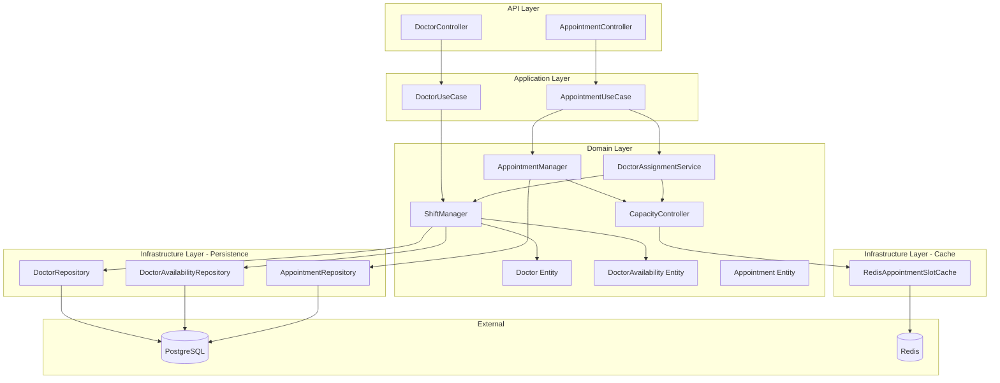
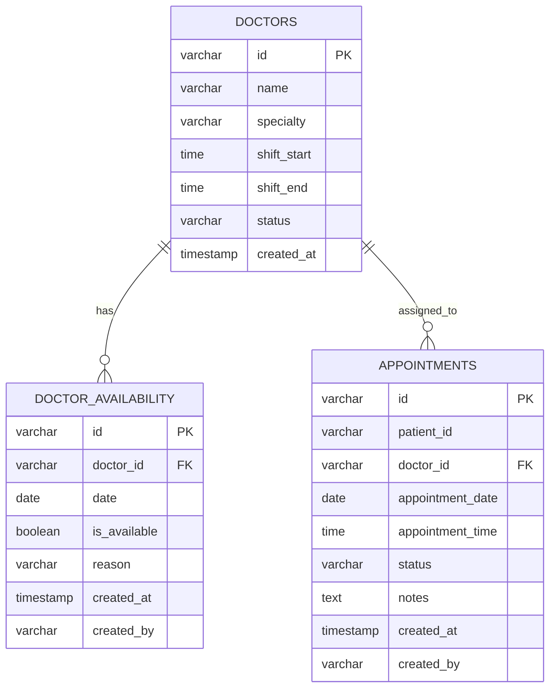
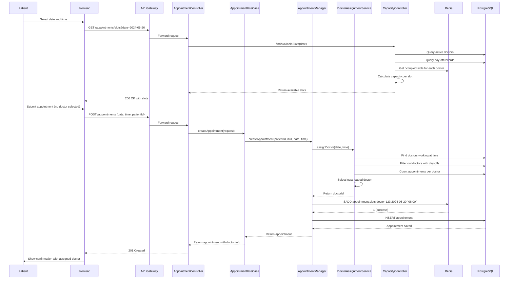
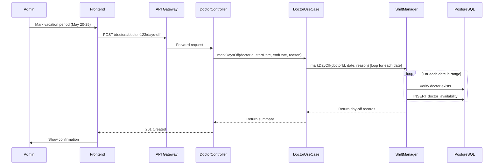
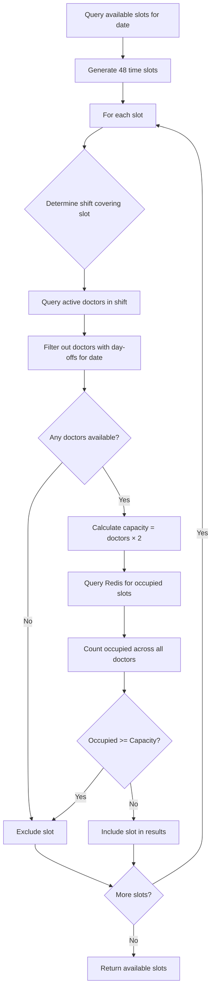
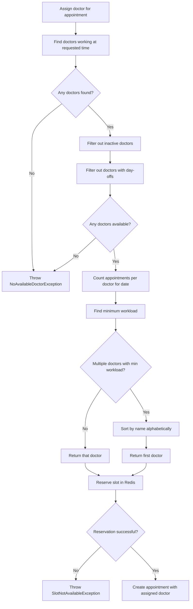

# Design Document: Doctor Auto-Assignment System

## Overview

The Doctor Auto-Assignment System automates the allocation of doctors to medical appointments based on workload balancing, shift schedules, and capacity constraints. This system integrates with the existing hexagonal architecture of the Clinical Service, extending the appointment booking functionality to eliminate manual doctor selection.

### Key Design Goals

1. **Fair Workload Distribution**: Automatically assign appointments to the doctor with the lowest daily workload
2. **Shift-Based Availability**: Respect doctor work schedules (Night, Morning, Evening shifts)
3. **Capacity Management**: Enforce 2 appointments per hour per doctor using Redis atomic operations
4. **Seamless Integration**: Extend existing `AppointmentManager` and `RedisAppointmentSlotCache` without breaking changes
5. **Backward Compatibility**: Support both automatic assignment (no doctorId) and manual selection (with doctorId)

### System Context

This feature extends the **Clinical Service** microservice within the MedFlow HIS architecture. It operates within the existing hexagonal architecture pattern:

- **Domain Layer**: Pure business logic for doctor assignment algorithm
- **Application Layer**: Use cases orchestrating domain services
- **Infrastructure Layer**: PostgreSQL repositories and Redis cache adapters
- **API Layer**: REST controllers exposing assignment endpoints

## Architecture

### Component Diagram



### Integration with Existing Architecture

The system extends the existing Clinical Service components:

**Existing Components (No Changes)**:
- `Appointment` entity: Already has `doctorId` field
- `AppointmentRepository`: Already supports `findByDoctorIdAndDate()`
- `RedisAppointmentSlotCache`: Already implements atomic slot reservation

**New Components**:
- `Doctor` entity: Stores doctor information and shift schedule
- `DoctorAvailability` entity: Tracks day-off records
- `DoctorAssignmentService`: Implements workload balancing algorithm
- `ShiftManager`: Manages doctor schedules and availability
- `CapacityController`: Calculates available slots across all doctors

**Modified Components**:
- `AppointmentManager`: Add optional automatic assignment before creating appointment
- `AppointmentController`: Make `doctorId` parameter optional in POST endpoint

### Hexagonal Architecture Ports

**Domain Ports (Interfaces)**:

```java
// Output Ports (implemented by infrastructure)
interface DoctorRepository {
    Doctor save(Doctor doctor);
    Optional<Doctor> findById(String id);
    List<Doctor> findByShiftAndStatus(LocalTime shiftStart, LocalTime shiftEnd, DoctorStatus status);
    List<Doctor> findAllActive();
}

interface DoctorAvailabilityRepository {
    DoctorAvailability save(DoctorAvailability availability);
    List<DoctorAvailability> findByDoctorIdAndDate(String doctorId, LocalDate date);
    void deleteByDoctorIdAndDate(String doctorId, LocalDate date);
}

// Input Ports (implemented by application layer)
interface AssignDoctorUseCase {
    String assignDoctor(LocalDate date, LocalTime time);
}

interface ManageDoctorUseCase {
    Doctor createDoctor(CreateDoctorCommand command);
    Doctor updateDoctor(String id, UpdateDoctorCommand command);
    void deactivateDoctor(String id);
}
```

## Components and Interfaces

### 1. Doctor Entity (Domain Model)

```java
public class Doctor {
    private String id;
    private String name;
    private String specialty;
    private LocalTime shiftStart;  // e.g., 08:00
    private LocalTime shiftEnd;    // e.g., 16:00
    private DoctorStatus status;   // ACTIVE, INACTIVE
    private LocalDateTime createdAt;
    
    public enum DoctorStatus {
        ACTIVE, INACTIVE
    }
    
    // Business method: Validate shift is exactly 8 hours
    public void validateShift() {
        long hours = Duration.between(shiftStart, shiftEnd).toHours();
        if (hours != 8) {
            throw new IllegalArgumentException(
                "El turno debe ser de exactamente 8 horas. Duración actual: " + hours + " horas");
        }
    }
    
    // Business method: Check if doctor works during a specific time
    public boolean worksAt(LocalTime time) {
        return !time.isBefore(shiftStart) && time.isBefore(shiftEnd);
    }
    
    // Business method: Deactivate doctor
    public void deactivate() {
        if (this.status == DoctorStatus.INACTIVE) {
            throw new IllegalStateException("El doctor ya está inactivo");
        }
        this.status = DoctorStatus.INACTIVE;
    }
}
```

### 2. DoctorAvailability Entity (Domain Model)

```java
public class DoctorAvailability {
    private String id;
    private String doctorId;
    private LocalDate date;
    private boolean isAvailable;  // false = day off
    private String reason;         // "Vacation", "Personal Day", etc.
    private LocalDateTime createdAt;
    private String createdBy;
    
    // Business method: Mark as unavailable
    public void markUnavailable(String reason) {
        this.isAvailable = false;
        this.reason = reason;
    }
    
    // Business method: Restore availability
    public void restore() {
        this.isAvailable = true;
        this.reason = null;
    }
}
```

### 3. DoctorAssignmentService (Domain Service)

```java
public class DoctorAssignmentService {
    private final DoctorRepository doctorRepository;
    private final DoctorAvailabilityRepository availabilityRepository;
    private final AppointmentRepository appointmentRepository;
    
    /**
     * Assigns a doctor to an appointment using the least-loaded algorithm.
     * 
     * Algorithm:
     * 1. Find all active doctors working during the requested time slot
     * 2. Exclude doctors with day-off records for the requested date
     * 3. Count total appointments for each remaining doctor on that date
     * 4. Select the doctor with the fewest appointments
     * 5. If tie, select alphabetically by name
     * 
     * @return doctorId of the assigned doctor
     * @throws NoAvailableDoctorException if no doctors are available
     */
    public String assignDoctor(LocalDate date, LocalTime time) {
        // Step 1: Find doctors working during this time slot
        List<Doctor> workingDoctors = findDoctorsWorkingAt(time);
        
        if (workingDoctors.isEmpty()) {
            throw new NoAvailableDoctorException(
                "No hay doctores trabajando en el horario " + time);
        }
        
        // Step 2: Exclude doctors with day-off records
        List<Doctor> availableDoctors = filterAvailableDoctors(workingDoctors, date);
        
        if (availableDoctors.isEmpty()) {
            throw new NoAvailableDoctorException(
                "No hay doctores disponibles para la fecha " + date);
        }
        
        // Step 3: Count appointments for each doctor on this date
        Map<String, Integer> workloadMap = calculateWorkload(availableDoctors, date);
        
        // Step 4: Find doctor with minimum workload
        Doctor assignedDoctor = selectLeastLoadedDoctor(availableDoctors, workloadMap);
        
        return assignedDoctor.getId();
    }
    
    private List<Doctor> findDoctorsWorkingAt(LocalTime time) {
        List<Doctor> allActive = doctorRepository.findAllActive();
        return allActive.stream()
            .filter(doctor -> doctor.worksAt(time))
            .collect(Collectors.toList());
    }
    
    private List<Doctor> filterAvailableDoctors(List<Doctor> doctors, LocalDate date) {
        return doctors.stream()
            .filter(doctor -> {
                List<DoctorAvailability> dayOffs = 
                    availabilityRepository.findByDoctorIdAndDate(doctor.getId(), date);
                return dayOffs.isEmpty() || dayOffs.stream().allMatch(DoctorAvailability::isAvailable);
            })
            .collect(Collectors.toList());
    }
    
    private Map<String, Integer> calculateWorkload(List<Doctor> doctors, LocalDate date) {
        Map<String, Integer> workload = new HashMap<>();
        for (Doctor doctor : doctors) {
            int count = appointmentRepository.findByDoctorIdAndDate(doctor.getId(), date).size();
            workload.put(doctor.getId(), count);
        }
        return workload;
    }
    
    private Doctor selectLeastLoadedDoctor(List<Doctor> doctors, Map<String, Integer> workload) {
        return doctors.stream()
            .min(Comparator
                .comparingInt((Doctor d) -> workload.get(d.getId()))
                .thenComparing(Doctor::getName))
            .orElseThrow(() -> new NoAvailableDoctorException("No se pudo asignar doctor"));
    }
}
```

### 4. ShiftManager (Domain Service)

```java
public class ShiftManager {
    private final DoctorRepository doctorRepository;
    private final DoctorAvailabilityRepository availabilityRepository;
    
    public Doctor createDoctor(String name, String specialty, 
                               LocalTime shiftStart, LocalTime shiftEnd) {
        Doctor doctor = new Doctor();
        doctor.setName(name);
        doctor.setSpecialty(specialty);
        doctor.setShiftStart(shiftStart);
        doctor.setShiftEnd(shiftEnd);
        doctor.setStatus(Doctor.DoctorStatus.ACTIVE);
        
        // Validate shift duration
        doctor.validateShift();
        
        return doctorRepository.save(doctor);
    }
    
    public void markDayOff(String doctorId, LocalDate date, String reason) {
        Doctor doctor = doctorRepository.findById(doctorId)
            .orElseThrow(() -> new DoctorNotFoundException("Doctor no encontrado: " + doctorId));
        
        DoctorAvailability availability = new DoctorAvailability();
        availability.setDoctorId(doctorId);
        availability.setDate(date);
        availability.markUnavailable(reason);
        
        availabilityRepository.save(availability);
    }
    
    public void removeDayOff(String doctorId, LocalDate date) {
        availabilityRepository.deleteByDoctorIdAndDate(doctorId, date);
    }
}
```

### 5. CapacityController (Domain Service)

```java
public class CapacityController {
    private static final int SLOTS_PER_HOUR_PER_DOCTOR = 2;
    private static final int SLOT_DURATION_MINUTES = 30;
    
    private final DoctorRepository doctorRepository;
    private final DoctorAvailabilityRepository availabilityRepository;
    private final AppointmentSlotCache slotCache;
    
    /**
     * Calculates available time slots for a given date across all doctors.
     * 
     * Algorithm:
     * 1. Generate all 48 time slots (00:00 to 23:30)
     * 2. For each slot, determine which shift covers it
     * 3. Count active doctors in that shift without day-offs
     * 4. Calculate total capacity = doctors * 2 slots/hour
     * 5. Count occupied slots from Redis cache
     * 6. If occupied >= capacity, exclude slot
     * 
     * @return List of available time slots
     */
    public List<LocalTime> findAvailableSlots(LocalDate date) {
        List<LocalTime> allSlots = generateAllSlots();
        List<LocalTime> availableSlots = new ArrayList<>();
        
        for (LocalTime slot : allSlots) {
            if (hasCapacity(slot, date)) {
                availableSlots.add(slot);
            }
        }
        
        return availableSlots;
    }
    
    private List<LocalTime> generateAllSlots() {
        List<LocalTime> slots = new ArrayList<>();
        LocalTime current = LocalTime.of(0, 0);
        LocalTime end = LocalTime.of(23, 30);
        
        while (!current.isAfter(end)) {
            slots.add(current);
            current = current.plusMinutes(SLOT_DURATION_MINUTES);
        }
        
        return slots;
    }
    
    private boolean hasCapacity(LocalTime slot, LocalDate date) {
        // Find doctors working during this slot
        List<Doctor> workingDoctors = doctorRepository.findAllActive().stream()
            .filter(doctor -> doctor.worksAt(slot))
            .collect(Collectors.toList());
        
        // Exclude doctors with day-offs
        List<Doctor> availableDoctors = workingDoctors.stream()
            .filter(doctor -> {
                List<DoctorAvailability> dayOffs = 
                    availabilityRepository.findByDoctorIdAndDate(doctor.getId(), date);
                return dayOffs.isEmpty() || dayOffs.stream().allMatch(DoctorAvailability::isAvailable);
            })
            .collect(Collectors.toList());
        
        if (availableDoctors.isEmpty()) {
            return false;
        }
        
        // Calculate total capacity
        int totalCapacity = availableDoctors.size() * SLOTS_PER_HOUR_PER_DOCTOR;
        
        // Count occupied slots from Redis
        int occupiedCount = 0;
        for (Doctor doctor : availableDoctors) {
            Set<LocalTime> occupied = slotCache.getOccupiedSlots(doctor.getId(), date);
            if (occupied.contains(slot)) {
                occupiedCount++;
            }
        }
        
        return occupiedCount < totalCapacity;
    }
}
```

### 6. Modified AppointmentManager

```java
public class AppointmentManager {
    // ... existing fields ...
    private final DoctorAssignmentService doctorAssignmentService;
    
    /**
     * Creates an appointment with optional automatic doctor assignment.
     * 
     * @param doctorId Optional. If null, system assigns doctor automatically.
     */
    public Appointment createAppointment(String patientId, String doctorId,
                                          LocalDate date, LocalTime time,
                                          String notes, String createdBy) {
        
        // 1. Validate patient exists
        patientServiceClient.validatePatientExists(patientId);
        
        // 2. Automatic doctor assignment if not provided
        if (doctorId == null || doctorId.isEmpty()) {
            doctorId = doctorAssignmentService.assignDoctor(date, time);
        }
        
        // 3. Reserve slot in Redis atomically
        boolean reserved = slotCache.reserveSlot(doctorId, date, time);
        if (!reserved) {
            throw new SlotNotAvailableException(
                "El horario " + time + " del " + date +
                " ya no está disponible. Por favor seleccione otro horario.");
        }
        
        try {
            // 4. Create appointment entity
            Appointment appointment = new Appointment();
            appointment.setPatientId(patientId);
            appointment.setDoctorId(doctorId);
            appointment.setAppointmentDate(date);
            appointment.setAppointmentTime(time);
            appointment.setNotes(notes);
            appointment.setCreatedBy(createdBy);
            
            // 5. Persist to database
            return appointmentRepository.save(appointment);
            
        } catch (Exception e) {
            // Rollback: release slot in Redis if DB save fails
            slotCache.releaseSlot(doctorId, date, time);
            throw e;
        }
    }
}
```

## Data Models

### Database Schema

```sql
-- Doctors table
CREATE TABLE doctors (
    id VARCHAR(36) PRIMARY KEY,
    name VARCHAR(255) NOT NULL,
    specialty VARCHAR(100) NOT NULL,
    shift_start TIME NOT NULL,
    shift_end TIME NOT NULL,
    status VARCHAR(20) NOT NULL DEFAULT 'ACTIVE',
    created_at TIMESTAMP NOT NULL DEFAULT CURRENT_TIMESTAMP,
    
    CONSTRAINT chk_status CHECK (status IN ('ACTIVE', 'INACTIVE')),
    CONSTRAINT chk_shift_duration CHECK (
        EXTRACT(HOUR FROM (shift_end - shift_start)) = 8
    )
);

-- Doctor availability (day-offs)
CREATE TABLE doctor_availability (
    id VARCHAR(36) PRIMARY KEY,
    doctor_id VARCHAR(36) NOT NULL,
    date DATE NOT NULL,
    is_available BOOLEAN NOT NULL DEFAULT true,
    reason VARCHAR(255),
    created_at TIMESTAMP NOT NULL DEFAULT CURRENT_TIMESTAMP,
    created_by VARCHAR(100),
    
    CONSTRAINT fk_doctor FOREIGN KEY (doctor_id) REFERENCES doctors(id),
    CONSTRAINT uq_doctor_date UNIQUE (doctor_id, date)
);

-- Indexes for performance
CREATE INDEX idx_doctors_shift ON doctors(shift_start, shift_end, status);
CREATE INDEX idx_doctors_status ON doctors(status);
CREATE INDEX idx_availability_doctor_date ON doctor_availability(doctor_id, date);
CREATE INDEX idx_availability_date ON doctor_availability(date);

-- Existing appointments table (add index)
CREATE INDEX idx_appointments_doctor_date ON appointments(doctor_id, appointment_date);
```

### Entity Relationships



### Redis Data Structure

```
Key Pattern: appointment:slots:{doctorId}:{date}
Type: SET
Members: ["08:00", "08:30", "09:00", ...]
TTL: 7 days

Example:
appointment:slots:doctor-123:2024-05-15 = {"08:00", "09:30", "14:00"}
appointment:slots:doctor-456:2024-05-15 = {"08:00", "10:00"}

Operations:
- SADD appointment:slots:doctor-123:2024-05-15 "08:00"  # Reserve slot (atomic)
- SREM appointment:slots:doctor-123:2024-05-15 "08:00"  # Release slot
- SMEMBERS appointment:slots:doctor-123:2024-05-15      # Get occupied slots
```

## Correctness Properties

*A property is a characteristic or behavior that should hold true across all valid executions of a system—essentially, a formal statement about what the system should do. Properties serve as the bridge between human-readable specifications and machine-verifiable correctness guarantees.*

Before writing the correctness properties, I need to analyze the acceptance criteria to determine which are testable as properties.


### Property Reflection

After analyzing all acceptance criteria, I've identified the following redundancies and consolidation opportunities:

**Redundancy Group 1: Doctor Filtering**
- Properties 1.4, 4.6 (inactive doctor exclusion) → Can be combined
- Properties 2.2, 4.7 (day-off exclusion) → Can be combined
- **Consolidation**: Single property for "assignment excludes unavailable doctors"

**Redundancy Group 2: Capacity Calculation**
- Properties 2.3, 3.5 (capacity with day-offs) → Duplicate logic
- Property 5.3 (counting available doctors) → Same as above
- **Consolidation**: Single property for "capacity calculation accounts for availability"

**Redundancy Group 3: Slot Counting**
- Properties 3.3, 5.4 (counting appointments per slot) → Same logic
- Property 4.2 (counting appointments per doctor per date) → Related but different scope
- **Consolidation**: Keep 4.2 for workload, combine 3.3 and 5.4 for slot counting

**Redundancy Group 4: Slot Availability**
- Properties 3.4, 5.5 (full slots excluded) → Same logic
- Property 5.6 (returned slots have capacity) → Inverse of above
- **Consolidation**: Single property for "available slots have capacity"

**Redundancy Group 5: Round-Trip Properties**
- Properties 1.1, 1.3 (doctor CRUD round-trip) → Can be combined
- Property 2.1 (day-off round-trip) → Keep separate (different entity)
- Property 12.4 (JSON round-trip) → Keep separate (different domain)

**Redundancy Group 6: Time Filtering**
- Properties 6.2, 6.4, 6.5 (time-based filtering) → Can be consolidated
- Property 6.3 is a specific example of 6.2 → Remove from properties

**Properties to Keep (Non-Redundant)**:
- 1.2: Shift validation (8-hour constraint)
- 3.1: Capacity constraint (2 slots per hour per doctor)
- 4.1: Doctor shift matching
- 4.3: Least-loaded assignment
- 4.4: Alphabetical tiebreaker
- 4.5: Doctor ID persistence
- 5.1: Slot generation (48 slots)
- 5.2: Shift identification
- 7.4: Time format conversion
- 7.6: Automatic assignment invocation
- 8.1: Response includes doctor ID
- 8.4, 8.5: Appointment data completeness
- 10.2: Slot count aggregation
- 10.4: Slot reservation/release round-trip
- 12.1, 12.2, 12.3, 12.4, 12.5, 12.6: Parser/serializer properties

**Final Property Count**: 25 unique, non-redundant properties

### Correctness Properties

#### Property 1: Doctor Record Round-Trip Preservation

*For any* valid doctor record with name, specialty, shift times, and status, saving the doctor to the repository and then retrieving it by ID SHALL produce a doctor record with equivalent field values.

**Validates: Requirements 1.1, 1.3**

#### Property 2: Shift Duration Validation

*For any* shift start and end times, the system SHALL accept the shift configuration if and only if the duration is exactly 8 hours.

**Validates: Requirements 1.2**

#### Property 3: Inactive Doctor Exclusion from Assignment

*For any* appointment date and time, the doctor assignment algorithm SHALL never return a doctor whose status is INACTIVE.

**Validates: Requirements 1.4, 4.6**

#### Property 4: Day-Off Record Persistence

*For any* valid day-off record with doctor ID, date, and reason, saving the record and then retrieving it SHALL produce an equivalent record.

**Validates: Requirements 2.1**

#### Property 5: Day-Off Exclusion from Assignment

*For any* appointment date and time, the doctor assignment algorithm SHALL never return a doctor who has a day-off record (is_available = false) for that specific date.

**Validates: Requirements 2.2, 4.7**

#### Property 6: Vacation Period Bulk Creation

*For any* doctor ID and date range [start, end], marking the range as unavailable SHALL create exactly (end - start + 1) day-off records, one for each date in the range.

**Validates: Requirements 2.4**

#### Property 7: Day-Off Removal Restoration

*For any* doctor and date, if a day-off record exists, removing it SHALL result in the doctor being available for assignment on that date (equivalent to no day-off record existing).

**Validates: Requirements 2.5**

#### Property 8: Hourly Capacity Constraint

*For any* doctor and date, the number of appointments assigned to that doctor within any single hour SHALL never exceed 2.

**Validates: Requirements 3.1**

#### Property 9: Capacity Calculation with Availability

*For any* time slot and date, the calculated total capacity SHALL equal (number of active doctors working that shift without day-offs) × 2.

**Validates: Requirements 2.3, 3.5, 5.3**

#### Property 10: Occupied Slot Counting Accuracy

*For any* time slot and date, the count of occupied slots SHALL equal the number of appointments scheduled at that exact time across all doctors.

**Validates: Requirements 3.3, 5.4**

#### Property 11: Full Slot Exclusion

*For any* time slot and date, if the number of occupied slots equals or exceeds the total capacity, then that slot SHALL NOT appear in the list of available slots.

**Validates: Requirements 3.4, 5.5, 5.6**

#### Property 12: Shift-Based Doctor Filtering

*For any* appointment time, the doctor assignment algorithm SHALL only consider doctors whose shift start time is less than or equal to the appointment time AND whose shift end time is greater than the appointment time.

**Validates: Requirements 4.1**

#### Property 13: Workload Counting Accuracy

*For any* doctor and date, the workload count SHALL equal the number of appointments in the repository with that doctor ID and appointment date.

**Validates: Requirements 4.2**

#### Property 14: Least-Loaded Doctor Selection

*For any* appointment date and time with multiple available doctors, the assigned doctor SHALL have a workload (appointment count for that date) less than or equal to all other available doctors' workloads.

**Validates: Requirements 4.3**

#### Property 15: Alphabetical Tiebreaker

*For any* appointment date and time where multiple available doctors have equal minimum workload, the assigned doctor SHALL be the one whose name comes first in alphabetical order among those tied doctors.

**Validates: Requirements 4.4**

#### Property 16: Doctor ID Persistence in Appointment

*For any* created appointment, retrieving the appointment from the repository SHALL return a record with a doctor ID that matches the doctor ID returned by the assignment algorithm.

**Validates: Requirements 4.5**

#### Property 17: Daily Slot Generation Completeness

*For any* date, querying available slots SHALL initially generate exactly 48 time slots: 00:00, 00:30, 01:00, ..., 23:00, 23:30 (before applying capacity and time filters).

**Validates: Requirements 5.1**

#### Property 18: Shift Identification Correctness

*For any* time slot, the identified shift SHALL be the shift whose start time is less than or equal to the slot time AND whose end time is greater than the slot time.

**Validates: Requirements 5.2**

#### Property 19: Future Slot Time Filtering

*For any* date and current time, if the date is today, then all returned available slots SHALL have start times strictly greater than the current time; if the date is in the future, then time filtering SHALL not apply.

**Validates: Requirements 6.2, 6.4, 6.5**

#### Property 20: Time Format Conversion Correctness

*For any* time in 24-hour format (HH:mm), converting to 12-hour format SHALL produce a string with format "HH:mm AM" or "HH:mm PM" where the hour is in range [1-12] and AM/PM correctly reflects the time period.

**Validates: Requirements 7.4**

#### Property 21: Automatic Assignment Invocation

*For any* appointment creation request without a doctor ID parameter, the system SHALL invoke the doctor assignment service and SHALL store the returned doctor ID in the created appointment record.

**Validates: Requirements 7.6**

#### Property 22: Appointment Response Completeness

*For any* successfully created appointment, the API response SHALL include a non-null doctor ID field.

**Validates: Requirements 8.1**

#### Property 23: Appointment History Data Completeness

*For any* appointment retrieved from the system, the record SHALL include both a status field (SCHEDULED, ACTIVE, COMPLETED, or CANCELLED) and a non-null doctor ID field.

**Validates: Requirements 8.4, 8.5**

#### Property 24: Slot Count Aggregation Accuracy

*For any* time slot and date, the aggregated occupied slot count across all doctors in the relevant shift SHALL equal the sum of individual occupied slot counts for each doctor.

**Validates: Requirements 10.2**

#### Property 25: Slot Reservation Release Round-Trip

*For any* doctor, date, and time slot, if a slot is reserved (appointment created) and then released (appointment cancelled), the slot SHALL return to the available state (equivalent to never having been reserved).

**Validates: Requirements 10.4**

#### Property 26: JSON Configuration Parsing Validity

*For any* syntactically valid JSON configuration string representing doctor shift data, parsing SHALL either produce a Doctor object or return a descriptive validation error; it SHALL NOT throw an unhandled exception.

**Validates: Requirements 12.1, 12.2**

#### Property 27: Doctor Object Serialization Validity

*For any* Doctor object with valid shift configuration, serializing to JSON SHALL produce a syntactically valid JSON string that conforms to the expected schema.

**Validates: Requirements 12.3**

#### Property 28: Configuration Round-Trip Preservation

*For any* valid Doctor configuration object, the operation parse(serialize(doctor)) SHALL produce a Doctor object equivalent to the original.

**Validates: Requirements 12.4**

#### Property 29: Shift Time Format Validation

*For any* shift configuration, the parser SHALL accept shift times if and only if they are in HH:mm format (24-hour) and the duration between start and end is exactly 8 hours.

**Validates: Requirements 12.5**

#### Property 30: Doctor ID Uniqueness Validation

*For any* JSON configuration file containing multiple doctor records, the parser SHALL reject the configuration if any doctor ID appears more than once.

**Validates: Requirements 12.6**

## Error Handling

### Domain Exceptions

```java
// Doctor Management Exceptions
public class DoctorNotFoundException extends RuntimeException {
    public DoctorNotFoundException(String message) {
        super(message);
    }
}

public class InvalidShiftDurationException extends RuntimeException {
    public InvalidShiftDurationException(String message) {
        super(message);
    }
}

// Assignment Exceptions
public class NoAvailableDoctorException extends RuntimeException {
    public NoAvailableDoctorException(String message) {
        super(message);
    }
}

// Capacity Exceptions
public class SlotNotAvailableException extends RuntimeException {
    public SlotNotAvailableException(String message) {
        super(message);
    }
}

// Configuration Exceptions
public class InvalidConfigurationException extends RuntimeException {
    public InvalidConfigurationException(String message) {
        super(message);
    }
}
```

### Error Handling Strategy

1. **Validation Errors**: Return 400 Bad Request with descriptive error messages
2. **Not Found Errors**: Return 404 Not Found for missing doctors or appointments
3. **Business Rule Violations**: Return 422 Unprocessable Entity (e.g., no available doctors)
4. **Concurrency Conflicts**: Return 409 Conflict when slot reservation fails due to race condition
5. **Internal Errors**: Return 500 Internal Server Error with generic message (log details internally)

### Error Response Format

```json
{
  "timestamp": "2024-05-15T10:30:00Z",
  "status": 422,
  "error": "Unprocessable Entity",
  "message": "No hay doctores disponibles para la fecha 2024-05-20 en el horario 14:00",
  "path": "/api/clinical/appointments"
}
```

## Testing Strategy

### Dual Testing Approach

This feature requires both **property-based testing** and **example-based unit testing** for comprehensive coverage:

**Property-Based Tests**: Verify universal properties across randomized inputs
- Minimum 100 iterations per property test
- Each test tagged with: `Feature: doctor-auto-assignment-system, Property {number}: {description}`
- Use **fast-check** library for Java (or **jqwik** as alternative)

**Unit Tests**: Verify specific examples, edge cases, and integration points
- Specific shift configurations (Night, Morning, Evening)
- Boundary conditions (exactly 2 slots per hour, exactly 8-hour shifts)
- Error conditions (no available doctors, invalid shifts)
- Integration with existing AppointmentManager

### Property-Based Testing Configuration

**Library**: jqwik (Java property-based testing framework)

```xml
<dependency>
    <groupId>net.jqwik</groupId>
    <artifactId>jqwik</artifactId>
    <version>1.7.4</version>
    <scope>test</scope>
</dependency>
```

**Test Structure Example**:

```java
@Property(tries = 100)
@Label("Feature: doctor-auto-assignment-system, Property 14: Least-Loaded Doctor Selection")
void assignedDoctorHasMinimumWorkload(
    @ForAll("availableDoctors") List<Doctor> doctors,
    @ForAll("appointmentDate") LocalDate date,
    @ForAll("appointmentTime") LocalTime time
) {
    // Arrange: Create existing appointments with random distribution
    Map<String, Integer> workload = createRandomWorkload(doctors, date);
    
    // Act: Assign doctor
    String assignedDoctorId = doctorAssignmentService.assignDoctor(date, time);
    
    // Assert: Assigned doctor has minimum workload
    int assignedWorkload = workload.get(assignedDoctorId);
    boolean hasMinimumWorkload = workload.values().stream()
        .allMatch(w -> assignedWorkload <= w);
    
    assertThat(hasMinimumWorkload).isTrue();
}
```

### Test Coverage Requirements

**Domain Layer** (Pure Logic):
- 100% coverage of business rules
- All 30 correctness properties implemented as property-based tests
- Edge cases covered by unit tests

**Application Layer** (Use Cases):
- Integration tests for orchestration logic
- Mock domain services to isolate use case logic

**Infrastructure Layer** (Adapters):
- Integration tests with real PostgreSQL (Testcontainers)
- Integration tests with real Redis (Testcontainers)
- Repository contract tests

**API Layer** (Controllers):
- REST API integration tests
- Request/response validation tests
- Error handling tests

### Test Data Generators

```java
@Provide
Arbitrary<Doctor> validDoctors() {
    return Combinators.combine(
        Arbitraries.strings().alpha().ofLength(10),
        Arbitraries.of("Cardiology", "Neurology", "Pediatrics"),
        Arbitraries.of(
            LocalTime.of(0, 0),   // Night shift start
            LocalTime.of(8, 0),   // Morning shift start
            LocalTime.of(16, 0)   // Evening shift start
        )
    ).as((name, specialty, shiftStart) -> {
        Doctor doctor = new Doctor();
        doctor.setName(name);
        doctor.setSpecialty(specialty);
        doctor.setShiftStart(shiftStart);
        doctor.setShiftEnd(shiftStart.plusHours(8));
        doctor.setStatus(Doctor.DoctorStatus.ACTIVE);
        return doctor;
    });
}
```

## API Endpoints

### Doctor Management Endpoints

#### POST /api/clinical/doctors
Create a new doctor record.

**Request**:
```json
{
  "name": "Dr. Juan Pérez",
  "specialty": "Cardiology",
  "shiftStart": "08:00",
  "shiftEnd": "16:00"
}
```

**Response** (201 Created):
```json
{
  "id": "doctor-123",
  "name": "Dr. Juan Pérez",
  "specialty": "Cardiology",
  "shiftStart": "08:00",
  "shiftEnd": "16:00",
  "status": "ACTIVE",
  "createdAt": "2024-05-15T10:00:00Z"
}
```

**Errors**:
- 400: Invalid shift duration (not 8 hours)
- 400: Invalid time format

#### PUT /api/clinical/doctors/{id}
Update doctor information.

**Request**:
```json
{
  "name": "Dr. Juan Pérez García",
  "specialty": "Cardiology",
  "shiftStart": "16:00",
  "shiftEnd": "24:00"
}
```

**Response** (200 OK): Same as POST response

**Errors**:
- 404: Doctor not found
- 400: Invalid shift duration

#### DELETE /api/clinical/doctors/{id}
Deactivate a doctor (soft delete).

**Response** (204 No Content)

**Errors**:
- 404: Doctor not found

#### GET /api/clinical/doctors
List all active doctors.

**Response** (200 OK):
```json
{
  "doctors": [
    {
      "id": "doctor-123",
      "name": "Dr. Juan Pérez",
      "specialty": "Cardiology",
      "shiftStart": "08:00",
      "shiftEnd": "16:00",
      "status": "ACTIVE"
    }
  ],
  "total": 1
}
```

#### POST /api/clinical/doctors/{id}/days-off
Mark dates as unavailable for a doctor.

**Request**:
```json
{
  "startDate": "2024-05-20",
  "endDate": "2024-05-25",
  "reason": "Vacation"
}
```

**Response** (201 Created):
```json
{
  "doctorId": "doctor-123",
  "daysOff": [
    {
      "date": "2024-05-20",
      "reason": "Vacation"
    },
    {
      "date": "2024-05-21",
      "reason": "Vacation"
    }
  ],
  "total": 6
}
```

**Errors**:
- 404: Doctor not found
- 400: Invalid date range

#### DELETE /api/clinical/doctors/{id}/days-off/{date}
Remove a day-off record.

**Response** (204 No Content)

**Errors**:
- 404: Doctor or day-off record not found

### Appointment Endpoints (Modified)

#### GET /api/clinical/appointments/slots
Get available appointment slots (capacity-aware, no doctorId parameter).

**Query Parameters**:
- `date` (required): Date in YYYY-MM-DD format

**Response** (200 OK):
```json
{
  "date": "2024-05-20",
  "availableSlots": [
    {
      "time": "08:00",
      "availableCapacity": 4,
      "totalCapacity": 4
    },
    {
      "time": "08:30",
      "availableCapacity": 3,
      "totalCapacity": 4
    }
  ],
  "total": 2
}
```

**Errors**:
- 400: Invalid date format
- 400: Past date selected

#### POST /api/clinical/appointments
Create appointment with automatic doctor assignment.

**Request** (doctorId is now optional):
```json
{
  "patientId": "patient-456",
  "appointmentDate": "2024-05-20",
  "appointmentTime": "08:00",
  "notes": "Consulta de rutina"
}
```

**Response** (201 Created):
```json
{
  "id": "appointment-789",
  "patientId": "patient-456",
  "doctorId": "doctor-123",
  "doctorName": "Dr. Juan Pérez",
  "doctorSpecialty": "Cardiology",
  "appointmentDate": "2024-05-20",
  "appointmentTime": "08:00",
  "status": "SCHEDULED",
  "notes": "Consulta de rutina",
  "createdAt": "2024-05-15T10:30:00Z"
}
```

**Errors**:
- 404: Patient not found
- 422: No available doctors for the requested time
- 409: Slot no longer available (race condition)

## Integration Flows

### Flow 1: Appointment Booking with Automatic Assignment



### Flow 2: Doctor Day-Off Management



### Flow 3: Capacity Calculation with Day-Offs



### Flow 4: Workload Balancing Algorithm



## Implementation Phases

### Phase 1: Domain Model and Core Logic (Week 1)
- [ ] Create `Doctor` entity with shift validation
- [ ] Create `DoctorAvailability` entity
- [ ] Implement `DoctorAssignmentService` with workload algorithm
- [ ] Implement `ShiftManager` for doctor CRUD
- [ ] Implement `CapacityController` for slot calculation
- [ ] Write property-based tests for all domain logic

### Phase 2: Infrastructure Layer (Week 2)
- [ ] Create `DoctorRepository` interface and JPA implementation
- [ ] Create `DoctorAvailabilityRepository` interface and JPA implementation
- [ ] Create database migration scripts (Flyway)
- [ ] Extend `RedisAppointmentSlotCache` if needed
- [ ] Write integration tests with Testcontainers

### Phase 3: Application and API Layer (Week 3)
- [ ] Create `DoctorUseCase` for doctor management
- [ ] Modify `AppointmentUseCase` to support automatic assignment
- [ ] Create `DoctorController` with REST endpoints
- [ ] Modify `AppointmentController` to make doctorId optional
- [ ] Write API integration tests

### Phase 4: Frontend Integration (Week 4)
- [ ] Modify appointment booking form to remove doctor selection
- [ ] Update slot query to use new capacity-aware endpoint
- [ ] Add doctor management UI for administrators
- [ ] Add day-off management UI
- [ ] End-to-end testing

### Phase 5: Configuration Parser (Optional Enhancement)
- [ ] Implement JSON parser for doctor shift configurations
- [ ] Implement JSON serializer
- [ ] Write round-trip property tests
- [ ] Create bulk import endpoint

## Security Considerations

1. **Role-Based Access Control**:
   - Doctor management endpoints require `ADMINISTRATOR` role
   - Appointment creation requires `PATIENT` or `ADMISSION` role
   - Slot queries are public (no authentication required)

2. **Input Validation**:
   - Validate shift times are in valid format (HH:mm)
   - Validate shift duration is exactly 8 hours
   - Validate dates are not in the past
   - Sanitize all string inputs to prevent injection

3. **Concurrency Control**:
   - Use Redis atomic operations (SADD) for slot reservation
   - Implement optimistic locking for doctor updates
   - Handle race conditions gracefully with 409 Conflict responses

4. **Data Privacy**:
   - Do not expose internal doctor IDs in public APIs
   - Log doctor assignments for audit trail
   - Implement rate limiting on slot queries to prevent scraping

## Performance Considerations

1. **Database Optimization**:
   - Index on `doctors(shift_start, shift_end, status)` for shift queries
   - Composite index on `appointments(doctor_id, appointment_date)` for workload counting
   - Index on `doctor_availability(doctor_id, date)` for day-off lookups

2. **Redis Caching**:
   - Use Redis SET operations for O(1) slot reservation
   - Set TTL of 7 days on slot keys to prevent memory bloat
   - Consider Redis pipelining for bulk slot queries

3. **Query Optimization**:
   - Batch doctor availability queries when calculating capacity
   - Use database connection pooling
   - Consider caching active doctor list (invalidate on doctor updates)

4. **Scalability**:
   - Stateless design allows horizontal scaling
   - Redis can be clustered for high availability
   - Consider read replicas for PostgreSQL if query load is high

## Monitoring and Observability

1. **Metrics to Track**:
   - Average workload per doctor per day
   - Assignment algorithm execution time
   - Slot reservation success/failure rate
   - Number of "no available doctor" errors

2. **Logging**:
   - Log all doctor assignments with timestamp and workload distribution
   - Log day-off creations and removals
   - Log slot reservation conflicts
   - Log assignment algorithm decisions (which doctors were considered)

3. **Alerts**:
   - Alert when no doctors are available for a shift
   - Alert when slot reservation failure rate exceeds threshold
   - Alert when assignment algorithm takes longer than expected

## Future Enhancements

1. **Advanced Assignment Algorithms**:
   - Consider doctor specialty matching
   - Implement priority-based assignment (VIP patients)
   - Add doctor preference settings (preferred time slots)

2. **Capacity Management**:
   - Dynamic capacity adjustment based on appointment type
   - Emergency slot reservation for urgent cases
   - Waitlist management for fully booked slots

3. **Analytics and Reporting**:
   - Doctor workload reports
   - Capacity utilization reports
   - Peak time analysis
   - No-show rate tracking per doctor

4. **Integration Enhancements**:
   - Sync with external calendar systems (Google Calendar, Outlook)
   - SMS/email notifications for assigned appointments
   - Real-time capacity updates via WebSocket

---

**Document Version**: 1.0  
**Last Updated**: 2024-05-15  
**Author**: MedFlow Development Team
