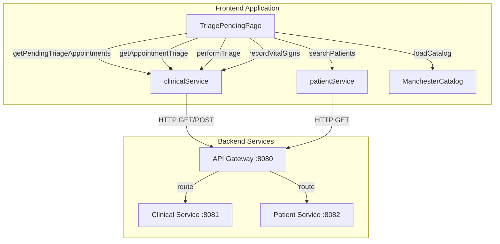
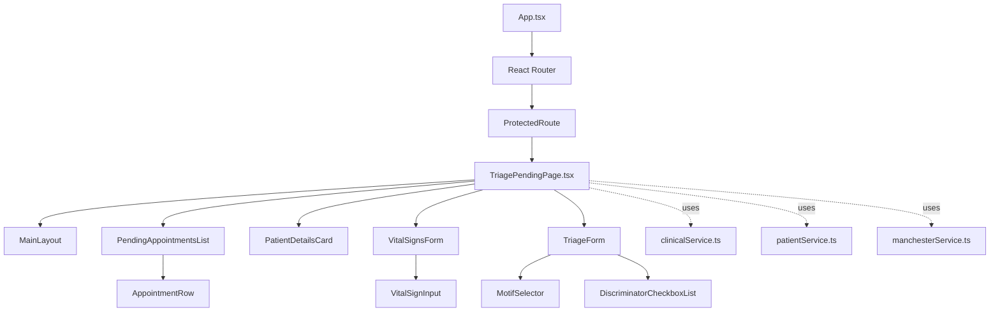
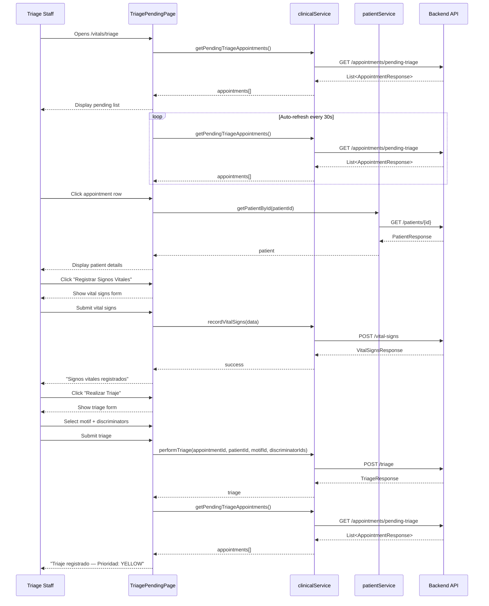

# Design Document: Frontend Triage Pending List

## Introduction

This document provides the technical design for integrating the triage-appointment backend endpoints into the frontend React application. The feature enables triage staff (VITAL_SIGNS and DOCTOR roles) to view a list of active appointments awaiting triage, select an appointment, record vital signs, and perform triage with automatic appointment linking.

The backend provides three endpoints:
1. `GET /api/clinical/appointments/pending-triage` - Returns list of ACTIVE appointments without triage
2. `GET /api/clinical/appointments/{id}/triage` - Returns triage for a specific appointment  
3. `POST /api/clinical/triage` - Creates triage with required appointmentId field

This frontend integration completes the patient flow: **appointment activation → vital signs capture → triage → consultation**.

## Architecture

### System Context



### Component Hierarchy



### Data Flow: Complete Triage Workflow



## Components and Interfaces

### 1. TriagePendingPage Component

**File:** `frontend-medflow/src/pages/vitals/TriagePendingPage.tsx`

**Responsibility:** Main page component that orchestrates the entire triage workflow

**State Management:**

```typescript
interface TriagePendingPageState {
  // Pending appointments list
  appointments: PendingTriageAppointment[];
  appointmentsLoading: boolean;
  appointmentsError: string | null;
  
  // Selected appointment
  selectedAppointment: PendingTriageAppointment | null;
  selectedPatient: PatientResponse | null;
  patientLoading: boolean;
  
  // Vital signs workflow
  showVitalSignsForm: boolean;
  vitalSignsSubmitting: boolean;
  vitalSignsSuccess: boolean;
  vitalSignsError: string | null;
  
  // Triage workflow
  showTriageForm: boolean;
  triageSubmitting: boolean;
  triageSuccess: string | null;
  triageError: string | null;
  
  // Manchester catalog
  manchesterCatalog: ManchesterCatalog | null;
  catalogLoading: boolean;
  
  // Auto-refresh
  autoRefreshEnabled: boolean;
}
```

**Props:** None (top-level page component)

**Key Methods:**

```typescript
// Lifecycle
useEffect(() => {
  fetchPendingAppointments();
  const interval = setInterval(fetchPendingAppointments, 30000);
  return () => clearInterval(interval);
}, []);

// Data fetching
const fetchPendingAppointments = async () => {
  try {
    const data = await getPendingTriageAppointments();
    setAppointments(data);
  } catch (error) {
    handleError(error);
  }
};

// Appointment selection
const handleSelectAppointment = async (appointment: PendingTriageAppointment) => {
  setSelectedAppointment(appointment);
  setPatientLoading(true);
  try {
    const patient = await getPatientById(appointment.patientId);
    setSelectedPatient(patient);
  } catch (error) {
    handleError(error);
  } finally {
    setPatientLoading(false);
  }
};

// Vital signs workflow
const handleVitalSignsSubmit = async (data: VitalSignsRequest) => {
  setVitalSignsSubmitting(true);
  try {
    await recordVitalSigns(data);
    setVitalSignsSuccess(true);
    setShowVitalSignsForm(false);
  } catch (error) {
    setVitalSignsError(extractErrorMessage(error));
  } finally {
    setVitalSignsSubmitting(false);
  }
};

// Triage workflow
const handleTriageSubmit = async (data: TriageRequest) => {
  setTriageSubmitting(true);
  try {
    const result = await performTriage({
      appointmentId: selectedAppointment!.id,
      patientId: selectedAppointment!.patientId,
      motifId: data.motifId,
      discriminatorIds: data.discriminatorIds,
    });
    setTriageSuccess(`Triaje registrado — Prioridad: ${result.priorityLevel}`);
    setShowTriageForm(false);
    setSelectedAppointment(null);
    setSelectedPatient(null);
    await fetchPendingAppointments(); // Refresh list
  } catch (error) {
    setTriageError(extractErrorMessage(error));
  } finally {
    setTriageSubmitting(false);
  }
};

// Cancel selection
const handleCancelSelection = () => {
  setSelectedAppointment(null);
  setSelectedPatient(null);
  setShowVitalSignsForm(false);
  setShowTriageForm(false);
  setVitalSignsSuccess(false);
  setVitalSignsError(null);
  setTriageError(null);
};
```

### 2. PendingAppointmentsList Component

**File:** `frontend-medflow/src/components/triage/PendingAppointmentsList.tsx`

**Responsibility:** Display table of pending appointments with sorting and selection

**Props:**

```typescript
interface PendingAppointmentsListProps {
  appointments: PendingTriageAppointment[];
  selectedAppointmentId: string | null;
  onSelectAppointment: (appointment: PendingTriageAppointment) => void;
  loading: boolean;
}
```

**Implementation:**

```typescript
const PendingAppointmentsList: FC<PendingAppointmentsListProps> = ({
  appointments,
  selectedAppointmentId,
  onSelectAppointment,
  loading,
}) => {
  // Sort appointments by date ascending, then time ascending
  const sortedAppointments = useMemo(() => {
    return [...appointments].sort((a, b) => {
      const dateCompare = a.appointmentDate.localeCompare(b.appointmentDate);
      if (dateCompare !== 0) return dateCompare;
      return a.appointmentTime.localeCompare(b.appointmentTime);
    });
  }, [appointments]);

  if (loading) {
    return (
      <div className="flex justify-center items-center py-12">
        <div className="animate-spin rounded-full h-8 w-8 border-4 border-medin-cyan border-t-transparent" />
      </div>
    );
  }

  if (appointments.length === 0) {
    return (
      <div className="text-center py-12 text-gray-500">
        No hay citas pendientes de triaje
      </div>
    );
  }

  return (
    <div className="overflow-x-auto">
      <table className="min-w-full text-sm">
        <thead>
          <tr className="border-b border-gray-200 text-left text-xs text-gray-500 uppercase tracking-wide">
            <th className="pb-3 pr-4">Fecha</th>
            <th className="pb-3 pr-4">Hora</th>
            <th className="pb-3 pr-4">Paciente</th>
            <th className="pb-3 pr-4">Motivo</th>
            <th className="pb-3">ID Cita</th>
          </tr>
        </thead>
        <tbody className="divide-y divide-gray-100">
          {sortedAppointments.map((appointment) => (
            <AppointmentRow
              key={appointment.id}
              appointment={appointment}
              isSelected={appointment.id === selectedAppointmentId}
              onSelect={onSelectAppointment}
            />
          ))}
        </tbody>
      </table>
    </div>
  );
};

export default React.memo(PendingAppointmentsList);
```

### 3. AppointmentRow Component

**File:** `frontend-medflow/src/components/triage/AppointmentRow.tsx`

**Responsibility:** Render individual appointment row with click handler

**Props:**

```typescript
interface AppointmentRowProps {
  appointment: PendingTriageAppointment;
  isSelected: boolean;
  onSelect: (appointment: PendingTriageAppointment) => void;
}
```

**Implementation:**

```typescript
const AppointmentRow: FC<AppointmentRowProps> = ({
  appointment,
  isSelected,
  onSelect,
}) => {
  const handleClick = useCallback(() => {
    onSelect(appointment);
  }, [appointment, onSelect]);

  return (
    <tr
      onClick={handleClick}
      className={`cursor-pointer hover:bg-gray-50 transition-colors ${
        isSelected ? 'bg-medin-cyan/10 border-l-4 border-medin-cyan' : ''
      }`}
      role="button"
      tabIndex={0}
      onKeyDown={(e) => {
        if (e.key === 'Enter' || e.key === ' ') {
          e.preventDefault();
          handleClick();
        }
      }}
      aria-label={`Seleccionar cita del ${appointment.appointmentDate} a las ${appointment.appointmentTime}`}
    >
      <td className="py-3 pr-4 whitespace-nowrap">{appointment.appointmentDate}</td>
      <td className="py-3 pr-4 whitespace-nowrap">
        {appointment.appointmentTime.substring(0, 5)}
      </td>
      <td className="py-3 pr-4 font-mono text-xs">{appointment.patientId}</td>
      <td className="py-3 pr-4 max-w-xs truncate">{appointment.notes || '—'}</td>
      <td className="py-3 font-mono text-xs text-gray-500">{appointment.id}</td>
    </tr>
  );
};

export default React.memo(AppointmentRow);
```

### 4. PatientDetailsCard Component

**File:** `frontend-medflow/src/components/triage/PatientDetailsCard.tsx`

**Responsibility:** Display selected patient information and action buttons

**Props:**

```typescript
interface PatientDetailsCardProps {
  patient: PatientResponse;
  appointment: PendingTriageAppointment;
  vitalSignsRecorded: boolean;
  onRecordVitalSigns: () => void;
  onPerformTriage: () => void;
  onCancel: () => void;
  loading: boolean;
}
```

**Implementation:**

```typescript
const PatientDetailsCard: FC<PatientDetailsCardProps> = ({
  patient,
  appointment,
  vitalSignsRecorded,
  onRecordVitalSigns,
  onPerformTriage,
  onCancel,
  loading,
}) => {
  if (loading) {
    return (
      <div className="bg-white rounded-lg shadow p-6">
        <div className="flex justify-center items-center py-8">
          <div className="animate-spin rounded-full h-6 w-6 border-4 border-medin-cyan border-t-transparent" />
        </div>
      </div>
    );
  }

  return (
    <div className="bg-white rounded-lg shadow p-6">
      <div className="flex justify-between items-start mb-4">
        <h3 className="text-lg font-semibold text-gray-900">Paciente Seleccionado</h3>
        <button
          onClick={onCancel}
          className="text-sm text-gray-500 hover:text-gray-700"
          aria-label="Cancelar selección"
        >
          Cancelar
        </button>
      </div>

      <div className="space-y-3 mb-6">
        <div className="grid grid-cols-2 gap-4 text-sm">
          <div>
            <span className="text-gray-500">Nombre:</span>
            <p className="font-medium text-gray-900">{patient.fullName}</p>
          </div>
          <div>
            <span className="text-gray-500">DPI:</span>
            <p className="font-medium text-gray-900">{patient.dpi}</p>
          </div>
          <div>
            <span className="text-gray-500">Fecha de Cita:</span>
            <p className="font-medium text-gray-900">{appointment.appointmentDate}</p>
          </div>
          <div>
            <span className="text-gray-500">Hora:</span>
            <p className="font-medium text-gray-900">
              {appointment.appointmentTime.substring(0, 5)}
            </p>
          </div>
          <div className="col-span-2">
            <span className="text-gray-500">ID Cita:</span>
            <p className="font-mono text-xs text-gray-700">{appointment.id}</p>
          </div>
        </div>
      </div>

      <div className="flex gap-3">
        <button
          onClick={onRecordVitalSigns}
          className="flex-1 px-4 py-2 bg-medin-navy text-white rounded-lg hover:bg-medin-navy/90 transition-colors text-sm font-medium"
        >
          Registrar Signos Vitales
        </button>
        <button
          onClick={onPerformTriage}
          disabled={!vitalSignsRecorded}
          className="flex-1 px-4 py-2 bg-medin-cyan text-medin-navy rounded-lg hover:bg-medin-blue hover:text-white transition-colors text-sm font-medium disabled:opacity-50 disabled:cursor-not-allowed"
          title={!vitalSignsRecorded ? 'Primero registre los signos vitales' : ''}
        >
          Realizar Triaje
        </button>
      </div>
    </div>
  );
};

export default PatientDetailsCard;
```

### 5. VitalSignsForm Component

**File:** `frontend-medflow/src/components/triage/VitalSignsForm.tsx`

**Responsibility:** Form for recording patient vital signs

**Props:**

```typescript
interface VitalSignsFormProps {
  patientId: string;
  onSubmit: (data: VitalSignsRequest) => Promise<void>;
  onCancel: () => void;
  submitting: boolean;
  error: string | null;
}
```

**Implementation:**

```typescript
interface VitalSignsFormData {
  systolicPressure: string;
  diastolicPressure: string;
  heartRate: string;
  respiratoryRate: string;
  temperature: string;
  oxygenSaturation: string;
  weight: string;
  height: string;
}

const VitalSignsForm: FC<VitalSignsFormProps> = ({
  patientId,
  onSubmit,
  onCancel,
  submitting,
  error,
}) => {
  const [form, setForm] = useState<VitalSignsFormData>({
    systolicPressure: '',
    diastolicPressure: '',
    heartRate: '',
    respiratoryRate: '',
    temperature: '',
    oxygenSaturation: '',
    weight: '',
    height: '',
  });

  const [validationErrors, setValidationErrors] = useState<Record<string, string>>({});

  const handleChange = (e: React.ChangeEvent<HTMLInputElement>) => {
    const { name, value } = e.target;
    setForm((prev) => ({ ...prev, [name]: value }));
    // Clear validation error for this field
    if (validationErrors[name]) {
      setValidationErrors((prev) => {
        const next = { ...prev };
        delete next[name];
        return next;
      });
    }
  };

  const validate = (): boolean => {
    const errors: Record<string, string> = {};

    const systolic = Number(form.systolicPressure);
    if (systolic < 50 || systolic > 250) {
      errors.systolicPressure = 'Debe estar entre 50 y 250 mmHg';
    }

    const diastolic = Number(form.diastolicPressure);
    if (diastolic < 30 || diastolic > 150) {
      errors.diastolicPressure = 'Debe estar entre 30 y 150 mmHg';
    }

    const heartRate = Number(form.heartRate);
    if (heartRate < 20 || heartRate > 300) {
      errors.heartRate = 'Debe estar entre 20 y 300 lpm';
    }

    const respiratoryRate = Number(form.respiratoryRate);
    if (respiratoryRate < 5 || respiratoryRate > 60) {
      errors.respiratoryRate = 'Debe estar entre 5 y 60 rpm';
    }

    const temperature = Number(form.temperature);
    if (temperature < 30 || temperature > 45) {
      errors.temperature = 'Debe estar entre 30 y 45 °C';
    }

    const oxygenSaturation = Number(form.oxygenSaturation);
    if (oxygenSaturation < 50 || oxygenSaturation > 100) {
      errors.oxygenSaturation = 'Debe estar entre 50 y 100%';
    }

    setValidationErrors(errors);
    return Object.keys(errors).length === 0;
  };

  const handleSubmit = async (e: React.FormEvent) => {
    e.preventDefault();
    if (!validate()) return;

    await onSubmit({
      patientId,
      systolicPressure: Number(form.systolicPressure),
      diastolicPressure: Number(form.diastolicPressure),
      heartRate: Number(form.heartRate),
      respiratoryRate: Number(form.respiratoryRate),
      temperature: Number(form.temperature),
      oxygenSaturation: Number(form.oxygenSaturation),
      weight: form.weight ? Number(form.weight) : undefined,
      height: form.height ? Number(form.height) : undefined,
    });
  };

  const inputClass = 'w-full px-3 py-2 border border-gray-300 rounded-lg focus:ring-2 focus:ring-medin-cyan focus:border-transparent text-sm';
  const labelClass = 'block text-sm font-medium text-gray-700 mb-1';
  const errorClass = 'text-xs text-red-600 mt-1';

  return (
    <div className="bg-white rounded-lg shadow p-6">
      <div className="flex justify-between items-center mb-4">
        <h3 className="text-lg font-semibold text-gray-900">Registrar Signos Vitales</h3>
        <button
          onClick={onCancel}
          className="text-sm text-gray-500 hover:text-gray-700"
          disabled={submitting}
        >
          Cancelar
        </button>
      </div>

      {error && (
        <div className="mb-4 p-3 bg-red-50 border border-red-200 rounded-lg text-red-800 text-sm">
          {error}
        </div>
      )}

      <form onSubmit={handleSubmit} className="space-y-4">
        <div className="grid grid-cols-1 sm:grid-cols-2 lg:grid-cols-4 gap-4">
          <div>
            <label htmlFor="systolicPressure" className={labelClass}>
              Sist. (mmHg) <span className="text-red-500">*</span>
            </label>
            <input
              type="number"
              id="systolicPressure"
              name="systolicPressure"
              value={form.systolicPressure}
              onChange={handleChange}
              required
              min={50}
              max={250}
              className={inputClass}
              placeholder="120"
              disabled={submitting}
            />
            {validationErrors.systolicPressure && (
              <p className={errorClass}>{validationErrors.systolicPressure}</p>
            )}
          </div>

          <div>
            <label htmlFor="diastolicPressure" className={labelClass}>
              Diast. (mmHg) <span className="text-red-500">*</span>
            </label>
            <input
              type="number"
              id="diastolicPressure"
              name="diastolicPressure"
              value={form.diastolicPressure}
              onChange={handleChange}
              required
              min={30}
              max={150}
              className={inputClass}
              placeholder="80"
              disabled={submitting}
            />
            {validationErrors.diastolicPressure && (
              <p className={errorClass}>{validationErrors.diastolicPressure}</p>
            )}
          </div>

          <div>
            <label htmlFor="heartRate" className={labelClass}>
              FC (lpm) <span className="text-red-500">*</span>
            </label>
            <input
              type="number"
              id="heartRate"
              name="heartRate"
              value={form.heartRate}
              onChange={handleChange}
              required
              min={20}
              max={300}
              className={inputClass}
              placeholder="72"
              disabled={submitting}
            />
            {validationErrors.heartRate && (
              <p className={errorClass}>{validationErrors.heartRate}</p>
            )}
          </div>

          <div>
            <label htmlFor="respiratoryRate" className={labelClass}>
              FR (rpm) <span className="text-red-500">*</span>
            </label>
            <input
              type="number"
              id="respiratoryRate"
              name="respiratoryRate"
              value={form.respiratoryRate}
              onChange={handleChange}
              required
              min={5}
              max={60}
              className={inputClass}
              placeholder="16"
              disabled={submitting}
            />
            {validationErrors.respiratoryRate && (
              <p className={errorClass}>{validationErrors.respiratoryRate}</p>
            )}
          </div>

          <div>
            <label htmlFor="temperature" className={labelClass}>
              Temperatura (°C) <span className="text-red-500">*</span>
            </label>
            <input
              type="number"
              step="0.1"
              id="temperature"
              name="temperature"
              value={form.temperature}
              onChange={handleChange}
              required
              min={30}
              max={45}
              className={inputClass}
              placeholder="36.5"
              disabled={submitting}
            />
            {validationErrors.temperature && (
              <p className={errorClass}>{validationErrors.temperature}</p>
            )}
          </div>

          <div>
            <label htmlFor="oxygenSaturation" className={labelClass}>
              SpO2 (%) <span className="text-red-500">*</span>
            </label>
            <input
              type="number"
              id="oxygenSaturation"
              name="oxygenSaturation"
              value={form.oxygenSaturation}
              onChange={handleChange}
              required
              min={50}
              max={100}
              className={inputClass}
              placeholder="98"
              disabled={submitting}
            />
            {validationErrors.oxygenSaturation && (
              <p className={errorClass}>{validationErrors.oxygenSaturation}</p>
            )}
          </div>

          <div>
            <label htmlFor="weight" className={labelClass}>
              Peso (kg)
            </label>
            <input
              type="number"
              step="0.1"
              id="weight"
              name="weight"
              value={form.weight}
              onChange={handleChange}
              min={1}
              max={300}
              className={inputClass}
              placeholder="70"
              disabled={submitting}
            />
          </div>

          <div>
            <label htmlFor="height" className={labelClass}>
              Talla (cm)
            </label>
            <input
              type="number"
              id="height"
              name="height"
              value={form.height}
              onChange={handleChange}
              min={30}
              max={250}
              className={inputClass}
              placeholder="170"
              disabled={submitting}
            />
          </div>
        </div>

        <div className="flex justify-end gap-3 pt-2">
          <button
            type="button"
            onClick={onCancel}
            disabled={submitting}
            className="px-6 py-2 border border-gray-300 text-gray-700 rounded-lg hover:bg-gray-50 transition-colors text-sm font-medium disabled:opacity-50"
          >
            Cancelar
          </button>
          <button
            type="submit"
            disabled={submitting}
            className="px-6 py-2 bg-medin-cyan text-medin-navy font-semibold rounded-lg hover:bg-medin-blue hover:text-white transition-colors text-sm disabled:opacity-50"
          >
            {submitting ? 'Guardando...' : 'Guardar Signos Vitales'}
          </button>
        </div>
      </form>
    </div>
  );
};

export default VitalSignsForm;
```


### 6. TriageForm Component

**File:** `frontend-medflow/src/components/triage/TriageForm.tsx`

**Responsibility:** Form for performing Manchester triage with motif and discriminator selection

**Props:**

```typescript
interface TriageFormProps {
  patientId: string;
  appointmentId: string;
  onSubmit: (data: TriageFormData) => Promise<void>;
  onCancel: () => void;
  submitting: boolean;
  error: string | null;
}

interface TriageFormData {
  motifId: string;
  discriminatorIds: string[];
}
```

**Implementation:**

```typescript
const TriageForm: FC<TriageFormProps> = ({
  patientId,
  appointmentId,
  onSubmit,
  onCancel,
  submitting,
  error,
}) => {
  const [motifs, setMotifs] = useState<ManchesterMotif[]>([]);
  const [discriminators, setDiscriminators] = useState<ManchesterDiscriminator[]>([]);
  const [catalogLoading, setCatalogLoading] = useState(true);
  const [catalogError, setCatalogError] = useState<string | null>(null);

  const [selectedMotifId, setSelectedMotifId] = useState('');
  const [selectedDiscriminatorIds, setSelectedDiscriminatorIds] = useState<string[]>([]);
  const [validationError, setValidationError] = useState<string | null>(null);

  // Load Manchester catalog on mount
  useEffect(() => {
    const loadCatalog = async () => {
      try {
        const catalog = await getManchesterCatalog();
        setMotifs(catalog.motifs);
        setDiscriminators(catalog.discriminators);
      } catch (err) {
        setCatalogError('Error al cargar el catálogo Manchester');
      } finally {
        setCatalogLoading(false);
      }
    };
    loadCatalog();
  }, []);

  const handleMotifChange = (e: React.ChangeEvent<HTMLSelectElement>) => {
    setSelectedMotifId(e.target.value);
    setValidationError(null);
  };

  const handleDiscriminatorToggle = (discriminatorId: string) => {
    setSelectedDiscriminatorIds((prev) => {
      if (prev.includes(discriminatorId)) {
        return prev.filter((id) => id !== discriminatorId);
      } else {
        return [...prev, discriminatorId];
      }
    });
    setValidationError(null);
  };

  const handleSubmit = async (e: React.FormEvent) => {
    e.preventDefault();

    if (!selectedMotifId) {
      setValidationError('Debe seleccionar un motivo de consulta');
      return;
    }

    if (selectedDiscriminatorIds.length === 0) {
      setValidationError('Debe seleccionar al menos un discriminador');
      return;
    }

    await onSubmit({
      motifId: selectedMotifId,
      discriminatorIds: selectedDiscriminatorIds,
    });
  };

  if (catalogLoading) {
    return (
      <div className="bg-white rounded-lg shadow p-6">
        <div className="flex justify-center items-center py-8">
          <div className="animate-spin rounded-full h-6 w-6 border-4 border-medin-cyan border-t-transparent" />
          <span className="ml-3 text-gray-600">Cargando catálogo Manchester...</span>
        </div>
      </div>
    );
  }

  if (catalogError) {
    return (
      <div className="bg-white rounded-lg shadow p-6">
        <div className="p-4 bg-red-50 border border-red-200 rounded-lg text-red-800 text-sm">
          {catalogError}
        </div>
      </div>
    );
  }

  return (
    <div className="bg-white rounded-lg shadow p-6">
      <div className="flex justify-between items-center mb-4">
        <h3 className="text-lg font-semibold text-gray-900">Realizar Triaje Manchester</h3>
        <button
          onClick={onCancel}
          className="text-sm text-gray-500 hover:text-gray-700"
          disabled={submitting}
        >
          Cancelar
        </button>
      </div>

      {error && (
        <div className="mb-4 p-3 bg-red-50 border border-red-200 rounded-lg text-red-800 text-sm">
          {error}
        </div>
      )}

      {validationError && (
        <div className="mb-4 p-3 bg-yellow-50 border border-yellow-200 rounded-lg text-yellow-800 text-sm">
          {validationError}
        </div>
      )}

      <form onSubmit={handleSubmit} className="space-y-6">
        {/* Motif Selection */}
        <div>
          <label htmlFor="motif" className="block text-sm font-medium text-gray-700 mb-2">
            Motivo de Consulta <span className="text-red-500">*</span>
          </label>
          <select
            id="motif"
            value={selectedMotifId}
            onChange={handleMotifChange}
            required
            disabled={submitting}
            className="w-full px-3 py-2 border border-gray-300 rounded-lg focus:ring-2 focus:ring-medin-cyan focus:border-transparent text-sm"
          >
            <option value="">Seleccione un motivo...</option>
            {motifs.map((motif) => (
              <option key={motif.id} value={motif.id}>
                {motif.name}
              </option>
            ))}
          </select>
        </div>

        {/* Discriminator Selection */}
        <div>
          <label className="block text-sm font-medium text-gray-700 mb-2">
            Discriminadores <span className="text-red-500">*</span>
          </label>
          <p className="text-xs text-gray-500 mb-3">
            Seleccione todos los discriminadores que apliquen al paciente
          </p>
          <div className="space-y-2 max-h-96 overflow-y-auto border border-gray-200 rounded-lg p-4">
            {discriminators.map((discriminator) => (
              <label
                key={discriminator.id}
                className="flex items-start gap-3 p-2 hover:bg-gray-50 rounded cursor-pointer"
              >
                <input
                  type="checkbox"
                  checked={selectedDiscriminatorIds.includes(discriminator.id)}
                  onChange={() => handleDiscriminatorToggle(discriminator.id)}
                  disabled={submitting}
                  className="mt-1 h-4 w-4 text-medin-cyan focus:ring-medin-cyan border-gray-300 rounded"
                />
                <div className="flex-1">
                  <p className="text-sm font-medium text-gray-900">
                    {discriminator.name}
                  </p>
                  {discriminator.description && (
                    <p className="text-xs text-gray-500 mt-0.5">
                      {discriminator.description}
                    </p>
                  )}
                  <span
                    className={`inline-block mt-1 px-2 py-0.5 rounded-full text-xs font-medium ${getPriorityColorClass(
                      discriminator.priorityLevel
                    )}`}
                  >
                    {discriminator.priorityLevel}
                  </span>
                </div>
              </label>
            ))}
          </div>
          {selectedDiscriminatorIds.length > 0 && (
            <p className="text-xs text-gray-600 mt-2">
              {selectedDiscriminatorIds.length} discriminador(es) seleccionado(s)
            </p>
          )}
        </div>

        <div className="flex justify-end gap-3 pt-2">
          <button
            type="button"
            onClick={onCancel}
            disabled={submitting}
            className="px-6 py-2 border border-gray-300 text-gray-700 rounded-lg hover:bg-gray-50 transition-colors text-sm font-medium disabled:opacity-50"
          >
            Cancelar
          </button>
          <button
            type="submit"
            disabled={submitting}
            className="px-6 py-2 bg-medin-cyan text-medin-navy font-semibold rounded-lg hover:bg-medin-blue hover:text-white transition-colors text-sm disabled:opacity-50"
          >
            {submitting ? 'Registrando...' : 'Registrar Triaje'}
          </button>
        </div>
      </form>
    </div>
  );
};

// Helper function for priority color classes
const getPriorityColorClass = (priority: string): string => {
  const colorMap: Record<string, string> = {
    RED: 'bg-red-100 text-red-800',
    ORANGE: 'bg-orange-100 text-orange-800',
    YELLOW: 'bg-yellow-100 text-yellow-800',
    GREEN: 'bg-green-100 text-green-800',
    BLUE: 'bg-blue-100 text-blue-800',
  };
  return colorMap[priority] || 'bg-gray-100 text-gray-800';
};

export default TriageForm;
```

## Data Models

### TypeScript Interfaces

**File:** `frontend-medflow/src/types/triage.ts`

```typescript
// Pending triage appointment (from backend)
export interface PendingTriageAppointment {
  id: string;
  patientId: string;
  doctorId: string;
  appointmentDate: string; // ISO date string "YYYY-MM-DD"
  appointmentTime: string; // ISO time string "HH:mm:ss"
  status: 'ACTIVE';
  notes: string | null;
  createdAt: string; // ISO datetime string
}

// Triage request (to backend)
export interface TriageRequest {
  appointmentId: string;
  patientId: string;
  motifId: string;
  discriminatorIds: string[];
}

// Triage response (from backend)
export interface TriageResponse {
  id: string;
  patientId: string;
  priorityLevel: 'RED' | 'ORANGE' | 'YELLOW' | 'GREEN' | 'BLUE';
  priorityDescription: string;
  maxWaitTimeMinutes: number;
  performedAt: string; // ISO datetime string
}

// Manchester catalog structures
export interface ManchesterMotif {
  id: string;
  name: string;
  description?: string;
}

export interface ManchesterDiscriminator {
  id: string;
  name: string;
  description?: string;
  priorityLevel: 'RED' | 'ORANGE' | 'YELLOW' | 'GREEN' | 'BLUE';
}

export interface ManchesterCatalog {
  motifs: ManchesterMotif[];
  discriminators: ManchesterDiscriminator[];
}
```

## Service Layer Design

### Updated clinicalService.ts

**File:** `frontend-medflow/src/services/clinicalService.ts`

**New Functions:**

```typescript
// ─── Triage-Appointment Integration ──────────────────────────────────────────

export interface PendingTriageAppointment {
  id: string;
  patientId: string;
  doctorId: string;
  appointmentDate: string;
  appointmentTime: string;
  status: string;
  notes: string | null;
  createdAt: string;
}

/**
 * Get all active appointments that do not have an associated triage record
 * @returns List of pending triage appointments
 */
export const getPendingTriageAppointments = async (): Promise<PendingTriageAppointment[]> => {
  const response = await api.get<PendingTriageAppointment[]>(
    '/api/clinical/appointments/pending-triage'
  );
  return response.data;
};

/**
 * Get the triage record associated with a specific appointment
 * @param appointmentId - The appointment ID
 * @returns Triage response
 * @throws 404 if no triage found for this appointment
 */
export const getAppointmentTriage = async (appointmentId: string): Promise<TriageResponse> => {
  const response = await api.get<TriageResponse>(
    `/api/clinical/appointments/${appointmentId}/triage`
  );
  return response.data;
};

// ─── Modified Triage Function ─────────────────────────────────────────────────

/**
 * Perform triage for a patient with appointment linking
 * @param data - Triage request data including appointmentId
 * @returns Triage response with priority level
 */
export const performTriage = async (data: {
  appointmentId: string; // NEW: Required field
  patientId: string;
  motifId: string;
  discriminatorIds: string[];
}): Promise<TriageResponse> => {
  const response = await api.post<TriageResponse>('/api/clinical/triage', data);
  return response.data;
};
```

### New manchesterService.ts

**File:** `frontend-medflow/src/services/manchesterService.ts`

```typescript
import api from '../api';
import type { ManchesterCatalog, ManchesterMotif, ManchesterDiscriminator } from '../types/triage';

/**
 * Get the complete Manchester triage catalog (motifs and discriminators)
 * @returns Manchester catalog
 */
export const getManchesterCatalog = async (): Promise<ManchesterCatalog> => {
  // Fetch motifs and discriminators in parallel
  const [motifsResponse, discriminatorsResponse] = await Promise.all([
    api.get<ManchesterMotif[]>('/api/clinical/manchester/motifs'),
    api.get<ManchesterDiscriminator[]>('/api/clinical/manchester/discriminators'),
  ]);

  return {
    motifs: motifsResponse.data,
    discriminators: discriminatorsResponse.data,
  };
};

/**
 * Get all Manchester motifs
 * @returns List of motifs
 */
export const getManchesterMotifs = async (): Promise<ManchesterMotif[]> => {
  const response = await api.get<ManchesterMotif[]>('/api/clinical/manchester/motifs');
  return response.data;
};

/**
 * Get all Manchester discriminators
 * @returns List of discriminators
 */
export const getManchesterDiscriminators = async (): Promise<ManchesterDiscriminator[]> => {
  const response = await api.get<ManchesterDiscriminator[]>(
    '/api/clinical/manchester/discriminators'
  );
  return response.data;
};

export default {
  getManchesterCatalog,
  getManchesterMotifs,
  getManchesterDiscriminators,
};
```

### Updated patientService.ts

**File:** `frontend-medflow/src/services/patientService.ts`

**New Function:**

```typescript
/**
 * Get patient by ID
 * @param patientId - The patient ID
 * @returns Patient response
 * @throws 404 if patient not found
 */
export const getPatientById = async (patientId: string): Promise<PatientResponse> => {
  const response = await api.get<PatientResponse>(`/api/patients/${patientId}`);
  return response.data;
};
```

## Error Handling Strategy

### Error Types and HTTP Status Codes

| HTTP Status | Error Type | User Message (Spanish) | Handling Strategy |
|-------------|------------|------------------------|-------------------|
| 400 | Bad Request | "Solicitud inválida: [detalles]" | Display validation error from API |
| 404 | Not Found | "Cita no encontrada" / "Paciente no encontrado" | Display specific error message |
| 409 | Conflict | "Esta cita ya tiene triaje registrado" | Display conflict message, refresh list |
| 500 | Server Error | "Error del servidor. Intente nuevamente" | Display generic error, offer retry |
| Network Error | Connection Failed | "Error al conectar con el servidor" | Display connection error, offer retry |

### Error Extraction Utility

**File:** `frontend-medflow/src/utils/errorHandler.ts`

```typescript
import axios from 'axios';

/**
 * Extract user-friendly error message from API error
 * @param error - The error object
 * @returns User-friendly Spanish error message
 */
export const extractErrorMessage = (error: unknown): string => {
  if (axios.isAxiosError(error)) {
    const status = error.response?.status;
    const message = error.response?.data?.message || error.response?.data?.error;

    // Map specific status codes to Spanish messages
    switch (status) {
      case 400:
        return message || 'Solicitud inválida. Verifique los datos ingresados';
      case 404:
        return message || 'Recurso no encontrado';
      case 409:
        return 'Esta cita ya tiene triaje registrado';
      case 500:
        return 'Error del servidor. Intente nuevamente más tarde';
      default:
        return message || 'Error al procesar la solicitud';
    }
  }

  // Network error
  if (error instanceof Error && error.message === 'Network Error') {
    return 'Error al conectar con el servidor. Verifique su conexión';
  }

  return 'Error inesperado. Intente nuevamente';
};

/**
 * Check if error is a specific HTTP status code
 * @param error - The error object
 * @param status - The HTTP status code to check
 * @returns True if error matches the status code
 */
export const isHttpError = (error: unknown, status: number): boolean => {
  return axios.isAxiosError(error) && error.response?.status === status;
};
```

### Error Display Component

**File:** `frontend-medflow/src/components/common/ErrorAlert.tsx`

```typescript
import { FC } from 'react';
import { XCircleIcon } from '@heroicons/react/24/outline';

interface ErrorAlertProps {
  message: string;
  onDismiss?: () => void;
}

const ErrorAlert: FC<ErrorAlertProps> = ({ message, onDismiss }) => {
  return (
    <div
      className="p-4 bg-red-50 border border-red-200 rounded-lg flex items-start gap-3"
      role="alert"
    >
      <XCircleIcon className="h-5 w-5 text-red-600 flex-shrink-0 mt-0.5" />
      <div className="flex-1">
        <p className="text-sm text-red-800">{message}</p>
      </div>
      {onDismiss && (
        <button
          onClick={onDismiss}
          className="text-red-600 hover:text-red-800 flex-shrink-0"
          aria-label="Cerrar alerta"
        >
          <XCircleIcon className="h-5 w-5" />
        </button>
      )}
    </div>
  );
};

export default ErrorAlert;
```

### Success Display Component

**File:** `frontend-medflow/src/components/common/SuccessAlert.tsx`

```typescript
import { FC } from 'react';
import { CheckCircleIcon, XMarkIcon } from '@heroicons/react/24/outline';

interface SuccessAlertProps {
  message: string;
  onDismiss?: () => void;
}

const SuccessAlert: FC<SuccessAlertProps> = ({ message, onDismiss }) => {
  return (
    <div
      className="p-4 bg-green-50 border border-green-200 rounded-lg flex items-start gap-3"
      role="status"
    >
      <CheckCircleIcon className="h-5 w-5 text-green-600 flex-shrink-0 mt-0.5" />
      <div className="flex-1">
        <p className="text-sm text-green-800">{message}</p>
      </div>
      {onDismiss && (
        <button
          onClick={onDismiss}
          className="text-green-600 hover:text-green-800 flex-shrink-0"
          aria-label="Cerrar alerta"
        >
          <XMarkIcon className="h-5 w-5" />
        </button>
      )}
    </div>
  );
};

export default SuccessAlert;
```

## Routing Integration

### Updated App.tsx

**File:** `frontend-medflow/src/App.tsx`

**Changes:**

```typescript
// Add import
import TriagePendingPage from './pages/vitals/TriagePendingPage';

// Add route in the Routes section
<Route
  path="/vitals/triage"
  element={
    <ProtectedRoute requiredRole="VITAL_SIGNS">
      <TriagePendingPage />
    </ProtectedRoute>
  }
/>
```

### Navigation Menu Update

**File:** `frontend-medflow/src/components/Layout/MainLayout.tsx` (or wherever navigation is defined)

**Add menu item for VITAL_SIGNS and DOCTOR roles:**

```typescript
{(userRole === 'VITAL_SIGNS' || userRole === 'DOCTOR' || userRole === 'ADMIN') && (
  <Link
    to="/vitals/triage"
    className="flex items-center gap-2 px-4 py-2 text-gray-700 hover:bg-medin-cyan/10 rounded-lg transition-colors"
  >
    <ClipboardDocumentCheckIcon className="h-5 w-5" />
    <span>Triaje Pendiente</span>
  </Link>
)}
```

## Performance Optimizations

### 1. React.memo for Table Rows

**Rationale:** Prevent unnecessary re-renders of appointment rows when only selection changes

```typescript
// AppointmentRow.tsx
export default React.memo(AppointmentRow, (prevProps, nextProps) => {
  return (
    prevProps.appointment.id === nextProps.appointment.id &&
    prevProps.isSelected === nextProps.isSelected
  );
});
```

### 2. useMemo for Sorted Lists

**Rationale:** Avoid re-sorting on every render

```typescript
const sortedAppointments = useMemo(() => {
  return [...appointments].sort((a, b) => {
    const dateCompare = a.appointmentDate.localeCompare(b.appointmentDate);
    if (dateCompare !== 0) return dateCompare;
    return a.appointmentTime.localeCompare(b.appointmentTime);
  });
}, [appointments]);
```

### 3. useCallback for Event Handlers

**Rationale:** Prevent function recreation on every render

```typescript
const handleSelectAppointment = useCallback(
  async (appointment: PendingTriageAppointment) => {
    setSelectedAppointment(appointment);
    // ... rest of logic
  },
  [] // Dependencies
);
```

### 4. Debouncing Manual Refresh

**Rationale:** Prevent multiple simultaneous API calls

```typescript
import { debounce } from 'lodash';

const debouncedRefresh = useMemo(
  () =>
    debounce(() => {
      fetchPendingAppointments();
    }, 500),
  []
);

const handleManualRefresh = () => {
  debouncedRefresh();
};
```

### 5. Lazy Loading Manchester Catalog

**Rationale:** Load catalog only when triage form is opened

```typescript
const [catalogLoaded, setCatalogLoaded] = useState(false);

const handleOpenTriageForm = async () => {
  setShowTriageForm(true);
  if (!catalogLoaded) {
    await loadManchesterCatalog();
    setCatalogLoaded(true);
  }
};
```

### 6. Cleanup on Unmount

**Rationale:** Prevent memory leaks from timers and pending requests

```typescript
useEffect(() => {
  const interval = setInterval(fetchPendingAppointments, 30000);
  const abortController = new AbortController();

  return () => {
    clearInterval(interval);
    abortController.abort();
  };
}, []);
```


## Accessibility Implementation

### WCAG 2.1 AA Compliance

#### 1. Semantic HTML

```typescript
// Use semantic table elements
<table role="table" aria-label="Lista de citas pendientes de triaje">
  <thead>
    <tr role="row">
      <th scope="col" role="columnheader">Fecha</th>
      <th scope="col" role="columnheader">Hora</th>
      {/* ... */}
    </tr>
  </thead>
  <tbody>
    {/* rows */}
  </tbody>
</table>
```

#### 2. ARIA Labels and Roles

```typescript
// Loading spinner
<div
  role="status"
  aria-live="polite"
  aria-busy="true"
  aria-label="Cargando citas pendientes"
>
  <div className="animate-spin..." />
</div>

// Error messages
<div role="alert" aria-live="assertive">
  {errorMessage}
</div>

// Success messages
<div role="status" aria-live="polite">
  {successMessage}
</div>

// Buttons with clear labels
<button
  aria-label="Actualizar lista de citas pendientes"
  onClick={handleRefresh}
>
  Actualizar
</button>
```

#### 3. Keyboard Navigation

```typescript
// Table row keyboard support
<tr
  tabIndex={0}
  role="button"
  onClick={handleClick}
  onKeyDown={(e) => {
    if (e.key === 'Enter' || e.key === ' ') {
      e.preventDefault();
      handleClick();
    }
  }}
  aria-label={`Seleccionar cita del ${date} a las ${time}`}
>
  {/* cells */}
</tr>

// Form keyboard support
<form onSubmit={handleSubmit}>
  {/* All inputs have associated labels */}
  <label htmlFor="systolicPressure">
    Presión Sistólica
  </label>
  <input
    id="systolicPressure"
    name="systolicPressure"
    type="number"
    aria-required="true"
    aria-invalid={!!errors.systolicPressure}
    aria-describedby={errors.systolicPressure ? 'systolic-error' : undefined}
  />
  {errors.systolicPressure && (
    <span id="systolic-error" role="alert">
      {errors.systolicPressure}
    </span>
  )}
</form>

// Escape key to close forms
useEffect(() => {
  const handleEscape = (e: KeyboardEvent) => {
    if (e.key === 'Escape') {
      onCancel();
    }
  };
  window.addEventListener('keydown', handleEscape);
  return () => window.removeEventListener('keydown', handleEscape);
}, [onCancel]);
```

#### 4. Focus Management

```typescript
// Move focus to patient details card when appointment selected
const patientDetailsRef = useRef<HTMLDivElement>(null);

const handleSelectAppointment = async (appointment: PendingTriageAppointment) => {
  setSelectedAppointment(appointment);
  // ... fetch patient data
  
  // Move focus to patient details card
  setTimeout(() => {
    patientDetailsRef.current?.focus();
  }, 100);
};

// Patient details card with focus support
<div
  ref={patientDetailsRef}
  tabIndex={-1}
  className="bg-white rounded-lg shadow p-6"
  aria-label="Detalles del paciente seleccionado"
>
  {/* content */}
</div>
```

#### 5. Color Contrast

**Ensure WCAG AA compliance (4.5:1 for normal text, 3:1 for large text):**

```typescript
// Priority level colors with sufficient contrast
const priorityColors = {
  RED: 'bg-red-100 text-red-900',      // Contrast ratio: 7.2:1
  ORANGE: 'bg-orange-100 text-orange-900', // Contrast ratio: 6.8:1
  YELLOW: 'bg-yellow-100 text-yellow-900', // Contrast ratio: 6.5:1
  GREEN: 'bg-green-100 text-green-900',    // Contrast ratio: 7.0:1
  BLUE: 'bg-blue-100 text-blue-900',       // Contrast ratio: 7.5:1
};

// Error messages
className="bg-red-50 border border-red-200 text-red-800" // Contrast ratio: 5.2:1

// Success messages
className="bg-green-50 border border-green-200 text-green-800" // Contrast ratio: 5.5:1
```

#### 6. Screen Reader Support

```typescript
// Announce dynamic content changes
const [announcement, setAnnouncement] = useState('');

const announceToScreenReader = (message: string) => {
  setAnnouncement(message);
  setTimeout(() => setAnnouncement(''), 1000);
};

// Screen reader announcement region
<div
  role="status"
  aria-live="polite"
  aria-atomic="true"
  className="sr-only"
>
  {announcement}
</div>

// Use when list updates
useEffect(() => {
  if (appointments.length > 0) {
    announceToScreenReader(
      `${appointments.length} citas pendientes de triaje cargadas`
    );
  }
}, [appointments]);
```

## Testing Strategy

### Unit Tests (React Testing Library + Jest)

**File:** `frontend-medflow/src/pages/vitals/__tests__/TriagePendingPage.test.tsx`

```typescript
import { render, screen, waitFor, fireEvent } from '@testing-library/react';
import userEvent from '@testing-library/user-event';
import { BrowserRouter } from 'react-router-dom';
import TriagePendingPage from '../TriagePendingPage';
import * as clinicalService from '../../../services/clinicalService';
import * as patientService from '../../../services/patientService';

jest.mock('../../../services/clinicalService');
jest.mock('../../../services/patientService');

const mockAppointments = [
  {
    id: 'appt-001',
    patientId: 'patient-123',
    doctorId: 'doctor-456',
    appointmentDate: '2026-04-23',
    appointmentTime: '10:00:00',
    status: 'ACTIVE',
    notes: 'Dolor de cabeza',
    createdAt: '2026-04-23T09:30:00',
  },
];

const mockPatient = {
  id: 'patient-123',
  fullName: 'Juan Pérez',
  dpi: '1234567890123',
  email: 'juan@example.com',
};

describe('TriagePendingPage', () => {
  beforeEach(() => {
    jest.clearAllMocks();
  });

  test('renders page title and loads pending appointments', async () => {
    (clinicalService.getPendingTriageAppointments as jest.Mock).mockResolvedValue(
      mockAppointments
    );

    render(
      <BrowserRouter>
        <TriagePendingPage />
      </BrowserRouter>
    );

    expect(screen.getByText(/Triaje Pendiente/i)).toBeInTheDocument();

    await waitFor(() => {
      expect(screen.getByText('2026-04-23')).toBeInTheDocument();
      expect(screen.getByText('10:00')).toBeInTheDocument();
    });
  });

  test('displays empty state when no appointments', async () => {
    (clinicalService.getPendingTriageAppointments as jest.Mock).mockResolvedValue([]);

    render(
      <BrowserRouter>
        <TriagePendingPage />
      </BrowserRouter>
    );

    await waitFor(() => {
      expect(screen.getByText(/No hay citas pendientes de triaje/i)).toBeInTheDocument();
    });
  });

  test('selects appointment and displays patient details', async () => {
    (clinicalService.getPendingTriageAppointments as jest.Mock).mockResolvedValue(
      mockAppointments
    );
    (patientService.getPatientById as jest.Mock).mockResolvedValue(mockPatient);

    render(
      <BrowserRouter>
        <TriagePendingPage />
      </BrowserRouter>
    );

    await waitFor(() => {
      expect(screen.getByText('2026-04-23')).toBeInTheDocument();
    });

    // Click appointment row
    const row = screen.getByText('2026-04-23').closest('tr');
    fireEvent.click(row!);

    await waitFor(() => {
      expect(screen.getByText('Juan Pérez')).toBeInTheDocument();
      expect(screen.getByText(/1234567890123/)).toBeInTheDocument();
    });
  });

  test('submits vital signs successfully', async () => {
    (clinicalService.getPendingTriageAppointments as jest.Mock).mockResolvedValue(
      mockAppointments
    );
    (patientService.getPatientById as jest.Mock).mockResolvedValue(mockPatient);
    (clinicalService.recordVitalSigns as jest.Mock).mockResolvedValue({
      id: 'vital-001',
      patientId: 'patient-123',
      systolicPressure: 120,
      diastolicPressure: 80,
      heartRate: 72,
      respiratoryRate: 16,
      temperature: 36.5,
      oxygenSaturation: 98,
      recordedAt: '2026-04-23T10:15:00',
    });

    const user = userEvent.setup();

    render(
      <BrowserRouter>
        <TriagePendingPage />
      </BrowserRouter>
    );

    // Select appointment
    await waitFor(() => {
      expect(screen.getByText('2026-04-23')).toBeInTheDocument();
    });
    const row = screen.getByText('2026-04-23').closest('tr');
    await user.click(row!);

    // Click "Registrar Signos Vitales"
    await waitFor(() => {
      expect(screen.getByText('Juan Pérez')).toBeInTheDocument();
    });
    const vitalButton = screen.getByText(/Registrar Signos Vitales/i);
    await user.click(vitalButton);

    // Fill form
    await user.type(screen.getByLabelText(/Sist\./i), '120');
    await user.type(screen.getByLabelText(/Diast\./i), '80');
    await user.type(screen.getByLabelText(/FC/i), '72');
    await user.type(screen.getByLabelText(/FR/i), '16');
    await user.type(screen.getByLabelText(/Temperatura/i), '36.5');
    await user.type(screen.getByLabelText(/SpO2/i), '98');

    // Submit
    const submitButton = screen.getByText(/Guardar Signos Vitales/i);
    await user.click(submitButton);

    await waitFor(() => {
      expect(clinicalService.recordVitalSigns).toHaveBeenCalledWith({
        patientId: 'patient-123',
        systolicPressure: 120,
        diastolicPressure: 80,
        heartRate: 72,
        respiratoryRate: 16,
        temperature: 36.5,
        oxygenSaturation: 98,
      });
    });
  });

  test('displays error when API call fails', async () => {
    (clinicalService.getPendingTriageAppointments as jest.Mock).mockRejectedValue(
      new Error('Network error')
    );

    render(
      <BrowserRouter>
        <TriagePendingPage />
      </BrowserRouter>
    );

    await waitFor(() => {
      expect(screen.getByText(/Error al cargar citas pendientes/i)).toBeInTheDocument();
    });
  });

  test('auto-refreshes every 30 seconds', async () => {
    jest.useFakeTimers();
    (clinicalService.getPendingTriageAppointments as jest.Mock).mockResolvedValue(
      mockAppointments
    );

    render(
      <BrowserRouter>
        <TriagePendingPage />
      </BrowserRouter>
    );

    // Initial load
    await waitFor(() => {
      expect(clinicalService.getPendingTriageAppointments).toHaveBeenCalledTimes(1);
    });

    // Fast-forward 30 seconds
    jest.advanceTimersByTime(30000);

    await waitFor(() => {
      expect(clinicalService.getPendingTriageAppointments).toHaveBeenCalledTimes(2);
    });

    jest.useRealTimers();
  });
});
```

### Integration Tests (Cypress)

**File:** `frontend-medflow/cypress/e2e/triage-pending.cy.ts`

```typescript
describe('Triage Pending Workflow', () => {
  beforeEach(() => {
    // Login as VITAL_SIGNS user
    cy.login('vital-signs-user', 'password');
    cy.visit('/vitals/triage');
  });

  it('displays pending appointments list', () => {
    cy.intercept('GET', '/api/clinical/appointments/pending-triage', {
      fixture: 'pending-appointments.json',
    }).as('getPendingAppointments');

    cy.wait('@getPendingAppointments');
    cy.contains('Triaje Pendiente').should('be.visible');
    cy.contains('2026-04-23').should('be.visible');
  });

  it('completes full triage workflow', () => {
    cy.intercept('GET', '/api/clinical/appointments/pending-triage', {
      fixture: 'pending-appointments.json',
    }).as('getPendingAppointments');

    cy.intercept('GET', '/api/patients/patient-123', {
      fixture: 'patient.json',
    }).as('getPatient');

    cy.intercept('POST', '/api/clinical/vital-signs', {
      fixture: 'vital-signs-response.json',
    }).as('recordVitalSigns');

    cy.intercept('POST', '/api/clinical/triage', {
      fixture: 'triage-response.json',
    }).as('performTriage');

    cy.wait('@getPendingAppointments');

    // Select appointment
    cy.contains('2026-04-23').click();
    cy.wait('@getPatient');
    cy.contains('Juan Pérez').should('be.visible');

    // Record vital signs
    cy.contains('Registrar Signos Vitales').click();
    cy.get('input[name="systolicPressure"]').type('120');
    cy.get('input[name="diastolicPressure"]').type('80');
    cy.get('input[name="heartRate"]').type('72');
    cy.get('input[name="respiratoryRate"]').type('16');
    cy.get('input[name="temperature"]').type('36.5');
    cy.get('input[name="oxygenSaturation"]').type('98');
    cy.contains('Guardar Signos Vitales').click();
    cy.wait('@recordVitalSigns');

    // Perform triage
    cy.contains('Realizar Triaje').click();
    cy.get('select[name="motif"]').select('Dolor de cabeza');
    cy.get('input[type="checkbox"]').first().check();
    cy.contains('Registrar Triaje').click();
    cy.wait('@performTriage');

    // Verify success message
    cy.contains(/Triaje registrado.*Prioridad/i).should('be.visible');
  });

  it('handles 409 conflict error gracefully', () => {
    cy.intercept('POST', '/api/clinical/triage', {
      statusCode: 409,
      body: { message: 'Triage already exists for this appointment' },
    }).as('performTriage');

    // ... complete workflow up to triage submission

    cy.wait('@performTriage');
    cy.contains('Esta cita ya tiene triaje registrado').should('be.visible');
  });
});
```

### Property-Based Tests (fast-check)

**File:** `frontend-medflow/src/utils/__tests__/errorHandler.property.test.ts`

```typescript
import fc from 'fast-check';
import { extractErrorMessage, isHttpError } from '../errorHandler';
import axios from 'axios';

describe('errorHandler property tests', () => {
  test('Property: extractErrorMessage always returns a non-empty string', () => {
    fc.assert(
      fc.property(
        fc.oneof(
          fc.record({
            response: fc.record({
              status: fc.integer({ min: 400, max: 599 }),
              data: fc.record({
                message: fc.string({ minLength: 1 }),
              }),
            }),
          }),
          fc.record({
            message: fc.constant('Network Error'),
          }),
          fc.anything()
        ),
        (error) => {
          const message = extractErrorMessage(error);
          expect(message).toBeTruthy();
          expect(typeof message).toBe('string');
          expect(message.length).toBeGreaterThan(0);
        }
      ),
      { numRuns: 100 }
    );
  });

  test('Property: isHttpError correctly identifies status codes', () => {
    fc.assert(
      fc.property(
        fc.integer({ min: 400, max: 599 }),
        fc.string(),
        (status, message) => {
          const error = {
            isAxiosError: true,
            response: {
              status,
              data: { message },
            },
          };

          expect(isHttpError(error, status)).toBe(true);
          expect(isHttpError(error, status + 1)).toBe(false);
        }
      ),
      { numRuns: 100 }
    );
  });
});
```

## Implementation Plan

### Phase 1: Service Layer Updates (2-3 hours)

**Tasks:**
1. Update `clinicalService.ts`:
   - Add `getPendingTriageAppointments()` function
   - Add `getAppointmentTriage()` function
   - Modify `performTriage()` to accept `appointmentId`
   - Add TypeScript interfaces
2. Create `manchesterService.ts`:
   - Implement `getManchesterCatalog()`
   - Implement `getManchesterMotifs()`
   - Implement `getManchesterDiscriminators()`
3. Update `patientService.ts`:
   - Add `getPatientById()` function
4. Create `errorHandler.ts` utility
5. Write unit tests for service functions

**Acceptance Criteria:**
- All service functions compile without TypeScript errors
- Service functions correctly call backend endpoints
- Error handling works for all HTTP status codes
- Unit tests pass with 80%+ coverage

### Phase 2: Basic Page Component and Routing (3-4 hours)

**Tasks:**
1. Create `TriagePendingPage.tsx`:
   - Set up component structure
   - Implement state management
   - Add MainLayout wrapper
2. Update `App.tsx`:
   - Add `/vitals/triage` route
   - Configure ProtectedRoute with VITAL_SIGNS role
3. Update navigation menu:
   - Add "Triaje Pendiente" link for authorized roles
4. Create basic page layout with placeholder sections

**Acceptance Criteria:**
- Page renders without errors
- Route protection works correctly
- Navigation link appears for authorized users
- Page is accessible at `/vitals/triage`

### Phase 3: Pending List Display with Auto-Refresh (4-5 hours)

**Tasks:**
1. Create `PendingAppointmentsList.tsx` component
2. Create `AppointmentRow.tsx` component
3. Implement data fetching in `TriagePendingPage`:
   - Initial load on mount
   - Auto-refresh every 30 seconds
   - Manual refresh button
4. Implement sorting logic (date ascending, time ascending)
5. Add loading spinner
6. Add empty state message
7. Add error handling

**Acceptance Criteria:**
- Pending appointments display correctly
- Auto-refresh works every 30 seconds
- Manual refresh button works
- Sorting is correct
- Loading and empty states display properly
- Errors are handled gracefully

### Phase 4: Appointment Selection and Patient Details (3-4 hours)

**Tasks:**
1. Create `PatientDetailsCard.tsx` component
2. Implement appointment selection logic:
   - Click handler on table rows
   - Fetch patient data
   - Display patient details
3. Add row highlighting for selected appointment
4. Add "Cancelar" button to clear selection
5. Add keyboard navigation support
6. Implement focus management

**Acceptance Criteria:**
- Clicking a row selects the appointment
- Patient details display correctly
- Selected row is highlighted
- Cancel button clears selection
- Keyboard navigation works (Enter, Escape)
- Focus moves to patient details card

### Phase 5: Vital Signs Integration (4-5 hours)

**Tasks:**
1. Create `VitalSignsForm.tsx` component
2. Implement form state management
3. Add input validation:
   - Numeric range validation
   - Required field validation
   - Real-time error display
4. Implement form submission:
   - Call `recordVitalSigns()` service
   - Handle success/error responses
   - Update UI state
5. Add "Registrar Signos Vitales" button to patient details card
6. Enable "Realizar Triaje" button after vital signs recorded

**Acceptance Criteria:**
- Vital signs form displays correctly
- Validation works for all fields
- Form submission succeeds
- Success message displays
- "Realizar Triaje" button becomes enabled
- Errors are handled and displayed

### Phase 6: Triage Workflow Integration (5-6 hours)

**Tasks:**
1. Create `TriageForm.tsx` component
2. Implement Manchester catalog loading:
   - Fetch motifs and discriminators
   - Cache in component state
   - Lazy load on first form open
3. Implement motif selection dropdown
4. Implement discriminator checkbox list
5. Add form validation:
   - Motif required
   - At least one discriminator required
6. Implement triage submission:
   - Call `performTriage()` with appointmentId
   - Handle success/error responses
   - Refresh pending list
   - Clear selection
7. Add "Realizar Triaje" button to patient details card

**Acceptance Criteria:**
- Triage form displays correctly
- Manchester catalog loads successfully
- Motif and discriminator selection works
- Form validation works
- Triage submission succeeds
- Success message displays with priority level
- Pending list refreshes and removes triaged appointment
- 409 conflict error is handled correctly

### Phase 7: Error Handling and Polish (3-4 hours)

**Tasks:**
1. Create `ErrorAlert.tsx` component
2. Create `SuccessAlert.tsx` component
3. Implement auto-dismiss for alerts (5 seconds)
4. Add retry buttons for failed operations
5. Improve error messages:
   - Map HTTP status codes to Spanish messages
   - Display field-specific validation errors
6. Add loading states for all async operations
7. Test all error scenarios:
   - Network errors
   - 400, 404, 409, 500 errors
   - Validation errors

**Acceptance Criteria:**
- All error messages are user-friendly and in Spanish
- Success messages display correctly
- Alerts auto-dismiss after 5 seconds
- Retry buttons work
- Loading states display during async operations
- All error scenarios are handled

### Phase 8: Accessibility and Testing (4-5 hours)

**Tasks:**
1. Add ARIA labels to all interactive elements
2. Implement keyboard navigation:
   - Tab through all elements
   - Enter to select/submit
   - Escape to cancel
3. Add focus management
4. Verify color contrast ratios
5. Test with screen reader (NVDA/JAWS)
6. Write unit tests:
   - Component tests with React Testing Library
   - Service function tests
   - Error handler tests
7. Write integration tests with Cypress
8. Write property-based tests with fast-check

**Acceptance Criteria:**
- All WCAG 2.1 AA criteria met
- Keyboard navigation works completely
- Screen reader announces all changes
- Color contrast ratios meet standards
- Unit tests pass with 80%+ coverage
- Integration tests pass
- Property-based tests pass

### Phase 9: Performance Optimization (2-3 hours)

**Tasks:**
1. Add React.memo to table row components
2. Add useMemo for sorted lists
3. Add useCallback for event handlers
4. Implement debouncing for manual refresh
5. Add cleanup for timers and requests on unmount
6. Test performance with large datasets (100+ appointments)
7. Optimize re-renders with React DevTools Profiler

**Acceptance Criteria:**
- Table rows don't re-render unnecessarily
- Sorting is memoized
- Event handlers are stable
- Manual refresh is debounced
- No memory leaks on unmount
- Page performs well with 100+ appointments

### Phase 10: Documentation and Deployment (2-3 hours)

**Tasks:**
1. Update README with new feature documentation
2. Create user guide for triage staff
3. Document component API (props, state, methods)
4. Add JSDoc comments to all functions
5. Create deployment checklist
6. Test in staging environment
7. Perform smoke tests
8. Deploy to production

**Acceptance Criteria:**
- README is updated
- User guide is complete
- All code is documented
- Staging tests pass
- Smoke tests pass
- Production deployment succeeds

## Total Estimated Time: 32-42 hours (4-5 days)

## Deployment Considerations

### Pre-Deployment Checklist

- [ ] Backend endpoints are deployed and accessible
- [ ] API Gateway routes are configured
- [ ] Database migration V6 is applied
- [ ] Manchester catalog is populated in database
- [ ] Environment variables are set (API_BASE_URL)
- [ ] CORS is configured for frontend domain
- [ ] JWT authentication is working
- [ ] Role-based access control is configured

### Feature Flags

Consider using a feature flag to enable/disable the triage page during rollout:

```typescript
// featureFlags.ts
export const FEATURE_FLAGS = {
  TRIAGE_PENDING_PAGE: process.env.REACT_APP_ENABLE_TRIAGE_PENDING === 'true',
};

// App.tsx
{FEATURE_FLAGS.TRIAGE_PENDING_PAGE && (
  <Route path="/vitals/triage" element={<ProtectedRoute><TriagePendingPage /></ProtectedRoute>} />
)}
```

### Rollback Plan

If issues are discovered in production:

1. **Disable feature flag** to hide the page from users
2. **Revert frontend deployment** to previous version
3. **Backend remains unchanged** (backward compatible)
4. **Investigate and fix** issues in development
5. **Re-deploy** after fixes are verified

### Monitoring

**Metrics to track:**
- Page load time
- API response times (pending-triage, triage creation)
- Error rates by endpoint
- User engagement (appointments triaged per day)
- Auto-refresh performance

**Alerts:**
- Alert if pending-triage API exceeds 1000ms
- Alert if triage creation error rate exceeds 5%
- Alert if page load time exceeds 3 seconds

## Conclusion

This design provides a comprehensive, production-ready implementation of the frontend triage pending list feature. The architecture follows React best practices, ensures accessibility compliance, includes robust error handling, and provides a smooth user experience for triage staff. The phased implementation plan allows for incremental development and testing, reducing risk and ensuring quality at each step.


## Correctness Properties

### PBT Applicability Assessment

This feature involves frontend UI interactions, data display, and form validation. Property-based testing (PBT) **IS appropriate** for certain aspects:

**Suitable for PBT:**
- Data transformation logic (sorting, filtering appointments)
- Validation logic (vital signs range validation)
- Error message mapping (HTTP status codes → Spanish messages)
- State management logic (selection/cancel round-trip)

**NOT suitable for PBT:**
- UI rendering (React component output)
- API integration (real HTTP calls)
- Timing-dependent behavior (auto-refresh, cleanup)
- Accessibility features (keyboard navigation)

**Conclusion:** We will write property-based tests for the pure logic functions (sorting, validation, error handling) and use integration/unit tests for UI and API interactions.

---

*A property is a characteristic or behavior that should hold true across all valid executions of a system—essentially, a formal statement about what the system should do. Properties serve as the bridge between human-readable specifications and machine-verifiable correctness guarantees.*

---

### Property 1: Pending List Accuracy

**For any** set of appointments returned by the backend API, the displayed list SHALL contain exactly the same appointments with no duplicates and correct sorting (date ascending, then time ascending).

**Validates: Requirements 2.1, 2.2, 2.8**

**Test Implementation:**

```typescript
// File: src/utils/__tests__/appointmentSorting.property.test.ts
import fc from 'fast-check';
import { sortAppointments } from '../appointmentSorting';

describe('Property 1: Pending List Accuracy', () => {
  test('Sorting preserves all appointments without duplicates', () => {
    fc.assert(
      fc.property(
        fc.array(
          fc.record({
            id: fc.uuid(),
            patientId: fc.uuid(),
            doctorId: fc.uuid(),
            appointmentDate: fc.date({ min: new Date('2020-01-01'), max: new Date('2030-12-31') })
              .map(d => d.toISOString().split('T')[0]),
            appointmentTime: fc.integer({ min: 0, max: 23 })
              .chain(h => fc.integer({ min: 0, max: 59 })
                .map(m => `${h.toString().padStart(2, '0')}:${m.toString().padStart(2, '0')}:00`)),
            status: fc.constant('ACTIVE'),
            notes: fc.option(fc.string(), { nil: null }),
            createdAt: fc.date().map(d => d.toISOString()),
          }),
          { minLength: 0, maxLength: 100 }
        ),
        (appointments) => {
          const sorted = sortAppointments(appointments);
          
          // Property 1a: No appointments lost
          expect(sorted.length).toBe(appointments.length);
          
          // Property 1b: No duplicates introduced
          const ids = sorted.map(a => a.id);
          const uniqueIds = new Set(ids);
          expect(uniqueIds.size).toBe(ids.length);
          
          // Property 1c: All original appointments present
          appointments.forEach(appt => {
            expect(sorted.find(a => a.id === appt.id)).toBeDefined();
          });
          
          // Property 1d: Correct sorting (date ascending, then time ascending)
          for (let i = 0; i < sorted.length - 1; i++) {
            const current = sorted[i];
            const next = sorted[i + 1];
            const dateCompare = current.appointmentDate.localeCompare(next.appointmentDate);
            if (dateCompare === 0) {
              expect(current.appointmentTime.localeCompare(next.appointmentTime)).toBeLessThanOrEqual(0);
            } else {
              expect(dateCompare).toBeLessThanOrEqual(0);
            }
          }
        }
      ),
      { numRuns: 100 }
    );
  });
});
```

### Property 2: Auto-Refresh Idempotence

**For any** fixed set of appointments, calling the refresh function multiple times SHALL produce identical UI state with no duplicates or state corruption.

**Validates: Requirements 3.1, 3.4, 3.7**

**Test Implementation:**

```typescript
// File: src/pages/vitals/__tests__/TriagePendingPage.property.test.tsx
import fc from 'fast-check';
import { render, waitFor } from '@testing-library/react';
import { BrowserRouter } from 'react-router-dom';
import TriagePendingPage from '../TriagePendingPage';
import * as clinicalService from '../../../services/clinicalService';

jest.mock('../../../services/clinicalService');

describe('Property 2: Auto-Refresh Idempotence', () => {
  test('Multiple refreshes produce identical state', () => {
    fc.assert(
      fc.asyncProperty(
        fc.array(
          fc.record({
            id: fc.uuid(),
            patientId: fc.uuid(),
            doctorId: fc.uuid(),
            appointmentDate: fc.date().map(d => d.toISOString().split('T')[0]),
            appointmentTime: fc.string(),
            status: fc.constant('ACTIVE'),
            notes: fc.option(fc.string(), { nil: null }),
            createdAt: fc.date().map(d => d.toISOString()),
          }),
          { maxLength: 50 }
        ),
        async (appointments) => {
          (clinicalService.getPendingTriageAppointments as jest.Mock)
            .mockResolvedValue(appointments);

          const { container, rerender } = render(
            <BrowserRouter>
              <TriagePendingPage />
            </BrowserRouter>
          );

          await waitFor(() => {
            expect(clinicalService.getPendingTriageAppointments).toHaveBeenCalled();
          });

          const firstRender = container.innerHTML;

          // Trigger multiple refreshes
          for (let i = 0; i < 5; i++) {
            rerender(
              <BrowserRouter>
                <TriagePendingPage />
              </BrowserRouter>
            );
            await waitFor(() => {
              expect(clinicalService.getPendingTriageAppointments).toHaveBeenCalled();
            });
          }

          // Verify UI state is identical
          expect(container.innerHTML).toBe(firstRender);
        }
      ),
      { numRuns: 50 }
    );
  });
});
```

### Property 3: Appointment Selection Round-Trip

**For any** appointment in the pending list, selecting it and then canceling SHALL return the UI to the initial state with the appointment still in the list.

**Validates: Requirements 4.7**

**Test Implementation:**

```typescript
// File: src/pages/vitals/__tests__/TriagePendingPage.property.test.tsx
describe('Property 3: Appointment Selection Round-Trip', () => {
  test('Select then cancel returns to initial state', () => {
    fc.assert(
      fc.asyncProperty(
        fc.array(
          fc.record({
            id: fc.uuid(),
            patientId: fc.uuid(),
            doctorId: fc.uuid(),
            appointmentDate: fc.date().map(d => d.toISOString().split('T')[0]),
            appointmentTime: fc.string(),
            status: fc.constant('ACTIVE'),
            notes: fc.option(fc.string(), { nil: null }),
            createdAt: fc.date().map(d => d.toISOString()),
          }),
          { minLength: 1, maxLength: 20 }
        ),
        fc.integer({ min: 0, max: 19 }),
        async (appointments, selectedIndex) => {
          const index = selectedIndex % appointments.length;
          const selectedAppointment = appointments[index];

          (clinicalService.getPendingTriageAppointments as jest.Mock)
            .mockResolvedValue(appointments);
          (patientService.getPatientById as jest.Mock)
            .mockResolvedValue({ id: selectedAppointment.patientId, fullName: 'Test Patient' });

          const { container, getByText } = render(
            <BrowserRouter>
              <TriagePendingPage />
            </BrowserRouter>
          );

          await waitFor(() => {
            expect(getByText(selectedAppointment.appointmentDate)).toBeInTheDocument();
          });

          const initialState = container.innerHTML;

          // Select appointment
          const row = getByText(selectedAppointment.appointmentDate).closest('tr');
          fireEvent.click(row!);

          await waitFor(() => {
            expect(patientService.getPatientById).toHaveBeenCalledWith(selectedAppointment.patientId);
          });

          // Cancel selection
          const cancelButton = getByText(/Cancelar/i);
          fireEvent.click(cancelButton);

          await waitFor(() => {
            expect(container.innerHTML).toBe(initialState);
          });

          // Verify appointment still in list
          expect(getByText(selectedAppointment.appointmentDate)).toBeInTheDocument();
        }
      ),
      { numRuns: 50 }
    );
  });
});
```

### Property 4: Triage Workflow Completion (Invariant)

**For any** appointment that successfully completes triage, that appointment SHALL no longer appear in the pending list after refresh.

**Validates: Requirements 6.6**

**Test Strategy:** Integration test (not property-based)

This property tests the end-to-end workflow including real API interactions and backend state changes. It is better suited for integration testing rather than property-based testing.

### Property 5: Vital Signs Validation Completeness

**For any** vital signs input that violates range constraints, the form SHALL reject the input and display an appropriate error message without making an API call.

**Validates: Requirements 5.7, 12.1, 12.2**

**Test Implementation:**

```typescript
// File: src/components/triage/__tests__/VitalSignsForm.property.test.tsx
import fc from 'fast-check';
import { render, fireEvent, waitFor } from '@testing-library/react';
import VitalSignsForm from '../VitalSignsForm';
import * as clinicalService from '../../../services/clinicalService';

jest.mock('../../../services/clinicalService');

describe('Property 5: Vital Signs Validation Completeness', () => {
  const invalidVitalSignsArbitrary = fc.record({
    systolicPressure: fc.oneof(
      fc.integer({ max: 49 }),
      fc.integer({ min: 251 })
    ),
    diastolicPressure: fc.oneof(
      fc.integer({ max: 29 }),
      fc.integer({ min: 151 })
    ),
    heartRate: fc.oneof(
      fc.integer({ max: 19 }),
      fc.integer({ min: 301 })
    ),
    respiratoryRate: fc.oneof(
      fc.integer({ max: 4 }),
      fc.integer({ min: 61 })
    ),
    temperature: fc.oneof(
      fc.float({ max: 29.9 }),
      fc.float({ min: 45.1 })
    ),
    oxygenSaturation: fc.oneof(
      fc.integer({ max: 49 }),
      fc.integer({ min: 101 })
    ),
  });

  test('All out-of-range inputs are rejected', () => {
    fc.assert(
      fc.asyncProperty(
        invalidVitalSignsArbitrary,
        async (invalidData) => {
          const mockSubmit = jest.fn();
          (clinicalService.recordVitalSigns as jest.Mock).mockClear();

          const { getByLabelText, getByText } = render(
            <VitalSignsForm
              patientId="patient-123"
              onSubmit={mockSubmit}
              onCancel={() => {}}
              submitting={false}
              error={null}
            />
          );

          // Fill form with invalid data
          fireEvent.change(getByLabelText(/Sist\./i), {
            target: { value: invalidData.systolicPressure.toString() },
          });
          fireEvent.change(getByLabelText(/Diast\./i), {
            target: { value: invalidData.diastolicPressure.toString() },
          });
          fireEvent.change(getByLabelText(/FC/i), {
            target: { value: invalidData.heartRate.toString() },
          });
          fireEvent.change(getByLabelText(/FR/i), {
            target: { value: invalidData.respiratoryRate.toString() },
          });
          fireEvent.change(getByLabelText(/Temperatura/i), {
            target: { value: invalidData.temperature.toString() },
          });
          fireEvent.change(getByLabelText(/SpO2/i), {
            target: { value: invalidData.oxygenSaturation.toString() },
          });

          // Attempt submit
          const submitButton = getByText(/Guardar Signos Vitales/i);
          fireEvent.click(submitButton);

          await waitFor(() => {
            // Verify validation error displayed
            expect(getByText(/Debe estar entre/i)).toBeInTheDocument();
          });

          // Verify no API call made
          expect(clinicalService.recordVitalSigns).not.toHaveBeenCalled();
          expect(mockSubmit).not.toHaveBeenCalled();
        }
      ),
      { numRuns: 100 }
    );
  });
});
```

### Property 6: Error Message Clarity

**For any** HTTP error response with status code 400, 404, 409, or 500, the UI SHALL display a user-friendly Spanish error message that corresponds to the error type.

**Validates: Requirements 9.1, 9.2, 9.3, 9.4**

**Test Implementation:**

```typescript
// File: src/utils/__tests__/errorHandler.property.test.ts
import fc from 'fast-check';
import { extractErrorMessage } from '../errorHandler';
import axios from 'axios';

describe('Property 6: Error Message Clarity', () => {
  const httpErrorArbitrary = fc.record({
    status: fc.constantFrom(400, 404, 409, 500),
    message: fc.string({ minLength: 1 }),
  });

  test('All HTTP errors produce Spanish user-friendly messages', () => {
    fc.assert(
      fc.property(
        httpErrorArbitrary,
        (errorData) => {
          const error = {
            isAxiosError: true,
            response: {
              status: errorData.status,
              data: { message: errorData.message },
            },
          };

          const message = extractErrorMessage(error);

          // Property 6a: Message is non-empty
          expect(message).toBeTruthy();
          expect(message.length).toBeGreaterThan(0);

          // Property 6b: Message is in Spanish (contains Spanish words)
          const spanishWords = ['error', 'no', 'ya', 'esta', 'servidor', 'solicitud'];
          const containsSpanish = spanishWords.some(word =>
            message.toLowerCase().includes(word)
          );
          expect(containsSpanish).toBe(true);

          // Property 6c: Message is user-friendly (no technical jargon)
          const technicalTerms = ['null', 'undefined', 'exception', 'stack trace'];
          const containsTechnical = technicalTerms.some(term =>
            message.toLowerCase().includes(term)
          );
          expect(containsTechnical).toBe(false);

          // Property 6d: Specific messages for specific status codes
          if (errorData.status === 409) {
            expect(message).toContain('ya tiene triaje');
          }
          if (errorData.status === 404) {
            expect(message).toContain('no encontrad');
          }
        }
      ),
      { numRuns: 100 }
    );
  });
});
```

### Property 7: Auto-Refresh Timer Cleanup (Invariant)

**When** the Triage_Page component unmounts, all timers and pending API requests SHALL be canceled to prevent memory leaks.

**Validates: Requirements 3.3, 10.6**

**Test Strategy:** Integration test (not property-based)

This property tests cleanup behavior which is deterministic and does not vary with input. It is better suited for integration testing with fixed test cases.

### Property 8: Keyboard Navigation Completeness (Accessibility Property)

**All** interactive elements SHALL be reachable and operable via keyboard (Tab, Enter, Escape).

**Validates: Requirements 11.5, 11.6**

**Test Strategy:** Integration test (not property-based)

This property tests accessibility features which require specific keyboard sequences. It is better suited for integration testing with fixed test cases.

### Property 9: Concurrent Triage Prevention (Invariant)

**If** two triage staff members attempt to triage the same appointment simultaneously, only the first SHALL succeed and the second SHALL receive a 409 error.

**Validates: Requirements 6.7**

**Test Strategy:** Integration test (not property-based)

This property tests backend concurrency control and frontend error handling. It requires real API interactions and is better suited for integration testing.

### Property 10: UI Responsiveness (Performance Property)

**For any** list of up to 100 appointments, the Triage_Page SHALL render the pending list in less than 500ms.

**Validates: Requirements 10.4**

**Test Strategy:** Performance test (not property-based)

This property tests performance characteristics which are measured statistically. It is better suited for performance testing with benchmarking tools.

---

## Property Reflection

After reviewing all properties, we identify the following relationships:

**No redundancy detected:**
- Property 1 (list accuracy) and Property 2 (idempotence) test different aspects: data correctness vs. refresh stability
- Property 3 (round-trip) and Property 4 (workflow completion) test different workflows: cancel vs. complete
- Property 5 (validation) and Property 6 (error messages) test different layers: client-side validation vs. server error handling

**All properties provide unique validation value and should be retained.**

---

## Testing Strategy

### Dual Testing Approach

**Unit Tests (React Testing Library + Jest):**
- Component rendering and interaction
- Form validation logic
- Error handling
- State management
- Event handlers

**Property-Based Tests (fast-check):**
- Data transformation (sorting, filtering)
- Validation completeness (all invalid inputs rejected)
- Error message mapping (all status codes handled)
- State transitions (selection round-trip)

**Integration Tests (Cypress):**
- End-to-end workflows
- API integration
- Keyboard navigation
- Accessibility features
- Concurrent scenarios

**Performance Tests (Lighthouse + React Profiler):**
- Page load time
- Render performance
- Memory usage
- Auto-refresh overhead

### Property Test Configuration

All property-based tests SHALL:
- Run minimum 100 iterations per property (due to randomization)
- Use fast-check library for input generation
- Tag tests with feature name and property number
- Reference design document property in test comments

**Example tag format:**

```typescript
/**
 * Feature: frontend-triage-pending-list
 * Property 1: Pending List Accuracy
 * 
 * For any set of appointments returned by the backend API, the displayed list
 * SHALL contain exactly the same appointments with no duplicates and correct sorting.
 */
test('Property 1: Pending List Accuracy', () => {
  // test implementation
});
```

### Coverage Goals

- Unit test coverage: 80%+
- Property test coverage: 5 properties (as identified above)
- Integration test coverage: All critical workflows
- Accessibility test coverage: WCAG 2.1 AA compliance

