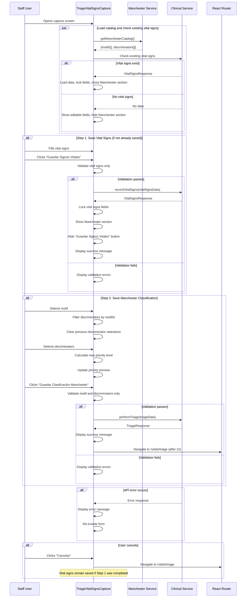

# Design Document: Integrated Manchester Triage

## Overview

This design document specifies the technical implementation for integrating Manchester Triage System classification directly into the vital signs capture screen using a **two-step progressive workflow**. The integration enables staff to complete both vital signs capture and Manchester classification in the same screen through a sequential process with independent save operations at each step.

### Current State

The existing `TriageVitalSignsCapture` component (`frontend-medflow/src/pages/vitals/TriageVitalSignsCapture.tsx`) provides:
- Patient information display with speech synthesis call functionality
- Vital signs form with 8 fields (6 required, 2 optional)
- Form validation and submission to `recordVitalSigns` API
- Navigation back to pending triage list after successful save

### Target State

The enhanced component will implement a **two-step progressive workflow**:

**Step 1: Vital Signs Capture**
- Display editable vital signs form
- "Guardar Signos Vitales" button (only visible if vital signs not saved)
- On save: lock vital signs fields, reveal Manchester section, hide Step 1 button
- Appointment status changes to "Signos vitales registrados"

**Step 2: Manchester Classification**
- Manchester section hidden until Step 1 complete
- Motif selection dropdown and discriminator checkboxes
- Real-time priority level calculation and preview
- "Guardar Clasificación Manchester" button (only visible after Step 1)
- On save: complete triage, navigate to pending list
- Appointment moves to doctor queue

**Resume Capability:**
- On component mount, check if vital signs already exist
- If exist: load data, lock fields, show Manchester section, hide Step 1 button
- If not exist: show editable fields, hide Manchester section

### Key Design Decisions

1. **Two-Step Progressive Workflow**: Separate save operations for vital signs and Manchester classification, allowing staff to save progress at each step and resume incomplete sessions.

2. **Conditional UI Visibility**: Manchester classification section is hidden until vital signs are saved, enforcing the correct workflow sequence.

3. **Vital Signs Locking**: Once saved, vital signs fields become read-only to prevent modification, ensuring data integrity.

4. **Independent Buttons**: Two separate submit buttons ("Guardar Signos Vitales" and "Guardar Clasificación Manchester") with conditional visibility based on workflow state.

5. **State-Based Rendering**: Component state tracks whether vital signs are saved (`vitalSignsSaved` flag) to control UI visibility and field editability.

6. **Resume Support**: On mount, fetch existing vital signs if available and initialize component in appropriate state (Step 1 or Step 2).

7. **Client-Side Priority Calculation**: Calculate the highest priority level from selected discriminators on the client side for immediate preview.

8. **Parallel Catalog Fetch**: Load motifs and discriminators in parallel using `Promise.all` to minimize initial loading time.

9. **State Management**: Use React hooks (`useState`, `useEffect`, `useCallback`) for local component state rather than introducing global state management.

## Architecture

### Component Structure

```
TriageVitalSignsCapture (Enhanced)
├── Patient Information Card
│   ├── Patient Details Display
│   └── Call Patient Button (Speech Synthesis)
├── Vital Signs Form Section (Step 1)
│   ├── 8 Input Fields (editable until saved)
│   ├── Field Validation
│   ├── "Guardar Signos Vitales" Button (hidden after save)
│   └── Success Message (after save)
└── Manchester Classification Section (Step 2 - hidden until Step 1 complete)
    ├── Motif Selection Dropdown
    ├── Discriminator Selection Area
    │   ├── Filtered Discriminator List
    │   └── Checkbox Selection UI
    ├── Priority Level Preview
    │   ├── Color-Coded Badge
    │   └── Description Text
    └── "Guardar Clasificación Manchester" Button
```

### Data Flow



### State Management

The component will manage the following state:

```typescript
// Existing state (preserved)
const [patient, setPatient] = useState<PatientResponse | null>(null);
const [loading, setLoading] = useState(true);
const [error, setError] = useState<string | null>(null);
const [form, setForm] = useState<VitalForm>(emptyForm);

// New state for two-step workflow control
const [vitalSignsSaved, setVitalSignsSaved] = useState(false); // Controls Step 1 completion
const [vitalSignsLocked, setVitalSignsLocked] = useState(false); // Controls field editability
const [savingVitalSigns, setSavingVitalSigns] = useState(false); // Step 1 submission state
const [vitalSignsError, setVitalSignsError] = useState<string | null>(null); // Step 1 errors
const [vitalSignsSuccess, setVitalSignsSuccess] = useState(false); // Step 1 success message

// New state for Manchester classification (Step 2)
const [catalogLoading, setCatalogLoading] = useState(true);
const [catalogError, setCatalogError] = useState<string | null>(null);
const [motifs, setMotifs] = useState<ManchesterMotif[]>([]);
const [discriminators, setDiscriminators] = useState<ManchesterDiscriminator[]>([]);
const [selectedMotifId, setSelectedMotifId] = useState<string>('');
const [selectedDiscriminatorIds, setSelectedDiscriminatorIds] = useState<string[]>([]);
const [calculatedPriority, setCalculatedPriority] = useState<{
  level: 'RED' | 'ORANGE' | 'YELLOW' | 'GREEN' | 'BLUE' | null;
  description: string;
} | null>(null);

// Step 2 submission state
const [savingTriage, setSavingTriage] = useState(false);
const [triageError, setTriageError] = useState<string | null>(null);
const [triageSuccess, setTriageSuccess] = useState(false);
```

### UI Visibility Logic

```typescript
// Step 1 button visibility
const showVitalSignsButton = !vitalSignsSaved && !triageSuccess;

// Manchester section visibility
const showManchesterSection = vitalSignsSaved;

// Step 2 button visibility
const showTriageButton = vitalSignsSaved && !triageSuccess;

// Field editability
const vitalSignsFieldsDisabled = vitalSignsLocked || savingVitalSigns;

// Cancel button state
const cancelDisabled = savingVitalSigns || savingTriage;
```

## Components and Interfaces

### Enhanced Component Interface

```typescript
// Component props (unchanged - uses location.state)
interface LocationState {
  appointmentId: string;
  patientId: string;
}

// Vital signs form (unchanged)
interface VitalForm {
  systolicPressure: string;
  diastolicPressure: string;
  heartRate: string;
  respiratoryRate: string;
  temperature: string;
  oxygenSaturation: string;
  weight: string;
  height: string;
}

// Priority level mapping (new)
interface PriorityInfo {
  level: 'RED' | 'ORANGE' | 'YELLOW' | 'GREEN' | 'BLUE';
  description: string;
  color: string;
  bgColor: string;
}

const PRIORITY_MAP: Record<string, PriorityInfo> = {
  RED: {
    level: 'RED',
    description: 'Inmediato',
    color: 'text-red-800',
    bgColor: 'bg-red-100 border-red-300'
  },
  ORANGE: {
    level: 'ORANGE',
    description: 'Muy urgente',
    color: 'text-orange-800',
    bgColor: 'bg-orange-100 border-orange-300'
  },
  YELLOW: {
    level: 'YELLOW',
    description: 'Urgente',
    color: 'text-yellow-800',
    bgColor: 'bg-yellow-100 border-yellow-300'
  },
  GREEN: {
    level: 'GREEN',
    description: 'Poco urgente',
    color: 'text-green-800',
    bgColor: 'bg-green-100 border-green-300'
  },
  BLUE: {
    level: 'BLUE',
    description: 'No urgente',
    color: 'text-blue-800',
    bgColor: 'bg-blue-100 border-blue-300'
  }
};
```

### Service Interfaces (Existing)

```typescript
// From manchesterService.ts
interface ManchesterCatalog {
  motifs: ManchesterMotif[];
  discriminators: ManchesterDiscriminator[];
}

interface ManchesterMotif {
  id: string;
  code: string;
  description: string;
  category: string;
  active: boolean;
}

interface ManchesterDiscriminator {
  id: string;
  code: string;
  description: string;
  priorityLevel: 'RED' | 'ORANGE' | 'YELLOW' | 'GREEN' | 'BLUE';
  motifId: string | null;
  active: boolean;
}

// From clinicalService.ts
interface VitalSignsRequest {
  appointmentId: string;
  patientId: string;
  systolicPressure: number;
  diastolicPressure: number;
  heartRate: number;
  respiratoryRate: number;
  temperature: number;
  oxygenSaturation: number;
  weight?: number;
  height?: number;
}

interface TriageRequest {
  appointmentId: string;
  patientId: string;
  motifId: string;
  discriminatorIds: string[];
}
```

## Data Models

### Component State Model

```typescript
interface TriageVitalSignsCaptureState {
  // Patient data
  patient: PatientResponse | null;
  loading: boolean;
  error: string | null;
  
  // Vital signs form (Step 1)
  form: VitalForm;
  vitalSignsSaved: boolean;        // Flag: Step 1 complete
  vitalSignsLocked: boolean;       // Flag: Fields read-only
  savingVitalSigns: boolean;       // Flag: Step 1 submission in progress
  vitalSignsError: string | null;  // Step 1 error message
  vitalSignsSuccess: boolean;      // Flag: Step 1 success message visible
  
  // Manchester catalog
  catalogLoading: boolean;
  catalogError: string | null;
  motifs: ManchesterMotif[];
  discriminators: ManchesterDiscriminator[];
  
  // Manchester selection (Step 2)
  selectedMotifId: string;
  selectedDiscriminatorIds: string[];
  calculatedPriority: {
    level: 'RED' | 'ORANGE' | 'YELLOW' | 'GREEN' | 'BLUE' | null;
    description: string;
  } | null;
  
  // Step 2 submission state
  savingTriage: boolean;           // Flag: Step 2 submission in progress
  triageError: string | null;      // Step 2 error message
  triageSuccess: boolean;          // Flag: Step 2 success message visible
}
```

### Derived Data

```typescript
// Filtered discriminators based on selected motif
const filteredDiscriminators = useMemo(() => {
  if (!selectedMotifId) return [];
  return discriminators.filter(d => d.motifId === selectedMotifId && d.active);
}, [discriminators, selectedMotifId]);

// Sorted motifs for dropdown
const sortedMotifs = useMemo(() => {
  return [...motifs]
    .filter(m => m.active)
    .sort((a, b) => a.description.localeCompare(b.description, 'es'));
}, [motifs]);
```

## Correctness Properties

*A property is a characteristic or behavior that should hold true across all valid executions of a system—essentially, a formal statement about what the system should do. Properties serve as the bridge between human-readable specifications and machine-verifiable correctness guarantees.*

### Property Reflection

After analyzing all acceptance criteria, I identified the following properties suitable for property-based testing. Many UI-specific criteria (rendering, layout, styling) are better suited for example-based tests or snapshot tests. The properties below focus on core logic that should hold across all inputs:

**Redundancy Analysis:**
- Properties related to validation (vital signs validation, Manchester validation) are kept separate as they validate different steps
- Properties related to UI visibility are combined where they share the same underlying state logic
- Properties 7.3 and 7.4 (color and description mapping) can be combined into a single priority display property

**New Properties for Two-Step Workflow:**
- State transition properties ensure correct workflow progression
- Field locking properties ensure data integrity after Step 1
- UI visibility properties ensure correct conditional rendering

### Property 1: Active Motif Filtering

*For any* Manchester catalog containing both active and inactive motifs, the motif dropdown SHALL display only motifs where `active === true`, sorted alphabetically by description.

**Validates: Requirements 4.1, 4.3**

### Property 2: Discriminator Filtering by Motif

*For any* selected motif and Manchester catalog, the displayed discriminators SHALL include only discriminators where `motifId === selectedMotifId` AND `active === true`.

**Validates: Requirements 5.1**

### Property 3: Discriminator Selection Clearing

*For any* sequence of motif selections, when the selected motif changes from motif A to motif B, all previously selected discriminator IDs SHALL be cleared from the selection state.

**Validates: Requirements 5.4**

### Property 4: Maximum Priority Calculation

*For any* non-empty set of selected discriminators, the calculated priority level SHALL equal the highest priority level among the selected discriminators, where priority ordering is: RED > ORANGE > YELLOW > GREEN > BLUE.

**Validates: Requirements 7.1**

### Property 5: Priority Display Mapping

*For any* priority level (RED, ORANGE, YELLOW, GREEN, BLUE), the priority preview SHALL display the correct color class and description text according to the PRIORITY_MAP.

**Validates: Requirements 7.3, 7.4**

### Property 6: Step 1 Validation Completeness

*For any* vital signs form state, Step 1 validation SHALL fail if and only if any required vital signs field is empty or outside its valid range.

**Validates: Requirements 9.1**

### Property 7: Step 2 Validation Completeness

*For any* Manchester selection state, Step 2 validation SHALL fail if and only if: (1) no motif is selected, OR (2) no discriminators are selected.

**Validates: Requirements 10.1, 10.2**

### Property 8: Vital Signs Validation Rules

*For any* vital signs input values, the validation SHALL enforce: systolic pressure [50-250], diastolic pressure [30-150], heart rate [20-300], respiratory rate [5-60], temperature [30-45], oxygen saturation [50-100], and optional weight [1-300], height [30-250].

**Validates: Requirements 2.2**

### Property 9: Manchester Section Visibility

*For any* component state, the Manchester classification section SHALL be visible if and only if `vitalSignsSaved === true`.

**Validates: Requirements 3.1, 3.2**

### Property 10: Step 1 Button Visibility

*For any* component state, the "Guardar Signos Vitales" button SHALL be visible if and only if `vitalSignsSaved === false` AND `triageSuccess === false`.

**Validates: Requirements 8.1, 8.2, 9.6**

### Property 11: Step 2 Button Visibility

*For any* component state, the "Guardar Clasificación Manchester" button SHALL be visible if and only if `vitalSignsSaved === true` AND `triageSuccess === false`.

**Validates: Requirements 8.3**

### Property 12: Vital Signs Field Editability

*For any* component state, vital signs input fields SHALL be disabled if and only if `vitalSignsLocked === true` OR `savingVitalSigns === true`.

**Validates: Requirements 2.6, 9.4**

### Property 13: Form Data Preservation on Error

*For any* form state, if an API error occurs during Step 1 or Step 2 submission, all form field values and Manchester selections SHALL remain unchanged in component state.

**Validates: Requirements 11.4**

### Property 14: Error Message Extraction

*For any* API error response, the extracted error message SHALL be a user-friendly string (not a raw error object or stack trace).

**Validates: Requirements 11.5**

### Property 15: State Initialization from Existing Vital Signs

*For any* existing vital signs data loaded on mount, the component state SHALL set: (1) form fields populated with existing values, (2) `vitalSignsSaved === true`, (3) `vitalSignsLocked === true`, (4) Manchester section visible.

**Validates: Requirements 12.2, 12.3, 12.4, 12.5**

## Error Handling

### Error Categories

1. **Catalog Loading Errors**
   - Network failure during Manchester catalog fetch
   - Backend service unavailable
   - Malformed catalog response

2. **Existing Vital Signs Loading Errors**
   - Network failure during vital signs fetch
   - Backend service unavailable
   - Malformed response

3. **Step 1 Validation Errors**
   - Missing required vital signs fields
   - Out-of-range vital signs values

4. **Step 2 Validation Errors**
   - No motif selected
   - No discriminators selected

5. **Step 1 Submission Errors**
   - Vital signs recording failure
   - Network timeout
   - Backend validation errors

6. **Step 2 Submission Errors**
   - Triage classification failure
   - Network timeout
   - Backend validation errors

### Error Handling Strategy

```typescript
// Component mount: Load catalog and check existing vital signs
useEffect(() => {
  const initializeComponent = async () => {
    try {
      setLoading(true);
      setError(null);
      
      // Load Manchester catalog
      setCatalogLoading(true);
      const catalog = await getManchesterCatalog();
      setMotifs(catalog.motifs);
      setDiscriminators(catalog.discriminators);
      setCatalogLoading(false);
      
      // Check if vital signs already exist
      try {
        const existingVitalSigns = await getVitalSignsByAppointment(appointmentId);
        
        if (existingVitalSigns) {
          // Load existing data
          setForm({
            systolicPressure: String(existingVitalSigns.systolicPressure),
            diastolicPressure: String(existingVitalSigns.diastolicPressure),
            heartRate: String(existingVitalSigns.heartRate),
            respiratoryRate: String(existingVitalSigns.respiratoryRate),
            temperature: String(existingVitalSigns.temperature),
            oxygenSaturation: String(existingVitalSigns.oxygenSaturation),
            weight: existingVitalSigns.weight ? String(existingVitalSigns.weight) : '',
            height: existingVitalSigns.height ? String(existingVitalSigns.height) : '',
          });
          
          // Set flags for Step 1 complete
          setVitalSignsSaved(true);
          setVitalSignsLocked(true);
        }
      } catch (vitalSignsErr) {
        // If 404, no vital signs exist yet - this is expected
        if (vitalSignsErr.response?.status !== 404) {
          console.error('Error loading existing vital signs:', vitalSignsErr);
          // Don't block the UI, just log the error
        }
      }
      
    } catch (err) {
      console.error('Error initializing component:', err);
      setError(extractErrorMessage(err));
    } finally {
      setLoading(false);
    }
  };
  
  if (appointmentId && patientId) {
    initializeComponent();
  }
}, [appointmentId, patientId]);

// Step 1: Validate vital signs only
const validateVitalSigns = (): { valid: boolean; errors: string[] } => {
  const errors: string[] = [];
  
  if (!form.systolicPressure || Number(form.systolicPressure) < 50 || Number(form.systolicPressure) > 250) {
    errors.push('Presión sistólica debe estar entre 50 y 250 mmHg');
  }
  if (!form.diastolicPressure || Number(form.diastolicPressure) < 30 || Number(form.diastolicPressure) > 150) {
    errors.push('Presión diastólica debe estar entre 30 y 150 mmHg');
  }
  if (!form.heartRate || Number(form.heartRate) < 20 || Number(form.heartRate) > 300) {
    errors.push('Frecuencia cardíaca debe estar entre 20 y 300 lpm');
  }
  if (!form.respiratoryRate || Number(form.respiratoryRate) < 5 || Number(form.respiratoryRate) > 60) {
    errors.push('Frecuencia respiratoria debe estar entre 5 y 60 rpm');
  }
  if (!form.temperature || Number(form.temperature) < 30 || Number(form.temperature) > 45) {
    errors.push('Temperatura debe estar entre 30 y 45 °C');
  }
  if (!form.oxygenSaturation || Number(form.oxygenSaturation) < 50 || Number(form.oxygenSaturation) > 100) {
    errors.push('Saturación de oxígeno debe estar entre 50 y 100%');
  }
  
  return { valid: errors.length === 0, errors };
};

// Step 1: Submit vital signs
const handleSaveVitalSigns = async (e: FormEvent) => {
  e.preventDefault();
  if (!patient || !appointmentId) return;
  
  // Validate vital signs only
  const validation = validateVitalSigns();
  if (!validation.valid) {
    setVitalSignsError(validation.errors.join('. '));
    return;
  }
  
  setSavingVitalSigns(true);
  setVitalSignsError(null);
  setVitalSignsSuccess(false);
  
  try {
    await recordVitalSigns({
      appointmentId,
      patientId: patient.id,
      systolicPressure: Number(form.systolicPressure),
      diastolicPressure: Number(form.diastolicPressure),
      heartRate: Number(form.heartRate),
      respiratoryRate: Number(form.respiratoryRate),
      temperature: Number(form.temperature),
      oxygenSaturation: Number(form.oxygenSaturation),
      weight: form.weight ? Number(form.weight) : undefined,
      height: form.height ? Number(form.height) : undefined,
    });
    
    // Success: Lock fields, show Manchester section
    setVitalSignsSaved(true);
    setVitalSignsLocked(true);
    setVitalSignsSuccess(true);
    
  } catch (err) {
    console.error('Error recording vital signs:', err);
    setVitalSignsError(extractErrorMessage(err));
  } finally {
    setSavingVitalSigns(false);
  }
};

// Step 2: Validate Manchester selection only
const validateManchesterSelection = (): { valid: boolean; errors: string[] } => {
  const errors: string[] = [];
  
  if (!selectedMotifId) {
    errors.push('Debe seleccionar un motivo de consulta');
  }
  if (selectedDiscriminatorIds.length === 0) {
    errors.push('Debe seleccionar al menos un discriminador');
  }
  
  return { valid: errors.length === 0, errors };
};

// Step 2: Submit triage classification
const handleSaveTriage = async (e: FormEvent) => {
  e.preventDefault();
  if (!patient || !appointmentId) return;
  
  // Validate Manchester selection only
  const validation = validateManchesterSelection();
  if (!validation.valid) {
    setTriageError(validation.errors.join('. '));
    return;
  }
  
  setSavingTriage(true);
  setTriageError(null);
  setTriageSuccess(false);
  
  try {
    await performTriage({
      appointmentId,
      patientId: patient.id,
      motifId: selectedMotifId,
      discriminatorIds: selectedDiscriminatorIds,
    });
    
    // Success: Show message and navigate
    setTriageSuccess(true);
    
    setTimeout(() => {
      navigate('/vitals/triage');
    }, 2000);
    
  } catch (err) {
    console.error('Error performing triage:', err);
    setTriageError(extractErrorMessage(err));
  } finally {
    setSavingTriage(false);
  }
};
```

### Error Display

```typescript
// Catalog error display
{catalogError && (
  <div className="bg-red-50 border border-red-200 rounded-lg p-4">
    <p className="text-red-800 font-semibold">Error al cargar catálogo Manchester</p>
    <p className="text-red-700 text-sm mt-1">{catalogError}</p>
    <button
      onClick={() => window.location.reload()}
      className="mt-3 px-4 py-2 bg-red-600 text-white rounded-lg hover:bg-red-700"
    >
      Reintentar
    </button>
  </div>
)}

// Step 1 success message
{vitalSignsSuccess && (
  <div className="bg-green-50 border border-green-200 rounded-lg p-4">
    <p className="text-green-800 font-semibold">✓ Signos vitales guardados exitosamente</p>
    <p className="text-green-700 text-sm mt-1">Ahora puede completar la clasificación Manchester</p>
  </div>
)}

// Step 1 error display
{vitalSignsError && (
  <div className="bg-red-50 border border-red-200 rounded-lg p-4">
    <p className="text-red-800 font-semibold">Error al guardar signos vitales</p>
    <p className="text-red-700 text-sm mt-1">{vitalSignsError}</p>
  </div>
)}

// Step 2 success message
{triageSuccess && (
  <div className="bg-green-50 border border-green-200 rounded-lg p-4">
    <p className="text-green-800 font-semibold">✓ Clasificación Manchester registrada exitosamente</p>
    <p className="text-green-700 text-sm mt-1">Redirigiendo a Triaje Pendiente...</p>
  </div>
)}

// Step 2 error display
{triageError && (
  <div className="bg-red-50 border border-red-200 rounded-lg p-4">
    <p className="text-red-800 font-semibold">Error al guardar clasificación Manchester</p>
    <p className="text-red-700 text-sm mt-1">{triageError}</p>
  </div>
)}
```

## Testing Strategy

### Dual Testing Approach

This feature requires both **unit tests** and **property-based tests** for comprehensive coverage:

- **Unit tests**: Verify specific examples, UI rendering, component lifecycle, and integration points
- **Property tests**: Verify universal properties across all inputs (filtering, validation, calculation logic)

### Unit Testing

**Focus Areas:**
1. **Component Rendering**
   - Patient information card displays correctly
   - Vital signs form renders all fields
   - Manchester classification section is hidden initially
   - Manchester classification section appears after Step 1 complete
   - Loading states display appropriately
   - Error states display appropriately

2. **Two-Step Workflow**
   - "Guardar Signos Vitales" button visible initially
   - "Guardar Signos Vitales" button hidden after Step 1 complete
   - Vital signs fields become read-only after Step 1 complete
   - Manchester section appears after Step 1 complete
   - "Guardar Clasificación Manchester" button visible only after Step 1 complete
   - Success messages display for each step

3. **Resume Capability**
   - Component loads existing vital signs on mount if available
   - Existing vital signs populate form fields
   - Fields are locked when existing vital signs loaded
   - Manchester section is visible when existing vital signs loaded
   - Step 1 button is hidden when existing vital signs loaded

4. **User Interactions**
   - Form field changes update state (when not locked)
   - Motif selection triggers discriminator filtering
   - Discriminator checkbox selection updates state
   - Step 1 submit button triggers validation and submission
   - Step 2 submit button triggers validation and submission
   - Cancel button navigates back

5. **API Integration**
   - Manchester catalog is fetched on mount
   - Existing vital signs are checked on mount
   - recordVitalSigns is called with correct data (Step 1)
   - performTriage is called with correct data (Step 2)
   - API errors are handled gracefully for each step

6. **Edge Cases**
   - Empty catalog (no motifs or discriminators)
   - Motif with no associated discriminators
   - API timeout scenarios
   - Network failure scenarios
   - 404 response when no existing vital signs (expected)

**Example Unit Tests:**

```typescript
describe('TriageVitalSignsCapture - Two-Step Workflow', () => {
  it('should hide Manchester section initially', async () => {
    const mockCatalog = { motifs: [...], discriminators: [...] };
    jest.spyOn(manchesterService, 'getManchesterCatalog').mockResolvedValue(mockCatalog);
    jest.spyOn(clinicalService, 'getVitalSignsByAppointment').mockRejectedValue({ response: { status: 404 } });
    
    const { queryByText } = render(<TriageVitalSignsCapture />);
    
    await waitFor(() => expect(queryByText('Cargando...')).not.toBeInTheDocument());
    
    expect(queryByText('Motivo de consulta')).not.toBeInTheDocument();
    expect(queryByText('Guardar Signos Vitales')).toBeInTheDocument();
  });
  
  it('should show Manchester section after saving vital signs', async () => {
    const mockCatalog = { motifs: [...], discriminators: [...] };
    const mockVitalSignsResponse = { id: 'vs1', ... };
    
    jest.spyOn(manchesterService, 'getManchesterCatalog').mockResolvedValue(mockCatalog);
    jest.spyOn(clinicalService, 'getVitalSignsByAppointment').mockRejectedValue({ response: { status: 404 } });
    jest.spyOn(clinicalService, 'recordVitalSigns').mockResolvedValue(mockVitalSignsResponse);
    
    const { getByText, getByLabelText, queryByText } = render(<TriageVitalSignsCapture />);
    
    await waitFor(() => expect(queryByText('Cargando...')).not.toBeInTheDocument());
    
    // Fill vital signs
    fireEvent.change(getByLabelText(/Sist\./), { target: { value: '120' } });
    fireEvent.change(getByLabelText(/Diast\./), { target: { value: '80' } });
    // ... fill other fields
    
    // Submit Step 1
    fireEvent.click(getByText('Guardar Signos Vitales'));
    
    await waitFor(() => {
      expect(clinicalService.recordVitalSigns).toHaveBeenCalled();
      expect(queryByText('Motivo de consulta')).toBeInTheDocument();
      expect(queryByText('Guardar Signos Vitales')).not.toBeInTheDocument();
      expect(queryByText('Guardar Clasificación Manchester')).toBeInTheDocument();
    });
  });
  
  it('should lock vital signs fields after saving', async () => {
    const mockCatalog = { motifs: [...], discriminators: [...] };
    const mockVitalSignsResponse = { id: 'vs1', ... };
    
    jest.spyOn(manchesterService, 'getManchesterCatalog').mockResolvedValue(mockCatalog);
    jest.spyOn(clinicalService, 'getVitalSignsByAppointment').mockRejectedValue({ response: { status: 404 } });
    jest.spyOn(clinicalService, 'recordVitalSigns').mockResolvedValue(mockVitalSignsResponse);
    
    const { getByText, getByLabelText } = render(<TriageVitalSignsCapture />);
    
    await waitFor(() => expect(queryByText('Cargando...')).not.toBeInTheDocument());
    
    const systolicInput = getByLabelText(/Sist\./) as HTMLInputElement;
    
    // Initially editable
    expect(systolicInput.disabled).toBe(false);
    
    // Fill and submit
    fireEvent.change(systolicInput, { target: { value: '120' } });
    // ... fill other fields
    fireEvent.click(getByText('Guardar Signos Vitales'));
    
    await waitFor(() => {
      expect(systolicInput.disabled).toBe(true);
    });
  });
  
  it('should load existing vital signs and show Manchester section', async () => {
    const mockCatalog = { motifs: [...], discriminators: [...] };
    const mockExistingVitalSigns = {
      id: 'vs1',
      systolicPressure: 120,
      diastolicPressure: 80,
      heartRate: 72,
      respiratoryRate: 16,
      temperature: 36.5,
      oxygenSaturation: 98,
      weight: 70,
      height: 170
    };
    
    jest.spyOn(manchesterService, 'getManchesterCatalog').mockResolvedValue(mockCatalog);
    jest.spyOn(clinicalService, 'getVitalSignsByAppointment').mockResolvedValue(mockExistingVitalSigns);
    
    const { getByLabelText, queryByText } = render(<TriageVitalSignsCapture />);
    
    await waitFor(() => {
      expect(queryByText('Cargando...')).not.toBeInTheDocument();
      
      // Fields populated
      expect((getByLabelText(/Sist\./) as HTMLInputElement).value).toBe('120');
      expect((getByLabelText(/Diast\./) as HTMLInputElement).value).toBe('80');
      
      // Fields locked
      expect((getByLabelText(/Sist\./) as HTMLInputElement).disabled).toBe(true);
      
      // Manchester section visible
      expect(queryByText('Motivo de consulta')).toBeInTheDocument();
      
      // Step 1 button hidden
      expect(queryByText('Guardar Signos Vitales')).not.toBeInTheDocument();
      
      // Step 2 button visible
      expect(queryByText('Guardar Clasificación Manchester')).toBeInTheDocument();
    });
  });
  
  it('should submit triage classification after Step 1 complete', async () => {
    const mockCatalog = {
      motifs: [{ id: 'm1', description: 'Chest Pain', active: true, ... }],
      discriminators: [
        { id: 'd1', motifId: 'm1', description: 'Severe pain', priorityLevel: 'ORANGE', active: true, ... }
      ]
    };
    const mockTriageResponse = { id: 't1', priorityLevel: 'ORANGE', ... };
    
    jest.spyOn(manchesterService, 'getManchesterCatalog').mockResolvedValue(mockCatalog);
    jest.spyOn(clinicalService, 'getVitalSignsByAppointment').mockResolvedValue({ id: 'vs1', ... });
    jest.spyOn(clinicalService, 'performTriage').mockResolvedValue(mockTriageResponse);
    
    const { getByText, getByLabelText } = render(<TriageVitalSignsCapture />);
    
    await waitFor(() => expect(queryByText('Cargando...')).not.toBeInTheDocument());
    
    // Select motif and discriminator
    fireEvent.change(getByLabelText('Motivo de consulta'), { target: { value: 'm1' } });
    fireEvent.click(getByLabelText('Severe pain'));
    
    // Submit Step 2
    fireEvent.click(getByText('Guardar Clasificación Manchester'));
    
    await waitFor(() => {
      expect(clinicalService.performTriage).toHaveBeenCalledWith({
        appointmentId: expect.any(String),
        patientId: expect.any(String),
        motifId: 'm1',
        discriminatorIds: ['d1']
      });
    });
  });
  
  it('should validate only vital signs on Step 1 submit', async () => {
    const mockCatalog = { motifs: [...], discriminators: [...] };
    
    jest.spyOn(manchesterService, 'getManchesterCatalog').mockResolvedValue(mockCatalog);
    jest.spyOn(clinicalService, 'getVitalSignsByAppointment').mockRejectedValue({ response: { status: 404 } });
    
    const { getByText, queryByText } = render(<TriageVitalSignsCapture />);
    
    await waitFor(() => expect(queryByText('Cargando...')).not.toBeInTheDocument());
    
    // Submit without filling vital signs
    fireEvent.click(getByText('Guardar Signos Vitales'));
    
    await waitFor(() => {
      expect(queryByText(/Presión sistólica/)).toBeInTheDocument();
      expect(clinicalService.recordVitalSigns).not.toHaveBeenCalled();
    });
  });
  
  it('should validate only Manchester selection on Step 2 submit', async () => {
    const mockCatalog = { motifs: [...], discriminators: [...] };
    
    jest.spyOn(manchesterService, 'getManchesterCatalog').mockResolvedValue(mockCatalog);
    jest.spyOn(clinicalService, 'getVitalSignsByAppointment').mockResolvedValue({ id: 'vs1', ... });
    
    const { getByText, queryByText } = render(<TriageVitalSignsCapture />);
    
    await waitFor(() => expect(queryByText('Cargando...')).not.toBeInTheDocument());
    
    // Submit without selecting motif/discriminators
    fireEvent.click(getByText('Guardar Clasificación Manchester'));
    
    await waitFor(() => {
      expect(queryByText(/Debe seleccionar un motivo/)).toBeInTheDocument();
      expect(clinicalService.performTriage).not.toHaveBeenCalled();
    });
  });
});
```

### Property-Based Testing

**Property Test Library:** `fast-check` (JavaScript/TypeScript property-based testing library)

**Configuration:** Minimum 100 iterations per property test

**Property Test Implementation:**

```typescript
import fc from 'fast-check';

describe('Manchester Triage Properties', () => {
  /**
   * Feature: integrated-manchester-triage, Property 1: Active Motif Filtering
   * For any Manchester catalog containing both active and inactive motifs,
   * the motif dropdown SHALL display only motifs where active === true,
   * sorted alphabetically by description.
   */
  it('should filter and sort active motifs', () => {
    fc.assert(
      fc.property(
        fc.array(fc.record({
          id: fc.uuid(),
          code: fc.string(),
          description: fc.string({ minLength: 1 }),
          category: fc.string(),
          active: fc.boolean()
        })),
        (motifs) => {
          const result = filterAndSortMotifs(motifs);
          
          // All results must be active
          expect(result.every(m => m.active)).toBe(true);
          
          // Results must be sorted alphabetically
          for (let i = 1; i < result.length; i++) {
            expect(result[i].description.localeCompare(result[i-1].description, 'es')).toBeGreaterThanOrEqual(0);
          }
        }
      ),
      { numRuns: 100 }
    );
  });
  
  /**
   * Feature: integrated-manchester-triage, Property 4: Maximum Priority Calculation
   * For any non-empty set of selected discriminators, the calculated priority level
   * SHALL equal the highest priority level among the selected discriminators.
   */
  it('should calculate maximum priority level', () => {
    const priorityOrder = ['RED', 'ORANGE', 'YELLOW', 'GREEN', 'BLUE'];
    
    fc.assert(
      fc.property(
        fc.array(
          fc.record({
            id: fc.uuid(),
            priorityLevel: fc.constantFrom('RED', 'ORANGE', 'YELLOW', 'GREEN', 'BLUE')
          }),
          { minLength: 1 }
        ),
        (discriminators) => {
          const result = calculateMaxPriority(discriminators);
          
          // Find expected max priority
          const expectedMax = discriminators.reduce((max, d) => {
            const maxIndex = priorityOrder.indexOf(max);
            const dIndex = priorityOrder.indexOf(d.priorityLevel);
            return dIndex < maxIndex ? d.priorityLevel : max;
          }, 'BLUE');
          
          expect(result).toBe(expectedMax);
        }
      ),
      { numRuns: 100 }
    );
  });
  
  /**
   * Feature: integrated-manchester-triage, Property 6: Step 1 Validation Completeness
   * For any vital signs form state, Step 1 validation SHALL fail if and only if
   * any required vital signs field is empty or outside its valid range.
   */
  it('should validate Step 1 vital signs completeness', () => {
    fc.assert(
      fc.property(
        fc.record({
          systolicPressure: fc.option(fc.integer({ min: 0, max: 300 })),
          diastolicPressure: fc.option(fc.integer({ min: 0, max: 200 })),
          heartRate: fc.option(fc.integer({ min: 0, max: 400 })),
          respiratoryRate: fc.option(fc.integer({ min: 0, max: 100 })),
          temperature: fc.option(fc.float({ min: 20, max: 50 })),
          oxygenSaturation: fc.option(fc.integer({ min: 0, max: 100 }))
        }),
        (vitalSigns) => {
          const validation = validateVitalSigns(vitalSigns);
          
          const hasInvalidVitalSigns = 
            !vitalSigns.systolicPressure || vitalSigns.systolicPressure < 50 || vitalSigns.systolicPressure > 250 ||
            !vitalSigns.diastolicPressure || vitalSigns.diastolicPressure < 30 || vitalSigns.diastolicPressure > 150 ||
            !vitalSigns.heartRate || vitalSigns.heartRate < 20 || vitalSigns.heartRate > 300 ||
            !vitalSigns.respiratoryRate || vitalSigns.respiratoryRate < 5 || vitalSigns.respiratoryRate > 60 ||
            !vitalSigns.temperature || vitalSigns.temperature < 30 || vitalSigns.temperature > 45 ||
            !vitalSigns.oxygenSaturation || vitalSigns.oxygenSaturation < 50 || vitalSigns.oxygenSaturation > 100;
          
          expect(validation.valid).toBe(!hasInvalidVitalSigns);
        }
      ),
      { numRuns: 100 }
    );
  });
  
  /**
   * Feature: integrated-manchester-triage, Property 7: Step 2 Validation Completeness
   * For any Manchester selection state, Step 2 validation SHALL fail if and only if:
   * (1) no motif is selected, OR (2) no discriminators are selected.
   */
  it('should validate Step 2 Manchester selection completeness', () => {
    fc.assert(
      fc.property(
        fc.record({
          motifId: fc.option(fc.uuid()),
          discriminatorIds: fc.array(fc.uuid())
        }),
        (manchesterSelection) => {
          const validation = validateManchesterSelection(manchesterSelection);
          
          const hasNoMotif = !manchesterSelection.motifId;
          const hasNoDiscriminators = manchesterSelection.discriminatorIds.length === 0;
          
          const shouldFail = hasNoMotif || hasNoDiscriminators;
          
          expect(validation.valid).toBe(!shouldFail);
        }
      ),
      { numRuns: 100 }
    );
  });
  
  /**
   * Feature: integrated-manchester-triage, Property 8: Vital Signs Validation Rules
   * For any vital signs input values, the validation SHALL enforce correct ranges.
   */
  it('should enforce vital signs ranges', () => {
    fc.assert(
      fc.property(
        fc.record({
          systolicPressure: fc.integer({ min: -100, max: 400 }),
          diastolicPressure: fc.integer({ min: -100, max: 300 }),
          heartRate: fc.integer({ min: -50, max: 500 }),
          respiratoryRate: fc.integer({ min: -10, max: 150 }),
          temperature: fc.float({ min: 0, max: 60 }),
          oxygenSaturation: fc.integer({ min: -10, max: 150 })
        }),
        (vitalSigns) => {
          const validation = validateVitalSigns(vitalSigns);
          
          const isValid = 
            vitalSigns.systolicPressure >= 50 && vitalSigns.systolicPressure <= 250 &&
            vitalSigns.diastolicPressure >= 30 && vitalSigns.diastolicPressure <= 150 &&
            vitalSigns.heartRate >= 20 && vitalSigns.heartRate <= 300 &&
            vitalSigns.respiratoryRate >= 5 && vitalSigns.respiratoryRate <= 60 &&
            vitalSigns.temperature >= 30 && vitalSigns.temperature <= 45 &&
            vitalSigns.oxygenSaturation >= 50 && vitalSigns.oxygenSaturation <= 100;
          
          expect(validation.valid).toBe(isValid);
        }
      ),
      { numRuns: 100 }
    );
  });
  
  /**
   * Feature: integrated-manchester-triage, Property 9: Manchester Section Visibility
   * For any component state, the Manchester classification section SHALL be visible
   * if and only if vitalSignsSaved === true.
   */
  it('should control Manchester section visibility based on vitalSignsSaved flag', () => {
    fc.assert(
      fc.property(
        fc.record({
          vitalSignsSaved: fc.boolean(),
          triageSuccess: fc.boolean(),
          catalogLoading: fc.boolean()
        }),
        (state) => {
          const shouldShowManchesterSection = shouldShowManchester(state);
          
          expect(shouldShowManchesterSection).toBe(state.vitalSignsSaved);
        }
      ),
      { numRuns: 100 }
    );
  });
  
  /**
   * Feature: integrated-manchester-triage, Property 10: Step 1 Button Visibility
   * For any component state, the "Guardar Signos Vitales" button SHALL be visible
   * if and only if vitalSignsSaved === false AND triageSuccess === false.
   */
  it('should control Step 1 button visibility', () => {
    fc.assert(
      fc.property(
        fc.record({
          vitalSignsSaved: fc.boolean(),
          triageSuccess: fc.boolean()
        }),
        (state) => {
          const shouldShowButton = shouldShowVitalSignsButton(state);
          
          expect(shouldShowButton).toBe(!state.vitalSignsSaved && !state.triageSuccess);
        }
      ),
      { numRuns: 100 }
    );
  });
  
  /**
   * Feature: integrated-manchester-triage, Property 11: Step 2 Button Visibility
   * For any component state, the "Guardar Clasificación Manchester" button SHALL be visible
   * if and only if vitalSignsSaved === true AND triageSuccess === false.
   */
  it('should control Step 2 button visibility', () => {
    fc.assert(
      fc.property(
        fc.record({
          vitalSignsSaved: fc.boolean(),
          triageSuccess: fc.boolean()
        }),
        (state) => {
          const shouldShowButton = shouldShowTriageButton(state);
          
          expect(shouldShowButton).toBe(state.vitalSignsSaved && !state.triageSuccess);
        }
      ),
      { numRuns: 100 }
    );
  });
  
  /**
   * Feature: integrated-manchester-triage, Property 12: Vital Signs Field Editability
   * For any component state, vital signs input fields SHALL be disabled if and only if
   * vitalSignsLocked === true OR savingVitalSigns === true.
   */
  it('should control vital signs field editability', () => {
    fc.assert(
      fc.property(
        fc.record({
          vitalSignsLocked: fc.boolean(),
          savingVitalSigns: fc.boolean()
        }),
        (state) => {
          const shouldDisableFields = shouldDisableVitalSignsFields(state);
          
          expect(shouldDisableFields).toBe(state.vitalSignsLocked || state.savingVitalSigns);
        }
      ),
      { numRuns: 100 }
    );
  });
  
  /**
   * Feature: integrated-manchester-triage, Property 15: State Initialization from Existing Vital Signs
   * For any existing vital signs data loaded on mount, the component state SHALL set
   * appropriate flags and populate form fields.
   */
  it('should initialize state correctly from existing vital signs', () => {
    fc.assert(
      fc.property(
        fc.option(fc.record({
          systolicPressure: fc.integer({ min: 50, max: 250 }),
          diastolicPressure: fc.integer({ min: 30, max: 150 }),
          heartRate: fc.integer({ min: 20, max: 300 }),
          respiratoryRate: fc.integer({ min: 5, max: 60 }),
          temperature: fc.float({ min: 30, max: 45 }),
          oxygenSaturation: fc.integer({ min: 50, max: 100 })
        })),
        (existingVitalSigns) => {
          const initialState = initializeStateFromVitalSigns(existingVitalSigns);
          
          if (existingVitalSigns) {
            expect(initialState.vitalSignsSaved).toBe(true);
            expect(initialState.vitalSignsLocked).toBe(true);
            expect(initialState.form.systolicPressure).toBe(String(existingVitalSigns.systolicPressure));
            expect(initialState.form.diastolicPressure).toBe(String(existingVitalSigns.diastolicPressure));
          } else {
            expect(initialState.vitalSignsSaved).toBe(false);
            expect(initialState.vitalSignsLocked).toBe(false);
          }
        }
      ),
      { numRuns: 100 }
    );
  });
});
```

### Integration Testing

**Focus Areas:**
1. End-to-end workflow from component mount to successful submission
2. Real API integration (with test backend or mocked services)
3. Navigation flow verification
4. Performance testing (catalog load time, priority calculation responsiveness)

### Test Coverage Goals

- **Unit Test Coverage**: >80% code coverage
- **Property Test Coverage**: All 15 correctness properties implemented
- **Integration Test Coverage**: Complete happy path + major error scenarios
- **Two-Step Workflow Coverage**: All state transitions and UI visibility logic tested

