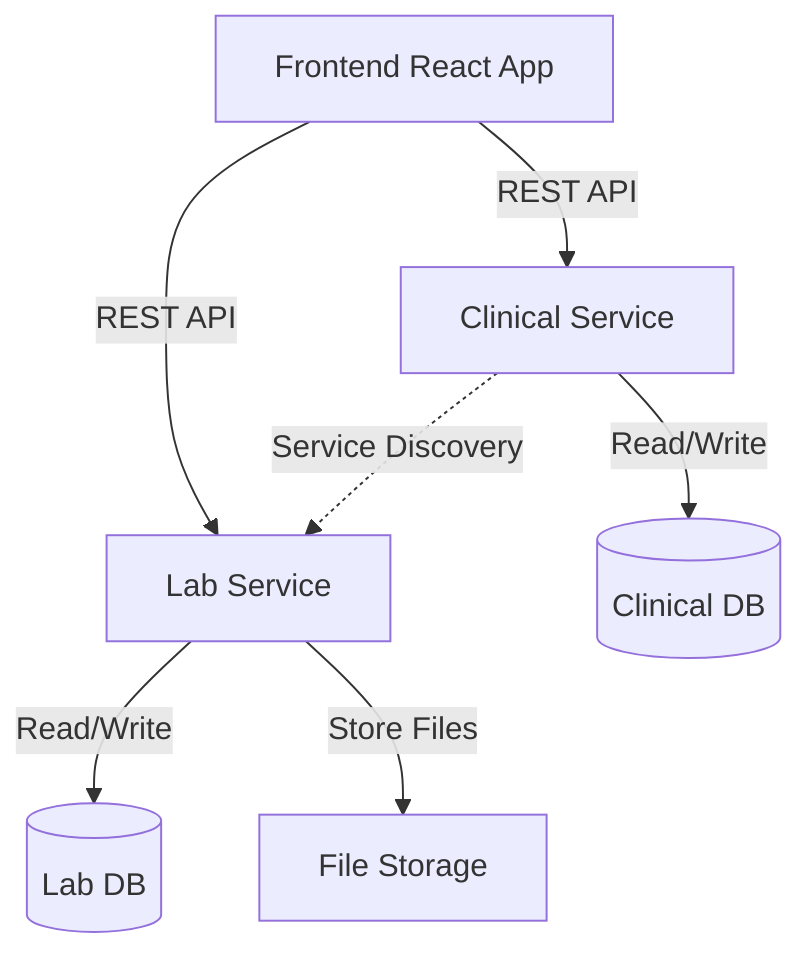
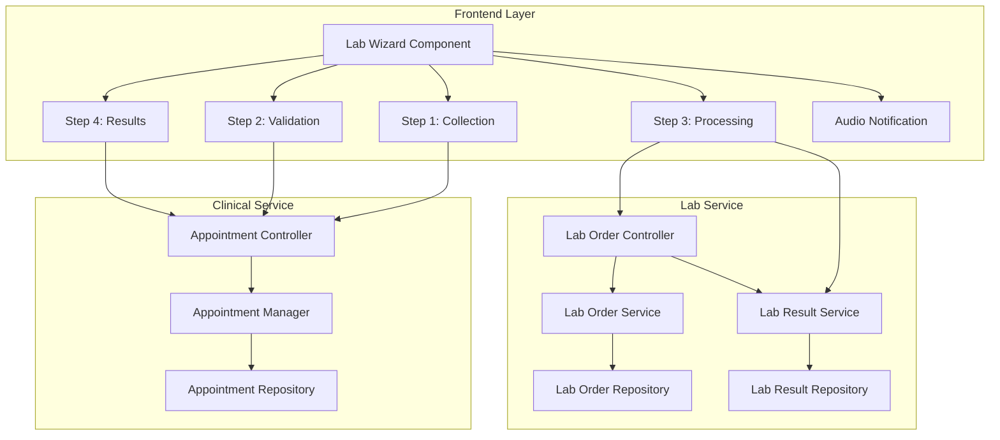
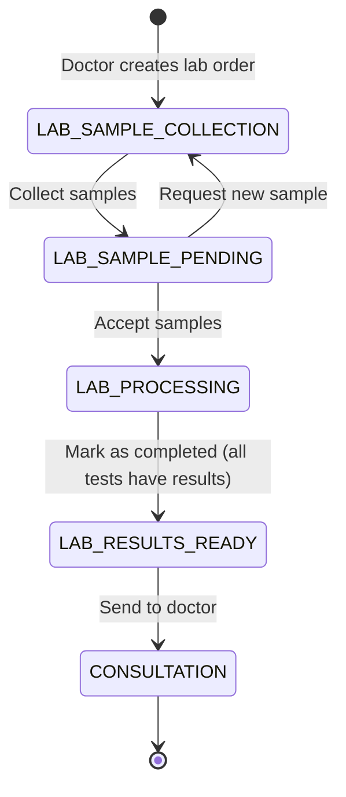

# Design Document - Laboratory Sample Management System

## Overview

The Laboratory Sample Management System is a comprehensive module within the MedFlow hospital system that enables laboratory technicians to manage the complete workflow from sample collection to results delivery. The system implements a 4-step wizard interface where each step corresponds to a different appointment status in the laboratory workflow.

### Key Design Decisions

1. **Wizard-Based UI Pattern**: A stepper/wizard interface provides clear visual feedback about workflow progress and prevents technicians from skipping required steps.

2. **Appointment Status as State Machine**: The appointment status field drives the wizard navigation, ensuring backend and frontend state remain synchronized.

3. **Microservice Architecture**: Separation between Clinical Service (appointment management) and Lab Service (test-specific operations) maintains bounded contexts and allows independent scaling.

4. **File-Based Results**: Laboratory results are stored as PDF or image files rather than structured data, accommodating the reality that lab equipment often produces reports in these formats.

5. **Audio Feedback**: Consistent with other modules (triage, doctor), audio notifications provide non-visual confirmation of actions.

### Technology Stack

**Backend:**
- Spring Boot 3.x (Java 17+)
- PostgreSQL (existing clinical and lab schemas)
- Spring Cloud (Eureka for service discovery)
- Multipart file upload (Spring Web)

**Frontend:**
- React 18+ with TypeScript
- React Router for navigation
- Axios for HTTP requests
- HTML5 Audio API for notifications

## Architecture

### System Context



### Component Architecture



### State Machine Design

The laboratory workflow extends the existing appointment status enum with four new states:



**Valid State Transitions:**
1. `LAB_SAMPLE_COLLECTION → LAB_SAMPLE_PENDING` (samples collected)
2. `LAB_SAMPLE_PENDING → LAB_PROCESSING` (samples accepted)
3. `LAB_SAMPLE_PENDING → LAB_SAMPLE_COLLECTION` (samples rejected, need new collection)
4. `LAB_PROCESSING → LAB_RESULTS_READY` (all results uploaded)
5. `LAB_RESULTS_READY → CONSULTATION` (results sent to doctor)

## Components and Interfaces

### Backend Components

#### 1. Appointment Domain Model Extension

**File:** `backend-services/clinical-service/src/main/java/com/medframe/clinical/domain/model/Appointment.java`

**New Status Values:**
```java
public enum AppointmentStatus {
    // ... existing statuses ...
    
    // Laboratory workflow (NEW)
    LAB_SAMPLE_COLLECTION,  // Waiting for sample collection
    LAB_SAMPLE_PENDING,     // Samples collected, awaiting validation
    LAB_PROCESSING,         // Samples accepted, tests in progress
    LAB_RESULTS_READY,      // Results uploaded, ready for doctor review
    
    // ... existing statuses ...
}
```

**New State Transition Methods:**
```java
// Transition: LAB_SAMPLE_COLLECTION → LAB_SAMPLE_PENDING
public void collectLabSamples() {
    if (this.status != AppointmentStatus.LAB_SAMPLE_COLLECTION) {
        throw new IllegalStateException("...");
    }
    this.status = AppointmentStatus.LAB_SAMPLE_PENDING;
}

// Transition: LAB_SAMPLE_PENDING → LAB_PROCESSING
public void acceptLabSamples() {
    if (this.status != AppointmentStatus.LAB_SAMPLE_PENDING) {
        throw new IllegalStateException("...");
    }
    this.status = AppointmentStatus.LAB_PROCESSING;
}

// Transition: LAB_SAMPLE_PENDING → LAB_SAMPLE_COLLECTION
public void rejectLabSamples() {
    if (this.status != AppointmentStatus.LAB_SAMPLE_PENDING) {
        throw new IllegalStateException("...");
    }
    this.status = AppointmentStatus.LAB_SAMPLE_COLLECTION;
}

// Transition: LAB_PROCESSING → LAB_RESULTS_READY
public void completeLabProcessing() {
    if (this.status != AppointmentStatus.LAB_PROCESSING) {
        throw new IllegalStateException("...");
    }
    this.status = AppointmentStatus.LAB_RESULTS_READY;
}

// Transition: LAB_RESULTS_READY → CONSULTATION
public void sendLabResultsToDoctor() {
    if (this.status != AppointmentStatus.LAB_RESULTS_READY) {
        throw new IllegalStateException("...");
    }
    this.status = AppointmentStatus.CONSULTATION;
}
```

#### 2. Appointment Controller Extensions

**File:** `backend-services/clinical-service/src/main/java/com/medframe/clinical/infrastructure/rest/controller/AppointmentController.java`

**New Endpoints:**

```java
/**
 * GET /api/clinical/appointments?queue=lab
 * Lists appointments in laboratory workflow states.
 * Uses existing unified endpoint with queue filter.
 */
// Already implemented via existing queue filter

/**
 * PUT /api/clinical/appointments/{id}/lab/collect-samples
 * Transition: LAB_SAMPLE_COLLECTION → LAB_SAMPLE_PENDING
 */
@PutMapping("/{id}/lab/collect-samples")
public ResponseEntity<AppointmentListItemResponse> collectLabSamples(
    @PathVariable String id,
    @RequestHeader("X-User-Id") String userId
) {
    // Validate appointment exists and is in LAB_SAMPLE_COLLECTION state
    // Call domain method: appointment.collectLabSamples()
    // Save and return updated appointment
}

/**
 * PUT /api/clinical/appointments/{id}/lab/accept-samples
 * Transition: LAB_SAMPLE_PENDING → LAB_PROCESSING
 */
@PutMapping("/{id}/lab/accept-samples")
public ResponseEntity<AppointmentListItemResponse> acceptLabSamples(
    @PathVariable String id,
    @RequestHeader("X-User-Id") String userId
) {
    // Validate appointment exists and is in LAB_SAMPLE_PENDING state
    // Call domain method: appointment.acceptLabSamples()
    // Save and return updated appointment
}

/**
 * PUT /api/clinical/appointments/{id}/lab/reject-samples
 * Transition: LAB_SAMPLE_PENDING → LAB_SAMPLE_COLLECTION
 */
@PutMapping("/{id}/lab/reject-samples")
public ResponseEntity<AppointmentListItemResponse> rejectLabSamples(
    @PathVariable String id,
    @RequestHeader("X-User-Id") String userId
) {
    // Validate appointment exists and is in LAB_SAMPLE_PENDING state
    // Call domain method: appointment.rejectLabSamples()
    // Save and return updated appointment
}

/**
 * PUT /api/clinical/appointments/{id}/lab/complete-processing
 * Transition: LAB_PROCESSING → LAB_RESULTS_READY
 * Validates that all tests have uploaded results before allowing transition.
 */
@PutMapping("/{id}/lab/complete-processing")
public ResponseEntity<AppointmentListItemResponse> completeLabProcessing(
    @PathVariable String id,
    @RequestHeader("X-User-Id") String userId
) {
    // 1. Get appointment and validate state
    // 2. Get lab order for this appointment
    // 3. Verify all tests have results (call Lab Service)
    // 4. If validation passes, call domain method: appointment.completeLabProcessing()
    // 5. Save and return updated appointment
}

/**
 * PUT /api/clinical/appointments/{id}/lab/send-to-doctor
 * Transition: LAB_RESULTS_READY → CONSULTATION
 */
@PutMapping("/{id}/lab/send-to-doctor")
public ResponseEntity<AppointmentListItemResponse> sendLabResultsToDoctor(
    @PathVariable String id,
    @RequestHeader("X-User-Id") String userId
) {
    // Validate appointment exists and is in LAB_RESULTS_READY state
    // Call domain method: appointment.sendLabResultsToDoctor()
    // Save and return updated appointment
}
```

#### 3. Lab Service Extensions

**File:** `backend-services/lab-service/src/main/java/com/medflow/lab/controller/LabOrderController.java`

**New Endpoints:**

```java
/**
 * GET /api/lab/orders/by-appointment/{appointmentId}
 * Retrieves lab order and tests for a specific appointment.
 */
@GetMapping("/by-appointment/{appointmentId}")
public ResponseEntity<LabOrderWithTestsResponse> getOrderByAppointmentId(
    @PathVariable String appointmentId
) {
    // Query lab_orders table by appointmentId
    // Return order with all test details
}

/**
 * POST /api/lab/orders/{orderId}/tests/{testName}/results
 * Uploads a result file for a specific test within an order.
 * Accepts multipart/form-data with file field.
 */
@PostMapping(value = "/{orderId}/tests/{testName}/results", 
             consumes = MediaType.MULTIPART_FORM_DATA_VALUE)
public ResponseEntity<LabResultResponse> uploadTestResult(
    @PathVariable String orderId,
    @PathVariable String testName,
    @RequestParam("file") MultipartFile file,
    @RequestHeader("X-User-Id") String userId
) {
    // 1. Validate file format (PDF, JPEG, PNG)
    // 2. Validate file size (<= 10 MB)
    // 3. Generate unique filename
    // 4. Store file to persistent storage
    // 5. Create LabResult record with metadata
    // 6. Return success response with file ID
}

/**
 * GET /api/lab/orders/{orderId}/results
 * Retrieves all result files for an order.
 */
@GetMapping("/{orderId}/results")
public ResponseEntity<List<LabResultResponse>> getOrderResults(
    @PathVariable String orderId
) {
    // Query lab_results table by orderId
    // Return list of results with metadata
}

/**
 * GET /api/lab/orders/{orderId}/validation/all-tests-complete
 * Validates that all tests in an order have uploaded results.
 */
@GetMapping("/{orderId}/validation/all-tests-complete")
public ResponseEntity<ValidationResponse> validateAllTestsComplete(
    @PathVariable String orderId
) {
    // 1. Get lab order with test names
    // 2. Get all results for this order
    // 3. Check if each test has at least one result
    // 4. Return validation result with missing tests if any
}
```

#### 4. Lab Result Service

**File:** `backend-services/lab-service/src/main/java/com/medflow/lab/service/LabResultService.java`

**New Methods:**

```java
public LabResultResponse uploadTestResult(
    String orderId, 
    String testName, 
    MultipartFile file, 
    String userId
) {
    // 1. Validate file format
    validateFileFormat(file);
    
    // 2. Validate file size
    validateFileSize(file);
    
    // 3. Generate unique filename
    String uniqueFilename = generateUniqueFilename(file.getOriginalFilename());
    
    // 4. Store file
    String filePath = fileStorageService.store(file, uniqueFilename);
    
    // 5. Create LabResult entity
    LabResult result = LabResult.builder()
        .orderId(orderId)
        .testName(testName)
        .resultFilePath(filePath)
        .originalFilename(file.getOriginalFilename())
        .fileSize(file.getSize())
        .uploadedBy(userId)
        .uploadedAt(LocalDateTime.now())
        .build();
    
    // 6. Save and return
    return labResultRepository.save(result);
}

private void validateFileFormat(MultipartFile file) {
    String contentType = file.getContentType();
    List<String> allowedTypes = Arrays.asList(
        "application/pdf",
        "image/jpeg",
        "image/png"
    );
    
    if (!allowedTypes.contains(contentType)) {
        throw new InvalidFileFormatException(
            "Formato de archivo no permitido. Solo se aceptan PDF, JPEG y PNG."
        );
    }
}

private void validateFileSize(MultipartFile file) {
    long maxSize = 10 * 1024 * 1024; // 10 MB
    
    if (file.getSize() > maxSize) {
        throw new FileSizeExceededException(
            "El archivo excede el tamaño máximo permitido de 10 MB."
        );
    }
}

public ValidationResponse validateAllTestsComplete(String orderId) {
    // 1. Get lab order
    LabOrder order = labOrderRepository.findById(orderId)
        .orElseThrow(() -> new LabOrderNotFoundException("..."));
    
    // 2. Get all results for this order
    List<LabResult> results = labResultRepository.findByOrderId(orderId);
    
    // 3. Extract test names from results
    Set<String> testsWithResults = results.stream()
        .map(LabResult::getTestName)
        .collect(Collectors.toSet());
    
    // 4. Find missing tests
    List<String> missingTests = order.getTestNames().stream()
        .filter(testName -> !testsWithResults.contains(testName))
        .collect(Collectors.toList());
    
    // 5. Return validation result
    return ValidationResponse.builder()
        .isValid(missingTests.isEmpty())
        .missingTests(missingTests)
        .build();
}
```

### Frontend Components

#### 1. Lab Wizard Container

**File:** `frontend-medflow/src/pages/lab/LabSampleWorkflow.tsx`

**Responsibilities:**
- Fetch appointment data and lab order details
- Determine current step based on appointment status
- Render appropriate step component
- Handle step transitions via API calls
- Display progress bar and step indicators

**Component Structure:**
```typescript
interface LabWizardProps {
  appointmentId: string;
}

const LabSampleWorkflow: FC<LabWizardProps> = ({ appointmentId }) => {
  const [appointment, setAppointment] = useState<AppointmentListItem | null>(null);
  const [labOrder, setLabOrder] = useState<LabOrderWithTests | null>(null);
  const [loading, setLoading] = useState(true);
  const [currentStep, setCurrentStep] = useState(1);
  
  // Map appointment status to wizard step
  const getStepFromStatus = (status: string): number => {
    const stepMap: Record<string, number> = {
      'LAB_SAMPLE_COLLECTION': 1,
      'LAB_SAMPLE_PENDING': 2,
      'LAB_PROCESSING': 3,
      'LAB_RESULTS_READY': 4,
    };
    return stepMap[status] || 1;
  };
  
  // Load appointment and lab order data
  useEffect(() => {
    const loadData = async () => {
      const appt = await getAppointmentById(appointmentId);
      const order = await getLabOrderByAppointmentId(appointmentId);
      setAppointment(appt);
      setLabOrder(order);
      setCurrentStep(getStepFromStatus(appt.status));
      setLoading(false);
    };
    loadData();
  }, [appointmentId]);
  
  // Render step component based on current step
  const renderStep = () => {
    switch (currentStep) {
      case 1: return <SampleCollectionStep />;
      case 2: return <SampleValidationStep />;
      case 3: return <TestProcessingStep />;
      case 4: return <ResultsReadyStep />;
      default: return null;
    }
  };
  
  return (
    <MainLayout>
      <WizardProgressBar currentStep={currentStep} totalSteps={4} />
      {renderStep()}
    </MainLayout>
  );
};
```

#### 2. Wizard Progress Bar

**File:** `frontend-medflow/src/components/lab/WizardProgressBar.tsx`

**Visual Design:**
```
┌─────────────────────────────────────────────────────────────┐
│  ●━━━━━━━━━━━━━━━━━━━━━━━━━━━━━━━━━━━━━━━━━━━━━━━━━━━━━━━━│
│  1. Recolección    2. Validar    3. Procesar    4. Resultados│
│     de Muestras       Muestras      Exámenes        Listos   │
└─────────────────────────────────────────────────────────────┘
```

**Component:**
```typescript
interface WizardProgressBarProps {
  currentStep: number;
  totalSteps: number;
}

const WizardProgressBar: FC<WizardProgressBarProps> = ({ currentStep, totalSteps }) => {
  const steps = [
    { number: 1, label: 'Recolección de Muestras' },
    { number: 2, label: 'Validar Muestras' },
    { number: 3, label: 'Procesar Exámenes' },
    { number: 4, label: 'Resultados Listos' },
  ];
  
  return (
    <div className="mb-8">
      <div className="flex items-center justify-between">
        {steps.map((step, index) => (
          <div key={step.number} className="flex items-center">
            <div className={`
              flex items-center justify-center w-10 h-10 rounded-full
              ${step.number === currentStep ? 'bg-purple-600 text-white' : ''}
              ${step.number < currentStep ? 'bg-green-500 text-white' : ''}
              ${step.number > currentStep ? 'bg-gray-200 text-gray-500' : ''}
            `}>
              {step.number < currentStep ? '✓' : step.number}
            </div>
            <span className="ml-2 text-sm">{step.label}</span>
            {index < steps.length - 1 && (
              <div className={`
                w-24 h-1 mx-4
                ${step.number < currentStep ? 'bg-green-500' : 'bg-gray-200'}
              `} />
            )}
          </div>
        ))}
      </div>
    </div>
  );
};
```

#### 3. Step Components

**Step 1: Sample Collection**
```typescript
const SampleCollectionStep: FC<StepProps> = ({ appointment, labOrder, onNext }) => {
  const handleCollectSamples = async () => {
    await collectLabSamples(appointment.id);
    onNext();
  };
  
  return (
    <div>
      <h3>Paso 1: Recolección de Muestras</h3>
      <TestList tests={labOrder.testNames} />
      <button onClick={handleCollectSamples}>
        Recolectar Muestras
      </button>
    </div>
  );
};
```

**Step 2: Sample Validation**
```typescript
const SampleValidationStep: FC<StepProps> = ({ appointment, labOrder, onNext, onPrevious }) => {
  const handleAcceptSamples = async () => {
    await acceptLabSamples(appointment.id);
    onNext();
  };
  
  const handleRejectSamples = async () => {
    await rejectLabSamples(appointment.id);
    onPrevious();
  };
  
  return (
    <div>
      <h3>Paso 2: Validar Muestras</h3>
      <TestList tests={labOrder.testNames} />
      <button onClick={handleAcceptSamples}>Aceptar muestras</button>
      <button onClick={handleRejectSamples}>Solicitar nueva muestra</button>
    </div>
  );
};
```

**Step 3: Test Processing**
```typescript
const TestProcessingStep: FC<StepProps> = ({ appointment, labOrder, onNext }) => {
  const [uploadedResults, setUploadedResults] = useState<Map<string, File>>(new Map());
  
  const handleFileUpload = async (testName: string, file: File) => {
    // Validate file format and size
    validateFile(file);
    
    // Upload to server
    await uploadTestResult(labOrder.id, testName, file);
    
    // Update local state
    setUploadedResults(prev => new Map(prev).set(testName, file));
  };
  
  const handleMarkComplete = async () => {
    // Validate all tests have results
    const validation = await validateAllTestsComplete(labOrder.id);
    
    if (!validation.isValid) {
      alert(`Faltan resultados para: ${validation.missingTests.join(', ')}`);
      return;
    }
    
    // Transition to next step
    await completeLabProcessing(appointment.id);
    onNext();
  };
  
  return (
    <div>
      <h3>Paso 3: Procesar Exámenes</h3>
      {labOrder.testNames.map(testName => (
        <TestResultUpload
          key={testName}
          testName={testName}
          onUpload={(file) => handleFileUpload(testName, file)}
          uploaded={uploadedResults.has(testName)}
        />
      ))}
      <button onClick={handleMarkComplete}>Marcar como completado</button>
    </div>
  );
};
```

**Step 4: Results Ready**
```typescript
const ResultsReadyStep: FC<StepProps> = ({ appointment, labOrder, onComplete }) => {
  const [results, setResults] = useState<LabResult[]>([]);
  
  useEffect(() => {
    const loadResults = async () => {
      const data = await getLabOrderResults(labOrder.id);
      setResults(data);
    };
    loadResults();
  }, [labOrder.id]);
  
  const handleSendToDoctor = async () => {
    await sendLabResultsToDoctor(appointment.id);
    onComplete();
  };
  
  return (
    <div>
      <h3>Paso 4: Resultados Listos</h3>
      <ResultsList results={results} />
      <button onClick={handleSendToDoctor}>Enviar a doctor</button>
    </div>
  );
};
```

#### 4. Audio Notification Component

**File:** `frontend-medflow/src/components/common/AudioNotification.tsx`

```typescript
export const playNotificationSound = () => {
  const audio = new Audio('/sounds/notification.mp3');
  audio.play().catch(err => {
    console.warn('Audio playback failed:', err);
  });
};
```

**Usage in appointment list:**
```typescript
const handleAttendAppointment = (appointmentId: string) => {
  playNotificationSound();
  setTimeout(() => {
    navigate(`/lab/workflow/${appointmentId}`);
  }, 500);
};
```

## Data Models

### Database Schema Extensions

#### Clinical Service Database

**Table:** `appointments` (existing, add new status values)

No schema changes required. The `status` column already uses VARCHAR and can accommodate new enum values.

**Migration:**
```sql
-- No migration needed for status column
-- Just add new enum values in application code
```

#### Lab Service Database

**Table:** `lab_results` (extend existing)

```sql
ALTER TABLE lab_schema.lab_results
ADD COLUMN test_name VARCHAR(255) NOT NULL DEFAULT '',
ADD COLUMN original_filename VARCHAR(500),
ADD COLUMN file_size BIGINT;

-- Add index for querying results by test name
CREATE INDEX idx_lab_results_test_name ON lab_schema.lab_results(test_name);
```

### Domain Models

#### LabResult (Extended)

```java
@Entity
@Table(name = "lab_results", schema = "lab_schema")
public class LabResult {
    @Id
    @GeneratedValue(strategy = GenerationType.UUID)
    private String id;
    
    @Column(name = "order_id", nullable = false)
    private String orderId;
    
    @Column(name = "test_name", nullable = false)
    private String testName;  // NEW
    
    @Column(name = "patient_id", nullable = false)
    private String patientId;
    
    @Column(name = "result_file_path", nullable = false)
    private String resultFilePath;
    
    @Column(name = "original_filename")
    private String originalFilename;  // NEW
    
    @Column(name = "file_size")
    private Long fileSize;  // NEW
    
    @Column(name = "uploaded_at", nullable = false)
    private LocalDateTime uploadedAt;
    
    @Column(name = "uploaded_by", nullable = false)
    private String uploadedBy;
}
```

### DTOs

#### LabOrderWithTestsResponse

```java
@Data
@Builder
public class LabOrderWithTestsResponse {
    private String id;
    private String orderCode;
    private String patientId;
    private String doctorId;
    private String appointmentId;
    private List<TestDetail> tests;
    private OrderStatus status;
    private LocalDateTime orderedAt;
}

@Data
@Builder
public class TestDetail {
    private String testName;
    private String testType;
    private String sampleType;
    private boolean hasResult;
}
```

#### LabResultResponse

```java
@Data
@Builder
public class LabResultResponse {
    private String id;
    private String orderId;
    private String testName;
    private String originalFilename;
    private Long fileSize;
    private LocalDateTime uploadedAt;
    private String uploadedBy;
    private String downloadUrl;  // Presigned URL or path
}
```

#### ValidationResponse

```java
@Data
@Builder
public class ValidationResponse {
    private boolean isValid;
    private List<String> missingTests;
    private String message;
}
```

## Correctness Properties

*A property is a characteristic or behavior that should hold true across all valid executions of a system—essentially, a formal statement about what the system should do. Properties serve as the bridge between human-readable specifications and machine-verifiable correctness guarantees.*

Before writing correctness properties, I need to analyze each acceptance criterion for testability using the prework tool.


### Property Reflection

After analyzing all acceptance criteria, I've identified the following properties that are suitable for property-based testing. I'll now eliminate redundancy:

**Redundancy Analysis:**

1. **Status-to-Step Mapping (3.3, 3.4, 4.1, 5.1, 6.1, 7.1)**: These all test the same mapping function. Can be combined into one comprehensive property.

2. **State Transition Validation (1.4, 1.5, 4.5, 5.4, 5.5, 7.5, 9.1-9.4)**: All test the same state machine validation logic. Can be combined into one property about valid transitions and one about invalid transitions.

3. **Test List Rendering (4.2, 5.2, 6.2)**: All test that tests are rendered. Can be combined into one property.

4. **File Format Validation (6.4, 11.1)**: Same validation logic, combine into one property.

5. **Error Message Content (9.3, 13.4)**: Same requirement, combine into one property.

**Final Properties After Reflection:**

1. State transition validation (combines 1.4, 1.5, 9.2-9.4)
2. Status-to-step mapping (combines 3.3, 3.4, 4.1, 5.1, 6.1, 7.1)
3. Lab appointment filtering (2.1, 2.6)
4. Test list rendering (4.2, 4.3)
5. File format validation (6.4, 11.1)
6. File size validation (11.2)
7. Filename uniqueness (11.3)
8. Results completeness validation (6.8, 6.10)
9. Invalid transition error messages (9.3, 13.4)
10. HTTP status code correctness (12.6)
11. Error message localization (13.1, 13.2, 13.3)
12. Multiple results per test (15.4)

### Property 1: State Transition Validation

*For any* appointment in a laboratory workflow state and any target status, the system SHALL correctly validate whether the transition is allowed according to the defined state machine rules, accepting valid transitions and rejecting invalid ones.

**Validates: Requirements 1.4, 1.5, 9.2, 9.3, 9.4**

### Property 2: Status-to-Step Mapping Consistency

*For any* appointment with a laboratory-related status (LAB_SAMPLE_COLLECTION, LAB_SAMPLE_PENDING, LAB_PROCESSING, LAB_RESULTS_READY), the wizard interface SHALL map the status to the correct step number (1, 2, 3, 4 respectively) and highlight that step.

**Validates: Requirements 3.3, 3.4, 4.1, 5.1, 6.1, 7.1**

### Property 3: Laboratory Appointment Filtering

*For any* list of appointments with mixed statuses, filtering by laboratory queue SHALL return only appointments with statuses LAB_SAMPLE_COLLECTION, LAB_SAMPLE_PENDING, LAB_PROCESSING, or LAB_RESULTS_READY, excluding all other statuses.

**Validates: Requirements 2.1, 2.6**

### Property 4: Test Information Completeness

*For any* test in a lab order, the rendered output SHALL contain all required fields: test name, test type, and sample type required.

**Validates: Requirements 4.2, 4.3, 10.3**

### Property 5: File Format Validation

*For any* uploaded file, the validation logic SHALL accept only files with MIME types application/pdf, image/jpeg, or image/png, and reject all other file types with a descriptive error message.

**Validates: Requirements 6.4, 11.1**

### Property 6: File Size Validation

*For any* uploaded file, the validation logic SHALL reject files larger than 10 MB and accept files at or below 10 MB.

**Validates: Requirements 11.2**

### Property 7: Filename Uniqueness

*For any* sequence of file uploads, the system SHALL generate unique filenames such that no two uploaded files have the same stored filename, preventing collisions.

**Validates: Requirements 11.3**

### Property 8: Results Completeness Validation

*For any* lab order with a set of test names, the validation logic SHALL correctly identify which tests are missing results by comparing the test names in the order against the test names in the uploaded results, returning an accurate list of missing tests.

**Validates: Requirements 6.8, 6.10**

### Property 9: Invalid Transition Error Messages

*For any* invalid state transition attempt, the error response SHALL contain both the current appointment status and the requested target status in the error message.

**Validates: Requirements 9.3, 13.4**

### Property 10: HTTP Status Code Correctness

*For any* API operation result (success, validation error, not found, server error), the HTTP response SHALL use the correct status code: 200 for success, 400 for validation errors, 404 for not found, 500 for server errors.

**Validates: Requirements 12.6**

### Property 11: Error Message Localization and Specificity

*For any* error condition (network error, validation error, file upload failure), the error message displayed to the user SHALL be in Spanish and SHALL contain specific details about what failed and why.

**Validates: Requirements 13.1, 13.2, 13.3**

### Property 12: Multiple Results Per Test

*For any* test in a lab order, the system SHALL allow multiple result files to be uploaded and associated with that test, storing all uploaded results without overwriting previous ones.

**Validates: Requirements 15.4**

### Property 13: Wizard Step Content Isolation

*For any* current step number (1-4), the wizard SHALL render only the content and actions for that specific step, hiding content from other steps.

**Validates: Requirements 3.5**

### Property 14: Step Visual State Indication

*For any* current step number, the wizard SHALL apply distinct visual styling to completed steps (steps < current), the current step, and pending steps (steps > current).

**Validates: Requirements 3.6**

### Property 15: Audio Playback Error Resilience

*For any* audio playback error, the navigation to the wizard form SHALL proceed successfully without being blocked by the audio failure.

**Validates: Requirements 8.3**

### Property 16: Button Disabling During API Requests

*For any* API request in progress, all action buttons SHALL be disabled to prevent duplicate submissions, and re-enabled when the request completes.

**Validates: Requirements 14.4**

### Property 17: Loading Indicator Display

*For any* asynchronous operation (data fetching, file upload), a loading indicator SHALL be displayed while the operation is in progress and hidden when it completes.

**Validates: Requirements 14.5**

### Property 18: Console Error Logging

*For any* error that occurs in the frontend application, an error message SHALL be logged to the browser console for debugging purposes.

**Validates: Requirements 13.6**

### Property 19: Lab Order Initialization Status

*For any* lab order created by a doctor, the associated appointment SHALL be initialized with status LAB_SAMPLE_COLLECTION.

**Validates: Requirements 1.2**

### Property 20: Appointment Field Rendering

*For any* appointment in the laboratory queue list, the rendered output SHALL contain patient name, appointment date, appointment time, current status, and lab order identifier.

**Validates: Requirements 2.2**

## Error Handling

### Error Categories

1. **Validation Errors (HTTP 400)**
   - Invalid state transition
   - Invalid file format
   - File size exceeds limit
   - Missing required fields
   - Incomplete test results

2. **Not Found Errors (HTTP 404)**
   - Appointment not found
   - Lab order not found
   - Test not found
   - Result file not found

3. **Server Errors (HTTP 500)**
   - Database connection failure
   - File storage failure
   - Service communication failure

### Error Response Format

All API errors SHALL return a consistent JSON structure:

```json
{
  "timestamp": "2024-01-15T10:30:00",
  "status": 400,
  "error": "Bad Request",
  "message": "Transición de estado inválida: no se puede cambiar de LAB_PROCESSING a LAB_SAMPLE_COLLECTION",
  "path": "/api/clinical/appointments/123/lab/reject-samples",
  "details": {
    "currentStatus": "LAB_PROCESSING",
    "requestedStatus": "LAB_SAMPLE_COLLECTION",
    "allowedTransitions": ["LAB_RESULTS_READY"]
  }
}
```

### Frontend Error Handling Strategy

1. **Network Errors**: Display user-friendly message in Spanish, log technical details to console
2. **Validation Errors**: Display specific validation failure reason from server response
3. **File Upload Errors**: Show file name and failure reason
4. **State Transition Errors**: Explain why transition is not allowed with current and target states
5. **Timeout Errors**: Provide retry option with exponential backoff

### Error Recovery Mechanisms

1. **Automatic Retry**: Network errors with exponential backoff (max 3 attempts)
2. **Manual Retry**: User-initiated retry button for failed operations
3. **Graceful Degradation**: Audio notification failure doesn't block navigation
4. **Transaction Rollback**: Database failures roll back partial changes
5. **Error Boundaries**: React error boundaries prevent full app crashes

## Testing Strategy

### Testing Approach

This feature requires a **dual testing approach** combining property-based testing for business logic and integration testing for infrastructure concerns.

### Property-Based Testing

**Framework**: jqwik (Java) for backend, fast-check (TypeScript) for frontend

**Minimum Iterations**: 100 per property test

**Property Test Coverage**:

1. **State Machine Properties** (Backend)
   - Test all possible (currentStatus, targetStatus) combinations
   - Verify valid transitions are accepted
   - Verify invalid transitions are rejected with correct error messages
   - Tag: `Feature: lab-sample-workflow, Property 1: State transition validation`

2. **Status-to-Step Mapping** (Frontend)
   - Generate appointments with all four lab statuses
   - Verify correct step number is returned for each status
   - Tag: `Feature: lab-sample-workflow, Property 2: Status-to-step mapping consistency`

3. **File Validation Properties** (Backend)
   - Generate files with various MIME types
   - Generate files with various sizes (including boundary values: 10MB, 10MB+1byte)
   - Verify validation logic correctly accepts/rejects
   - Tag: `Feature: lab-sample-workflow, Property 5: File format validation`
   - Tag: `Feature: lab-sample-workflow, Property 6: File size validation`

4. **Filename Uniqueness** (Backend)
   - Generate sequences of file uploads with same original names
   - Verify all generated filenames are unique
   - Tag: `Feature: lab-sample-workflow, Property 7: Filename uniqueness`

5. **Results Completeness Validation** (Backend)
   - Generate lab orders with varying numbers of tests
   - Generate result sets with varying completeness
   - Verify validation correctly identifies missing tests
   - Tag: `Feature: lab-sample-workflow, Property 8: Results completeness validation`

6. **HTTP Status Code Properties** (Backend)
   - Generate various operation outcomes (success, validation error, not found, server error)
   - Verify correct HTTP status codes are returned
   - Tag: `Feature: lab-sample-workflow, Property 10: HTTP status code correctness`

7. **Error Message Properties** (Backend/Frontend)
   - Generate various error conditions
   - Verify error messages are in Spanish and contain specific details
   - Tag: `Feature: lab-sample-workflow, Property 11: Error message localization and specificity`

8. **UI Rendering Properties** (Frontend)
   - Generate appointments with various data
   - Verify all required fields are rendered
   - Verify correct CSS classes are applied
   - Tag: `Feature: lab-sample-workflow, Property 4: Test information completeness`
   - Tag: `Feature: lab-sample-workflow, Property 14: Step visual state indication`

### Unit Testing

**Focus Areas**:
- Specific examples of state transitions
- Edge cases: empty test lists, single test, maximum tests (50)
- Boundary values: file size exactly 10MB, file size 10MB + 1 byte
- Error handling: audio playback failure, network timeout
- Button state management during API calls
- Loading indicator display/hide logic

**Example Unit Tests**:
```java
@Test
void shouldRejectTransitionFromProcessingToCollection() {
    Appointment appointment = new Appointment();
    appointment.setStatus(AppointmentStatus.LAB_PROCESSING);
    
    assertThrows(IllegalStateException.class, 
        () -> appointment.rejectLabSamples());
}

@Test
void shouldAcceptPdfFile() {
    MockMultipartFile file = new MockMultipartFile(
        "file", "result.pdf", "application/pdf", new byte[1024]);
    
    assertDoesNotThrow(() -> labResultService.validateFileFormat(file));
}

@Test
void shouldRejectFileOver10MB() {
    byte[] largeContent = new byte[10 * 1024 * 1024 + 1];
    MockMultipartFile file = new MockMultipartFile(
        "file", "large.pdf", "application/pdf", largeContent);
    
    assertThrows(FileSizeExceededException.class,
        () -> labResultService.validateFileSize(file));
}
```

### Integration Testing

**Focus Areas**:
- Database persistence and transactions
- File storage and retrieval
- Microservice communication (Clinical ↔ Lab)
- API endpoint functionality
- Service discovery and load balancing
- Performance requirements (500ms for test data, 3s for file upload)

**Integration Test Scenarios**:
1. Complete workflow: collection → validation → processing → results → doctor
2. Sample rejection flow: validation → back to collection
3. File upload and retrieval
4. Concurrent file uploads for different tests
5. Transaction rollback on failure
6. Service communication failure handling

### End-to-End Testing

**User Workflows**:
1. Lab technician views appointment list
2. Lab technician clicks "Atender" (audio plays, navigates to wizard)
3. Lab technician collects samples (step 1 → step 2)
4. Lab technician accepts samples (step 2 → step 3)
5. Lab technician uploads results for all tests
6. Lab technician marks as complete (step 3 → step 4)
7. Lab technician sends results to doctor (step 4 → consultation)

**Alternative Flows**:
- Sample rejection: step 2 → step 1
- Incomplete results: attempt to complete, see error, upload missing results
- Audio failure: navigation still works

### Test Data Generation

**Property Test Generators**:

```java
// State transition generator
@Provide
Arbitrary<StateTransition> stateTransitions() {
    return Combinators.combine(
        Arbitraries.of(AppointmentStatus.values()),
        Arbitraries.of(AppointmentStatus.values())
    ).as((current, target) -> new StateTransition(current, target));
}

// File generator
@Provide
Arbitrary<MockMultipartFile> files() {
    return Combinators.combine(
        Arbitraries.strings().alpha().ofLength(10),
        Arbitraries.of("application/pdf", "image/jpeg", "image/png", "text/plain"),
        Arbitraries.integers().between(0, 15 * 1024 * 1024)
    ).as((name, type, size) -> 
        new MockMultipartFile("file", name, type, new byte[size]));
}

// Lab order generator
@Provide
Arbitrary<LabOrder> labOrders() {
    return Combinators.combine(
        Arbitraries.strings().alpha().ofLength(8),
        Arbitraries.strings().numeric().ofLength(36),
        Arbitraries.strings().numeric().ofLength(36),
        Arbitraries.strings().alpha().ofMinLength(1).ofMaxLength(50).list().ofMinSize(1).ofMaxSize(10)
    ).as((orderCode, patientId, doctorId, testNames) ->
        LabOrder.builder()
            .orderCode(orderCode)
            .patientId(patientId)
            .doctorId(doctorId)
            .testNames(testNames)
            .status(OrderStatus.PENDING)
            .build());
}
```

### Test Coverage Goals

- **Line Coverage**: > 80% for business logic
- **Branch Coverage**: > 75% for conditional logic
- **Property Test Coverage**: All 20 identified properties
- **Integration Test Coverage**: All API endpoints and service interactions
- **E2E Test Coverage**: All primary and alternative user workflows

### Continuous Testing

- **Pre-commit**: Unit tests and property tests (fast subset, 10 iterations)
- **CI Pipeline**: Full test suite (property tests with 100 iterations)
- **Nightly**: Extended property tests (1000 iterations), performance tests
- **Pre-release**: Full E2E test suite, load testing

## Security Considerations

### Authentication and Authorization

1. **User Authentication**: All API endpoints require valid JWT token in Authorization header
2. **Role-Based Access**: Only users with LABORATORY role can access lab workflow endpoints
3. **User Identification**: X-User-Id header required for audit trail

### File Upload Security

1. **File Type Validation**: Server-side MIME type validation (don't trust client)
2. **File Size Limits**: Enforce 10MB limit to prevent DoS attacks
3. **Filename Sanitization**: Generate unique filenames, don't use user-provided names directly
4. **Virus Scanning**: Consider integrating antivirus scanning for uploaded files
5. **Storage Isolation**: Store files outside web root, serve via controlled endpoints

### Data Privacy

1. **Patient Data**: Lab results contain sensitive patient information, enforce access controls
2. **Audit Logging**: Log all access to lab results with user ID and timestamp
3. **Data Encryption**: Encrypt files at rest, use HTTPS for transmission
4. **Data Retention**: Implement retention policies for lab results per regulations

### Input Validation

1. **Appointment ID**: Validate UUID format, check existence
2. **Status Transitions**: Validate against state machine rules
3. **File Uploads**: Validate format, size, and content type
4. **SQL Injection**: Use parameterized queries (JPA handles this)
5. **XSS Prevention**: Sanitize all user inputs displayed in UI

## Performance Considerations

### Response Time Requirements

- **Test Data Retrieval**: < 500ms for up to 50 tests (Requirement 10.5)
- **File Upload**: < 3s for files up to 10MB (Requirement 11.6)
- **Status Update**: < 200ms for state transitions
- **Appointment List**: < 1s for up to 100 appointments

### Optimization Strategies

1. **Database Indexing**:
   - Index on `appointments.status` for queue filtering
   - Index on `lab_orders.appointment_id` for lookups
   - Index on `lab_results.order_id` for result retrieval
   - Index on `lab_results.test_name` for validation queries

2. **Caching**:
   - Cache lab order details (5-minute TTL)
   - Cache test catalog data (1-hour TTL)
   - No caching for appointment status (must be real-time)

3. **File Storage**:
   - Use object storage (S3, MinIO) for scalability
   - Generate presigned URLs for file downloads
   - Implement CDN for frequently accessed results

4. **API Optimization**:
   - Batch result uploads (future enhancement)
   - Pagination for appointment lists (if > 100 items)
   - Lazy loading for file previews

5. **Frontend Optimization**:
   - Code splitting for wizard steps
   - Lazy load file preview components
   - Debounce file validation
   - Optimize re-renders with React.memo

### Scalability Considerations

1. **Horizontal Scaling**: Both Clinical and Lab services are stateless, can scale horizontally
2. **Database Connection Pooling**: Configure appropriate pool sizes
3. **File Storage**: Object storage scales independently
4. **Load Balancing**: Use Eureka for service discovery and client-side load balancing

## Deployment Considerations

### Database Migrations

**Migration 1: Add new appointment statuses**
```sql
-- No schema change needed, just add enum values in application code
-- Existing VARCHAR column can accommodate new values
```

**Migration 2: Extend lab_results table**
```sql
ALTER TABLE lab_schema.lab_results
ADD COLUMN test_name VARCHAR(255) NOT NULL DEFAULT '',
ADD COLUMN original_filename VARCHAR(500),
ADD COLUMN file_size BIGINT;

CREATE INDEX idx_lab_results_test_name ON lab_schema.lab_results(test_name);
```

### Configuration Changes

**Clinical Service** (`application.yml`):
```yaml
lab:
  workflow:
    enabled: true
    statuses:
      - LAB_SAMPLE_COLLECTION
      - LAB_SAMPLE_PENDING
      - LAB_PROCESSING
      - LAB_RESULTS_READY
```

**Lab Service** (`application.yml`):
```yaml
file:
  upload:
    max-size: 10485760  # 10 MB in bytes
    allowed-types:
      - application/pdf
      - image/jpeg
      - image/png
    storage-path: /var/medflow/lab-results
```

### Deployment Steps

1. **Database Migration**: Run migration scripts on lab_schema
2. **Backend Deployment**:
   - Deploy Lab Service first (backward compatible)
   - Deploy Clinical Service second (uses new Lab Service endpoints)
3. **Frontend Deployment**: Deploy React app with new wizard components
4. **Verification**: Run smoke tests on production
5. **Monitoring**: Watch for errors in logs and metrics

### Rollback Plan

1. **Frontend Rollback**: Revert to previous React build
2. **Backend Rollback**: Revert Clinical and Lab services
3. **Database Rollback**: New columns are nullable, no rollback needed
4. **Data Cleanup**: No data cleanup needed (new statuses won't be used)

## Monitoring and Observability

### Metrics to Track

1. **Business Metrics**:
   - Number of lab orders processed per day
   - Average time in each workflow step
   - Sample rejection rate
   - Results upload success rate

2. **Technical Metrics**:
   - API response times (p50, p95, p99)
   - File upload success/failure rate
   - State transition errors
   - Service availability

3. **User Experience Metrics**:
   - Wizard completion rate
   - Step abandonment rate
   - Error message frequency
   - Audio notification playback success rate

### Logging Strategy

**Log Levels**:
- **INFO**: State transitions, file uploads, workflow completions
- **WARN**: Validation failures, rejected transitions, audio playback failures
- **ERROR**: Server errors, database failures, service communication failures

**Log Format**:
```json
{
  "timestamp": "2024-01-15T10:30:00",
  "level": "INFO",
  "service": "clinical-service",
  "userId": "user-123",
  "appointmentId": "appt-456",
  "action": "STATE_TRANSITION",
  "details": {
    "from": "LAB_SAMPLE_PENDING",
    "to": "LAB_PROCESSING"
  }
}
```

### Alerting Rules

1. **Critical Alerts**:
   - Service down (> 5 minutes)
   - Database connection failure
   - File storage unavailable

2. **Warning Alerts**:
   - High error rate (> 5% of requests)
   - Slow response times (p95 > 2s)
   - High file upload failure rate (> 10%)

3. **Info Alerts**:
   - High sample rejection rate (> 20%)
   - Unusual workflow patterns

## Future Enhancements

1. **Barcode Scanning**: Integrate barcode scanner for sample tracking
2. **Equipment Integration**: Parse results directly from lab equipment
3. **Email Notifications**: Notify patients when results are ready
4. **Quality Control**: Add QC checks and sample rejection reasons
5. **Batch Processing**: Process multiple appointments simultaneously
6. **Results Approval**: Add approval workflow before sending to doctor
7. **Mobile App**: Native mobile app for lab technicians
8. **Real-time Updates**: WebSocket for live status updates
9. **Analytics Dashboard**: Visualize lab workflow metrics
10. **Multi-language Support**: Support for English and other languages

## Conclusion

The Laboratory Sample Management System design provides a comprehensive solution for managing the complete lab workflow from sample collection to results delivery. The wizard-based UI ensures a clear, step-by-step process that prevents errors and provides excellent user experience. The state machine design ensures data integrity and proper workflow enforcement. The microservice architecture maintains separation of concerns and allows independent scaling. Property-based testing ensures correctness across all possible inputs and states, while integration testing verifies end-to-end functionality.

The design is production-ready, scalable, secure, and maintainable, with clear error handling, comprehensive testing strategy, and detailed deployment plan.
