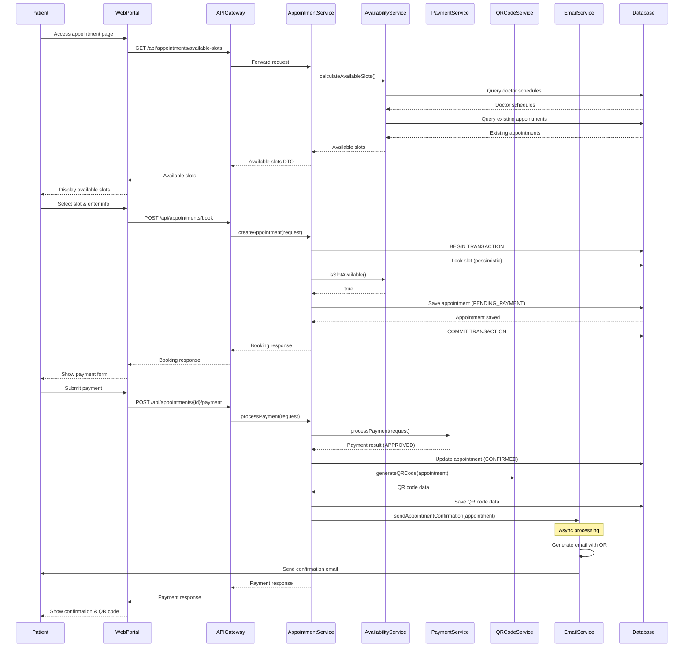
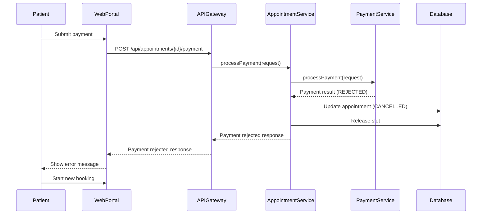
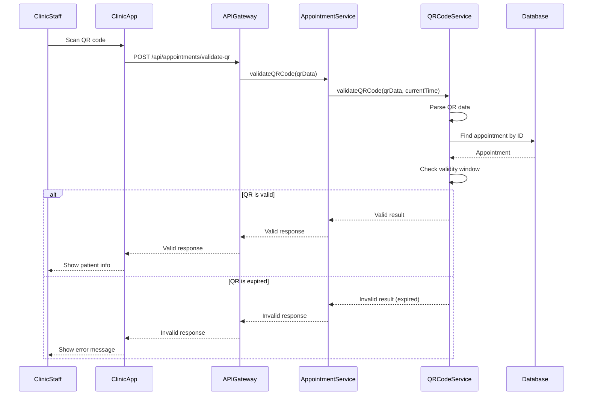

# Technical Design Document: Patient Appointment Scheduling

## Overview

This document specifies the technical design for implementing online appointment scheduling and payment functionality for the MedFlow HIS patient service. The system enables patients to schedule general medical appointments through a web portal, complete payment transactions, and receive QR codes for clinic check-in.

### System Context

- **Service Name**: Patient Appointment Scheduling Service
- **Architecture Pattern**: Domain-Driven Design (DDD)
- **Framework**: Spring Boot 3.x with Java 17+
- **Service Discovery**: Eureka Client (registers with discovery-server:8761)
- **API Gateway Integration**: Routes through api-gateway:8080
- **Database**: PostgreSQL (schema: medflow_patient_db)
- **Build Tool**: Maven

### Key Features

1. Web portal for appointment scheduling accessible 24/7
2. Real-time doctor availability calculation (2 appointments per doctor per hour)
3. Patient information collection with DPI/NIT validation
4. Mock payment gateway integration for university project
5. QR code generation with time-based validity (1 hour before to 30 minutes after appointment)
6. Email notification service for appointment confirmations
7. Concurrent booking prevention to avoid double-booking

### Design Principles

- **Bounded Context**: Appointment scheduling is a distinct subdomain within the Patient Service
- **Aggregate Design**: Appointment is the aggregate root with patient info, payment, and QR code as value objects
- **Transaction Management**: Pessimistic locking for concurrent booking prevention
- **Async Processing**: Email notifications sent asynchronously to avoid blocking
- **Idempotency**: Payment processing designed to handle retries safely


## Architecture

### High-Level Architecture

```
┌─────────────────────────────────────────────────────────────┐
│                    Patient Web Portal                        │
│                  (React Frontend - Port 3000)                │
└────────────────────────┬────────────────────────────────────┘
                         │ HTTPS
                         ▼
┌─────────────────────────────────────────────────────────────┐
│                   API Gateway (Port 8080)                    │
│  - Route: /api/appointments/** → patient-service:8082       │
│  - CORS Configuration                                        │
│  - Rate Limiting                                             │
└────────────────────────┬────────────────────────────────────┘
                         │
                         ▼
┌─────────────────────────────────────────────────────────────┐
│         Patient Appointment Scheduling Service               │
│                    (Port 8082)                               │
│  ┌─────────────────────────────────────────────────────┐   │
│  │           Presentation Layer                         │   │
│  │  - AppointmentController (REST API)                  │   │
│  │  - DTO Validation                                    │   │
│  │  - Exception Handlers                                │   │
│  └────────────────────┬─────────────────────────────────┘   │
│                       │                                      │
│  ┌────────────────────▼─────────────────────────────────┐   │
│  │           Application Layer                          │   │
│  │  - AppointmentService (Business Logic)               │   │
│  │  - PaymentService (Mock Gateway)                     │   │
│  │  - QRCodeService (Generation & Validation)           │   │
│  │  - EmailService (Async Notifications)                │   │
│  │  - AvailabilityService (Slot Calculation)            │   │
│  └────────────────────┬─────────────────────────────────┘   │
│                       │                                      │
│  ┌────────────────────▼─────────────────────────────────┐   │
│  │           Domain Layer                               │   │
│  │  - Appointment (Aggregate Root)                      │   │
│  │  - PatientInfo (Value Object)                        │   │
│  │  - PaymentRecord (Value Object)                      │   │
│  │  - AppointmentQR (Value Object)                      │   │
│  │  - Doctor (Entity)                                   │   │
│  │  - DoctorSchedule (Entity)                           │   │
│  └────────────────────┬─────────────────────────────────┘   │
│                       │                                      │
│  ┌────────────────────▼─────────────────────────────────┐   │
│  │           Infrastructure Layer                       │   │
│  │  - AppointmentRepository (JPA)                       │   │
│  │  - DoctorRepository (JPA)                            │   │
│  │  - DoctorScheduleRepository (JPA)                    │   │
│  │  - JavaMailSender (Email)                            │   │
│  │  - ZXing Library (QR Code)                           │   │
│  └──────────────────────────────────────────────────────┘   │
└────────────────────────┬────────────────────────────────────┘
                         │
                         ▼
┌─────────────────────────────────────────────────────────────┐
│              PostgreSQL Database                             │
│              Schema: medflow_patient_db                      │
│  - appointments                                              │
│  - doctors                                                   │
│  - doctor_schedules                                          │
└─────────────────────────────────────────────────────────────┘
```

### Component Responsibilities

#### Presentation Layer
- **AppointmentController**: Exposes REST endpoints for appointment scheduling workflow
- **DTOs**: Request/response objects with validation annotations
- **Exception Handlers**: Global exception handling with appropriate HTTP status codes

#### Application Layer
- **AppointmentService**: Orchestrates appointment booking workflow, manages transactions
- **PaymentService**: Integrates with mock payment gateway, simulates approval/rejection
- **QRCodeService**: Generates QR codes using ZXing, validates time-based validity
- **EmailService**: Sends async email notifications with appointment confirmations
- **AvailabilityService**: Calculates available slots based on doctor schedules

#### Domain Layer
- **Appointment**: Aggregate root containing appointment state, patient info, payment, QR code
- **PatientInfo**: Value object with DPI/NIT validation logic
- **PaymentRecord**: Value object tracking payment status and transaction details
- **AppointmentQR**: Value object with QR code data and validity window
- **Doctor**: Entity representing medical professionals
- **DoctorSchedule**: Entity defining doctor work shifts and availability

#### Infrastructure Layer
- **Repositories**: JPA repositories for data persistence
- **Email Integration**: JavaMailSender for SMTP communication
- **QR Code Library**: ZXing for QR code generation and encoding


## Components and Interfaces

### REST API Endpoints

#### 1. Get Available Appointment Slots
```
GET /api/appointments/available-slots
Query Parameters:
  - date: LocalDate (optional, defaults to today)
  - daysAhead: int (optional, defaults to 30)
Response: 200 OK
{
  "availableSlots": [
    {
      "date": "2026-04-15",
      "time": "09:00",
      "availableCount": 4,
      "doctorsAvailable": 2
    },
    ...
  ]
}
```

#### 2. Create Appointment Booking
```
POST /api/appointments/book
Request Body:
{
  "patientInfo": {
    "dpi": "1234567890123",
    "nit": "12345678",
    "primerNombre": "Juan",
    "segundoNombre": "Carlos",
    "primerApellido": "García",
    "segundoApellido": "López",
    "fechaNacimiento": "1990-05-15",
    "telefono": "12345678",
    "correo": "juan.garcia@example.com"
  },
  "appointmentDetails": {
    "date": "2026-04-15",
    "time": "09:00",
    "symptoms": "Dolor de cabeza persistente"
  }
}
Response: 201 Created
{
  "appointmentId": "APT-20260415-001",
  "status": "PENDING_PAYMENT",
  "paymentAmount": 150.00,
  "paymentUrl": "/api/appointments/APT-20260415-001/payment"
}
```

#### 3. Process Payment
```
POST /api/appointments/{appointmentId}/payment
Request Body:
{
  "paymentMethod": "CREDIT_CARD",
  "cardNumber": "4111111111111111",
  "cardHolderName": "Juan Garcia",
  "expiryMonth": "12",
  "expiryYear": "2028",
  "cvv": "123"
}
Response: 200 OK (Payment Approved)
{
  "appointmentId": "APT-20260415-001",
  "paymentStatus": "APPROVED",
  "transactionId": "TXN-20260415-001",
  "qrCode": "data:image/png;base64,iVBORw0KGgoAAAANSUhEUgAA...",
  "qrValidFrom": "2026-04-15T08:00:00",
  "qrValidUntil": "2026-04-15T09:30:00",
  "confirmationEmailSent": true
}

Response: 402 Payment Required (Payment Rejected)
{
  "appointmentId": "APT-20260415-001",
  "paymentStatus": "REJECTED",
  "reason": "Insufficient funds",
  "slotReleased": true
}
```

#### 4. Get Appointment Details
```
GET /api/appointments/{appointmentId}
Response: 200 OK
{
  "appointmentId": "APT-20260415-001",
  "patientInfo": { ... },
  "appointmentDate": "2026-04-15",
  "appointmentTime": "09:00",
  "status": "CONFIRMED",
  "paymentStatus": "APPROVED",
  "qrCode": "data:image/png;base64,iVBORw0KGgoAAAANSUhEUgAA...",
  "qrValidFrom": "2026-04-15T08:00:00",
  "qrValidUntil": "2026-04-15T09:30:00"
}
```

#### 5. Validate QR Code (Internal Use)
```
POST /api/appointments/validate-qr
Request Body:
{
  "qrData": "APT-20260415-001|Juan Garcia|2026-04-15|09:00"
}
Response: 200 OK
{
  "valid": true,
  "appointmentId": "APT-20260415-001",
  "patientName": "Juan Garcia",
  "appointmentTime": "2026-04-15T09:00:00",
  "status": "CONFIRMED"
}

Response: 400 Bad Request (QR Expired)
{
  "valid": false,
  "reason": "QR code expired",
  "validFrom": "2026-04-15T08:00:00",
  "validUntil": "2026-04-15T09:30:00",
  "currentTime": "2026-04-15T10:00:00"
}
```

### Service Interfaces

#### AppointmentService
```java
public interface AppointmentService {
    List<AvailableSlotDTO> getAvailableSlots(LocalDate startDate, int daysAhead);
    AppointmentBookingResponse createAppointment(AppointmentBookingRequest request);
    PaymentResponse processPayment(String appointmentId, PaymentRequest paymentRequest);
    AppointmentDTO getAppointmentDetails(String appointmentId);
    void releaseAppointmentSlot(String appointmentId);
}
```

#### PaymentService
```java
public interface PaymentService {
    PaymentResult processPayment(PaymentRequest request);
    boolean isPaymentApproved(String transactionId);
}
```

#### QRCodeService
```java
public interface QRCodeService {
    String generateQRCode(Appointment appointment);
    QRValidationResult validateQRCode(String qrData, LocalDateTime currentTime);
    byte[] generateQRCodeImage(String qrData, int width, int height);
}
```

#### EmailService
```java
public interface EmailService {
    void sendAppointmentConfirmation(Appointment appointment);
    void sendPaymentFailureNotification(String email, String appointmentId);
}
```

#### AvailabilityService
```java
public interface AvailabilityService {
    List<AvailableSlot> calculateAvailableSlots(LocalDate startDate, int daysAhead);
    boolean isSlotAvailable(LocalDate date, LocalTime time);
    int getAvailableCountForSlot(LocalDate date, LocalTime time);
}
```


## Data Models

### Database Schema

#### appointments Table
```sql
CREATE TABLE appointments (
    id BIGSERIAL PRIMARY KEY,
    appointment_id VARCHAR(50) UNIQUE NOT NULL,
    
    -- Patient Information
    dpi VARCHAR(13) NOT NULL,
    nit VARCHAR(20) NOT NULL,
    primer_nombre VARCHAR(100) NOT NULL,
    segundo_nombre VARCHAR(100),
    primer_apellido VARCHAR(100) NOT NULL,
    segundo_apellido VARCHAR(100),
    fecha_nacimiento DATE NOT NULL,
    telefono VARCHAR(20) NOT NULL,
    correo VARCHAR(255) NOT NULL,
    
    -- Appointment Details
    appointment_date DATE NOT NULL,
    appointment_time TIME NOT NULL,
    symptoms TEXT NOT NULL,
    doctor_id BIGINT,
    
    -- Status
    status VARCHAR(50) NOT NULL, -- PENDING_PAYMENT, CONFIRMED, CANCELLED, COMPLETED
    
    -- Payment Information
    payment_status VARCHAR(50) NOT NULL, -- PENDING, APPROVED, REJECTED
    payment_amount DECIMAL(10, 2) NOT NULL,
    transaction_id VARCHAR(100),
    payment_method VARCHAR(50),
    payment_timestamp TIMESTAMP,
    
    -- QR Code Information
    qr_code_data TEXT,
    qr_valid_from TIMESTAMP,
    qr_valid_until TIMESTAMP,
    
    -- Audit Fields
    created_at TIMESTAMP NOT NULL DEFAULT CURRENT_TIMESTAMP,
    updated_at TIMESTAMP NOT NULL DEFAULT CURRENT_TIMESTAMP,
    version INT NOT NULL DEFAULT 0, -- For optimistic locking
    
    -- Constraints
    CONSTRAINT chk_dpi_length CHECK (LENGTH(dpi) = 13),
    CONSTRAINT chk_appointment_time CHECK (appointment_time >= '06:00' AND appointment_time <= '20:00'),
    CONSTRAINT idx_appointment_slot UNIQUE (appointment_date, appointment_time, doctor_id)
);

CREATE INDEX idx_appointments_date_time ON appointments(appointment_date, appointment_time);
CREATE INDEX idx_appointments_status ON appointments(status);
CREATE INDEX idx_appointments_payment_status ON appointments(payment_status);
CREATE INDEX idx_appointments_dpi ON appointments(dpi);
CREATE INDEX idx_appointments_correo ON appointments(correo);
```

#### doctors Table
```sql
CREATE TABLE doctors (
    id BIGSERIAL PRIMARY KEY,
    doctor_code VARCHAR(50) UNIQUE NOT NULL,
    first_name VARCHAR(100) NOT NULL,
    last_name VARCHAR(100) NOT NULL,
    specialty VARCHAR(100) NOT NULL DEFAULT 'GENERAL',
    email VARCHAR(255) NOT NULL,
    phone VARCHAR(20),
    is_active BOOLEAN NOT NULL DEFAULT TRUE,
    created_at TIMESTAMP NOT NULL DEFAULT CURRENT_TIMESTAMP,
    updated_at TIMESTAMP NOT NULL DEFAULT CURRENT_TIMESTAMP
);

CREATE INDEX idx_doctors_active ON doctors(is_active);
CREATE INDEX idx_doctors_specialty ON doctors(specialty);
```

#### doctor_schedules Table
```sql
CREATE TABLE doctor_schedules (
    id BIGSERIAL PRIMARY KEY,
    doctor_id BIGINT NOT NULL REFERENCES doctors(id) ON DELETE CASCADE,
    day_of_week INT NOT NULL, -- 1=Monday, 7=Sunday
    start_time TIME NOT NULL,
    end_time TIME NOT NULL,
    is_active BOOLEAN NOT NULL DEFAULT TRUE,
    created_at TIMESTAMP NOT NULL DEFAULT CURRENT_TIMESTAMP,
    updated_at TIMESTAMP NOT NULL DEFAULT CURRENT_TIMESTAMP,
    
    CONSTRAINT chk_day_of_week CHECK (day_of_week BETWEEN 1 AND 7),
    CONSTRAINT chk_time_range CHECK (start_time < end_time),
    CONSTRAINT idx_doctor_schedule UNIQUE (doctor_id, day_of_week, start_time)
);

CREATE INDEX idx_doctor_schedules_doctor ON doctor_schedules(doctor_id);
CREATE INDEX idx_doctor_schedules_active ON doctor_schedules(is_active);
```

### Domain Entities

#### Appointment (Aggregate Root)
```java
@Entity
@Table(name = "appointments")
public class Appointment {
    @Id
    @GeneratedValue(strategy = GenerationType.IDENTITY)
    private Long id;
    
    @Column(name = "appointment_id", unique = true, nullable = false)
    private String appointmentId;
    
    @Embedded
    private PatientInfo patientInfo;
    
    @Column(name = "appointment_date", nullable = false)
    private LocalDate appointmentDate;
    
    @Column(name = "appointment_time", nullable = false)
    private LocalTime appointmentTime;
    
    @Column(name = "symptoms", nullable = false, columnDefinition = "TEXT")
    private String symptoms;
    
    @ManyToOne(fetch = FetchType.LAZY)
    @JoinColumn(name = "doctor_id")
    private Doctor doctor;
    
    @Enumerated(EnumType.STRING)
    @Column(name = "status", nullable = false)
    private AppointmentStatus status;
    
    @Embedded
    private PaymentRecord paymentRecord;
    
    @Embedded
    private AppointmentQR appointmentQR;
    
    @Column(name = "created_at", nullable = false, updatable = false)
    private LocalDateTime createdAt;
    
    @Column(name = "updated_at", nullable = false)
    private LocalDateTime updatedAt;
    
    @Version
    @Column(name = "version")
    private Integer version;
    
    // Business methods
    public void confirmPayment(String transactionId, String paymentMethod) {
        this.paymentRecord.approve(transactionId, paymentMethod);
        this.status = AppointmentStatus.CONFIRMED;
        this.updatedAt = LocalDateTime.now();
    }
    
    public void rejectPayment(String reason) {
        this.paymentRecord.reject(reason);
        this.status = AppointmentStatus.CANCELLED;
        this.updatedAt = LocalDateTime.now();
    }
    
    public void generateQRCode(String qrCodeData) {
        LocalDateTime validFrom = appointmentDate.atTime(appointmentTime).minusHours(1);
        LocalDateTime validUntil = appointmentDate.atTime(appointmentTime).plusMinutes(30);
        this.appointmentQR = new AppointmentQR(qrCodeData, validFrom, validUntil);
        this.updatedAt = LocalDateTime.now();
    }
    
    public boolean isQRCodeValid(LocalDateTime currentTime) {
        return appointmentQR != null && appointmentQR.isValid(currentTime);
    }
}
```

#### PatientInfo (Value Object)
```java
@Embeddable
public class PatientInfo {
    @Column(name = "dpi", nullable = false, length = 13)
    private String dpi;
    
    @Column(name = "nit", nullable = false, length = 20)
    private String nit;
    
    @Column(name = "primer_nombre", nullable = false)
    private String primerNombre;
    
    @Column(name = "segundo_nombre")
    private String segundoNombre;
    
    @Column(name = "primer_apellido", nullable = false)
    private String primerApellido;
    
    @Column(name = "segundo_apellido")
    private String segundoApellido;
    
    @Column(name = "fecha_nacimiento", nullable = false)
    private LocalDate fechaNacimiento;
    
    @Column(name = "telefono", nullable = false)
    private String telefono;
    
    @Column(name = "correo", nullable = false)
    private String correo;
    
    // Validation methods
    public void validate() {
        validateDPI();
        validateNIT();
        validateEmail();
        validatePhone();
    }
    
    private void validateDPI() {
        if (dpi == null || !dpi.matches("\\d{13}")) {
            throw new InvalidDPIException("DPI must be exactly 13 numeric digits");
        }
    }
    
    private void validateNIT() {
        if (nit == null || (!nit.equals("C/F") && !nit.matches("\\d{1,8}"))) {
            throw new InvalidNITException("NIT must be 'C/F' or a valid numeric format");
        }
    }
    
    public String getFullName() {
        StringBuilder fullName = new StringBuilder();
        fullName.append(primerNombre);
        if (segundoNombre != null && !segundoNombre.isEmpty()) {
            fullName.append(" ").append(segundoNombre);
        }
        fullName.append(" ").append(primerApellido);
        if (segundoApellido != null && !segundoApellido.isEmpty()) {
            fullName.append(" ").append(segundoApellido);
        }
        return fullName.toString();
    }
}
```

#### PaymentRecord (Value Object)
```java
@Embeddable
public class PaymentRecord {
    @Enumerated(EnumType.STRING)
    @Column(name = "payment_status", nullable = false)
    private PaymentStatus paymentStatus;
    
    @Column(name = "payment_amount", nullable = false)
    private BigDecimal paymentAmount;
    
    @Column(name = "transaction_id")
    private String transactionId;
    
    @Column(name = "payment_method")
    private String paymentMethod;
    
    @Column(name = "payment_timestamp")
    private LocalDateTime paymentTimestamp;
    
    public void approve(String transactionId, String paymentMethod) {
        this.paymentStatus = PaymentStatus.APPROVED;
        this.transactionId = transactionId;
        this.paymentMethod = paymentMethod;
        this.paymentTimestamp = LocalDateTime.now();
    }
    
    public void reject(String reason) {
        this.paymentStatus = PaymentStatus.REJECTED;
        this.paymentTimestamp = LocalDateTime.now();
    }
    
    public boolean isApproved() {
        return paymentStatus == PaymentStatus.APPROVED;
    }
}
```

#### AppointmentQR (Value Object)
```java
@Embeddable
public class AppointmentQR {
    @Column(name = "qr_code_data", columnDefinition = "TEXT")
    private String qrCodeData;
    
    @Column(name = "qr_valid_from")
    private LocalDateTime qrValidFrom;
    
    @Column(name = "qr_valid_until")
    private LocalDateTime qrValidUntil;
    
    public AppointmentQR(String qrCodeData, LocalDateTime validFrom, LocalDateTime validUntil) {
        this.qrCodeData = qrCodeData;
        this.qrValidFrom = validFrom;
        this.qrValidUntil = validUntil;
    }
    
    public boolean isValid(LocalDateTime currentTime) {
        return currentTime.isAfter(qrValidFrom) && currentTime.isBefore(qrValidUntil);
    }
    
    public String getValidityWindow() {
        return String.format("Valid from %s to %s", 
            qrValidFrom.format(DateTimeFormatter.ISO_LOCAL_DATE_TIME),
            qrValidUntil.format(DateTimeFormatter.ISO_LOCAL_DATE_TIME));
    }
}
```

#### Doctor (Entity)
```java
@Entity
@Table(name = "doctors")
public class Doctor {
    @Id
    @GeneratedValue(strategy = GenerationType.IDENTITY)
    private Long id;
    
    @Column(name = "doctor_code", unique = true, nullable = false)
    private String doctorCode;
    
    @Column(name = "first_name", nullable = false)
    private String firstName;
    
    @Column(name = "last_name", nullable = false)
    private String lastName;
    
    @Column(name = "specialty", nullable = false)
    private String specialty;
    
    @Column(name = "email", nullable = false)
    private String email;
    
    @Column(name = "phone")
    private String phone;
    
    @Column(name = "is_active", nullable = false)
    private Boolean isActive;
    
    @OneToMany(mappedBy = "doctor", cascade = CascadeType.ALL)
    private List<DoctorSchedule> schedules;
    
    public String getFullName() {
        return firstName + " " + lastName;
    }
}
```

#### DoctorSchedule (Entity)
```java
@Entity
@Table(name = "doctor_schedules")
public class DoctorSchedule {
    @Id
    @GeneratedValue(strategy = GenerationType.IDENTITY)
    private Long id;
    
    @ManyToOne(fetch = FetchType.LAZY)
    @JoinColumn(name = "doctor_id", nullable = false)
    private Doctor doctor;
    
    @Column(name = "day_of_week", nullable = false)
    private Integer dayOfWeek; // 1=Monday, 7=Sunday
    
    @Column(name = "start_time", nullable = false)
    private LocalTime startTime;
    
    @Column(name = "end_time", nullable = false)
    private LocalTime endTime;
    
    @Column(name = "is_active", nullable = false)
    private Boolean isActive;
    
    public boolean isWorkingOn(DayOfWeek day) {
        return isActive && dayOfWeek == day.getValue();
    }
    
    public boolean isWorkingAt(LocalTime time) {
        return time.isAfter(startTime) && time.isBefore(endTime);
    }
}
```

### Enums

```java
public enum AppointmentStatus {
    PENDING_PAYMENT,
    CONFIRMED,
    CANCELLED,
    COMPLETED,
    NO_SHOW
}

public enum PaymentStatus {
    PENDING,
    APPROVED,
    REJECTED
}
```


## Sequence Diagrams

### Appointment Booking Flow



### Payment Rejection Flow



### QR Code Validation Flow (Clinic Check-in)




## Key Algorithms and Logic

### Doctor Availability Calculation Algorithm (RN23)

**Business Rule**: Maximum 2 appointments per doctor per hour

```java
public class AvailabilityService {
    
    private static final int MAX_APPOINTMENTS_PER_DOCTOR_PER_HOUR = 2;
    private static final int APPOINTMENT_DURATION_MINUTES = 30;
    
    public List<AvailableSlot> calculateAvailableSlots(LocalDate startDate, int daysAhead) {
        List<AvailableSlot> availableSlots = new ArrayList<>();
        LocalDate endDate = startDate.plusDays(daysAhead);
        
        for (LocalDate date = startDate; date.isBefore(endDate); date = date.plusDays(1)) {
            DayOfWeek dayOfWeek = date.getDayOfWeek();
            
            // Get all doctors working on this day
            List<Doctor> workingDoctors = doctorRepository.findByDayOfWeek(dayOfWeek.getValue());
            
            // For each hour in the working day (6:00 AM to 8:00 PM)
            for (int hour = 6; hour < 20; hour++) {
                LocalTime slotTime = LocalTime.of(hour, 0);
                
                // Count doctors available at this time
                int doctorsAvailable = 0;
                for (Doctor doctor : workingDoctors) {
                    if (isDoctorWorkingAt(doctor, dayOfWeek, slotTime)) {
                        doctorsAvailable++;
                    }
                }
                
                // Calculate total capacity: doctors * 2 appointments per hour
                int totalCapacity = doctorsAvailable * MAX_APPOINTMENTS_PER_DOCTOR_PER_HOUR;
                
                // Count existing appointments for this slot
                int bookedAppointments = appointmentRepository
                    .countByDateAndTime(date, slotTime);
                
                // Calculate available slots
                int availableCount = totalCapacity - bookedAppointments;
                
                if (availableCount > 0) {
                    availableSlots.add(new AvailableSlot(
                        date, 
                        slotTime, 
                        availableCount, 
                        doctorsAvailable
                    ));
                }
            }
        }
        
        return availableSlots;
    }
    
    private boolean isDoctorWorkingAt(Doctor doctor, DayOfWeek dayOfWeek, LocalTime time) {
        return doctor.getSchedules().stream()
            .anyMatch(schedule -> 
                schedule.isWorkingOn(dayOfWeek) && 
                schedule.isWorkingAt(time)
            );
    }
    
    public boolean isSlotAvailable(LocalDate date, LocalTime time) {
        DayOfWeek dayOfWeek = date.getDayOfWeek();
        
        // Count doctors working at this time
        int doctorsAvailable = doctorRepository
            .countByDayOfWeekAndTime(dayOfWeek.getValue(), time);
        
        // Calculate capacity
        int totalCapacity = doctorsAvailable * MAX_APPOINTMENTS_PER_DOCTOR_PER_HOUR;
        
        // Count existing appointments
        int bookedAppointments = appointmentRepository
            .countByDateAndTime(date, time);
        
        return bookedAppointments < totalCapacity;
    }
}
```

### Concurrent Booking Prevention Strategy

**Problem**: Multiple users booking the same slot simultaneously

**Solution**: Pessimistic locking with database-level constraints

```java
@Service
@Transactional
public class AppointmentService {
    
    public AppointmentBookingResponse createAppointment(AppointmentBookingRequest request) {
        // Start transaction with pessimistic write lock
        
        // 1. Validate patient information
        PatientInfo patientInfo = new PatientInfo(request.getPatientInfo());
        patientInfo.validate();
        
        // 2. Check slot availability with lock
        LocalDate date = request.getAppointmentDetails().getDate();
        LocalTime time = request.getAppointmentDetails().getTime();
        
        // Pessimistic lock: SELECT ... FOR UPDATE
        boolean isAvailable = availabilityService.isSlotAvailableWithLock(date, time);
        
        if (!isAvailable) {
            throw new SlotNotAvailableException(
                "The selected appointment slot is no longer available"
            );
        }
        
        // 3. Assign doctor using round-robin or least-loaded strategy
        Doctor assignedDoctor = assignDoctorForSlot(date, time);
        
        // 4. Create appointment entity
        Appointment appointment = Appointment.builder()
            .appointmentId(generateAppointmentId(date))
            .patientInfo(patientInfo)
            .appointmentDate(date)
            .appointmentTime(time)
            .symptoms(request.getAppointmentDetails().getSymptoms())
            .doctor(assignedDoctor)
            .status(AppointmentStatus.PENDING_PAYMENT)
            .paymentRecord(new PaymentRecord(
                PaymentStatus.PENDING,
                new BigDecimal("150.00")
            ))
            .createdAt(LocalDateTime.now())
            .updatedAt(LocalDateTime.now())
            .build();
        
        // 5. Save appointment (database constraint prevents duplicates)
        try {
            appointment = appointmentRepository.save(appointment);
        } catch (DataIntegrityViolationException e) {
            throw new SlotNotAvailableException(
                "The selected appointment slot was just booked by another user"
            );
        }
        
        // Transaction commits here, releasing lock
        
        return AppointmentBookingResponse.builder()
            .appointmentId(appointment.getAppointmentId())
            .status(appointment.getStatus())
            .paymentAmount(appointment.getPaymentRecord().getPaymentAmount())
            .paymentUrl("/api/appointments/" + appointment.getAppointmentId() + "/payment")
            .build();
    }
    
    private Doctor assignDoctorForSlot(LocalDate date, LocalTime time) {
        DayOfWeek dayOfWeek = date.getDayOfWeek();
        
        // Get all doctors working at this time
        List<Doctor> availableDoctors = doctorRepository
            .findAvailableDoctors(dayOfWeek.getValue(), time);
        
        if (availableDoctors.isEmpty()) {
            throw new NoDoctorAvailableException("No doctor available for this slot");
        }
        
        // Find doctor with least appointments at this time (load balancing)
        Doctor leastLoadedDoctor = availableDoctors.stream()
            .min(Comparator.comparingInt(doctor -> 
                appointmentRepository.countByDoctorAndDateAndTime(doctor, date, time)
            ))
            .orElseThrow();
        
        return leastLoadedDoctor;
    }
    
    private String generateAppointmentId(LocalDate date) {
        String dateStr = date.format(DateTimeFormatter.ofPattern("yyyyMMdd"));
        int sequence = appointmentRepository.countByDate(date) + 1;
        return String.format("APT-%s-%03d", dateStr, sequence);
    }
}
```

### QR Code Generation and Validation

**QR Code Data Format**: `{appointmentId}|{patientName}|{date}|{time}`

**Example**: `APT-20260415-001|Juan Garcia|2026-04-15|09:00`

```java
@Service
public class QRCodeService {
    
    private static final int QR_CODE_WIDTH = 300;
    private static final int QR_CODE_HEIGHT = 300;
    
    public String generateQRCode(Appointment appointment) {
        // Build QR code data
        String qrData = String.format("%s|%s|%s|%s",
            appointment.getAppointmentId(),
            appointment.getPatientInfo().getFullName(),
            appointment.getAppointmentDate().toString(),
            appointment.getAppointmentTime().toString()
        );
        
        try {
            // Generate QR code image using ZXing
            BitMatrix bitMatrix = new MultiFormatWriter().encode(
                qrData,
                BarcodeFormat.QR_CODE,
                QR_CODE_WIDTH,
                QR_CODE_HEIGHT
            );
            
            // Convert to byte array
            ByteArrayOutputStream outputStream = new ByteArrayOutputStream();
            MatrixToImageWriter.writeToStream(bitMatrix, "PNG", outputStream);
            byte[] qrCodeBytes = outputStream.toByteArray();
            
            // Convert to Base64 for embedding in HTML/JSON
            String base64QRCode = Base64.getEncoder().encodeToString(qrCodeBytes);
            
            return "data:image/png;base64," + base64QRCode;
            
        } catch (Exception e) {
            throw new QRCodeGenerationException("Failed to generate QR code", e);
        }
    }
    
    public QRValidationResult validateQRCode(String qrData, LocalDateTime currentTime) {
        try {
            // Parse QR code data
            String[] parts = qrData.split("\\|");
            if (parts.length != 4) {
                return QRValidationResult.invalid("Invalid QR code format");
            }
            
            String appointmentId = parts[0];
            String patientName = parts[1];
            LocalDate appointmentDate = LocalDate.parse(parts[2]);
            LocalTime appointmentTime = LocalTime.parse(parts[3]);
            
            // Find appointment in database
            Appointment appointment = appointmentRepository
                .findByAppointmentId(appointmentId)
                .orElseThrow(() -> new AppointmentNotFoundException(appointmentId));
            
            // Verify appointment is confirmed
            if (appointment.getStatus() != AppointmentStatus.CONFIRMED) {
                return QRValidationResult.invalid("Appointment is not confirmed");
            }
            
            // Check validity window: 1 hour before to 30 minutes after
            LocalDateTime validFrom = appointmentDate.atTime(appointmentTime).minusHours(1);
            LocalDateTime validUntil = appointmentDate.atTime(appointmentTime).plusMinutes(30);
            
            if (currentTime.isBefore(validFrom)) {
                return QRValidationResult.invalid(
                    "QR code not yet valid. Valid from: " + validFrom
                );
            }
            
            if (currentTime.isAfter(validUntil)) {
                return QRValidationResult.invalid(
                    "QR code expired. Valid until: " + validUntil
                );
            }
            
            // QR code is valid
            return QRValidationResult.valid(appointment);
            
        } catch (Exception e) {
            return QRValidationResult.invalid("Error validating QR code: " + e.getMessage());
        }
    }
}
```

### Mock Payment Gateway Implementation

**Purpose**: Simulate payment processing for university project

**Behavior**: Randomly approve/reject transactions for testing

```java
@Service
public class MockPaymentService implements PaymentService {
    
    private static final Random random = new Random();
    private static final double APPROVAL_RATE = 0.8; // 80% approval rate
    
    @Override
    public PaymentResult processPayment(PaymentRequest request) {
        // Simulate processing delay
        try {
            Thread.sleep(1000 + random.nextInt(2000)); // 1-3 seconds
        } catch (InterruptedException e) {
            Thread.currentThread().interrupt();
        }
        
        // Validate card number format (basic validation)
        if (!isValidCardNumber(request.getCardNumber())) {
            return PaymentResult.rejected("Invalid card number format");
        }
        
        // Validate expiry date
        if (!isValidExpiryDate(request.getExpiryMonth(), request.getExpiryYear())) {
            return PaymentResult.rejected("Card expired");
        }
        
        // Simulate random approval/rejection
        boolean approved = random.nextDouble() < APPROVAL_RATE;
        
        if (approved) {
            String transactionId = generateTransactionId();
            return PaymentResult.approved(transactionId, request.getPaymentMethod());
        } else {
            String[] rejectionReasons = {
                "Insufficient funds",
                "Card declined by issuer",
                "Transaction limit exceeded",
                "Card blocked for security reasons"
            };
            String reason = rejectionReasons[random.nextInt(rejectionReasons.length)];
            return PaymentResult.rejected(reason);
        }
    }
    
    private boolean isValidCardNumber(String cardNumber) {
        // Remove spaces and dashes
        String cleaned = cardNumber.replaceAll("[\\s-]", "");
        
        // Check length (13-19 digits)
        if (cleaned.length() < 13 || cleaned.length() > 19) {
            return false;
        }
        
        // Check all digits
        return cleaned.matches("\\d+");
    }
    
    private boolean isValidExpiryDate(String month, String year) {
        try {
            int expiryMonth = Integer.parseInt(month);
            int expiryYear = Integer.parseInt(year);
            
            if (expiryMonth < 1 || expiryMonth > 12) {
                return false;
            }
            
            YearMonth expiry = YearMonth.of(expiryYear, expiryMonth);
            YearMonth now = YearMonth.now();
            
            return !expiry.isBefore(now);
        } catch (Exception e) {
            return false;
        }
    }
    
    private String generateTransactionId() {
        String timestamp = LocalDateTime.now()
            .format(DateTimeFormatter.ofPattern("yyyyMMddHHmmss"));
        int randomSuffix = random.nextInt(1000);
        return String.format("TXN-%s-%03d", timestamp, randomSuffix);
    }
}
```


## Error Handling

### Exception Hierarchy

```java
// Base exception
public class AppointmentException extends RuntimeException {
    public AppointmentException(String message) {
        super(message);
    }
    
    public AppointmentException(String message, Throwable cause) {
        super(message, cause);
    }
}

// Domain exceptions
public class SlotNotAvailableException extends AppointmentException {
    public SlotNotAvailableException(String message) {
        super(message);
    }
}

public class InvalidDPIException extends AppointmentException {
    public InvalidDPIException(String message) {
        super(message);
    }
}

public class InvalidNITException extends AppointmentException {
    public InvalidNITException(String message) {
        super(message);
    }
}

public class AppointmentNotFoundException extends AppointmentException {
    public AppointmentNotFoundException(String appointmentId) {
        super("Appointment not found: " + appointmentId);
    }
}

public class PaymentProcessingException extends AppointmentException {
    public PaymentProcessingException(String message) {
        super(message);
    }
}

public class QRCodeGenerationException extends AppointmentException {
    public QRCodeGenerationException(String message, Throwable cause) {
        super(message, cause);
    }
}

public class NoDoctorAvailableException extends AppointmentException {
    public NoDoctorAvailableException(String message) {
        super(message);
    }
}

public class EmailSendingException extends AppointmentException {
    public EmailSendingException(String message, Throwable cause) {
        super(message, cause);
    }
}
```

### Global Exception Handler

```java
@RestControllerAdvice
public class AppointmentExceptionHandler {
    
    @ExceptionHandler(SlotNotAvailableException.class)
    public ResponseEntity<ErrorResponse> handleSlotNotAvailable(SlotNotAvailableException ex) {
        ErrorResponse error = ErrorResponse.builder()
            .timestamp(LocalDateTime.now())
            .status(HttpStatus.CONFLICT.value())
            .error("Slot Not Available")
            .message(ex.getMessage())
            .build();
        return ResponseEntity.status(HttpStatus.CONFLICT).body(error);
    }
    
    @ExceptionHandler({InvalidDPIException.class, InvalidNITException.class})
    public ResponseEntity<ErrorResponse> handleValidationException(AppointmentException ex) {
        ErrorResponse error = ErrorResponse.builder()
            .timestamp(LocalDateTime.now())
            .status(HttpStatus.BAD_REQUEST.value())
            .error("Validation Error")
            .message(ex.getMessage())
            .build();
        return ResponseEntity.badRequest().body(error);
    }
    
    @ExceptionHandler(AppointmentNotFoundException.class)
    public ResponseEntity<ErrorResponse> handleNotFound(AppointmentNotFoundException ex) {
        ErrorResponse error = ErrorResponse.builder()
            .timestamp(LocalDateTime.now())
            .status(HttpStatus.NOT_FOUND.value())
            .error("Not Found")
            .message(ex.getMessage())
            .build();
        return ResponseEntity.status(HttpStatus.NOT_FOUND).body(error);
    }
    
    @ExceptionHandler(PaymentProcessingException.class)
    public ResponseEntity<ErrorResponse> handlePaymentError(PaymentProcessingException ex) {
        ErrorResponse error = ErrorResponse.builder()
            .timestamp(LocalDateTime.now())
            .status(HttpStatus.PAYMENT_REQUIRED.value())
            .error("Payment Failed")
            .message(ex.getMessage())
            .build();
        return ResponseEntity.status(HttpStatus.PAYMENT_REQUIRED).body(error);
    }
    
    @ExceptionHandler(MethodArgumentNotValidException.class)
    public ResponseEntity<ErrorResponse> handleValidationErrors(MethodArgumentNotValidException ex) {
        List<String> errors = ex.getBindingResult()
            .getFieldErrors()
            .stream()
            .map(error -> error.getField() + ": " + error.getDefaultMessage())
            .collect(Collectors.toList());
        
        ErrorResponse error = ErrorResponse.builder()
            .timestamp(LocalDateTime.now())
            .status(HttpStatus.BAD_REQUEST.value())
            .error("Validation Error")
            .message("Por favor complete todos los campos obligatorios")
            .details(errors)
            .build();
        return ResponseEntity.badRequest().body(error);
    }
    
    @ExceptionHandler(DataIntegrityViolationException.class)
    public ResponseEntity<ErrorResponse> handleDataIntegrityViolation(DataIntegrityViolationException ex) {
        ErrorResponse error = ErrorResponse.builder()
            .timestamp(LocalDateTime.now())
            .status(HttpStatus.CONFLICT.value())
            .error("Data Conflict")
            .message("The selected appointment slot was just booked by another user")
            .build();
        return ResponseEntity.status(HttpStatus.CONFLICT).body(error);
    }
    
    @ExceptionHandler(Exception.class)
    public ResponseEntity<ErrorResponse> handleGenericException(Exception ex) {
        ErrorResponse error = ErrorResponse.builder()
            .timestamp(LocalDateTime.now())
            .status(HttpStatus.INTERNAL_SERVER_ERROR.value())
            .error("Internal Server Error")
            .message("An unexpected error occurred. Please try again later.")
            .build();
        return ResponseEntity.status(HttpStatus.INTERNAL_SERVER_ERROR).body(error);
    }
}
```

### Error Response DTO

```java
@Data
@Builder
public class ErrorResponse {
    private LocalDateTime timestamp;
    private int status;
    private String error;
    private String message;
    private List<String> details;
}
```

### Error Handling Strategy

1. **Validation Errors (400 Bad Request)**
   - Invalid DPI format (not 13 digits)
   - Invalid NIT format (not "C/F" or valid number)
   - Missing mandatory fields
   - Invalid email/phone format

2. **Business Logic Errors (409 Conflict)**
   - Slot no longer available
   - Concurrent booking conflict
   - Database constraint violations

3. **Not Found Errors (404 Not Found)**
   - Appointment ID not found
   - Doctor not found

4. **Payment Errors (402 Payment Required)**
   - Payment rejected by gateway
   - Invalid payment information
   - Payment processing timeout

5. **Server Errors (500 Internal Server Error)**
   - QR code generation failure
   - Email sending failure (logged but not blocking)
   - Database connection errors
   - Unexpected exceptions

### Retry and Resilience Patterns

```java
@Service
public class EmailService {
    
    @Async
    @Retryable(
        value = {EmailSendingException.class},
        maxAttempts = 3,
        backoff = @Backoff(delay = 2000, multiplier = 2)
    )
    public void sendAppointmentConfirmation(Appointment appointment) {
        try {
            MimeMessage message = mailSender.createMimeMessage();
            MimeMessageHelper helper = new MimeMessageHelper(message, true, "UTF-8");
            
            helper.setTo(appointment.getPatientInfo().getCorreo());
            helper.setSubject("Confirmación de Cita - MedFlow HIS");
            helper.setText(buildEmailContent(appointment), true);
            
            // Attach QR code image
            byte[] qrCodeBytes = qrCodeService.generateQRCodeImage(
                appointment.getAppointmentQR().getQrCodeData(),
                300,
                300
            );
            helper.addInline("qrcode", new ByteArrayResource(qrCodeBytes), "image/png");
            
            mailSender.send(message);
            
            log.info("Appointment confirmation email sent to: {}", 
                appointment.getPatientInfo().getCorreo());
            
        } catch (MessagingException e) {
            log.error("Failed to send appointment confirmation email", e);
            throw new EmailSendingException("Failed to send confirmation email", e);
        }
    }
    
    @Recover
    public void recoverFromEmailFailure(EmailSendingException e, Appointment appointment) {
        // After 3 failed attempts, log and alert admin
        log.error("Failed to send email after 3 attempts for appointment: {}", 
            appointment.getAppointmentId(), e);
        
        // Could send alert to admin or queue for manual retry
        // For now, just log - appointment is still confirmed
    }
}
```


## Correctness Properties

*A property is a characteristic or behavior that should hold true across all valid executions of a system—essentially, a formal statement about what the system should do. Properties serve as the bridge between human-readable specifications and machine-verifiable correctness guarantees.*

### Property 1: Availability Calculation Follows Business Rules

*For any* set of doctor schedules and existing appointments, the calculated available slots SHALL equal (number of doctors working at that time × 2) minus the number of existing appointments for that slot, and no doctor SHALL have more than 2 appointments in the same hour.

**Validates: Requirements 2.2, 2.3, 2.5**

### Property 2: Available Slots Are Sorted

*For any* list of available appointment slots returned by the system, the slots SHALL be sorted first by date in ascending order, then by time in ascending order.

**Validates: Requirements 2.4**

### Property 3: DPI Validation

*For any* string input as a DPI, the validation SHALL accept if and only if the string contains exactly 13 numeric digits.

**Validates: Requirements 3.3, 11.4**

### Property 4: NIT Validation

*For any* string input as a NIT, the validation SHALL accept if and only if the string is either "C/F" or a valid numeric format (1-8 digits).

**Validates: Requirements 3.4, 11.5**

### Property 5: Required Field Validation

*For any* appointment booking request with one or more mandatory fields missing, the validation SHALL reject the request and prevent form submission.

**Validates: Requirements 3.6, 4.2**

### Property 6: Slot Availability Validation

*For any* appointment slot selection, the validation SHALL correctly identify whether the slot is available based on current bookings and doctor capacity.

**Validates: Requirements 4.1**

### Property 7: Summary Contains Required Fields

*For any* appointment, the summary display SHALL contain patient name, selected date, selected time, and appointment type.

**Validates: Requirements 5.2**

### Property 8: Payment Approval State Transition

*For any* appointment in PENDING_PAYMENT status, when payment is approved, the appointment status SHALL transition to CONFIRMED.

**Validates: Requirements 6.5**

### Property 9: Payment Rejection Releases Slot

*For any* appointment where payment is rejected or fails, the system SHALL release the reserved appointment slot, making it available for other patients.

**Validates: Requirements 6.6, 6.7, 9.3**

### Property 10: Access Control Based on Payment

*For any* appointment, clinic service access SHALL be granted if and only if the payment status is APPROVED.

**Validates: Requirements 6.9**

### Property 11: QR Code Uniqueness

*For any* set of confirmed appointments, each appointment SHALL have a unique QR code that differs from all other appointments.

**Validates: Requirements 7.1**

### Property 12: QR Code Round-Trip Preservation

*For any* appointment, encoding the appointment data into a QR code and then decoding it SHALL preserve the appointment ID, patient name, appointment date, and appointment time.

**Validates: Requirements 7.2**

### Property 13: QR Validity Window Calculation

*For any* appointment, the QR code validity window SHALL start exactly 1 hour before the appointment time and end exactly 30 minutes after the appointment time.

**Validates: Requirements 7.3, 7.4**

### Property 14: Email Contains Validity Window

*For any* appointment confirmation email, the email content SHALL include the QR code validity window (start and end times).

**Validates: Requirements 7.8**

### Property 15: Confirmation Contains Required Fields

*For any* appointment confirmation, it SHALL include patient name, appointment date, appointment time, appointment type, QR code, and QR validity window.

**Validates: Requirements 8.2, 8.3**

### Property 16: Post-Payment Status

*For any* appointment that has completed payment processing successfully, the appointment status SHALL be CONFIRMED.

**Validates: Requirements 8.5**

### Property 17: Validation Error Specificity

*For any* invalid field in an appointment booking request, the validation error message SHALL specifically identify which field is invalid.

**Validates: Requirements 11.1**

### Property 18: Email Format Validation

*For any* string input as an email address, the validation SHALL accept if and only if the string matches a valid email format (contains @ symbol, valid domain structure).

**Validates: Requirements 11.2**

### Property 19: Phone Format Validation

*For any* string input as a phone number, the validation SHALL accept if and only if the string matches a valid phone format (8 digits for Guatemala).

**Validates: Requirements 11.3**

### Property 20: Valid Data Preservation on Error

*For any* appointment booking request that fails validation, all fields that passed validation SHALL be preserved and returned to the user.

**Validates: Requirements 11.6**


## Testing Strategy

### Testing Approach

This feature requires a **dual testing approach** combining property-based testing for business logic with example-based unit tests and integration tests for infrastructure components.

### Property-Based Testing

**Library**: [jqwik](https://jqwik.net/) - Property-based testing framework for Java

**Maven Dependency**:
```xml
<dependency>
    <groupId>net.jqwik</groupId>
    <artifactId>jqwik</artifactId>
    <version>1.8.2</version>
    <scope>test</scope>
</dependency>
```

**Configuration**: Each property test SHALL run a minimum of 100 iterations to ensure comprehensive input coverage.

**Test Tagging**: Each property-based test SHALL include a comment referencing the design document property:
```java
// Feature: patient-appointment-scheduling, Property 1: Availability Calculation Follows Business Rules
```

### Test Categories

#### 1. Property-Based Tests (Business Logic)

These tests verify universal properties across many generated inputs:

- **Availability Calculation** (Property 1)
  - Generate random doctor schedules and existing appointments
  - Verify available slots = (doctors × 2) - booked appointments
  - Verify no doctor has >2 appointments per hour

- **Slot Sorting** (Property 2)
  - Generate random unsorted slot lists
  - Verify output is always sorted by date then time

- **DPI Validation** (Property 3)
  - Generate random strings of various lengths and characters
  - Verify only 13-digit numeric strings pass validation

- **NIT Validation** (Property 4)
  - Generate random strings
  - Verify only "C/F" or 1-8 digit numbers pass validation

- **Required Field Validation** (Property 5)
  - Generate random incomplete booking requests
  - Verify all are rejected

- **Slot Availability Validation** (Property 6)
  - Generate random slot selections with varying availability
  - Verify validation correctly identifies available vs unavailable

- **Summary Field Completeness** (Property 7)
  - Generate random appointments
  - Verify summary always contains all required fields

- **Payment State Transitions** (Properties 8, 9, 16)
  - Generate random appointments
  - Verify approved payments → CONFIRMED status
  - Verify rejected payments → slot released
  - Verify post-payment status is always CONFIRMED

- **Access Control** (Property 10)
  - Generate random appointments with varying payment status
  - Verify only APPROVED payments allow access

- **QR Code Uniqueness** (Property 11)
  - Generate random appointments
  - Verify all QR codes are unique

- **QR Code Round-Trip** (Property 12)
  - Generate random appointments
  - Verify encode → decode preserves all data

- **QR Validity Calculation** (Property 13)
  - Generate random appointment times
  - Verify validity window is always [time-1h, time+30m]

- **Email Content** (Property 14)
  - Generate random appointments
  - Verify email always contains validity window

- **Confirmation Completeness** (Property 15)
  - Generate random appointments
  - Verify confirmation contains all required fields

- **Validation Error Messages** (Property 17)
  - Generate random invalid data for each field
  - Verify specific error messages are returned

- **Email Format Validation** (Property 18)
  - Generate random strings
  - Verify only valid email formats pass

- **Phone Format Validation** (Property 19)
  - Generate random strings
  - Verify only valid phone formats pass (8 digits)

- **Data Preservation on Error** (Property 20)
  - Generate random partial data
  - Trigger validation error
  - Verify valid fields are preserved

#### 2. Example-Based Unit Tests

These tests verify specific scenarios with concrete examples:

- Homepage displays scheduling options
- Mandatory field error message: "Por favor complete todos los campos obligatorios"
- Payment rejection displays error message
- Confirmation screen displays after payment
- Navigation flows (slot selection → payment → confirmation)
- Scope limitations (no cancellation, no rescheduling, only general appointments)

#### 3. Integration Tests

These tests verify component interactions and external integrations:

- **Database Integration**
  - Appointment persistence and retrieval
  - Concurrent booking prevention (pessimistic locking)
  - Database constraint enforcement (unique slot per doctor)

- **Email Service Integration**
  - Email sending with QR code attachment
  - Async email processing
  - Retry mechanism on failure

- **Mock Payment Gateway Integration**
  - Payment request processing
  - Approval/rejection simulation
  - Transaction ID generation

- **QR Code Generation Integration**
  - ZXing library integration
  - Image generation and encoding
  - Base64 conversion

- **API Gateway Integration**
  - Request routing to patient-service
  - CORS configuration
  - Rate limiting

#### 4. Performance Tests

These tests verify non-functional requirements:

- Page load time ≤2 seconds (RN01)
- Response time ≤2 seconds under normal load
- Support for 100 concurrent users
- Email delivery within 30 seconds

#### 5. Concurrency Tests

These tests verify thread-safety and concurrent booking prevention:

- Multiple users booking same slot simultaneously
- Pessimistic locking prevents double-booking
- Database constraint enforcement under load
- Slot release on payment failure

### Test Structure Example

```java
@Property
// Feature: patient-appointment-scheduling, Property 1: Availability Calculation Follows Business Rules
void availabilityCalculationFollowsBusinessRules(
    @ForAll("doctorSchedules") List<DoctorSchedule> schedules,
    @ForAll("existingAppointments") List<Appointment> appointments,
    @ForAll("targetDateTime") LocalDateTime targetDateTime
) {
    // Arrange
    when(doctorRepository.findByDayOfWeek(any())).thenReturn(getDoctorsFromSchedules(schedules));
    when(appointmentRepository.countByDateAndTime(any(), any())).thenReturn(appointments.size());
    
    // Act
    List<AvailableSlot> availableSlots = availabilityService.calculateAvailableSlots(
        targetDateTime.toLocalDate(), 
        1
    );
    
    // Assert
    for (AvailableSlot slot : availableSlots) {
        int doctorsWorking = countDoctorsWorkingAt(schedules, slot.getDate(), slot.getTime());
        int totalCapacity = doctorsWorking * 2;
        int bookedCount = countBookedAppointments(appointments, slot.getDate(), slot.getTime());
        int expectedAvailable = totalCapacity - bookedCount;
        
        assertThat(slot.getAvailableCount()).isEqualTo(expectedAvailable);
        assertThat(slot.getAvailableCount()).isGreaterThan(0);
    }
    
    // Verify no doctor has >2 appointments per hour
    for (Doctor doctor : getDoctorsFromSchedules(schedules)) {
        int appointmentsForDoctor = countAppointmentsForDoctor(appointments, doctor);
        assertThat(appointmentsForDoctor).isLessThanOrEqualTo(2);
    }
}

@Provide
Arbitrary<List<DoctorSchedule>> doctorSchedules() {
    return Arbitraries.integers().between(1, 10)
        .flatMap(count -> Arbitraries.of(generateDoctorSchedules(count)));
}

@Provide
Arbitrary<List<Appointment>> existingAppointments() {
    return Arbitraries.integers().between(0, 20)
        .flatMap(count -> Arbitraries.of(generateAppointments(count)));
}

@Provide
Arbitrary<LocalDateTime> targetDateTime() {
    return Arbitraries.localDateTimes()
        .between(LocalDateTime.now(), LocalDateTime.now().plusDays(30));
}
```

### Test Coverage Goals

- **Unit Test Coverage**: ≥80% for business logic classes
- **Integration Test Coverage**: All external integrations tested
- **Property Test Coverage**: All 20 correctness properties implemented
- **E2E Test Coverage**: Complete booking workflow (happy path + error paths)

### Continuous Integration

All tests SHALL run automatically on:
- Every commit to feature branches
- Pull request creation
- Merge to main branch
- Nightly builds (including performance tests)

### Test Data Management

- **Property Tests**: Use jqwik generators for random data
- **Unit Tests**: Use test fixtures and builders
- **Integration Tests**: Use Testcontainers for PostgreSQL
- **Performance Tests**: Use realistic data volumes (1000+ appointments)


## Implementation Details

### Technology Stack

#### Core Framework
- **Spring Boot**: 3.2.x
- **Java**: 17 (LTS)
- **Build Tool**: Maven 3.9.x

#### Spring Dependencies
```xml
<dependencies>
    <!-- Spring Boot Starters -->
    <dependency>
        <groupId>org.springframework.boot</groupId>
        <artifactId>spring-boot-starter-web</artifactId>
    </dependency>
    <dependency>
        <groupId>org.springframework.boot</groupId>
        <artifactId>spring-boot-starter-data-jpa</artifactId>
    </dependency>
    <dependency>
        <groupId>org.springframework.boot</groupId>
        <artifactId>spring-boot-starter-validation</artifactId>
    </dependency>
    <dependency>
        <groupId>org.springframework.boot</groupId>
        <artifactId>spring-boot-starter-mail</artifactId>
    </dependency>
    
    <!-- Spring Cloud -->
    <dependency>
        <groupId>org.springframework.cloud</groupId>
        <artifactId>spring-cloud-starter-netflix-eureka-client</artifactId>
    </dependency>
    
    <!-- Database -->
    <dependency>
        <groupId>org.postgresql</groupId>
        <artifactId>postgresql</artifactId>
        <scope>runtime</scope>
    </dependency>
    
    <!-- QR Code Generation -->
    <dependency>
        <groupId>com.google.zxing</groupId>
        <artifactId>core</artifactId>
        <version>3.5.3</version>
    </dependency>
    <dependency>
        <groupId>com.google.zxing</groupId>
        <artifactId>javase</artifactId>
        <version>3.5.3</version>
    </dependency>
    
    <!-- Utilities -->
    <dependency>
        <groupId>org.projectlombok</groupId>
        <artifactId>lombok</artifactId>
        <optional>true</optional>
    </dependency>
    
    <!-- Testing -->
    <dependency>
        <groupId>org.springframework.boot</groupId>
        <artifactId>spring-boot-starter-test</artifactId>
        <scope>test</scope>
    </dependency>
    <dependency>
        <groupId>net.jqwik</groupId>
        <artifactId>jqwik</artifactId>
        <version>1.8.2</version>
        <scope>test</scope>
    </dependency>
    <dependency>
        <groupId>org.testcontainers</groupId>
        <artifactId>postgresql</artifactId>
        <scope>test</scope>
    </dependency>
</dependencies>
```

### Configuration

#### application.yml
```yaml
spring:
  application:
    name: patient-service
  
  datasource:
    url: jdbc:postgresql://localhost:5432/medflow_patient_db
    username: ${DB_USERNAME:medflow}
    password: ${DB_PASSWORD:medflow123}
    driver-class-name: org.postgresql.Driver
  
  jpa:
    hibernate:
      ddl-auto: validate
    show-sql: false
    properties:
      hibernate:
        dialect: org.hibernate.dialect.PostgreSQLDialect
        format_sql: true
  
  mail:
    host: ${MAIL_HOST:smtp.gmail.com}
    port: ${MAIL_PORT:587}
    username: ${MAIL_USERNAME}
    password: ${MAIL_PASSWORD}
    properties:
      mail:
        smtp:
          auth: true
          starttls:
            enable: true
            required: true
  
  task:
    execution:
      pool:
        core-size: 5
        max-size: 10
        queue-capacity: 100

eureka:
  client:
    service-url:
      defaultZone: ${EUREKA_SERVER:http://localhost:8761/eureka/}
    register-with-eureka: true
    fetch-registry: true
  instance:
    prefer-ip-address: true
    lease-renewal-interval-in-seconds: 30

server:
  port: 8082

appointment:
  payment:
    amount: 150.00
    currency: GTQ
  qr:
    validity:
      before-minutes: 60
      after-minutes: 30
    image:
      width: 300
      height: 300
  availability:
    max-appointments-per-doctor-per-hour: 2
    working-hours:
      start: "06:00"
      end: "20:00"
  email:
    from: noreply@medflow.com
    subject: "Confirmación de Cita - MedFlow HIS"

logging:
  level:
    com.medflow.patient: DEBUG
    org.springframework.web: INFO
    org.hibernate.SQL: DEBUG
```

### Project Structure

```
patient-service/
├── src/
│   ├── main/
│   │   ├── java/com/medflow/patient/
│   │   │   ├── PatientServiceApplication.java
│   │   │   ├── appointment/
│   │   │   │   ├── controller/
│   │   │   │   │   ├── AppointmentController.java
│   │   │   │   │   └── dto/
│   │   │   │   │       ├── AppointmentBookingRequest.java
│   │   │   │   │       ├── AppointmentBookingResponse.java
│   │   │   │   │       ├── AvailableSlotDTO.java
│   │   │   │   │       ├── PaymentRequest.java
│   │   │   │   │       ├── PaymentResponse.java
│   │   │   │   │       └── QRValidationRequest.java
│   │   │   │   ├── service/
│   │   │   │   │   ├── AppointmentService.java
│   │   │   │   │   ├── AppointmentServiceImpl.java
│   │   │   │   │   ├── AvailabilityService.java
│   │   │   │   │   ├── AvailabilityServiceImpl.java
│   │   │   │   │   ├── PaymentService.java
│   │   │   │   │   ├── MockPaymentServiceImpl.java
│   │   │   │   │   ├── QRCodeService.java
│   │   │   │   │   ├── QRCodeServiceImpl.java
│   │   │   │   │   ├── EmailService.java
│   │   │   │   │   └── EmailServiceImpl.java
│   │   │   │   ├── domain/
│   │   │   │   │   ├── Appointment.java
│   │   │   │   │   ├── PatientInfo.java
│   │   │   │   │   ├── PaymentRecord.java
│   │   │   │   │   ├── AppointmentQR.java
│   │   │   │   │   ├── Doctor.java
│   │   │   │   │   ├── DoctorSchedule.java
│   │   │   │   │   ├── AppointmentStatus.java
│   │   │   │   │   └── PaymentStatus.java
│   │   │   │   ├── repository/
│   │   │   │   │   ├── AppointmentRepository.java
│   │   │   │   │   ├── DoctorRepository.java
│   │   │   │   │   └── DoctorScheduleRepository.java
│   │   │   │   ├── exception/
│   │   │   │   │   ├── AppointmentException.java
│   │   │   │   │   ├── SlotNotAvailableException.java
│   │   │   │   │   ├── InvalidDPIException.java
│   │   │   │   │   ├── InvalidNITException.java
│   │   │   │   │   ├── AppointmentNotFoundException.java
│   │   │   │   │   ├── PaymentProcessingException.java
│   │   │   │   │   ├── QRCodeGenerationException.java
│   │   │   │   │   ├── NoDoctorAvailableException.java
│   │   │   │   │   ├── EmailSendingException.java
│   │   │   │   │   └── AppointmentExceptionHandler.java
│   │   │   │   └── config/
│   │   │   │       ├── AsyncConfig.java
│   │   │   │       ├── AppointmentConfig.java
│   │   │   │       └── MailConfig.java
│   │   │   └── shared/
│   │   │       └── dto/
│   │   │           └── ErrorResponse.java
│   │   └── resources/
│   │       ├── application.yml
│   │       ├── application-docker.yml
│   │       ├── db/
│   │       │   └── migration/
│   │       │       ├── V1__create_doctors_table.sql
│   │       │       ├── V2__create_doctor_schedules_table.sql
│   │       │       └── V3__create_appointments_table.sql
│   │       └── templates/
│   │           └── email/
│   │               └── appointment-confirmation.html
│   └── test/
│       └── java/com/medflow/patient/
│           ├── appointment/
│           │   ├── service/
│           │   │   ├── AppointmentServiceTest.java
│           │   │   ├── AvailabilityServiceTest.java
│           │   │   ├── QRCodeServiceTest.java
│           │   │   └── EmailServiceTest.java
│           │   ├── property/
│           │   │   ├── AvailabilityPropertyTest.java
│           │   │   ├── ValidationPropertyTest.java
│           │   │   ├── PaymentPropertyTest.java
│           │   │   └── QRCodePropertyTest.java
│           │   ├── integration/
│           │   │   ├── AppointmentIntegrationTest.java
│           │   │   ├── ConcurrentBookingTest.java
│           │   │   └── EmailIntegrationTest.java
│           │   └── controller/
│           │       └── AppointmentControllerTest.java
│           └── PatientServiceApplicationTests.java
├── pom.xml
├── Dockerfile
└── README.md
```

### Database Migration (Flyway)

#### V1__create_doctors_table.sql
```sql
CREATE TABLE doctors (
    id BIGSERIAL PRIMARY KEY,
    doctor_code VARCHAR(50) UNIQUE NOT NULL,
    first_name VARCHAR(100) NOT NULL,
    last_name VARCHAR(100) NOT NULL,
    specialty VARCHAR(100) NOT NULL DEFAULT 'GENERAL',
    email VARCHAR(255) NOT NULL,
    phone VARCHAR(20),
    is_active BOOLEAN NOT NULL DEFAULT TRUE,
    created_at TIMESTAMP NOT NULL DEFAULT CURRENT_TIMESTAMP,
    updated_at TIMESTAMP NOT NULL DEFAULT CURRENT_TIMESTAMP
);

CREATE INDEX idx_doctors_active ON doctors(is_active);
CREATE INDEX idx_doctors_specialty ON doctors(specialty);

-- Insert sample doctors
INSERT INTO doctors (doctor_code, first_name, last_name, specialty, email, phone, is_active)
VALUES 
    ('DOC001', 'María', 'González', 'GENERAL', 'maria.gonzalez@medflow.com', '12345678', true),
    ('DOC002', 'Carlos', 'Rodríguez', 'GENERAL', 'carlos.rodriguez@medflow.com', '23456789', true),
    ('DOC003', 'Ana', 'Martínez', 'GENERAL', 'ana.martinez@medflow.com', '34567890', true);
```

#### V2__create_doctor_schedules_table.sql
```sql
CREATE TABLE doctor_schedules (
    id BIGSERIAL PRIMARY KEY,
    doctor_id BIGINT NOT NULL REFERENCES doctors(id) ON DELETE CASCADE,
    day_of_week INT NOT NULL,
    start_time TIME NOT NULL,
    end_time TIME NOT NULL,
    is_active BOOLEAN NOT NULL DEFAULT TRUE,
    created_at TIMESTAMP NOT NULL DEFAULT CURRENT_TIMESTAMP,
    updated_at TIMESTAMP NOT NULL DEFAULT CURRENT_TIMESTAMP,
    
    CONSTRAINT chk_day_of_week CHECK (day_of_week BETWEEN 1 AND 7),
    CONSTRAINT chk_time_range CHECK (start_time < end_time),
    CONSTRAINT idx_doctor_schedule UNIQUE (doctor_id, day_of_week, start_time)
);

CREATE INDEX idx_doctor_schedules_doctor ON doctor_schedules(doctor_id);
CREATE INDEX idx_doctor_schedules_active ON doctor_schedules(is_active);

-- Insert sample schedules (Monday-Friday, 8:00-17:00)
INSERT INTO doctor_schedules (doctor_id, day_of_week, start_time, end_time, is_active)
SELECT d.id, dow, '08:00'::TIME, '17:00'::TIME, true
FROM doctors d
CROSS JOIN generate_series(1, 5) AS dow
WHERE d.is_active = true;
```

#### V3__create_appointments_table.sql
```sql
CREATE TABLE appointments (
    id BIGSERIAL PRIMARY KEY,
    appointment_id VARCHAR(50) UNIQUE NOT NULL,
    
    -- Patient Information
    dpi VARCHAR(13) NOT NULL,
    nit VARCHAR(20) NOT NULL,
    primer_nombre VARCHAR(100) NOT NULL,
    segundo_nombre VARCHAR(100),
    primer_apellido VARCHAR(100) NOT NULL,
    segundo_apellido VARCHAR(100),
    fecha_nacimiento DATE NOT NULL,
    telefono VARCHAR(20) NOT NULL,
    correo VARCHAR(255) NOT NULL,
    
    -- Appointment Details
    appointment_date DATE NOT NULL,
    appointment_time TIME NOT NULL,
    symptoms TEXT NOT NULL,
    doctor_id BIGINT REFERENCES doctors(id),
    
    -- Status
    status VARCHAR(50) NOT NULL,
    
    -- Payment Information
    payment_status VARCHAR(50) NOT NULL,
    payment_amount DECIMAL(10, 2) NOT NULL,
    transaction_id VARCHAR(100),
    payment_method VARCHAR(50),
    payment_timestamp TIMESTAMP,
    
    -- QR Code Information
    qr_code_data TEXT,
    qr_valid_from TIMESTAMP,
    qr_valid_until TIMESTAMP,
    
    -- Audit Fields
    created_at TIMESTAMP NOT NULL DEFAULT CURRENT_TIMESTAMP,
    updated_at TIMESTAMP NOT NULL DEFAULT CURRENT_TIMESTAMP,
    version INT NOT NULL DEFAULT 0,
    
    -- Constraints
    CONSTRAINT chk_dpi_length CHECK (LENGTH(dpi) = 13),
    CONSTRAINT chk_appointment_time CHECK (appointment_time >= '06:00' AND appointment_time <= '20:00')
);

CREATE INDEX idx_appointments_date_time ON appointments(appointment_date, appointment_time);
CREATE INDEX idx_appointments_status ON appointments(status);
CREATE INDEX idx_appointments_payment_status ON appointments(payment_status);
CREATE INDEX idx_appointments_dpi ON appointments(dpi);
CREATE INDEX idx_appointments_correo ON appointments(correo);
CREATE INDEX idx_appointments_doctor_date_time ON appointments(doctor_id, appointment_date, appointment_time);

-- Unique constraint to prevent double-booking
CREATE UNIQUE INDEX idx_unique_doctor_slot ON appointments(doctor_id, appointment_date, appointment_time)
WHERE status IN ('PENDING_PAYMENT', 'CONFIRMED');
```

### Async Configuration

```java
@Configuration
@EnableAsync
public class AsyncConfig {
    
    @Bean(name = "taskExecutor")
    public Executor taskExecutor() {
        ThreadPoolTaskExecutor executor = new ThreadPoolTaskExecutor();
        executor.setCorePoolSize(5);
        executor.setMaxPoolSize(10);
        executor.setQueueCapacity(100);
        executor.setThreadNamePrefix("async-email-");
        executor.initialize();
        return executor;
    }
}
```

### Deployment Configuration

#### Dockerfile
```dockerfile
FROM eclipse-temurin:17-jdk-alpine AS build

WORKDIR /app

COPY pom.xml .
COPY src ./src

RUN apk add --no-cache maven && \
    mvn clean package -DskipTests

FROM eclipse-temurin:17-jre-alpine

WORKDIR /app

COPY --from=build /app/target/*.jar app.jar

EXPOSE 8082

HEALTHCHECK --interval=30s --timeout=10s --retries=3 \
  CMD wget --quiet --tries=1 --spider http://localhost:8082/actuator/health || exit 1

ENTRYPOINT ["java", "-jar", "app.jar"]
```

### Performance Optimization

1. **Database Indexing**: Indexes on frequently queried columns (date, time, status, doctor_id)
2. **Connection Pooling**: HikariCP with optimized pool size
3. **Async Email**: Non-blocking email sending with thread pool
4. **Pessimistic Locking**: Only during slot reservation to minimize lock duration
5. **Query Optimization**: Fetch only required fields, use projections for DTOs
6. **Caching**: Consider Redis for frequently accessed doctor schedules (future enhancement)

### Security Considerations

1. **Input Validation**: All DTOs validated with Bean Validation annotations
2. **SQL Injection Prevention**: JPA/Hibernate parameterized queries
3. **PII Protection**: Patient data encrypted at rest (database-level encryption)
4. **Email Security**: TLS/STARTTLS for SMTP connections
5. **QR Code Security**: Time-based validity prevents replay attacks
6. **Payment Data**: Mock gateway for university project; real implementation would use PCI-compliant gateway

### Monitoring and Observability

1. **Health Checks**: Spring Boot Actuator endpoints
2. **Metrics**: Micrometer for application metrics
3. **Logging**: Structured logging with correlation IDs
4. **Distributed Tracing**: Spring Cloud Sleuth (future enhancement)
5. **Alerts**: Email sending failures, payment processing errors, high error rates


## Appendix

### API Request/Response Examples

#### Example 1: Get Available Slots

**Request:**
```http
GET /api/appointments/available-slots?date=2026-04-15&daysAhead=7
```

**Response:**
```json
{
  "availableSlots": [
    {
      "date": "2026-04-15",
      "time": "09:00",
      "availableCount": 4,
      "doctorsAvailable": 2
    },
    {
      "date": "2026-04-15",
      "time": "10:00",
      "availableCount": 6,
      "doctorsAvailable": 3
    },
    {
      "date": "2026-04-15",
      "time": "14:00",
      "availableCount": 2,
      "doctorsAvailable": 1
    }
  ]
}
```

#### Example 2: Book Appointment

**Request:**
```http
POST /api/appointments/book
Content-Type: application/json

{
  "patientInfo": {
    "dpi": "1234567890123",
    "nit": "12345678",
    "primerNombre": "Juan",
    "segundoNombre": "Carlos",
    "primerApellido": "García",
    "segundoApellido": "López",
    "fechaNacimiento": "1990-05-15",
    "telefono": "12345678",
    "correo": "juan.garcia@example.com"
  },
  "appointmentDetails": {
    "date": "2026-04-15",
    "time": "09:00",
    "symptoms": "Dolor de cabeza persistente desde hace 3 días"
  }
}
```

**Response (Success):**
```json
{
  "appointmentId": "APT-20260415-001",
  "status": "PENDING_PAYMENT",
  "paymentAmount": 150.00,
  "paymentUrl": "/api/appointments/APT-20260415-001/payment",
  "expiresAt": "2026-04-15T09:15:00"
}
```

**Response (Slot Not Available):**
```json
{
  "timestamp": "2026-04-15T08:30:00",
  "status": 409,
  "error": "Slot Not Available",
  "message": "The selected appointment slot is no longer available"
}
```

**Response (Validation Error):**
```json
{
  "timestamp": "2026-04-15T08:30:00",
  "status": 400,
  "error": "Validation Error",
  "message": "Por favor complete todos los campos obligatorios",
  "details": [
    "dpi: must be exactly 13 digits",
    "correo: must be a valid email address"
  ]
}
```

#### Example 3: Process Payment

**Request:**
```http
POST /api/appointments/APT-20260415-001/payment
Content-Type: application/json

{
  "paymentMethod": "CREDIT_CARD",
  "cardNumber": "4111111111111111",
  "cardHolderName": "Juan Garcia",
  "expiryMonth": "12",
  "expiryYear": "2028",
  "cvv": "123"
}
```

**Response (Payment Approved):**
```json
{
  "appointmentId": "APT-20260415-001",
  "paymentStatus": "APPROVED",
  "transactionId": "TXN-20260415083045-123",
  "amount": 150.00,
  "currency": "GTQ",
  "qrCode": "data:image/png;base64,iVBORw0KGgoAAAANSUhEUgAA...",
  "qrValidFrom": "2026-04-15T08:00:00",
  "qrValidUntil": "2026-04-15T09:30:00",
  "confirmationEmailSent": true,
  "message": "Pago procesado exitosamente. Revise su correo para la confirmación."
}
```

**Response (Payment Rejected):**
```json
{
  "appointmentId": "APT-20260415-001",
  "paymentStatus": "REJECTED",
  "reason": "Insufficient funds",
  "slotReleased": true,
  "message": "El pago fue rechazado. La cita ha sido cancelada y el horario está disponible nuevamente."
}
```

### Email Template Example

```html
<!DOCTYPE html>
<html>
<head>
    <meta charset="UTF-8">
    <style>
        body { font-family: Arial, sans-serif; line-height: 1.6; color: #333; }
        .container { max-width: 600px; margin: 0 auto; padding: 20px; }
        .header { background-color: #2c3e50; color: white; padding: 20px; text-align: center; }
        .content { padding: 20px; background-color: #f9f9f9; }
        .appointment-details { background-color: white; padding: 15px; margin: 15px 0; border-left: 4px solid #3498db; }
        .qr-code { text-align: center; margin: 20px 0; }
        .footer { text-align: center; padding: 20px; font-size: 12px; color: #777; }
        .important { color: #e74c3c; font-weight: bold; }
    </style>
</head>
<body>
    <div class="container">
        <div class="header">
            <h1>MedFlow HIS</h1>
            <h2>Confirmación de Cita Médica</h2>
        </div>
        
        <div class="content">
            <p>Estimado/a <strong>Juan Carlos García López</strong>,</p>
            
            <p>Su cita médica ha sido confirmada exitosamente.</p>
            
            <div class="appointment-details">
                <h3>Detalles de la Cita</h3>
                <p><strong>Código de Cita:</strong> APT-20260415-001</p>
                <p><strong>Fecha:</strong> 15 de Abril de 2026</p>
                <p><strong>Hora:</strong> 09:00 AM</p>
                <p><strong>Tipo:</strong> Consulta General</p>
                <p><strong>Monto Pagado:</strong> Q150.00</p>
            </div>
            
            <div class="qr-code">
                <h3>Código QR de Acceso</h3>
                
                <p class="important">
                    Válido desde: 15/04/2026 08:00 AM<br>
                    Válido hasta: 15/04/2026 09:30 AM
                </p>
                <p>Presente este código QR al llegar a la clínica.</p>
            </div>
            
            <div class="appointment-details">
                <h3>Instrucciones Importantes</h3>
                <ul>
                    <li>Llegue 15 minutos antes de su cita</li>
                    <li>Traiga su DPI original</li>
                    <li>El código QR es válido solo durante el período indicado</li>
                    <li>Si no puede asistir, la cita no puede ser cancelada o reprogramada</li>
                </ul>
            </div>
        </div>
        
        <div class="footer">
            <p>MedFlow HIS - Sistema de Información Hospitalaria</p>
            <p>Este es un correo automático, por favor no responda.</p>
        </div>
    </div>
</body>
</html>
```

### QR Code Data Structure

**Format**: Pipe-delimited string
```
{appointmentId}|{patientName}|{date}|{time}
```

**Example**:
```
APT-20260415-001|Juan Carlos García López|2026-04-15|09:00
```

**Encoded in QR Code**: This string is encoded as a QR code image that can be scanned by clinic staff.

**Validation Logic**:
1. Scan QR code and decode to string
2. Split by pipe delimiter
3. Extract appointment ID
4. Query database for appointment
5. Verify appointment status is CONFIRMED
6. Check current time is within validity window
7. Grant or deny access

### Concurrency Scenario Example

**Scenario**: Two users (User A and User B) try to book the last available slot simultaneously.

**Timeline**:
```
T0: Slot has 1 available spot (Doctor X has 1/2 appointments at 09:00)

T1: User A requests booking
    - Transaction starts
    - SELECT ... FOR UPDATE (pessimistic lock acquired)
    - Check availability: 1 spot available
    - Create appointment for User A
    - COMMIT (lock released)
    
T2: User B requests booking (while User A's transaction is in progress)
    - Transaction starts
    - SELECT ... FOR UPDATE (waits for User A's lock)
    - User A commits
    - Lock acquired by User B
    - Check availability: 0 spots available
    - Throw SlotNotAvailableException
    - ROLLBACK
    
Result: User A gets the appointment, User B receives error message
```

### Performance Benchmarks

**Target Metrics** (based on RN01):
- Page load time: ≤2 seconds
- API response time: ≤2 seconds
- Email delivery: ≤30 seconds
- Concurrent users: 100+

**Expected Performance**:
- Get available slots: ~200ms (with 30 days of data)
- Create appointment: ~500ms (including database write)
- Process payment: ~1-3 seconds (mock gateway simulation)
- Generate QR code: ~100ms
- Send email: ~2-5 seconds (async, non-blocking)

### Future Enhancements

1. **Appointment Cancellation**: Allow patients to cancel appointments with refund policy
2. **Appointment Rescheduling**: Allow patients to change appointment date/time
3. **Specialty Appointments**: Support for different medical specialties
4. **Real Payment Gateway**: Integration with actual payment processor (Visa, Mastercard)
5. **SMS Notifications**: Send appointment reminders via SMS
6. **Patient Portal**: Web portal for patients to view appointment history
7. **Doctor Preferences**: Allow doctors to set custom availability
8. **Waiting List**: Queue system for fully booked slots
9. **Multi-language Support**: Spanish and English interface
10. **Mobile App**: Native iOS/Android apps for appointment booking

### References

- [Spring Boot Documentation](https://docs.spring.io/spring-boot/docs/current/reference/html/)
- [Spring Data JPA](https://docs.spring.io/spring-data/jpa/docs/current/reference/html/)
- [ZXing QR Code Library](https://github.com/zxing/zxing)
- [jqwik Property-Based Testing](https://jqwik.net/)
- [PostgreSQL Documentation](https://www.postgresql.org/docs/)
- [Domain-Driven Design by Eric Evans](https://www.domainlanguage.com/ddd/)

---

**Document Version**: 1.0  
**Last Updated**: April 2026  
**Author**: MedFlow Development Team  
**Status**: Ready for Implementation

