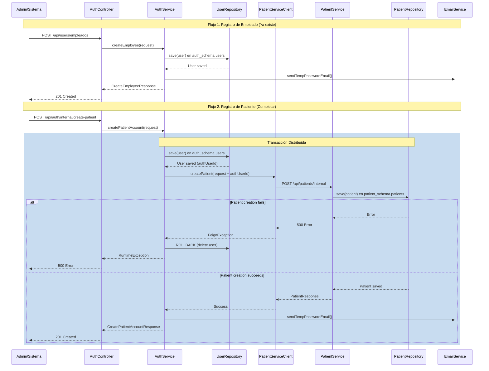

# Design Document: Patient-Employee Registration System

## Overview

Sistema de registro diferenciado para usuarios del HIS (Hospital Information System) que implementa dos flujos completamente funcionales: registro de empleados (ADMIN, DOCTOR, ADMISSION, etc.) y registro de pacientes con datos médicos completos. El sistema garantiza transacciones atómicas entre auth-service y patient-service, asegurando consistencia de datos mediante comunicación Feign Client y rollback automático en caso de fallo.

## Main Algorithm/Workflow



## Core Interfaces/Types

```java
// DTO para registro de empleados (ya existe)
public class CreateEmployeeRequest {
    private String firstName;
    private String secondName;
    private String firstLastName;
    private String secondLastName;
    private String email;
    private String phone;
    private String roleName; // ADMIN, DOCTOR, ADMISSION, etc.
}

// DTO para registro de pacientes (actualizar con campos médicos)
public class CreatePatientAccountRequest {
    private String dpi;              // 13 dígitos - Username
    private String email;
    private String firstName;
    private String secondName;
    private String firstLastName;
    private String secondLastName;
    private String phone;            // 8 dígitos
    
    // Campos médicos obligatorios (NUEVOS)
    private String birthDate;        // YYYY-MM-DD
    private String gender;           // M o F
    
    // Campos médicos opcionales (NUEVOS)
    private String nit;
    private String department;
    private String municipality;
    private String zone;
    private String address;
}

// DTO para comunicación con patient-service (NUEVO)
public class CreatePatientInternalRequest {
    private String id;               // UUID del usuario en auth
    private String dpi;
    private String nit;
    private String firstName;
    private String secondName;
    private String firstLastName;
    private String secondLastName;
    private String birthDate;
    private String gender;
    private String email;
    private String phone;
    private String department;
    private String municipality;
    private String zone;
    private String address;
    private String authUserId;       // Mismo que id
    private Boolean active;
}

// Feign Client para patient-service (NUEVO)
@FeignClient(name = "patient-service", path = "/api/patients")
public interface PatientServiceClient {
    @PostMapping("/internal")
    PatientResponse createPatient(@RequestBody CreatePatientInternalRequest request);
}

// Response del patient-service (NUEVO)
public class PatientResponse {
    private String id;
    private String dpi;
    private String fullName;
    private String email;
    private String authUserId;
    private Boolean active;
}
```

## Key Functions with Formal Specifications

### Function 1: createEmployee()

```java
@Transactional
public CreateEmployeeResponse createEmployee(CreateEmployeeRequest request)
```

**Preconditions:**
- `request` is non-null and validated
- `request.email` is unique in auth_schema.users
- `request.roleName` exists in auth_schema.roles
- `request.roleName` is NOT "PATIENT"
- `request.phone` matches pattern `\\d{8}`
- Caller has ADMIN role

**Postconditions:**
- User created in auth_schema.users with generated username
- Username format: `{firstName}.{firstLastName}` (lowercase, no accents)
- User has exactly one role matching `request.roleName`
- `user.active` is true
- Temporary password generated (8 chars: 1 uppercase, 1 lowercase, 1 digit)
- Email sent with credentials
- Returns CreateEmployeeResponse with user data and temporary password

**Loop Invariants:** N/A (no loops in main logic)

### Function 2: createPatientAccount()

```java
@Transactional
public CreatePatientAccountResponse createPatientAccount(CreatePatientAccountRequest request)
```

**Preconditions:**
- `request` is non-null and validated
- `request.dpi` is unique in auth_schema.users (13 digits)
- `request.email` is unique in auth_schema.users
- `request.birthDate` matches pattern `\\d{4}-\\d{2}-\\d{2}`
- `request.gender` is "M" or "F"
- `request.phone` matches pattern `\\d{8}`
- patient-service is available and reachable

**Postconditions:**
- User created in auth_schema.users with username = DPI
- User has exactly one role: PATIENT
- `user.active` is true
- Patient created in patient_schema.patients with auth_user_id = user.id
- If patient creation fails, user creation is rolled back (no orphan records)
- Temporary password generated (8 chars: 1 uppercase, 1 lowercase, 1 digit)
- Email sent with credentials
- Returns CreatePatientAccountResponse with user data and temporary password

**Loop Invariants:** N/A (no loops in main logic)

### Function 3: validatePatientRequest()

```java
private void validatePatientRequest(CreatePatientAccountRequest request)
```

**Preconditions:**
- `request` is non-null

**Postconditions:**
- If validation passes: returns normally
- If validation fails: throws ValidationException with descriptive message
- Validates: DPI format (13 digits), email format, birthDate format (YYYY-MM-DD), gender (M/F), phone (8 digits)

**Loop Invariants:** N/A

## Algorithmic Pseudocode

### Main Processing Algorithm: Employee Registration

```java
ALGORITHM createEmployee(request)
INPUT: request of type CreateEmployeeRequest
OUTPUT: response of type CreateEmployeeResponse

BEGIN
  // Step 1: Validate uniqueness
  ASSERT userRepository.findByEmail(request.email) IS EMPTY
  ASSERT roleRepository.findByName(request.roleName) IS NOT EMPTY
  ASSERT request.roleName != "PATIENT"
  
  // Step 2: Generate username
  username ← generateUsername(request.firstName, request.firstLastName)
  WHILE userRepository.findByUsername(username) IS NOT EMPTY DO
    username ← username + randomDigit()
  END WHILE
  
  // Step 3: Generate temporary password
  tempPassword ← generateTempPassword()
  
  // Step 4: Create user entity
  user ← User.builder()
    .username(username)
    .email(request.email)
    .password(passwordEncoder.encode(tempPassword))
    .firstName(request.firstName)
    .secondName(request.secondName)
    .firstLastName(request.firstLastName)
    .secondLastName(request.secondLastName)
    .phone(request.phone)
    .active(true)
    .roles(Set.of(role))
    .build()
  
  // Step 5: Save to database
  savedUser ← userRepository.save(user)
  
  // Step 6: Send email with credentials
  emailService.sendTempPasswordEmail(
    savedUser.email,
    savedUser.firstName,
    savedUser.username,
    tempPassword
  )
  
  // Step 7: Return response
  RETURN CreateEmployeeResponse(
    savedUser.id,
    savedUser.username,
    tempPassword,
    "Empleado registrado exitosamente"
  )
END
```

**Preconditions:**
- request is validated
- email is unique
- role exists and is not PATIENT

**Postconditions:**
- User created in auth_schema.users
- Email sent with credentials
- Response contains temporary password

**Loop Invariants:**
- Username generation loop: all previously checked usernames were taken

### Main Processing Algorithm: Patient Registration

```java
ALGORITHM createPatientAccount(request)
INPUT: request of type CreatePatientAccountRequest
OUTPUT: response of type CreatePatientAccountResponse

BEGIN
  // Step 1: Validate request
  validatePatientRequest(request)
  ASSERT userRepository.findByUsername(request.dpi) IS EMPTY
  ASSERT userRepository.findByEmail(request.email) IS EMPTY
  
  // Step 2: Get PATIENT role
  patientRole ← roleRepository.findByName("PATIENT")
  ASSERT patientRole IS NOT NULL
  
  // Step 3: Generate temporary password
  tempPassword ← generateTempPassword()
  
  // Step 4: Create user entity
  user ← User.builder()
    .username(request.dpi)
    .email(request.email)
    .password(passwordEncoder.encode(tempPassword))
    .firstName(request.firstName)
    .secondName(request.secondName)
    .firstLastName(request.firstLastName)
    .secondLastName(request.secondLastName)
    .phone(request.phone)
    .active(true)
    .roles(Set.of(patientRole))
    .build()
  
  // Step 5: Save user to auth_schema.users
  savedUser ← userRepository.save(user)
  
  // Step 6: Create patient in patient_schema.patients
  TRY
    patientRequest ← CreatePatientInternalRequest.builder()
      .id(savedUser.id.toString())
      .dpi(request.dpi)
      .nit(request.nit)
      .firstName(request.firstName)
      .secondName(request.secondName)
      .firstLastName(request.firstLastName)
      .secondLastName(request.secondLastName)
      .birthDate(request.birthDate)
      .gender(request.gender)
      .email(request.email)
      .phone(request.phone)
      .department(request.department)
      .municipality(request.municipality)
      .zone(request.zone)
      .address(request.address)
      .authUserId(savedUser.id.toString())
      .active(true)
      .build()
    
    patientResponse ← patientServiceClient.createPatient(patientRequest)
    ASSERT patientResponse IS NOT NULL
    
  CATCH FeignException e
    LOG "Error creating patient in patient-service: " + e.message
    THROW RuntimeException("Error al crear registro de paciente")
    // @Transactional will rollback user creation
  END TRY
  
  // Step 7: Send email with credentials
  emailService.sendTempPasswordEmail(
    savedUser.email,
    savedUser.firstName,
    savedUser.username,
    tempPassword
  )
  
  // Step 8: Return response
  RETURN CreatePatientAccountResponse(
    savedUser.id.toString(),
    savedUser.username,
    tempPassword,
    "Cuenta creada. Se envió la contraseña temporal al correo del paciente."
  )
END
```

**Preconditions:**
- request is validated with medical fields
- DPI is unique (13 digits)
- email is unique
- birthDate is valid (YYYY-MM-DD)
- gender is M or F
- patient-service is reachable

**Postconditions:**
- User created in auth_schema.users with username = DPI
- Patient created in patient_schema.patients with auth_user_id = user.id
- If patient creation fails, user creation is rolled back
- Email sent with credentials
- Response contains temporary password

**Loop Invariants:** N/A

### Validation Algorithm: Patient Request

```java
ALGORITHM validatePatientRequest(request)
INPUT: request of type CreatePatientAccountRequest
OUTPUT: void (throws exception if invalid)

BEGIN
  // Validate DPI format
  IF request.dpi IS NULL OR NOT matches("\\d{13}") THEN
    THROW ValidationException("El DPI debe tener 13 dígitos")
  END IF
  
  // Validate birthDate format
  IF request.birthDate IS NULL OR NOT matches("\\d{4}-\\d{2}-\\d{2}") THEN
    THROW ValidationException("Formato de fecha inválido (YYYY-MM-DD)")
  END IF
  
  // Validate birthDate is in the past
  birthDateParsed ← LocalDate.parse(request.birthDate)
  IF birthDateParsed >= LocalDate.now() THEN
    THROW ValidationException("La fecha de nacimiento debe ser en el pasado")
  END IF
  
  // Validate gender
  IF request.gender IS NULL OR (request.gender != "M" AND request.gender != "F") THEN
    THROW ValidationException("El género debe ser M o F")
  END IF
  
  // Validate email format
  IF request.email IS NULL OR NOT matches email pattern THEN
    THROW ValidationException("Formato de correo inválido")
  END IF
  
  // Validate phone format
  IF request.phone IS NULL OR NOT matches("\\d{8}") THEN
    THROW ValidationException("El teléfono debe tener 8 dígitos")
  END IF
  
  // All validations passed
  RETURN
END
```

**Preconditions:**
- request parameter is provided (may be null or invalid)

**Postconditions:**
- Returns normally if all validations pass
- Throws ValidationException with descriptive message if any validation fails
- No side effects on request parameter

**Loop Invariants:** N/A

## Example Usage

```java
// Example 1: Employee Registration (existing flow)
CreateEmployeeRequest employeeRequest = new CreateEmployeeRequest();
employeeRequest.setFirstName("Juan");
employeeRequest.setSecondName("Carlos");
employeeRequest.setFirstLastName("Pérez");
employeeRequest.setSecondLastName("García");
employeeRequest.setEmail("doctor@hospital.com");
employeeRequest.setPhone("12345678");
employeeRequest.setRoleName("DOCTOR");

CreateEmployeeResponse employeeResponse = authService.createEmployee(employeeRequest);
// Result: User created with username "juan.perez", role DOCTOR, temp password sent

// Example 2: Patient Registration (new complete flow)
CreatePatientAccountRequest patientRequest = new CreatePatientAccountRequest();
patientRequest.setDpi("1234567890123");
patientRequest.setEmail("maria.lopez@gmail.com");
patientRequest.setFirstName("María");
patientRequest.setSecondName("Elena");
patientRequest.setFirstLastName("López");
patientRequest.setSecondLastName("Martínez");
patientRequest.setPhone("87654321");
patientRequest.setBirthDate("1990-05-15");
patientRequest.setGender("F");
patientRequest.setNit("1234567-8");
patientRequest.setDepartment("Guatemala");
patientRequest.setMunicipality("Guatemala");
patientRequest.setZone("10");
patientRequest.setAddress("5ta Avenida 10-20 Zona 10");

CreatePatientAccountResponse patientResponse = authService.createPatientAccount(patientRequest);
// Result: 
// - User created in auth_schema.users with username "1234567890123", role PATIENT
// - Patient created in patient_schema.patients with all medical data
// - Temp password sent to email

// Example 3: Login with DPI (works for both employees and patients)
LoginRequest loginRequest = new LoginRequest();
loginRequest.setUsername("1234567890123"); // Can be DPI, username, or email
loginRequest.setPassword("Abc123xy");

LoginResponse loginResponse = authService.login(
    loginRequest.getUsername(),
    loginRequest.getPassword()
);
// Result: JWT token generated, user data returned

// Example 4: Error handling - Patient creation fails
try {
    CreatePatientAccountRequest invalidRequest = new CreatePatientAccountRequest();
    invalidRequest.setDpi("1234567890123");
    invalidRequest.setEmail("test@test.com");
    invalidRequest.setBirthDate("invalid-date"); // Invalid format
    
    authService.createPatientAccount(invalidRequest);
} catch (ValidationException e) {
    // Caught: "Formato de fecha inválido (YYYY-MM-DD)"
    // No records created in database
}

// Example 5: Error handling - Patient service unavailable
try {
    CreatePatientAccountRequest request = new CreatePatientAccountRequest();
    // ... set all valid fields ...
    
    authService.createPatientAccount(request);
    // If patient-service fails, FeignException is caught
} catch (RuntimeException e) {
    // Caught: "Error al crear registro de paciente"
    // User creation rolled back automatically by @Transactional
    // No orphan records in auth_schema.users
}
```

## Correctness Properties

### Property 1: No Orphan User Records
```java
∀ user ∈ auth_schema.users WHERE user.roles CONTAINS "PATIENT"
  ⟹ ∃ patient ∈ patient_schema.patients WHERE patient.auth_user_id = user.id
```
**Meaning:** Every user with PATIENT role must have a corresponding patient record. No orphan users in auth schema.

### Property 2: Username Uniqueness by Type
```java
∀ user ∈ auth_schema.users WHERE user.roles CONTAINS "PATIENT"
  ⟹ user.username matches "\\d{13}" AND user.username is unique

∀ user ∈ auth_schema.users WHERE user.roles NOT CONTAINS "PATIENT"
  ⟹ user.username matches "[a-z]+\\.[a-z]+(\\d*)" AND user.username is unique
```
**Meaning:** Patient usernames are always 13-digit DPIs. Employee usernames follow firstname.lastname pattern.

### Property 3: Email Uniqueness
```java
∀ user1, user2 ∈ auth_schema.users WHERE user1 ≠ user2
  ⟹ user1.email ≠ user2.email
```
**Meaning:** Email addresses are globally unique across all users.

### Property 4: DPI Uniqueness
```java
∀ patient1, patient2 ∈ patient_schema.patients WHERE patient1 ≠ patient2
  ⟹ patient1.dpi ≠ patient2.dpi
```
**Meaning:** DPI is unique across all patients.

### Property 5: Transactional Atomicity
```java
IF createPatientAccount(request) throws Exception
  ⟹ ¬∃ user ∈ auth_schema.users WHERE user.username = request.dpi
  AND ¬∃ patient ∈ patient_schema.patients WHERE patient.dpi = request.dpi
```
**Meaning:** If patient registration fails, no partial records exist in either schema.

### Property 6: Role Assignment Correctness
```java
∀ user ∈ auth_schema.users
  ⟹ (user.roles CONTAINS "PATIENT" ⟺ user.username matches "\\d{13}")
  AND (user.roles NOT CONTAINS "PATIENT" ⟺ user.username matches "[a-z]+\\.[a-z]+(\\d*)")
```
**Meaning:** PATIENT role is assigned if and only if username is a DPI. Non-patient roles have generated usernames.

### Property 7: Medical Data Completeness
```java
∀ patient ∈ patient_schema.patients
  ⟹ patient.birth_date IS NOT NULL
  AND patient.gender ∈ {"M", "F"}
  AND patient.dpi matches "\\d{13}"
```
**Meaning:** All patients have mandatory medical fields populated with valid values.

### Property 8: Auth User Reference Integrity
```java
∀ patient ∈ patient_schema.patients
  ⟹ ∃ user ∈ auth_schema.users WHERE user.id = patient.auth_user_id
  AND user.roles CONTAINS "PATIENT"
```
**Meaning:** Every patient record references a valid user with PATIENT role.

### Property 9: Temporary Password Security
```java
∀ tempPassword generated by generateTempPassword()
  ⟹ length(tempPassword) = 8
  AND contains(tempPassword, uppercase) ≥ 1
  AND contains(tempPassword, lowercase) ≥ 1
  AND contains(tempPassword, digit) ≥ 1
```
**Meaning:** All temporary passwords meet minimum security requirements.

### Property 10: Active Status Consistency
```java
∀ patient ∈ patient_schema.patients
  ⟹ ∃ user ∈ auth_schema.users WHERE user.id = patient.auth_user_id
  AND user.active = patient.active
```
**Meaning:** Active status is consistent between user and patient records.
