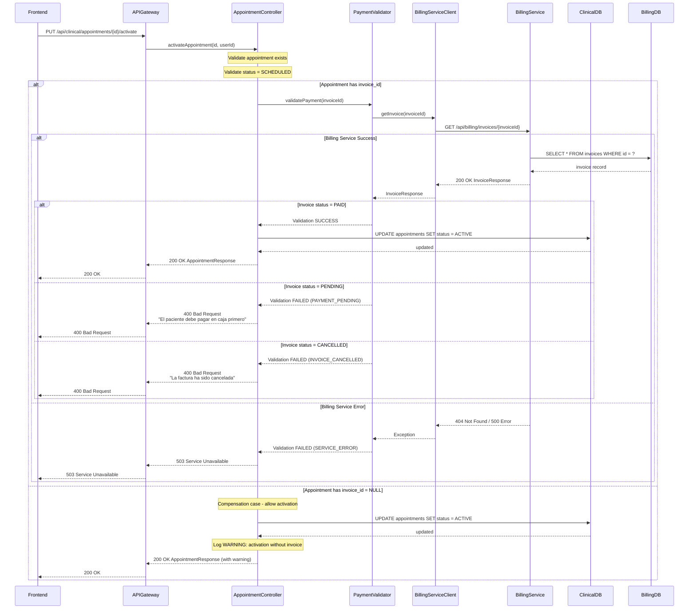
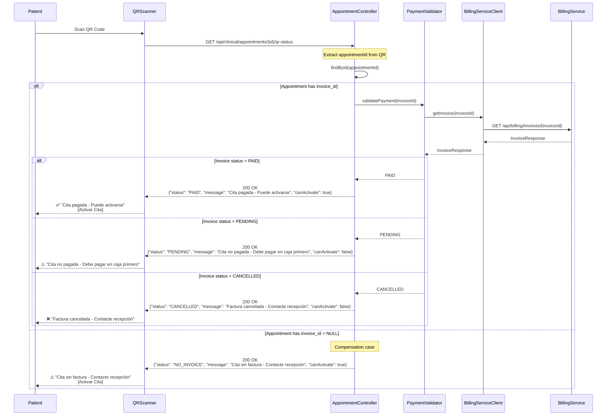
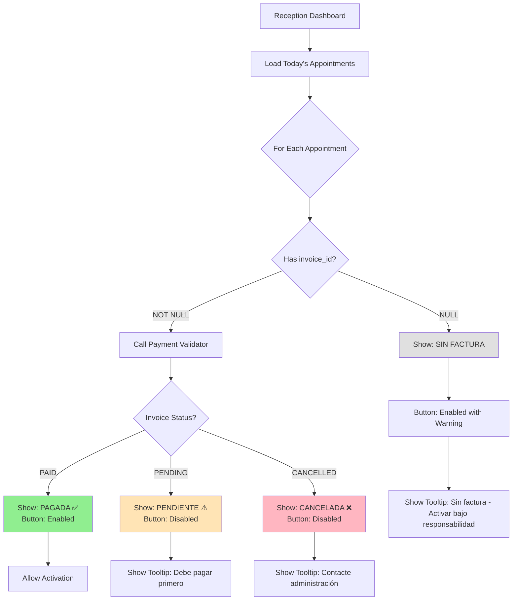
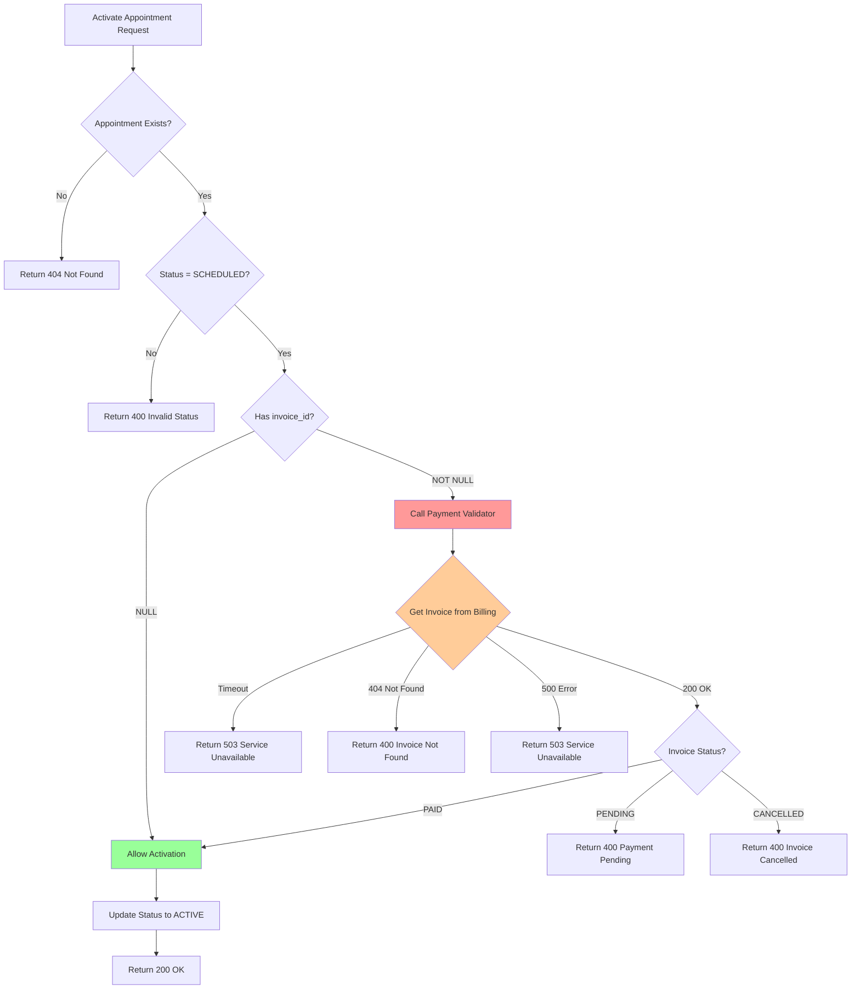

# Design Document: Payment Validation Before Activation

## Overview

La validación de pago antes de activar citas médicas garantiza que solo los pacientes que han pagado su consulta puedan aparecer en el sistema de triaje. Esta funcionalidad previene que pacientes sin pago confirmado sean atendidos, mejora el control financiero del hospital, y asegura que el flujo de caja sea consistente con la atención médica brindada.

**Problema actual**: El endpoint de activación de citas (`PUT /api/clinical/appointments/{id}/activate`) no valida el estado de pago de la factura asociada. Esto permite que citas con facturas en estado PENDING (no pagadas) sean activadas y aparezcan en triaje, generando inconsistencias entre pacientes atendidos y pagos recibidos.

**Solución propuesta**: Agregar validación en el endpoint de activación que consulte el estado de la factura en Billing Service antes de permitir la activación. Solo citas con facturas en estado PAID podrán activarse. Citas sin invoice_id (NULL) se permitirán activar como caso de compensación.

**Arquitectura**: Microservicios con DDD | **Comunicación**: REST síncrona | **Principio**: CERO JOINs entre esquemas

**Dependencias**: Esta feature se construye sobre `appointment-billing-integration` que ya implementó:
- BillingServiceClient con circuit breaker y retry
- Creación automática de facturas al crear citas
- Campo `invoice_id` en tabla appointments
- Campo `appointment_id` en tabla invoices

## Architecture

### System Context Diagram

```mermaid
graph TB
    subgraph "Clinical Service (8083)"
        AC[AppointmentController]
        PV[PaymentValidator]
        BSC[BillingServiceClient]
        AR[AppointmentRepository]
    end
    
    subgraph "Billing Service (8086)"
        IC[InvoiceController]
        IS[InvoiceService]
        IR[InvoiceRepository]
    end
    
    subgraph "API Gateway (8080)"
        AG[Gateway]
    end
    
    subgraph "Databases"
        CDB[(clinical_schema)]
        BDB[(billing_schema)]
    end
    
    AC -->|1. activateAppointment| PV
    PV -->|2. validatePayment| BSC
    BSC -->|3. GET /api/billing/invoices/{id}| AG
    AG -->|4. route| IC
    IC -->|5. getInvoice| IS
    IS -->|6. findById| IR
    IR -->|7. query| BDB
    IS -->|8. return Invoice| IC
    IC -->|9. return InvoiceResponse| AG
    AG -->|10. return| BSC
    BSC -->|11. return InvoiceResponse| PV
    PV -->|12. validate status| PV
    PV -->|13. return validation result| AC
    AC -->|14. update appointment| AR
    AR -->|15. persist| CDB
    AC -->|16. return response| AG
    
    style PV fill:#ff9999
    style IC fill:#99ccff
```

### Activation Sequence Diagram



### QR Scanning Flow



### Reception UI Flow





---

## Components and Interfaces

### 1. PaymentValidator (NEW Component)

**Purpose**: Validates payment status before allowing appointment activation

**Location**: `clinical-service/src/main/java/com/medframe/clinical/domain/service/PaymentValidator.java`

```java
package com.medframe.clinical.domain.service;

import com.medframe.clinical.infrastructure.client.BillingServiceClient;
import com.medframe.clinical.infrastructure.client.dto.InvoiceResponse;
import com.medframe.clinical.domain.exception.PaymentValidationException;
import lombok.RequiredArgsConstructor;
import lombok.extern.slf4j.Slf4j;
import org.springframework.boot.context.properties.ConfigurationProperties;
import org.springframework.stereotype.Component;

/**
 * Validates payment status before appointment activation.
 * 
 * Business Rules:
 * - Only appointments with PAID invoices can be activated
 * - Appointments with NULL invoice_id can be activated (compensation case)
 * - PENDING or CANCELLED invoices block activation
 */
@Component
@Slf4j
@RequiredArgsConstructor
public class PaymentValidator {
    
    private final BillingServiceClient billingServiceClient;
    private final PaymentValidationConfig config;
    
    /**
     * Validates payment for an appointment.
     * 
     * @param invoiceId the invoice ID to validate (can be null)
     * @param appointmentId the appointment ID (for logging)
     * @return PaymentValidationResult with status and error details
     */
    public PaymentValidationResult validatePayment(String invoiceId, String appointmentId) {
        // Case 1: No invoice (compensation case) - allow activation
        if (invoiceId == null) {
            log.warn("Activating appointment {} without invoice validation (invoice_id = NULL)", 
                     appointmentId);
            return PaymentValidationResult.allowedWithoutInvoice();
        }
        
        // Case 2: Validation disabled by configuration
        if (!config.isEnabled()) {
            log.warn("Payment validation is DISABLED. Allowing activation of appointment {} " +
                     "without checking invoice {}", appointmentId, invoiceId);
            return PaymentValidationResult.allowedWithoutValidation();
        }
        
        // Case 3: Validate invoice status
        try {
            log.info("Validating payment for appointment {}, invoice {}", appointmentId, invoiceId);
            
            InvoiceResponse invoice = billingServiceClient.getInvoice(invoiceId);
            
            if (invoice == null) {
                log.error("Invoice {} not found for appointment {}", invoiceId, appointmentId);
                return PaymentValidationResult.failed(
                    PaymentValidationError.INVOICE_NOT_FOUND,
                    "La factura asociada a esta cita no existe en el sistema."
                );
            }
            
            String status = invoice.getStatus();
            
            if ("PAID".equals(status)) {
                log.info("Payment validation SUCCESS for appointment {}, invoice {} is PAID", 
                         appointmentId, invoiceId);
                return PaymentValidationResult.success(invoice);
            }
            
            if ("PENDING".equals(status)) {
                log.error("Payment validation FAILED for appointment {}, invoice {} is PENDING", 
                          appointmentId, invoiceId);
                return PaymentValidationResult.failed(
                    PaymentValidationError.PAYMENT_PENDING,
                    "La cita no puede activarse. El paciente debe pagar en caja primero."
                );
            }
            
            if ("CANCELLED".equals(status)) {
                log.error("Payment validation FAILED for appointment {}, invoice {} is CANCELLED", 
                          appointmentId, invoiceId);
                return PaymentValidationResult.failed(
                    PaymentValidationError.INVOICE_CANCELLED,
                    "La cita no puede activarse. La factura ha sido cancelada."
                );
            }
            
            // Unknown status
            log.error("Unknown invoice status {} for appointment {}, invoice {}", 
                      status, appointmentId, invoiceId);
            return PaymentValidationResult.failed(
                PaymentValidationError.UNKNOWN_STATUS,
                "Estado de factura desconocido: " + status
            );
            
        } catch (BillingServiceTimeoutException e) {
            log.error("Billing Service timeout while validating payment for appointment {}: {}", 
                      appointmentId, e.getMessage());
            return PaymentValidationResult.failed(
                PaymentValidationError.SERVICE_TIMEOUT,
                "El sistema de facturación no está disponible. Intente nuevamente en unos momentos."
            );
            
        } catch (BillingServiceException e) {
            log.error("Billing Service error while validating payment for appointment {}: {}", 
                      appointmentId, e.getMessage(), e);
            return PaymentValidationResult.failed(
                PaymentValidationError.SERVICE_ERROR,
                "El sistema de facturación no está disponible. Intente nuevamente en unos momentos."
            );
        }
    }
}

/**
 * Configuration for payment validation feature.
 */
@Component
@ConfigurationProperties(prefix = "payment.validation")
@Data
class PaymentValidationConfig {
    private boolean enabled = true; // Default: enabled
}

/**
 * Result of payment validation.
 */
@Data
@AllArgsConstructor
class PaymentValidationResult {
    private boolean allowed;
    private PaymentValidationError error;
    private String errorMessage;
    private InvoiceResponse invoice;
    private boolean hasWarning;
    private String warningMessage;
    
    public static PaymentValidationResult success(InvoiceResponse invoice) {
        return new PaymentValidationResult(true, null, null, invoice, false, null);
    }
    
    public static PaymentValidationResult allowedWithoutInvoice() {
        return new PaymentValidationResult(
            true, null, null, null, true, 
            "Cita activada sin factura asociada (caso de compensación)"
        );
    }
    
    public static PaymentValidationResult allowedWithoutValidation() {
        return new PaymentValidationResult(
            true, null, null, null, true, 
            "Validación de pago deshabilitada por configuración"
        );
    }
    
    public static PaymentValidationResult failed(PaymentValidationError error, String message) {
        return new PaymentValidationResult(false, error, message, null, false, null);
    }
}

/**
 * Payment validation error codes.
 */
enum PaymentValidationError {
    PAYMENT_PENDING,
    INVOICE_CANCELLED,
    INVOICE_NOT_FOUND,
    SERVICE_TIMEOUT,
    SERVICE_ERROR,
    UNKNOWN_STATUS
}
```

### 2. Modified BillingServiceClient

**Add new method**: `getInvoice(String invoiceId)`

```java
/**
 * Gets an invoice by ID from Billing Service.
 * 
 * Circuit Breaker: Opens after 5 consecutive failures, half-open after 30s
 * Retry: 2 attempts with exponential backoff (500ms, 1s)
 * Timeout: 3 seconds per request
 * 
 * @param invoiceId the invoice ID to retrieve
 * @return InvoiceResponse with invoice details
 * @throws BillingServiceException if the call fails after retries
 * @throws BillingServiceTimeoutException if the call times out
 */
@CircuitBreaker(name = "billingService", fallbackMethod = "getInvoiceFallback")
@Retry(name = "billingServiceGet")
public InvoiceResponse getInvoice(String invoiceId) {
    log.info("Calling Billing Service to get invoice: {}", invoiceId);
    
    HttpHeaders headers = new HttpHeaders();
    headers.set("X-Service-Name", "clinical-service");
    headers.set("Accept", "application/json");
    
    HttpEntity<Void> entity = new HttpEntity<>(headers);
    
    try {
        ResponseEntity<InvoiceResponse> response = restTemplate.exchange(
            billingServiceUrl + "/api/billing/invoices/" + invoiceId,
            HttpMethod.GET,
            entity,
            InvoiceResponse.class
        );
        
        log.info("Invoice retrieved successfully: {}", invoiceId);
        return response.getBody();
        
    } catch (HttpClientErrorException.NotFound e) {
        log.error("Invoice not found: {}", invoiceId);
        return null; // Signals invoice not found
        
    } catch (ResourceAccessException e) {
        log.error("Timeout calling Billing Service for invoice {}: {}", invoiceId, e.getMessage());
        throw new BillingServiceTimeoutException("Billing Service timeout", e);
        
    } catch (Exception e) {
        log.error("Error calling Billing Service for invoice {}: {}", invoiceId, e.getMessage(), e);
        throw new BillingServiceException("Failed to get invoice from Billing Service", e);
    }
}

/**
 * Fallback method when circuit breaker is open or all retries fail.
 */
private InvoiceResponse getInvoiceFallback(String invoiceId, Exception e) {
    log.error("Circuit breaker OPEN or retries exhausted for Billing Service. " +
              "Invoice: {}, Error: {}", invoiceId, e.getMessage());
    throw new BillingServiceException("Billing Service unavailable", e);
}
```

**New Exception Classes**:

```java
package com.medframe.clinical.infrastructure.client;

public class BillingServiceException extends RuntimeException {
    public BillingServiceException(String message) {
        super(message);
    }
    
    public BillingServiceException(String message, Throwable cause) {
        super(message, cause);
    }
}

public class BillingServiceTimeoutException extends BillingServiceException {
    public BillingServiceTimeoutException(String message, Throwable cause) {
        super(message, cause);
    }
}
```

### 3. Modified AppointmentController

**Updated activateAppointment() method**:

```java
/**
 * Activates an appointment (changes status from SCHEDULED to ACTIVE).
 * Validates payment before activation.
 * 
 * @param id the appointment ID
 * @param userId the user ID performing the activation (for audit)
 * @return AppointmentResponse with updated status
 */
@PutMapping("/{id}/activate")
public ResponseEntity<AppointmentResponse> activateAppointment(
        @PathVariable String id,
        @RequestHeader("X-User-Id") String userId) {
    
    log.info("Activating appointment {} by user {}", id, userId);
    
    // 1. Validate appointment exists
    Appointment appointment = appointmentRepository.findById(id)
        .orElseThrow(() -> new AppointmentNotFoundException("Cita no encontrada: " + id));
    
    // 2. Validate appointment is in SCHEDULED status
    if (appointment.getStatus() != AppointmentStatus.SCHEDULED) {
        log.error("Cannot activate appointment {} with status {}", id, appointment.getStatus());
        throw new InvalidAppointmentStatusException(
            "Solo se pueden activar citas en estado SCHEDULED"
        );
    }
    
    // 3. Validate payment
    PaymentValidationResult validationResult = paymentValidator.validatePayment(
        appointment.getInvoiceId(), 
        appointment.getId()
    );
    
    if (!validationResult.isAllowed()) {
        log.error("Payment validation failed for appointment {}: {}", 
                  id, validationResult.getErrorMessage());
        
        // Map error to appropriate HTTP status
        if (validationResult.getError() == PaymentValidationError.SERVICE_TIMEOUT ||
            validationResult.getError() == PaymentValidationError.SERVICE_ERROR) {
            throw new ServiceUnavailableException(validationResult.getErrorMessage());
        } else {
            throw new PaymentValidationException(
                validationResult.getError(),
                validationResult.getErrorMessage()
            );
        }
    }
    
    // 4. Activate appointment
    appointment.setStatus(AppointmentStatus.ACTIVE);
    appointment.setUpdatedAt(LocalDateTime.now());
    appointment.setUpdatedBy(userId);
    
    Appointment updated = appointmentRepository.save(appointment);
    
    log.info("Appointment {} activated successfully by user {}", id, userId);
    
    // 5. Build response with warning if applicable
    AppointmentResponse response = mapToResponse(updated);
    if (validationResult.isHasWarning()) {
        response.setWarning(validationResult.getWarningMessage());
    }
    
    return ResponseEntity.ok(response);
}
```

**New Exception Classes**:

```java
package com.medframe.clinical.domain.exception;

@ResponseStatus(HttpStatus.BAD_REQUEST)
public class PaymentValidationException extends RuntimeException {
    private final PaymentValidationError errorCode;
    
    public PaymentValidationException(PaymentValidationError errorCode, String message) {
        super(message);
        this.errorCode = errorCode;
    }
    
    public PaymentValidationError getErrorCode() {
        return errorCode;
    }
}

@ResponseStatus(HttpStatus.SERVICE_UNAVAILABLE)
public class ServiceUnavailableException extends RuntimeException {
    public ServiceUnavailableException(String message) {
        super(message);
    }
}

@ResponseStatus(HttpStatus.BAD_REQUEST)
public class InvalidAppointmentStatusException extends RuntimeException {
    public InvalidAppointmentStatusException(String message) {
        super(message);
    }
}
```

### 4. Billing Service - New GET Endpoint

**InvoiceController - Add getInvoice() method**:

```java
/**
 * Gets an invoice by ID.
 * Used by Clinical Service to validate payment before appointment activation.
 * 
 * @param id the invoice ID
 * @return InvoiceResponse with invoice details
 */
@GetMapping("/{id}")
public ResponseEntity<InvoiceResponse> getInvoice(@PathVariable String id) {
    log.info("Getting invoice by ID: {}", id);
    
    InvoiceResponse response = invoiceService.getInvoiceById(id);
    return ResponseEntity.ok(response);
}
```

**InvoiceService - Add getInvoiceById() method**:

```java
/**
 * Gets an invoice by ID.
 * 
 * @param id the invoice ID
 * @return InvoiceResponse with invoice details
 * @throws InvoiceNotFoundException if invoice not found
 */
@Transactional(readOnly = true)
public InvoiceResponse getInvoiceById(String id) {
    Invoice invoice = invoiceRepository.findById(id)
        .orElseThrow(() -> new InvoiceNotFoundException("Factura no encontrada: " + id));
    
    return mapToResponse(invoice);
}
```

**Exception Handler**:

```java
@ResponseStatus(HttpStatus.NOT_FOUND)
public class InvoiceNotFoundException extends RuntimeException {
    public InvoiceNotFoundException(String message) {
        super(message);
    }
}
```

---

## QR Scanning and Reception UI Enhancements

### 5. QR Status Endpoint (NEW)

**Purpose**: Provides payment status when QR code is scanned

**Location**: `clinical-service/src/main/java/com/medframe/clinical/application/controller/AppointmentController.java`

```java
/**
 * Gets appointment payment status for QR scanning.
 * 
 * @param id the appointment ID
 * @return QRStatusResponse with payment status and activation capability
 */
@GetMapping("/{id}/qr-status")
public ResponseEntity<QRStatusResponse> getQRStatus(@PathVariable String id) {
    log.info("Getting QR status for appointment: {}", id);
    
    // 1. Validate appointment exists
    Appointment appointment = appointmentRepository.findById(id)
        .orElseThrow(() -> new AppointmentNotFoundException("Cita no encontrada: " + id));
    
    // 2. Check payment status
    PaymentValidationResult validationResult = paymentValidator.validatePayment(
        appointment.getInvoiceId(), 
        appointment.getId()
    );
    
    // 3. Build response based on validation result
    QRStatusResponse response = QRStatusResponse.builder()
        .appointmentId(id)
        .patientName(getPatientName(appointment.getPatientId()))
        .doctorName(getDoctorName(appointment.getDoctorId()))
        .appointmentDate(appointment.getAppointmentDate())
        .appointmentTime(appointment.getAppointmentTime())
        .appointmentStatus(appointment.getStatus().name())
        .build();
    
    if (appointment.getInvoiceId() == null) {
        response.setPaymentStatus("NO_INVOICE");
        response.setMessage("Cita sin factura - Contacte recepción");
        response.setCanActivate(true);
        response.setWarning("Esta cita no tiene factura asociada");
    } else if (validationResult.isAllowed()) {
        response.setPaymentStatus("PAID");
        response.setMessage("Cita pagada - Puede activarse");
        response.setCanActivate(true);
        response.setInvoiceNumber(validationResult.getInvoice().getInvoiceNumber());
    } else {
        PaymentValidationError error = validationResult.getError();
        if (error == PaymentValidationError.PAYMENT_PENDING) {
            response.setPaymentStatus("PENDING");
            response.setMessage("Cita no pagada - Debe pagar en caja primero");
        } else if (error == PaymentValidationError.INVOICE_CANCELLED) {
            response.setPaymentStatus("CANCELLED");
            response.setMessage("Factura cancelada - Contacte recepción");
        } else {
            response.setPaymentStatus("ERROR");
            response.setMessage("Error al verificar pago - Contacte recepción");
        }
        response.setCanActivate(false);
    }
    
    return ResponseEntity.ok(response);
}
```

**QRStatusResponse DTO**:

```java
package com.medframe.clinical.application.dto;

import lombok.AllArgsConstructor;
import lombok.Builder;
import lombok.Data;
import lombok.NoArgsConstructor;

import java.time.LocalDate;
import java.time.LocalTime;

@Data
@Builder
@NoArgsConstructor
@AllArgsConstructor
public class QRStatusResponse {
    private String appointmentId;
    private String patientName;
    private String doctorName;
    private LocalDate appointmentDate;
    private LocalTime appointmentTime;
    private String appointmentStatus; // SCHEDULED, ACTIVE, COMPLETED, CANCELLED
    private String paymentStatus; // PAID, PENDING, CANCELLED, NO_INVOICE, ERROR
    private String message; // User-friendly message in Spanish
    private boolean canActivate; // Whether activation button should be enabled
    private String invoiceNumber; // Only present if paid
    private String warning; // Optional warning message
}
```

### 6. Reception UI Enhancements

**Purpose**: Show payment status in appointment list with visual indicators

**Backend Support - Enhanced Appointment List Endpoint**:

```java
/**
 * Gets appointments for today with payment status.
 * Enhanced to include payment validation for UI indicators.
 * 
 * @param date the date to filter appointments (optional, defaults to today)
 * @return List of AppointmentWithPaymentStatus
 */
@GetMapping("/today")
public ResponseEntity<List<AppointmentWithPaymentStatusResponse>> getTodaysAppointments(
        @RequestParam(required = false) @DateTimeFormat(iso = DateTimeFormat.ISO.DATE) LocalDate date) {
    
    LocalDate targetDate = date != null ? date : LocalDate.now();
    log.info("Getting appointments for date: {}", targetDate);
    
    List<Appointment> appointments = appointmentRepository.findByAppointmentDateAndStatus(
        targetDate, AppointmentStatus.SCHEDULED);
    
    List<AppointmentWithPaymentStatusResponse> response = appointments.stream()
        .map(this::mapToAppointmentWithPaymentStatus)
        .collect(Collectors.toList());
    
    return ResponseEntity.ok(response);
}

private AppointmentWithPaymentStatusResponse mapToAppointmentWithPaymentStatus(Appointment appointment) {
    AppointmentWithPaymentStatusResponse response = new AppointmentWithPaymentStatusResponse();
    
    // Basic appointment info
    response.setId(appointment.getId());
    response.setPatientName(getPatientName(appointment.getPatientId()));
    response.setDoctorName(getDoctorName(appointment.getDoctorId()));
    response.setAppointmentDate(appointment.getAppointmentDate());
    response.setAppointmentTime(appointment.getAppointmentTime());
    response.setStatus(appointment.getStatus().name());
    
    // Payment status validation
    if (appointment.getInvoiceId() == null) {
        response.setPaymentStatus("NO_INVOICE");
        response.setPaymentStatusLabel("SIN FACTURA");
        response.setCanActivate(true);
        response.setActivateButtonTooltip("Cita sin factura - Activar bajo responsabilidad");
        response.setPaymentStatusColor("gray");
    } else {
        try {
            PaymentValidationResult validationResult = paymentValidator.validatePayment(
                appointment.getInvoiceId(), appointment.getId());
            
            if (validationResult.isAllowed()) {
                response.setPaymentStatus("PAID");
                response.setPaymentStatusLabel("PAGADA");
                response.setCanActivate(true);
                response.setActivateButtonTooltip("Cita pagada - Puede activarse");
                response.setPaymentStatusColor("green");
                response.setInvoiceNumber(validationResult.getInvoice().getInvoiceNumber());
            } else {
                PaymentValidationError error = validationResult.getError();
                if (error == PaymentValidationError.PAYMENT_PENDING) {
                    response.setPaymentStatus("PENDING");
                    response.setPaymentStatusLabel("PENDIENTE");
                    response.setCanActivate(false);
                    response.setActivateButtonTooltip("El paciente debe pagar en caja primero");
                    response.setPaymentStatusColor("orange");
                } else if (error == PaymentValidationError.INVOICE_CANCELLED) {
                    response.setPaymentStatus("CANCELLED");
                    response.setPaymentStatusLabel("CANCELADA");
                    response.setCanActivate(false);
                    response.setActivateButtonTooltip("Factura cancelada - Contacte administración");
                    response.setPaymentStatusColor("red");
                } else {
                    response.setPaymentStatus("ERROR");
                    response.setPaymentStatusLabel("ERROR");
                    response.setCanActivate(false);
                    response.setActivateButtonTooltip("Error al verificar pago - Contacte soporte");
                    response.setPaymentStatusColor("red");
                }
            }
        } catch (Exception e) {
            log.error("Error validating payment for appointment {}: {}", appointment.getId(), e.getMessage());
            response.setPaymentStatus("ERROR");
            response.setPaymentStatusLabel("ERROR");
            response.setCanActivate(false);
            response.setActivateButtonTooltip("Error al verificar pago - Contacte soporte");
            response.setPaymentStatusColor("red");
        }
    }
    
    return response;
}
```

**AppointmentWithPaymentStatusResponse DTO**:

```java
package com.medframe.clinical.application.dto;

import lombok.AllArgsConstructor;
import lombok.Data;
import lombok.NoArgsConstructor;

import java.time.LocalDate;
import java.time.LocalTime;

@Data
@NoArgsConstructor
@AllArgsConstructor
public class AppointmentWithPaymentStatusResponse {
    // Basic appointment info
    private String id;
    private String patientName;
    private String doctorName;
    private LocalDate appointmentDate;
    private LocalTime appointmentTime;
    private String status;
    
    // Payment status info
    private String paymentStatus; // PAID, PENDING, CANCELLED, NO_INVOICE, ERROR
    private String paymentStatusLabel; // PAGADA, PENDIENTE, CANCELADA, SIN FACTURA, ERROR
    private String paymentStatusColor; // green, orange, red, gray
    private boolean canActivate; // Whether activate button should be enabled
    private String activateButtonTooltip; // Tooltip text for activate button
    private String invoiceNumber; // Only present if paid
}
```

---

## Data Models

No database schema changes are required. This feature uses existing fields:
- `appointments.invoice_id` (already exists from appointment-billing-integration)
- `invoices.id` (primary key)
- `invoices.status` (PENDING, PAID, CANCELLED)

### Invoice Status Enum

```java
public enum InvoiceStatus {
    PENDING,   // Invoice created, awaiting payment
    PAID,      // Payment received
    CANCELLED  // Invoice cancelled
}
```

---

## Error Handling

### Error Response Format

```json
{
  "timestamp": "2025-01-20T10:30:00",
  "status": 400,
  "error": "Bad Request",
  "errorCode": "PAYMENT_PENDING",
  "message": "La cita no puede activarse. El paciente debe pagar en caja primero.",
  "path": "/api/clinical/appointments/123/activate",
  "requestId": "abc-123-def"
}
```

### Error Codes and Messages

| Error Code | HTTP Status | Message (Spanish) |
|------------|-------------|-------------------|
| PAYMENT_PENDING | 400 | La cita no puede activarse. El paciente debe pagar en caja primero. |
| INVOICE_CANCELLED | 400 | La cita no puede activarse. La factura ha sido cancelada. |
| INVOICE_NOT_FOUND | 400 | La factura asociada a esta cita no existe en el sistema. |
| SERVICE_TIMEOUT | 503 | El sistema de facturación no está disponible. Intente nuevamente en unos momentos. |
| SERVICE_ERROR | 503 | El sistema de facturación no está disponible. Intente nuevamente en unos momentos. |
| INVALID_STATUS | 400 | Solo se pueden activar citas en estado SCHEDULED |

### Global Exception Handler

```java
@RestControllerAdvice
public class GlobalExceptionHandler {
    
    @ExceptionHandler(PaymentValidationException.class)
    public ResponseEntity<ErrorResponse> handlePaymentValidation(
            PaymentValidationException ex, 
            HttpServletRequest request) {
        
        ErrorResponse error = ErrorResponse.builder()
            .timestamp(LocalDateTime.now())
            .status(HttpStatus.BAD_REQUEST.value())
            .error("Bad Request")
            .errorCode(ex.getErrorCode().name())
            .message(ex.getMessage())
            .path(request.getRequestURI())
            .requestId(UUID.randomUUID().toString())
            .build();
        
        return ResponseEntity.status(HttpStatus.BAD_REQUEST).body(error);
    }
    
    @ExceptionHandler(ServiceUnavailableException.class)
    public ResponseEntity<ErrorResponse> handleServiceUnavailable(
            ServiceUnavailableException ex, 
            HttpServletRequest request) {
        
        ErrorResponse error = ErrorResponse.builder()
            .timestamp(LocalDateTime.now())
            .status(HttpStatus.SERVICE_UNAVAILABLE.value())
            .error("Service Unavailable")
            .errorCode("SERVICE_UNAVAILABLE")
            .message(ex.getMessage())
            .path(request.getRequestURI())
            .requestId(UUID.randomUUID().toString())
            .build();
        
        return ResponseEntity.status(HttpStatus.SERVICE_UNAVAILABLE).body(error);
    }
}
```

---

## Configuration

### Clinical Service - application.yml

```yaml
# Payment Validation Configuration
payment:
  validation:
    enabled: ${PAYMENT_VALIDATION_ENABLED:true} # Feature flag

# Billing Service Integration (extends existing config)
billing:
  service:
    url: ${BILLING_SERVICE_URL:http://localhost:8086}
    timeout: 3000 # 3 seconds for GET requests

# Resilience4j Configuration (add new instance for GET requests)
resilience4j:
  retry:
    instances:
      billingServiceGet:
        maxAttempts: 2
        waitDuration: 500ms
        enableExponentialBackoff: true
        exponentialBackoffMultiplier: 2
        retryExceptions:
          - org.springframework.web.client.HttpServerErrorException
          - org.springframework.web.client.ResourceAccessException
        ignoreExceptions:
          - org.springframework.web.client.HttpClientErrorException.NotFound
```

### Billing Service - application.yml

```yaml
# Database Index for Performance
spring:
  jpa:
    properties:
      hibernate:
        jdbc:
          batch_size: 20
        order_inserts: true
        order_updates: true

# Logging
logging:
  level:
    com.medframe.billing.controller.InvoiceController: INFO
    com.medframe.billing.service.InvoiceService: INFO
```

### Database Index (if not exists)

```sql
-- Ensure index exists on invoices.id for fast lookups
CREATE INDEX IF NOT EXISTS idx_invoices_id 
ON billing_schema.invoices(id);
```

---

## Correctness Properties

*A property is a characteristic or behavior that should hold true across all valid executions of a system—essentially, a formal statement about what the system should do. Properties serve as the bridge between human-readable specifications and machine-verifiable correctness guarantees.*

### Property Reflection

After analyzing all acceptance criteria, I identified the following potential properties and performed redundancy analysis:

**Redundancy Analysis:**
- Properties 1.2, 1.8, 5.5 all test "PAID invoices allow activation" → Combine into Property 1
- Properties 1.3, 6.3 both test "PENDING invoices block activation" → Combine into Property 2
- Properties 1.4, 6.4 both test "CANCELLED invoices block activation" → Combine into Property 3
- Properties 2.1, 2.3 both test "NULL invoice_id allows activation" → Combine into Property 4
- Properties 3.1, 3.3 both test "Service errors return 503" → Combine into Property 5
- Properties 5.6 and validation failure tests → Covered by Properties 2, 3, 5
- Logging properties (1.7, 2.2, 6.6, 7.x) → Combine into Property 7
- Metrics properties (2.6, 3.8, 6.7) → Combine into Property 8

**Final Properties (after removing redundancy):**

### Property 1: PAID Invoice Allows Activation

*For any* appointment in SCHEDULED status with a non-null invoice_id that references an invoice with status PAID, the activation SHALL succeed and the appointment status SHALL change to ACTIVE.

**Validates: Requirements 1.2, 1.8, 5.5, 6.2**

**Test Strategy**: Generate random appointments with PAID invoices, verify all can be activated successfully and status becomes ACTIVE.

```java
@Property
void paidInvoiceAllowsActivation(
    @ForAll("scheduledAppointmentsWithPaidInvoice") Appointment appointment) {
    
    // Given: Appointment with PAID invoice
    when(billingServiceClient.getInvoice(appointment.getInvoiceId()))
        .thenReturn(invoiceWithStatus("PAID"));
    
    // When: Activate appointment
    ResponseEntity<AppointmentResponse> response = 
        appointmentController.activateAppointment(appointment.getId(), "user123");
    
    // Then: Activation succeeds
    assertThat(response.getStatusCode()).isEqualTo(HttpStatus.OK);
    
    // And: Status is ACTIVE
    Appointment updated = appointmentRepository.findById(appointment.getId()).orElseThrow();
    assertThat(updated.getStatus()).isEqualTo(AppointmentStatus.ACTIVE);
}
```

### Property 2: PENDING Invoice Blocks Activation

*For any* appointment in SCHEDULED status with a non-null invoice_id that references an invoice with status PENDING, the activation SHALL fail with HTTP 400 Bad Request and error code PAYMENT_PENDING, and the appointment status SHALL remain SCHEDULED.

**Validates: Requirements 1.3, 5.6, 6.3**

**Test Strategy**: Generate random appointments with PENDING invoices, verify all are rejected with 400 and status remains unchanged.

```java
@Property
void pendingInvoiceBlocksActivation(
    @ForAll("scheduledAppointmentsWithPendingInvoice") Appointment appointment) {
    
    // Given: Appointment with PENDING invoice
    when(billingServiceClient.getInvoice(appointment.getInvoiceId()))
        .thenReturn(invoiceWithStatus("PENDING"));
    
    AppointmentStatus originalStatus = appointment.getStatus();
    
    // When: Attempt to activate appointment
    PaymentValidationException exception = assertThrows(
        PaymentValidationException.class,
        () -> appointmentController.activateAppointment(appointment.getId(), "user123")
    );
    
    // Then: Activation fails with correct error code
    assertThat(exception.getErrorCode()).isEqualTo(PaymentValidationError.PAYMENT_PENDING);
    
    // And: Status remains unchanged
    Appointment unchanged = appointmentRepository.findById(appointment.getId()).orElseThrow();
    assertThat(unchanged.getStatus()).isEqualTo(originalStatus);
}
```

### Property 3: CANCELLED Invoice Blocks Activation

*For any* appointment in SCHEDULED status with a non-null invoice_id that references an invoice with status CANCELLED, the activation SHALL fail with HTTP 400 Bad Request and error code INVOICE_CANCELLED, and the appointment status SHALL remain SCHEDULED.

**Validates: Requirements 1.4, 5.6, 6.4**

**Test Strategy**: Generate random appointments with CANCELLED invoices, verify all are rejected with 400 and status remains unchanged.

```java
@Property
void cancelledInvoiceBlocksActivation(
    @ForAll("scheduledAppointmentsWithCancelledInvoice") Appointment appointment) {
    
    // Given: Appointment with CANCELLED invoice
    when(billingServiceClient.getInvoice(appointment.getInvoiceId()))
        .thenReturn(invoiceWithStatus("CANCELLED"));
    
    AppointmentStatus originalStatus = appointment.getStatus();
    
    // When: Attempt to activate appointment
    PaymentValidationException exception = assertThrows(
        PaymentValidationException.class,
        () -> appointmentController.activateAppointment(appointment.getId(), "user123")
    );
    
    // Then: Activation fails with correct error code
    assertThat(exception.getErrorCode()).isEqualTo(PaymentValidationError.INVOICE_CANCELLED);
    
    // And: Status remains unchanged
    Appointment unchanged = appointmentRepository.findById(appointment.getId()).orElseThrow();
    assertThat(unchanged.getStatus()).isEqualTo(originalStatus);
}
```

### Property 4: NULL Invoice Allows Activation (Compensation Case)

*For any* appointment in SCHEDULED status with invoice_id = NULL, the activation SHALL succeed without calling BillingServiceClient, the appointment status SHALL change to ACTIVE, and the response SHALL include a warning message.

**Validates: Requirements 2.1, 2.2, 2.3, 2.4**

**Test Strategy**: Generate random appointments with NULL invoice_id, verify activation succeeds without external call and includes warning.

```java
@Property
void nullInvoiceAllowsActivationWithWarning(
    @ForAll("scheduledAppointmentsWithoutInvoice") Appointment appointment) {
    
    // Given: Appointment with NULL invoice_id
    assertThat(appointment.getInvoiceId()).isNull();
    
    // When: Activate appointment
    ResponseEntity<AppointmentResponse> response = 
        appointmentController.activateAppointment(appointment.getId(), "user123");
    
    // Then: Activation succeeds
    assertThat(response.getStatusCode()).isEqualTo(HttpStatus.OK);
    
    // And: Status is ACTIVE
    Appointment updated = appointmentRepository.findById(appointment.getId()).orElseThrow();
    assertThat(updated.getStatus()).isEqualTo(AppointmentStatus.ACTIVE);
    
    // And: Response includes warning
    assertThat(response.getBody().getWarning()).isNotNull();
    assertThat(response.getBody().getWarning()).contains("sin factura");
    
    // And: BillingServiceClient was NOT called
    verify(billingServiceClient, never()).getInvoice(any());
}
```

### Property 5: Service Errors Return 503

*For any* appointment in SCHEDULED status with a non-null invoice_id, when BillingServiceClient throws a timeout or server error exception, the activation SHALL fail with HTTP 503 Service Unavailable and the appointment status SHALL remain SCHEDULED.

**Validates: Requirements 3.1, 3.2, 3.3, 5.6**

**Test Strategy**: Generate random appointments, mock service failures (timeout, 500 error), verify 503 response and status unchanged.

```java
@Property
void serviceErrorsReturnServiceUnavailable(
    @ForAll("scheduledAppointmentsWithInvoice") Appointment appointment,
    @ForAll("serviceErrors") Exception serviceError) {
    
    // Given: BillingServiceClient throws error
    when(billingServiceClient.getInvoice(appointment.getInvoiceId()))
        .thenThrow(serviceError);
    
    AppointmentStatus originalStatus = appointment.getStatus();
    
    // When: Attempt to activate appointment
    ServiceUnavailableException exception = assertThrows(
        ServiceUnavailableException.class,
        () -> appointmentController.activateAppointment(appointment.getId(), "user123")
    );
    
    // Then: Returns 503 error
    assertThat(exception.getMessage()).contains("no está disponible");
    
    // And: Status remains unchanged
    Appointment unchanged = appointmentRepository.findById(appointment.getId()).orElseThrow();
    assertThat(unchanged.getStatus()).isEqualTo(originalStatus);
}
```

### Property 6: Non-SCHEDULED Appointments Cannot Be Activated

*For any* appointment with status other than SCHEDULED, the activation SHALL fail with HTTP 400 Bad Request regardless of invoice status.

**Validates: Requirements 5.2, 5.3**

**Test Strategy**: Generate random appointments in non-SCHEDULED states (ACTIVE, COMPLETED, CANCELLED), verify all are rejected with 400.

```java
@Property
void nonScheduledAppointmentsCannotBeActivated(
    @ForAll("appointmentsInNonScheduledStatus") Appointment appointment) {
    
    // Given: Appointment not in SCHEDULED status
    assertThat(appointment.getStatus()).isNotEqualTo(AppointmentStatus.SCHEDULED);
    
    // When: Attempt to activate appointment
    InvalidAppointmentStatusException exception = assertThrows(
        InvalidAppointmentStatusException.class,
        () -> appointmentController.activateAppointment(appointment.getId(), "user123")
    );
    
    // Then: Activation fails with correct message
    assertThat(exception.getMessage()).contains("SCHEDULED");
}
```

### Property 7: All Activations Are Logged

*For any* activation attempt (successful or failed), the system SHALL create a log entry containing appointmentId, invoiceId (if present), invoice status (if validated), userId, and result.

**Validates: Requirements 1.7, 2.2, 6.6, 7.1, 7.2, 7.3**

**Test Strategy**: Generate random activation attempts with different outcomes, verify logs contain required fields.

```java
@Property
void allActivationsAreLogged(
    @ForAll("activationAttempts") ActivationAttempt attempt) {
    
    // Given: Test appender capturing logs
    TestAppender testAppender = new TestAppender();
    Logger logger = (Logger) LoggerFactory.getLogger(PaymentValidator.class);
    logger.addAppender(testAppender);
    
    // When: Attempt activation
    try {
        appointmentController.activateAppointment(attempt.getAppointmentId(), attempt.getUserId());
    } catch (Exception e) {
        // Expected for failed attempts
    }
    
    // Then: Log entry exists
    List<ILoggingEvent> logs = testAppender.getEvents();
    assertThat(logs).isNotEmpty();
    
    // And: Log contains required fields
    ILoggingEvent logEvent = logs.get(0);
    String logMessage = logEvent.getFormattedMessage();
    assertThat(logMessage).contains(attempt.getAppointmentId());
    assertThat(logMessage).contains(attempt.getUserId());
}
```

### Property 8: Metrics Are Recorded for All Validations

*For any* payment validation (successful or failed), the system SHALL increment the appropriate metric counter with correct labels (status, error type).

**Validates: Requirements 2.6, 3.8, 6.7**

**Test Strategy**: Generate random validations with different outcomes, verify metrics are incremented with correct labels.

```java
@Property
void metricsAreRecordedForAllValidations(
    @ForAll("validationScenarios") ValidationScenario scenario) {
    
    // Given: Metric registry
    MeterRegistry meterRegistry = new SimpleMeterRegistry();
    
    // When: Perform validation
    paymentValidator.validatePayment(scenario.getInvoiceId(), scenario.getAppointmentId());
    
    // Then: Metric is recorded
    Counter counter = meterRegistry.find("payment_validation_results_total")
        .tag("status", scenario.getExpectedStatus())
        .counter();
    
    assertThat(counter).isNotNull();
    assertThat(counter.count()).isGreaterThan(0);
}
```

### Property 9: Invoice Response Contains Required Fields

*For any* successful call to GET /api/billing/invoices/{id}, the InvoiceResponse SHALL contain all required fields: id, invoiceNumber, patientId, appointmentId, status, total, createdAt, and status SHALL NOT be NULL.

**Validates: Requirements 4.4, 6.8**

**Test Strategy**: Generate random valid invoice IDs, verify response structure contains all required fields.

```java
@Property
void invoiceResponseContainsRequiredFields(
    @ForAll("validInvoiceIds") String invoiceId) {
    
    // When: Get invoice
    ResponseEntity<InvoiceResponse> response = 
        invoiceController.getInvoice(invoiceId);
    
    // Then: Response is successful
    assertThat(response.getStatusCode()).isEqualTo(HttpStatus.OK);
    
    // And: All required fields are present
    InvoiceResponse invoice = response.getBody();
    assertThat(invoice.getId()).isNotNull();
    assertThat(invoice.getInvoiceNumber()).isNotNull();
    assertThat(invoice.getPatientId()).isNotNull();
    assertThat(invoice.getStatus()).isNotNull();
    assertThat(invoice.getTotal()).isNotNull();
    assertThat(invoice.getCreatedAt()).isNotNull();
}
```

### Property 10: Retry Mechanism Executes on Failures

*For any* call to BillingServiceClient that fails with a retryable exception, the system SHALL retry the request up to 2 times with exponential backoff before failing.

**Validates: Requirements 3.6**

**Test Strategy**: Generate random requests that fail, verify retry attempts occur with correct timing.

```java
@Property
void retryMechanismExecutesOnFailures(
    @ForAll("retryableExceptions") Exception retryableException) {
    
    // Given: BillingServiceClient configured with retry
    AtomicInteger attemptCount = new AtomicInteger(0);
    
    when(billingServiceClient.getInvoice(any()))
        .thenAnswer(invocation -> {
            attemptCount.incrementAndGet();
            throw retryableException;
        });
    
    // When: Attempt to get invoice
    try {
        paymentValidator.validatePayment("invoice-123", "appointment-456");
    } catch (Exception e) {
        // Expected after retries exhausted
    }
    
    // Then: Retry attempts occurred
    assertThat(attemptCount.get()).isEqualTo(2); // Initial + 1 retry = 2 total attempts
}
```

### Property 11: QR Status Returns Correct Payment Information

*For any* valid appointment ID, when GET /api/clinical/appointments/{id}/qr-status is called, the response SHALL contain correct payment status, user-friendly message in Spanish, and accurate canActivate flag based on invoice status.

**Validates: Requirements 10.1, 10.2, 10.3, 10.4, 10.5, 10.6, 10.7, 10.8**

**Test Strategy**: Generate random appointments with different payment statuses, verify QR status response contains correct information.

```java
@Property
void qrStatusReturnsCorrectPaymentInformation(
    @ForAll("appointmentsWithVariousPaymentStatuses") Appointment appointment) {
    
    // When: Get QR status
    ResponseEntity<QRStatusResponse> response = 
        appointmentController.getQRStatus(appointment.getId());
    
    // Then: Response is successful
    assertThat(response.getStatusCode()).isEqualTo(HttpStatus.OK);
    
    QRStatusResponse qrStatus = response.getBody();
    
    // And: Contains required fields
    assertThat(qrStatus.getAppointmentId()).isEqualTo(appointment.getId());
    assertThat(qrStatus.getMessage()).isNotNull();
    assertThat(qrStatus.getPaymentStatus()).isIn("PAID", "PENDING", "CANCELLED", "NO_INVOICE", "ERROR");
    
    // And: canActivate flag matches payment status
    if (appointment.getInvoiceId() == null) {
        assertThat(qrStatus.getPaymentStatus()).isEqualTo("NO_INVOICE");
        assertThat(qrStatus.isCanActivate()).isTrue();
        assertThat(qrStatus.getMessage()).contains("sin factura");
    } else {
        // Verify based on mocked invoice status
        InvoiceResponse mockInvoice = getMockInvoice(appointment.getInvoiceId());
        if ("PAID".equals(mockInvoice.getStatus())) {
            assertThat(qrStatus.getPaymentStatus()).isEqualTo("PAID");
            assertThat(qrStatus.isCanActivate()).isTrue();
            assertThat(qrStatus.getMessage()).contains("pagada");
        } else if ("PENDING".equals(mockInvoice.getStatus())) {
            assertThat(qrStatus.getPaymentStatus()).isEqualTo("PENDING");
            assertThat(qrStatus.isCanActivate()).isFalse();
            assertThat(qrStatus.getMessage()).contains("no pagada");
        }
    }
}
```

### Property 12: Reception UI Shows Correct Payment Status

*For any* list of appointments returned by GET /api/clinical/appointments/today, each appointment SHALL have correct paymentStatusLabel, paymentStatusColor, canActivate flag, and activateButtonTooltip based on its invoice status.

**Validates: Requirements 11.1, 11.2, 11.3, 11.4, 11.5, 11.6, 11.7, 11.8**

**Test Strategy**: Generate random appointment lists with various payment statuses, verify UI indicators are correct.

```java
@Property
void receptionUIShowsCorrectPaymentStatus(
    @ForAll("appointmentListsWithVariousPaymentStatuses") List<Appointment> appointments) {
    
    // When: Get today's appointments
    ResponseEntity<List<AppointmentWithPaymentStatusResponse>> response = 
        appointmentController.getTodaysAppointments(LocalDate.now());
    
    // Then: Response is successful
    assertThat(response.getStatusCode()).isEqualTo(HttpStatus.OK);
    
    List<AppointmentWithPaymentStatusResponse> appointmentList = response.getBody();
    
    // And: Each appointment has correct payment status indicators
    for (AppointmentWithPaymentStatusResponse apt : appointmentList) {
        if ("NO_INVOICE".equals(apt.getPaymentStatus())) {
            assertThat(apt.getPaymentStatusLabel()).isEqualTo("SIN FACTURA");
            assertThat(apt.getPaymentStatusColor()).isEqualTo("gray");
            assertThat(apt.isCanActivate()).isTrue();
            assertThat(apt.getActivateButtonTooltip()).contains("sin factura");
        } else if ("PAID".equals(apt.getPaymentStatus())) {
            assertThat(apt.getPaymentStatusLabel()).isEqualTo("PAGADA");
            assertThat(apt.getPaymentStatusColor()).isEqualTo("green");
            assertThat(apt.isCanActivate()).isTrue();
            assertThat(apt.getActivateButtonTooltip()).contains("pagada");
        } else if ("PENDING".equals(apt.getPaymentStatus())) {
            assertThat(apt.getPaymentStatusLabel()).isEqualTo("PENDIENTE");
            assertThat(apt.getPaymentStatusColor()).isEqualTo("orange");
            assertThat(apt.isCanActivate()).isFalse();
            assertThat(apt.getActivateButtonTooltip()).contains("pagar en caja");
        } else if ("CANCELLED".equals(apt.getPaymentStatus())) {
            assertThat(apt.getPaymentStatusLabel()).isEqualTo("CANCELADA");
            assertThat(apt.getPaymentStatusColor()).isEqualTo("red");
            assertThat(apt.isCanActivate()).isFalse();
            assertThat(apt.getActivateButtonTooltip()).contains("cancelada");
        }
    }
}
```

---

## Testing Strategy

### Dual Testing Approach

This feature requires both **property-based tests** and **unit tests** for comprehensive coverage:

**Property-Based Tests** (100+ iterations each):
- Verify universal properties across all valid inputs
- Test business logic with randomized data
- Validate state transitions and invariants
- Each test tagged with: `Feature: payment-validation-before-activation, Property {number}: {description}`

**Unit Tests** (specific examples):
- Verify exact error messages in Spanish
- Test specific configuration values
- Verify API endpoint signatures
- Test edge cases and boundary conditions

### Property-Based Testing Configuration

**Library**: Use **jqwik** for Java property-based testing

**Configuration**:
```java
@Property
@PropertyDefaults(tries = 100) // Minimum 100 iterations
void propertyTest(...) {
    // Test implementation
}
```

**Generators**:
```java
@Provide
Arbitrary<Appointment> scheduledAppointmentsWithPaidInvoice() {
    return Combinators.combine(
        Arbitraries.strings().withCharRange('a', 'z').ofLength(36), // id
        Arbitraries.strings().withCharRange('a', 'z').ofLength(36), // patientId
        Arbitraries.strings().withCharRange('a', 'z').ofLength(36), // doctorId
        Arbitraries.strings().withCharRange('a', 'z').ofLength(36)  // invoiceId (non-null)
    ).as((id, patientId, doctorId, invoiceId) -> {
        Appointment apt = new Appointment();
        apt.setId(id);
        apt.setPatientId(patientId);
        apt.setDoctorId(doctorId);
        apt.setInvoiceId(invoiceId);
        apt.setStatus(AppointmentStatus.SCHEDULED);
        return apt;
    });
}

@Provide
Arbitrary<Appointment> scheduledAppointmentsWithoutInvoice() {
    return Combinators.combine(
        Arbitraries.strings().withCharRange('a', 'z').ofLength(36), // id
        Arbitraries.strings().withCharRange('a', 'z').ofLength(36), // patientId
        Arbitraries.strings().withCharRange('a', 'z').ofLength(36)  // doctorId
    ).as((id, patientId, doctorId) -> {
        Appointment apt = new Appointment();
        apt.setId(id);
        apt.setPatientId(patientId);
        apt.setDoctorId(doctorId);
        apt.setInvoiceId(null); // NULL invoice_id
        apt.setStatus(AppointmentStatus.SCHEDULED);
        return apt;
    });
}

@Provide
Arbitrary<Exception> serviceErrors() {
    return Arbitraries.of(
        new BillingServiceTimeoutException("Timeout", new RuntimeException()),
        new BillingServiceException("Server error", new RuntimeException())
    );
}
```

### Unit Tests

**Example-Based Tests**:
1. Verify exact error message for PENDING invoice (Spanish)
2. Verify exact error message for CANCELLED invoice (Spanish)
3. Verify exact error message for timeout (Spanish)
4. Verify exact error message for invoice not found (Spanish)
5. Verify exact error message for invalid appointment status (Spanish)
6. Verify endpoint signature hasn't changed
7. Verify timeout configuration is 3 seconds
8. Verify retry configuration is 2 attempts with exponential backoff
9. Verify InvoiceStatus enum has correct values
10. Verify database index exists on invoices.id

### Integration Tests

**With WireMock** (simulating Billing Service):
1. Test successful activation with PAID invoice
2. Test rejection with PENDING invoice
3. Test rejection with CANCELLED invoice
4. Test activation with NULL invoice_id
5. Test timeout handling (delay response > 3 seconds)
6. Test 404 handling (invoice not found)
7. Test 500 handling (server error)
8. Test retry mechanism (fail first attempt, succeed second)
9. Test circuit breaker opens after threshold
10. Test metrics are recorded correctly

### Test Coverage Goals

- **Property-Based Tests**: >= 80% coverage of business logic
- **Unit Tests**: >= 90% coverage of PaymentValidator
- **Integration Tests**: >= 85% coverage of activation endpoint
- **Overall**: >= 85% code coverage

---

## Deployment Strategy

### Phase 1: Deploy Billing Service Changes (Zero Risk)
1. Deploy new GET endpoint: `GET /api/billing/invoices/{id}`
2. Verify endpoint is accessible and returns correct data
3. No impact on existing functionality (additive change)

### Phase 2: Deploy Clinical Service Changes (Low Risk)
1. Deploy PaymentValidator component
2. Deploy modified AppointmentController with validation
3. Set `payment.validation.enabled=false` initially (feature flag OFF)
4. Monitor logs and metrics

### Phase 3: Enable Validation Gradually (Controlled Rollout)
1. Enable validation in staging environment
2. Run integration tests and verify behavior
3. Enable validation in production: `payment.validation.enabled=true`
4. Monitor activation success rate and error rates
5. Monitor Billing Service call latency and error rates

### Phase 4: Monitor and Optimize
1. Monitor metrics:
   - `payment_validation_results_total` (by status)
   - `payment_validation_failures_total` (by reason)
   - `appointments_activated_without_invoice_total`
2. Monitor logs for errors and warnings
3. Optimize if needed (caching, timeout tuning)

### Rollback Plan

**If validation causes issues**:
1. **Immediate**: Set `payment.validation.enabled=false` (feature flag OFF)
2. **Investigate**: Review logs and metrics to identify root cause
3. **Fix**: Deploy hotfix if needed
4. **Re-enable**: Set `payment.validation.enabled=true` after fix

**Feature Flag Implementation**:
```yaml
payment:
  validation:
    enabled: ${PAYMENT_VALIDATION_ENABLED:true}
```

```java
@RefreshScope
@Component
public class PaymentValidator {
    @Value("${payment.validation.enabled:true}")
    private boolean validationEnabled;
    
    // Use validationEnabled to control behavior
}
```

---

## Monitoring and Observability

### Metrics to Track

1. **Payment Validation Results**:
   ```
   payment_validation_results_total{status="paid|pending|cancelled"}
   ```

2. **Payment Validation Failures**:
   ```
   payment_validation_failures_total{reason="timeout|not_found|server_error"}
   ```

3. **Appointments Activated Without Invoice**:
   ```
   appointments_activated_without_invoice_total
   ```

4. **Billing Service Call Duration**:
   ```
   billing_service_get_invoice_duration_seconds
   ```

5. **Activation Success Rate**:
   ```
   appointment_activation_success_rate
   ```

### Alerts

1. **High Validation Failure Rate**:
   - Condition: `payment_validation_failures_total > 10 in 5 minutes`
   - Action: Alert DevOps team

2. **Billing Service Unavailable**:
   - Condition: `billing_service_get_invoice_duration_seconds > 3s for 5 consecutive requests`
   - Action: Alert DevOps team

3. **Too Many Activations Without Invoice**:
   - Condition: `appointments_activated_without_invoice_total > 5 in 1 hour`
   - Action: Alert finance team for manual reconciliation

4. **Circuit Breaker Open**:
   - Condition: `resilience4j_circuitbreaker_state{name="billingService"} = OPEN for > 5 minutes`
   - Action: Alert DevOps team

### Logs

**Structured JSON Logging**:

```json
{
  "timestamp": "2025-01-20T10:30:00.123Z",
  "level": "INFO",
  "logger": "PaymentValidator",
  "message": "Payment validation SUCCESS",
  "appointmentId": "apt-123",
  "invoiceId": "inv-456",
  "invoiceStatus": "PAID",
  "userId": "user-789",
  "duration_ms": 45
}
```

```json
{
  "timestamp": "2025-01-20T10:31:00.456Z",
  "level": "ERROR",
  "logger": "PaymentValidator",
  "message": "Payment validation FAILED",
  "appointmentId": "apt-124",
  "invoiceId": "inv-457",
  "invoiceStatus": "PENDING",
  "userId": "user-790",
  "errorCode": "PAYMENT_PENDING",
  "duration_ms": 52
}
```

```json
{
  "timestamp": "2025-01-20T10:32:00.789Z",
  "level": "WARN",
  "logger": "PaymentValidator",
  "message": "Activating appointment without invoice validation",
  "appointmentId": "apt-125",
  "invoiceId": null,
  "userId": "user-791",
  "warning": "no_invoice"
}
```

---

## Security Considerations

1. **Internal Service Communication**: GET /api/billing/invoices/{id} is accessible without authentication (internal microservice communication)
2. **Audit Trail**: All activation attempts logged with userId for accountability
3. **Error Message Safety**: Error messages do NOT expose internal system details
4. **Input Validation**: Appointment ID and Invoice ID validated before processing
5. **Authorization**: Only users with RECEPTION or ADMIN roles can activate appointments (enforced by API Gateway)

---

## Performance Considerations

1. **Timeout Configuration**: 3 seconds per Billing Service call (reasonable for synchronous operation)
2. **Retry Strategy**: 2 attempts with exponential backoff (500ms, 1s) - total max 4.5 seconds
3. **Database Index**: Index on `invoices.id` ensures fast lookups (< 10ms)
4. **Circuit Breaker**: Prevents cascading failures when Billing Service is down
5. **Expected Latency**: 
   - Success case: < 200ms (database lookup + network)
   - Failure case: < 4.5s (with retries)
   - Circuit open case: < 10ms (fail fast)

---

## Future Enhancements

1. **Caching**: Cache invoice status for 30 seconds to reduce Billing Service calls
2. **Async Validation**: Use message queue for non-blocking validation
3. **Partial Payment Support**: Allow activation with partial payment (configurable threshold)
4. **Payment Reminder**: Send SMS/email reminder to patients with PENDING invoices
5. **Auto-Reconciliation**: Background job to link appointments without invoices
6. **Payment Gateway Integration**: Allow online payment before activation

---

**Created**: 2025-01-20  
**Author**: MedFlow Team  
**Status**: ✅ Ready for Review  
**Version**: 1.0.0
