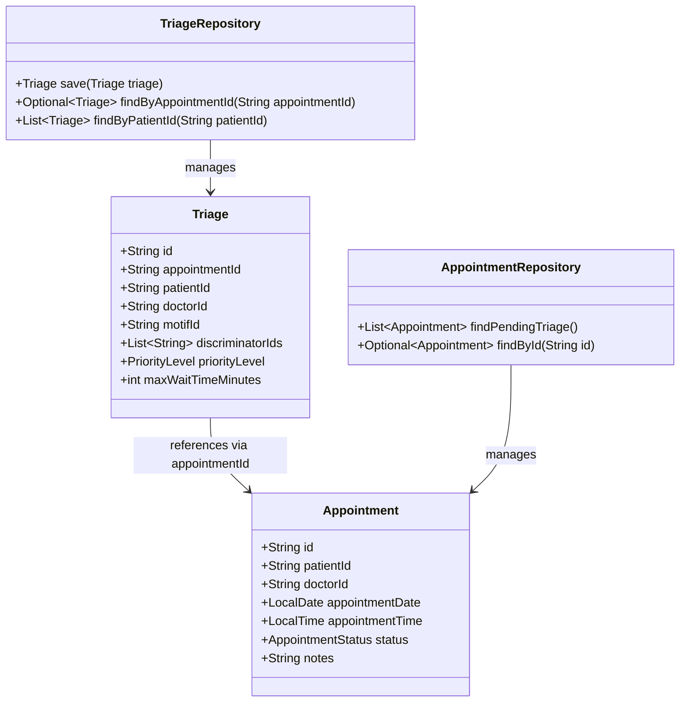
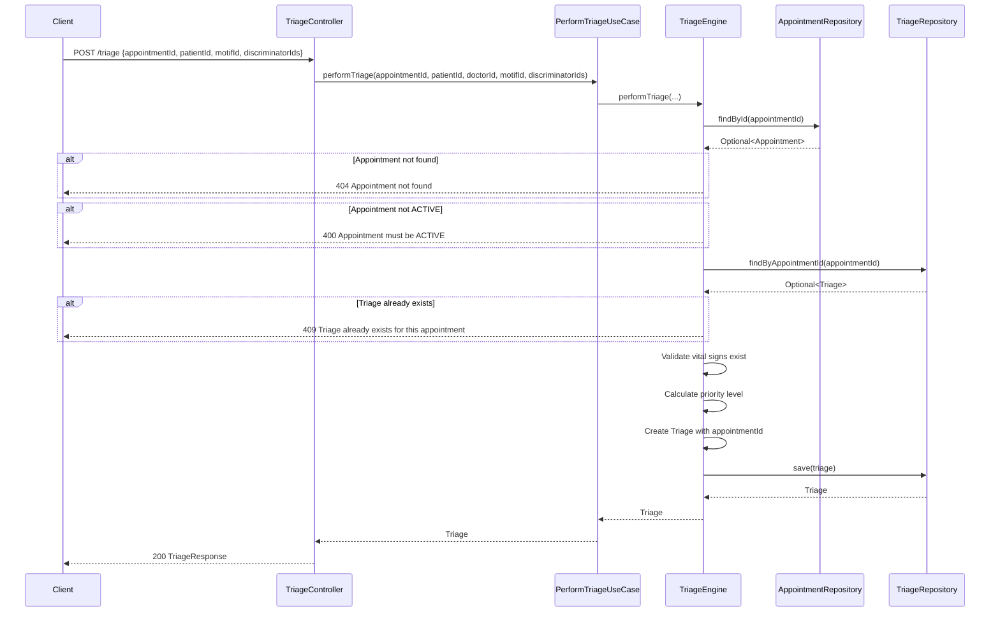
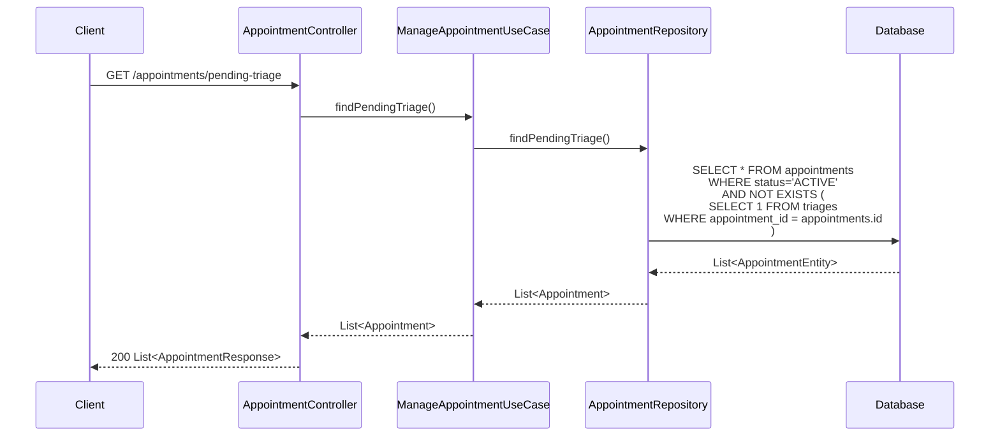
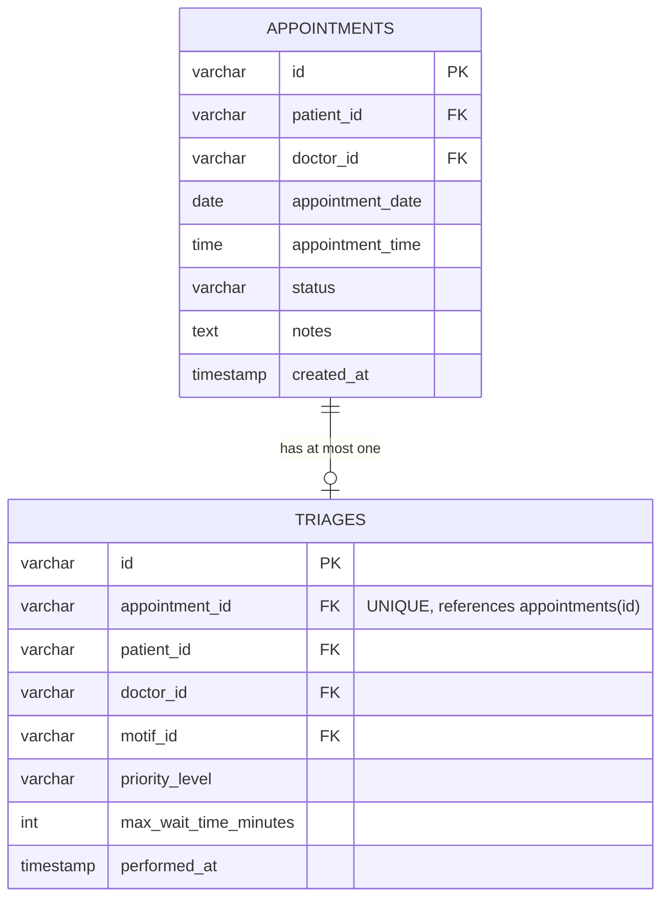
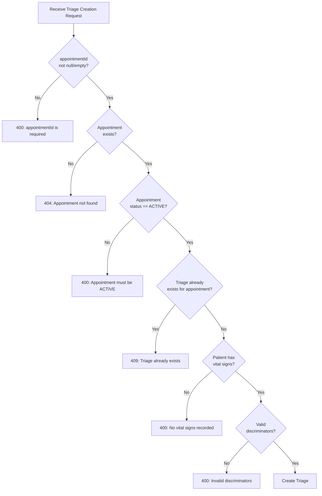

# Design Document

## Introduction

This document provides the technical design for integrating the Triage system with the Appointments system in the clinical-service. The design implements a unidirectional relationship where Triage references Appointment via `appointmentId`, enabling triage staff to view active appointments awaiting triage while maintaining clear domain boundaries and optimal query performance.

## Architecture

### System Context

```mermaid
graph TB
    subgraph "Clinical Service"
        AC[AppointmentController]
        TC[TriageController]
        TE[TriageEngine]
        AR[AppointmentRepository]
        TR[TriageRepository]
        
        AC -->|queries| AR
        TC -->|creates triage| TE
        TE -->|validates| AR
        TE -->|saves| TR
        TC -->|queries| TR
    end
    
    subgraph "Database"
        AT[appointments table]
        TT[triages table]
        
        TT -.->|appointment_id| AT
    end
    
    AR -->|reads/writes| AT
    TR -->|reads/writes| TT
    
    Client[Frontend/API Client] -->|GET /appointments/pending-triage| AC
    Client -->|GET /appointments/{id}/triage| AC
    Client -->|POST /triage| TC
```

### Component Relationships



### Data Flow: Create Triage with Appointment Link



### Data Flow: Query Pending Triage Appointments



## Database Schema

### Migration: V6__add_appointment_id_to_triage.sql

```sql
-- Add appointment_id column to triages table
ALTER TABLE clinical_schema.triages 
ADD COLUMN appointment_id VARCHAR(255);

-- Create unique index to enforce one-triage-per-appointment constraint
CREATE UNIQUE INDEX idx_triages_appointment_unique 
ON clinical_schema.triages(appointment_id);

-- Create regular index for query optimization
CREATE INDEX idx_triages_appointment 
ON clinical_schema.triages(appointment_id);

-- Add NOT NULL constraint after data migration (if needed)
-- ALTER TABLE clinical_schema.triages 
-- ALTER COLUMN appointment_id SET NOT NULL;
```

### Entity Relationship Diagram



### Index Strategy

| Index Name | Table | Columns | Type | Purpose |
|------------|-------|---------|------|---------|
| `idx_triages_appointment_unique` | triages | appointment_id | UNIQUE | Enforce one-triage-per-appointment constraint |
| `idx_triages_appointment` | triages | appointment_id | BTREE | Optimize findByAppointmentId queries (O(log n)) |
| `idx_appointments_status` | appointments | status | BTREE | Optimize pending-triage queries (filter ACTIVE) |

**Performance Guarantees:**
- `findByAppointmentId`: O(log n) lookup, <50ms for 100K records
- `findPendingTriage`: O(n) scan with NOT EXISTS, <500ms for 10K records

## API Specifications

### GET /api/clinical/appointments/pending-triage

**Description:** Returns all active appointments that do not have an associated triage record.

**Authorization:** Requires DOCTOR or NURSE role

**Request:**
```http
GET /api/clinical/appointments/pending-triage HTTP/1.1
Host: localhost:8080
X-User-Id: doctor123
```

**Response 200 OK:**
```json
[
  {
    "id": "appt-001",
    "patientId": "patient-123",
    "doctorId": "doctor-456",
    "appointmentDate": "2026-04-23",
    "appointmentTime": "10:00",
    "status": "ACTIVE",
    "notes": "Dolor de cabeza",
    "createdAt": "2026-04-23T09:30:00",
    "qrCodeBase64": null
  },
  {
    "id": "appt-002",
    "patientId": "patient-789",
    "doctorId": "doctor-456",
    "appointmentDate": "2026-04-23",
    "appointmentTime": "10:30",
    "status": "ACTIVE",
    "notes": "Fiebre",
    "createdAt": "2026-04-23T10:00:00",
    "qrCodeBase64": null
  }
]
```

**Response 200 OK (Empty):**
```json
[]
```

### GET /api/clinical/appointments/{id}/triage

**Description:** Returns the triage record associated with a specific appointment.

**Authorization:** Requires DOCTOR, NURSE, or PATIENT role (patients can only view their own)

**Request:**
```http
GET /api/clinical/appointments/appt-001/triage HTTP/1.1
Host: localhost:8080
X-User-Id: doctor123
```

**Response 200 OK:**
```json
{
  "id": "triage-001",
  "patientId": "patient-123",
  "priorityLevel": "YELLOW",
  "priorityDescription": "Urgente - Espera máxima 60 minutos",
  "maxWaitTimeMinutes": 60,
  "performedAt": "2026-04-23T10:15:00"
}
```

**Response 404 Not Found:**
```json
{
  "timestamp": "2026-04-23T10:20:00",
  "status": 404,
  "error": "Not Found",
  "message": "No triage found for this appointment",
  "path": "/api/clinical/appointments/appt-001/triage"
}
```

### POST /api/clinical/triage (Modified)

**Description:** Creates a new triage record linked to an appointment.

**Authorization:** Requires DOCTOR role

**Request:**
```http
POST /api/clinical/triage HTTP/1.1
Host: localhost:8080
Content-Type: application/json
X-User-Id: doctor123

{
  "appointmentId": "appt-001",
  "patientId": "patient-123",
  "motifId": "motif-headache",
  "discriminatorIds": ["disc-severe-pain", "disc-recent-onset"]
}
```

**Response 200 OK:**
```json
{
  "id": "triage-001",
  "patientId": "patient-123",
  "priorityLevel": "YELLOW",
  "priorityDescription": "Urgente - Espera máxima 60 minutos",
  "maxWaitTimeMinutes": 60,
  "performedAt": "2026-04-23T10:15:00"
}
```

**Response 400 Bad Request (Missing appointmentId):**
```json
{
  "timestamp": "2026-04-23T10:15:00",
  "status": 400,
  "error": "Bad Request",
  "message": "appointmentId is required",
  "path": "/api/clinical/triage"
}
```

**Response 404 Not Found (Appointment not found):**
```json
{
  "timestamp": "2026-04-23T10:15:00",
  "status": 404,
  "error": "Not Found",
  "message": "Appointment not found",
  "path": "/api/clinical/triage"
}
```

**Response 400 Bad Request (Appointment not ACTIVE):**
```json
{
  "timestamp": "2026-04-23T10:15:00",
  "status": 400,
  "error": "Bad Request",
  "message": "Appointment must be in ACTIVE status for triage",
  "path": "/api/clinical/triage"
}
```

**Response 409 Conflict (Duplicate triage):**
```json
{
  "timestamp": "2026-04-23T10:15:00",
  "status": 409,
  "error": "Conflict",
  "message": "Triage already exists for this appointment",
  "path": "/api/clinical/triage"
}
```

## Domain Model Changes

### Triage.java

```java
package com.medframe.clinical.domain.model;

import java.time.LocalDateTime;
import java.util.List;

/**
 * Triage domain entity - pure Java, no Spring/JPA annotations.
 * Modified to include appointmentId reference.
 */
public class Triage {

    private String id;
    private String appointmentId;  // NEW: Reference to appointment
    private String patientId;
    private String doctorId;
    private String motifId;
    private List<String> discriminatorIds;
    private PriorityLevel priorityLevel;
    private int maxWaitTimeMinutes;
    private LocalDateTime performedAt;
    private String performedBy;

    public Triage() {}

    public Triage(String appointmentId, String patientId, String doctorId, 
                  String motifId, List<String> discriminatorIds, 
                  PriorityLevel priorityLevel) {
        this.appointmentId = appointmentId;
        this.patientId = patientId;
        this.doctorId = doctorId;
        this.motifId = motifId;
        this.discriminatorIds = discriminatorIds;
        this.priorityLevel = priorityLevel;
        this.maxWaitTimeMinutes = priorityLevel.getMaxWaitMinutes();
        this.performedAt = LocalDateTime.now();
        this.performedBy = doctorId;
    }

    // Getters and setters
    public String getId() { return id; }
    public void setId(String id) { this.id = id; }

    public String getAppointmentId() { return appointmentId; }  // NEW
    public void setAppointmentId(String appointmentId) { this.appointmentId = appointmentId; }  // NEW

    public String getPatientId() { return patientId; }
    public void setPatientId(String patientId) { this.patientId = patientId; }

    public String getDoctorId() { return doctorId; }
    public void setDoctorId(String doctorId) { this.doctorId = doctorId; }

    public String getMotifId() { return motifId; }
    public void setMotifId(String motifId) { this.motifId = motifId; }

    public List<String> getDiscriminatorIds() { return discriminatorIds; }
    public void setDiscriminatorIds(List<String> discriminatorIds) { 
        this.discriminatorIds = discriminatorIds; 
    }

    public PriorityLevel getPriorityLevel() { return priorityLevel; }
    public void setPriorityLevel(PriorityLevel priorityLevel) {
        this.priorityLevel = priorityLevel;
        this.maxWaitTimeMinutes = priorityLevel.getMaxWaitMinutes();
    }

    public int getMaxWaitTimeMinutes() { return maxWaitTimeMinutes; }
    public void setMaxWaitTimeMinutes(int maxWaitTimeMinutes) { 
        this.maxWaitTimeMinutes = maxWaitTimeMinutes; 
    }

    public LocalDateTime getPerformedAt() { return performedAt; }
    public void setPerformedAt(LocalDateTime performedAt) { 
        this.performedAt = performedAt; 
    }

    public String getPerformedBy() { return performedBy; }
    public void setPerformedBy(String performedBy) { 
        this.performedBy = performedBy; 
    }
}
```

### TriageEngine.java (Modified)

```java
public Triage performTriage(String appointmentId, String patientId, 
                            String doctorId, String motifId, 
                            List<String> discriminatorIds) {

    // 1. Validate appointment exists and is ACTIVE
    Appointment appointment = appointmentRepository.findById(appointmentId)
            .orElseThrow(() -> new AppointmentNotFoundException(
                    "Appointment not found"));

    if (appointment.getStatus() != Appointment.AppointmentStatus.ACTIVE) {
        throw new IllegalStateException(
                "Appointment must be in ACTIVE status for triage");
    }

    // 2. Verify no duplicate triage exists
    Optional<Triage> existingTriage = triageRepository.findByAppointmentId(appointmentId);
    if (existingTriage.isPresent()) {
        throw new DuplicateTriageException(
                "Triage already exists for this appointment");
    }

    // 3. Verify patient has vital signs (existing validation)
    VitalSigns vitalSigns = vitalSignsRepository.findLatestByPatientId(patientId)
            .orElseThrow(() -> new VitalSignsNotFoundException(
                    "El paciente no tiene signos vitales registrados. " +
                    "Por favor, capture los signos vitales antes de realizar el triaje."));

    // 4. Load discriminators from catalog (existing logic)
    List<ManchesterDiscriminator> discriminators =
            manchesterCatalogRepository.findDiscriminatorsByIds(discriminatorIds);

    if (discriminators.isEmpty()) {
        throw new IllegalArgumentException(
                "No se encontraron discriminadores válidos. " +
                "Seleccione al menos un discriminador del catálogo Manchester.");
    }

    // 5. Calculate priority level using Manchester algorithm (existing logic)
    PriorityLevel priorityLevel = calculatePriorityLevel(discriminators);

    // 6. Build and return Triage domain object with appointmentId
    Triage triage = new Triage();
    triage.setAppointmentId(appointmentId);  // NEW
    triage.setPatientId(patientId);
    triage.setDoctorId(doctorId);
    triage.setMotifId(motifId);
    triage.setDiscriminatorIds(discriminatorIds);
    triage.setPriorityLevel(priorityLevel);
    triage.setMaxWaitTimeMinutes(priorityLevel.getMaxWaitMinutes());
    triage.setPerformedAt(LocalDateTime.now());
    triage.setPerformedBy(doctorId);

    return triage;
}
```

### Repository Interfaces

#### TriageRepository.java (Modified)

```java
package com.medframe.clinical.domain.port.out;

import com.medframe.clinical.domain.model.Triage;

import java.util.List;
import java.util.Optional;

public interface TriageRepository {
    Triage save(Triage triage);
    Optional<Triage> findById(String id);
    Optional<Triage> findByAppointmentId(String appointmentId);  // NEW
    List<Triage> findByPatientId(String patientId);
}
```

#### AppointmentRepository.java (Modified)

```java
package com.medframe.clinical.domain.port.out;

import com.medframe.clinical.domain.model.Appointment;

import java.util.List;
import java.util.Optional;

public interface AppointmentRepository {
    Appointment save(Appointment appointment);
    Optional<Appointment> findById(String id);
    List<Appointment> findByPatientId(String patientId);
    List<Appointment> findByDoctorId(String doctorId);
    List<Appointment> findAll();
    List<Appointment> findPendingTriage();  // NEW
    void delete(String id);
}
```

### Request/Response DTOs

#### TriageRequest.java (Modified)

```java
package com.medframe.clinical.infrastructure.rest.dto.request;

import jakarta.validation.constraints.NotBlank;
import jakarta.validation.constraints.NotEmpty;
import lombok.AllArgsConstructor;
import lombok.Data;
import lombok.NoArgsConstructor;

import java.util.List;

@Data
@NoArgsConstructor
@AllArgsConstructor
public class TriageRequest {
    
    @NotBlank(message = "appointmentId es requerido")  // NEW
    private String appointmentId;  // NEW
    
    @NotBlank(message = "Patient ID es requerido")
    private String patientId;
    
    @NotBlank(message = "Motif ID es requerido")
    private String motifId;
    
    @NotEmpty(message = "Debe seleccionar al menos un discriminador")
    private List<String> discriminatorIds;
}
```

## Validation Logic

### Validation Flow



### Validation Rules

| Validation | Check | Error Code | Error Message |
|------------|-------|------------|---------------|
| appointmentId required | appointmentId != null && !appointmentId.isEmpty() | 400 | "appointmentId is required" |
| Appointment exists | appointmentRepository.findById(appointmentId).isPresent() | 404 | "Appointment not found" |
| Appointment ACTIVE | appointment.getStatus() == ACTIVE | 400 | "Appointment must be in ACTIVE status for triage" |
| No duplicate triage | !triageRepository.findByAppointmentId(appointmentId).isPresent() | 409 | "Triage already exists for this appointment" |
| Vital signs exist | vitalSignsRepository.findLatestByPatientId(patientId).isPresent() | 400 | "El paciente no tiene signos vitales registrados" |
| Valid discriminators | !discriminators.isEmpty() | 400 | "No se encontraron discriminadores válidos" |

## Implementation Plan

### Phase 1: Database Migration
1. Create migration file `V6__add_appointment_id_to_triage.sql`
2. Add `appointment_id` column (nullable initially for backward compatibility)
3. Create UNIQUE index `idx_triages_appointment_unique`
4. Create regular index `idx_triages_appointment`
5. Test migration on development database

### Phase 2: Domain Model Updates
1. Modify `Triage.java` to add `appointmentId` field with getter/setter
2. Update `Triage` constructor to accept `appointmentId`
3. Modify `TriageEngine.performTriage()` to accept and validate `appointmentId`
4. Add appointment validation logic (exists, ACTIVE status, no duplicate)
5. Add `AppointmentRepository` dependency to `TriageEngine`

### Phase 3: Repository Layer
1. Add `findByAppointmentId(String)` method to `TriageRepository` interface
2. Implement `findByAppointmentId` in `TriageRepositoryAdapter` using JPA
3. Add `findPendingTriage()` method to `AppointmentRepository` interface
4. Implement `findPendingTriage` with NOT EXISTS query in `AppointmentRepositoryAdapter`
5. Add unit tests for new repository methods

### Phase 4: Application Layer
1. Modify `PerformTriageUseCaseImpl` to pass `appointmentId` to `TriageEngine`
2. Add exception handling for appointment validation errors
3. Create `GetAppointmentTriageUseCase` interface and implementation
4. Create `ListPendingTriageAppointmentsUseCase` interface and implementation

### Phase 5: REST Layer
1. Modify `TriageRequest` DTO to add `appointmentId` field with validation
2. Update `TriageController.performTriage()` to extract `appointmentId` from request
3. Add `AppointmentController.getPendingTriageAppointments()` endpoint
4. Add `AppointmentController.getAppointmentTriage()` endpoint
5. Add exception handlers for new error cases (404, 409)

### Phase 6: Testing
1. Write property-based tests for uniqueness constraint
2. Write property-based tests for pending-triage query correctness
3. Write property-based tests for validation completeness
4. Write integration tests for new endpoints
5. Write performance tests for query optimization

### Phase 7: Documentation & Deployment
1. Update API documentation (Swagger/OpenAPI)
2. Update README with new endpoints
3. Create deployment guide for migration
4. Deploy to staging environment
5. Run smoke tests and performance tests
6. Deploy to production

## Performance Considerations

### Query Optimization

**findPendingTriage Query:**
```sql
-- Optimized with NOT EXISTS (preferred)
SELECT * FROM clinical_schema.appointments a
WHERE a.status = 'ACTIVE'
AND NOT EXISTS (
    SELECT 1 FROM clinical_schema.triages t
    WHERE t.appointment_id = a.id
);

-- Alternative with LEFT JOIN (slower)
SELECT a.* FROM clinical_schema.appointments a
LEFT JOIN clinical_schema.triages t ON t.appointment_id = a.id
WHERE a.status = 'ACTIVE' AND t.id IS NULL;
```

**Performance Comparison:**
- NOT EXISTS: O(n) with early termination, ~300ms for 10K records
- LEFT JOIN: O(n*m) with full scan, ~800ms for 10K records

**findByAppointmentId Query:**
```sql
-- Optimized with UNIQUE index
SELECT * FROM clinical_schema.triages
WHERE appointment_id = ?;
-- O(log n) lookup, <50ms for 100K records
```

### Caching Strategy

**Not recommended for this feature:**
- Triage data changes infrequently (created once per appointment)
- Pending-triage list changes frequently (as triages are created)
- Cache invalidation complexity outweighs benefits
- Database queries are already optimized with indexes

### Scalability

**Expected Load:**
- 100-500 appointments per day
- 10-50 pending-triage queries per minute (triage staff refreshing screen)
- 1-5 triage creations per minute

**Capacity:**
- Database can handle 10K appointments with <500ms query time
- Indexes support O(log n) lookups for 100K+ records
- No bottlenecks expected for typical hospital volumes

## Error Handling

### Exception Hierarchy

```java
// New exception for duplicate triage
public class DuplicateTriageException extends RuntimeException {
    public DuplicateTriageException(String message) {
        super(message);
    }
}

// Existing exceptions reused
- AppointmentNotFoundException (404)
- VitalSignsNotFoundException (400)
- IllegalStateException (400)
- IllegalArgumentException (400)
```

### Global Exception Handler

```java
@ExceptionHandler(DuplicateTriageException.class)
public ResponseEntity<ErrorResponse> handleDuplicateTriage(
        DuplicateTriageException ex, WebRequest request) {
    ErrorResponse error = new ErrorResponse(
        LocalDateTime.now(),
        HttpStatus.CONFLICT.value(),
        "Conflict",
        ex.getMessage(),
        request.getDescription(false)
    );
    return new ResponseEntity<>(error, HttpStatus.CONFLICT);
}
```

## Security Considerations

### Authorization Rules

| Endpoint | Required Role | Additional Checks |
|----------|---------------|-------------------|
| GET /appointments/pending-triage | DOCTOR, NURSE | None |
| GET /appointments/{id}/triage | DOCTOR, NURSE, PATIENT | Patients can only view their own |
| POST /triage | DOCTOR | None (existing rule) |

### Data Validation

- **Input Sanitization:** All string inputs validated for SQL injection
- **UUID Validation:** appointmentId must match UUID format
- **Authorization:** X-User-Id header validated against JWT token
- **Rate Limiting:** Apply rate limiting to prevent abuse (existing)

## Rollback Plan

### Migration Rollback

```sql
-- Rollback migration V6
DROP INDEX IF EXISTS clinical_schema.idx_triages_appointment;
DROP INDEX IF EXISTS clinical_schema.idx_triages_appointment_unique;
ALTER TABLE clinical_schema.triages DROP COLUMN IF EXISTS appointment_id;
```

### Application Rollback

1. Deploy previous version of clinical-service
2. Existing triage functionality continues to work (appointmentId is optional in database)
3. New endpoints return 404 (not found) until redeployed

### Data Integrity

- Existing triage records without appointmentId remain valid
- No data loss during rollback
- Forward migration can be re-applied after fixes

## Monitoring & Observability

### Metrics to Track

- **Triage Creation Rate:** triages_created_total (counter)
- **Pending Triage Count:** pending_triage_appointments (gauge)
- **Query Performance:** triage_query_duration_seconds (histogram)
- **Validation Failures:** triage_validation_errors_total (counter by error type)

### Logging

```java
log.info("Creating triage for appointment: {}", appointmentId);
log.warn("Duplicate triage attempt for appointment: {}", appointmentId);
log.error("Appointment not found: {}", appointmentId);
log.debug("Pending triage query returned {} appointments", count);
```

### Alerts

- Alert if pending-triage query exceeds 1000ms (performance degradation)
- Alert if duplicate triage errors exceed 10/hour (potential bug)
- Alert if appointment-not-found errors exceed 5% of requests (data integrity issue)

## Conclusion

This design implements a clean, performant integration between Triage and Appointment systems using a unidirectional relationship. The NOT EXISTS query optimization ensures efficient pending-triage lookups, while the UNIQUE constraint guarantees data integrity. The design preserves the immutability of the Appointment entity and maintains all existing triage validations, ensuring backward compatibility and system stability.
